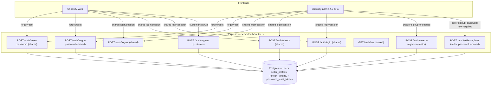

# Sprint 2 — Identity System Design (Choosify Closed Beta)

Design document. Produced from the current implementation and the seller-onboarding investigation. Implementation begins in Sprint 2A.

## Table of Contents

1. [Scope framing](#0-scope-framing)
2. [Customer](#1-customer)
3. [Seller](#2-seller)
4. [Creator](#3-creator)
5. [Admin](#4-admin)
6. [Full endpoint list for Closed Beta](#5-full-endpoint-list-for-closed-beta)
7. [Password reset — cross-role design note](#6-password-reset--cross-role-design-note)
8. [Recommended identity architecture](#7-recommended-identity-architecture)
9. [Migration plan from the current implementation](#8-migration-plan-from-the-current-implementation)
10. [Files that will eventually require modification](#9-files-that-will-eventually-require-modification)

---

## 0. Scope framing

The existing Postgres `role` enum has 10 values (`user`, `seller`, `verified_seller`, `moderator`, `admin`, `super_admin`, `creator`, `finance_manager`, `support_agent`, `marketing_manager`). The four Closed Beta roles map onto a subset of these:

| Design role | Existing DB enum value | Notes |
|---|---|---|
| Customer | `user` | Already the default/fallback role; just needs its own registration path instead of being an accidental side effect of seller signup |
| Seller | `seller` | Already implemented, minus a password (fixed in Sprint 2A Task 1) |
| Creator | `creator` | Role exists in the enum and in permissions, but no registration flow reaches it today |
| Admin | `admin` / `super_admin` | Never self-registered — provisioned directly, as `LoginPage.tsx` already states: *"Admin access only · Staff accounts are provisioned by Super Admin"* |

`verified_seller`, `moderator`, `finance_manager`, `support_agent`, `marketing_manager` are internal/staff-adjacent roles outside this design's scope — they continue to exist and log in through the same shared `/auth/login`, unaffected.

---

## 1. Customer

**1. Registration flow** — Fill name, email, password → `POST /auth/register` → account created with `role: 'user'` → same-response auto-login (access token + refresh cookie), matching the pattern the codebase already uses for seller registration, just without the seller fabrication.

**2. Login flow** — Email + password → `POST /auth/login` → receives `accessToken`, `role: 'user'` → frontend routes to the storefront home/account area (no special dashboard).

**3. Password creation** — Required at registration, one client-side rule matching the backend exactly: 8–128 characters.

**4. Password reset** — `POST /auth/forgot-password` → `POST /auth/reset-password`. See §6 (cross-role) for the beta-simplified delivery mechanism.

**5. Session management** — 15-minute JWT access token in memory/localStorage, 30-day httpOnly refresh cookie, refresh-on-401 exactly once.

**6. Dashboard access** — None required beyond the existing storefront account/orders pages. No admin-panel access.

**7. Required backend endpoint(s)** — `POST /auth/register`, plus the shared `/auth/login`, `/auth/logout`, `/auth/refresh`, `/auth/me`.

**8. Required frontend page(s)** — Choosify-Web's existing `LoginSignUpPage.tsx`, repointed from `apiSellerRegister` to a new `apiRegister` call. No new page needed.

---

## 2. Seller

**1. Registration flow** — Fill name, store name, phone, category, city, and password → `POST /auth/seller-register` → `role: 'seller'` → same-response auto-login.

**2. Login flow** — Same shared `POST /auth/login` as every role.

**3. Password creation** — Required, not optional, at registration. (Implemented in Sprint 2A Task 1 — the random-password-nobody-knows behavior has been removed entirely.)

**4. Password reset** — Same shared `forgot-password`/`reset-password` pair as every role.

**5. Session management** — Same shared pattern.

**6. Dashboard access** — `/seller/products` and the existing seller dashboard tree in `choosify-admin-4.0`, unchanged.

**7. Required backend endpoint(s)** — `POST /auth/seller-register` (password now required), plus the shared four.

**8. Required frontend page(s)** — `choosify-admin-4.0`'s existing `SellerSignupPage.tsx` (password field added in Sprint 2A Task 1).

---

## 3. Creator

**1. Registration flow** — Currently doesn't exist. Design: fill name, email, password, and minimal creator-identifying info (e.g. a display handle) → `POST /auth/creator-register` → `role: 'creator'` → same-response auto-login, following the exact same shape as seller registration.

**2. Login flow** — Same shared `POST /auth/login`.

**3. Password creation** — Required at registration, same rule as everyone else.

**4. Password reset** — Same shared pair.

**5. Session management** — Same shared pattern.

**6. Dashboard access** — `CreatorDashboard.tsx` already exists in `choosify-admin-4.0/src/pages/dashboards/`; it currently has no registration path feeding it, only role-switching for internal QA.

**7. Required backend endpoint(s)** — `POST /auth/creator-register`, plus the shared four.

**8. Required frontend page(s)** — A new, minimal creator signup page is the only genuinely *new* UI this design calls for. Given Closed Beta is the founder + 2–5 named testers, a lighter option is to **not** build self-serve creator signup for beta at all and instead seed the 1–2 creator testers directly via the same mechanism `server/db/seedDevUsers.ts` already uses. That keeps `POST /auth/creator-register` defined (for correctness and post-beta use) without requiring a UI to be built for a handful of known people. Recommend deciding this explicitly before it's scheduled.

---

## 4. Admin

**1. Registration flow** — None. No public registration endpoint. Accounts are seeded directly (mirrors the existing `seedDevUsers.ts` pattern and the UI copy already present in `LoginPage.tsx`).

**2. Login flow** — Same shared `POST /auth/login`, using `role: 'admin' | 'super_admin'` already returned by the backend today.

**3. Password creation** — Set at seed/provisioning time by whoever creates the account (founder, in Closed Beta) — not self-service.

**4. Password reset** — Same shared pair, so an admin who forgets their password isn't permanently locked out either.

**5. Session management** — Same shared pattern.

**6. Dashboard access** — `/admin/dashboard`, unchanged.

**7. Required backend endpoint(s)** — None beyond the shared four — no `admin-register` endpoint should exist, by design.

**8. Required frontend page(s)** — Existing `LoginPage.tsx`, unchanged in shape (a "Forgot your password?" button already sits in the UI — it needs to be wired to the new endpoint rather than left dead).

---

## 5. Full endpoint list for Closed Beta

| Endpoint | Roles it serves | Status |
|---|---|---|
| `POST /auth/register` | Customer | Designed — implementing in Sprint 2A Task 2 |
| `POST /auth/seller-register` | Seller | Implemented — password now required (Sprint 2A Task 1) |
| `POST /auth/creator-register` | Creator | Designed — later sprint |
| `POST /auth/login` | All four | Implemented |
| `POST /auth/logout` | All four | Implemented |
| `POST /auth/refresh` | All four | Implemented |
| `GET /auth/me` | All four | Implemented |
| `POST /auth/forgot-password` | All four | Designed — later sprint |
| `POST /auth/reset-password` | All four | Designed — later sprint |

No `POST /auth/admin-register` — intentionally absent. No OTP endpoint, no email-verification endpoint — intentionally excluded per the Closed Beta constraints.

---

## 6. Password reset — cross-role design note

`forgot-password` / `reset-password` need a *delivery* mechanism to carry the reset token to the user, and the backend inventory already established that **no email provider is configured** — the `EMAIL` notification channel is a `FrameworkChannelProvider` stub returning `"Provider for email is not configured. Framework only."` Building real email delivery is out of scope for "keep the workflow as simple as possible."

For a Closed Beta of a founder + 2–5 named testers, the simplest correct design is:
- The two endpoints exist and are fully functional (token generation, hashing, expiry, single-use).
- The reset link/token is surfaced through a channel that already works without new infrastructure — e.g., logged server-side for the founder to relay manually, or returned in a support-assisted flow — rather than building an email pipeline for a five-person cohort.
- This is explicitly a **beta-only shortcut**, not the intended production design; real email delivery should be scoped as its own follow-up once beyond Closed Beta.

---

## 7. Recommended identity architecture

Core principles this design enforces, directly answering the four problems identified in the investigation:

1. **Every registration path that creates a password-authenticated account collects a real password from the user, always.** No endpoint ever generates one silently. *(Enforced as of Sprint 2A Task 1 for sellers.)*
2. **Every role gets its own registration endpoint that stores what the user actually is.** No endpoint is reused across roles by fabricating fields — the thing that made a customer secretly become a seller with a fake store. *(Addressed by `POST /auth/register`, Sprint 2A Task 2.)*
3. **Email verification is not built for beta**, and nothing pretends it is — `emailVerified` stays a stored-but-unenforced field by explicit decision, not by accident, and that decision is documented rather than silently absent.
4. **Seller/creator approval is not built for beta**, by the same explicit, documented decision — `VERIFIED_SELLER` and `SELLER_APPROVE` remain dormant scaffolding, understood as a deliberate post-beta feature rather than a broken one.

---

## 8. Migration plan from the current implementation

1. **Add the missing password field to the seller registration form** and make it required end-to-end. *(Done — Sprint 2A Task 1.)*
2. **Introduce `POST /auth/register`** as a true customer endpoint, and **repoint Choosify-Web's generic signup form to it** instead of `seller-register`. *(In progress — Sprint 2A Task 2.)*
3. **Introduce `POST /auth/creator-register`**, decide whether it's fronted by a real signup page or used only for beta seeding.
4. **Introduce `POST /auth/forgot-password` and `POST /auth/reset-password`**, including a new `password_reset_tokens`-style table (or equivalent).
5. **Wire the two existing dead "Forgot password?" UI elements** to the new endpoints.
6. **Align the two mismatched password-length rules** (client 6 vs. backend 8) to one shared value. *(Done for the seller-registration client check — Sprint 2A Task 1; Choosify-Web's signup form check is Sprint 2A Task 3.)*
7. **Add error handling to `LoginPage.tsx`'s submit handler** so a real login failure is visible instead of a silent unhandled rejection.
8. **Leave `verified_seller`, `SELLER_APPROVE`, and `emailVerified` exactly as they are** — dormant, undisturbed — since Closed Beta explicitly does not require them.
9. **Existing registered accounts from the current broken paths need a decision, not code**: password-less seller accounts created before Task 1 have no way to acquire a password without the reset flow from step 4.

---

## 9. Files that will eventually require modification

Listed for future sprints — tracked as work is completed.

**Backend (`choosify-admin-4.0`)**
- `server/authRouter.ts` — add `/auth/register` *(Sprint 2A Task 2)*, `/auth/creator-register`, `/auth/forgot-password`, `/auth/reset-password`; random-password fallback in `/auth/seller-register` removed *(done, Task 1)*
- `server/validation/auth/sellerRegisterSchema.ts` — password made required *(done, Task 1)*
- `server/validation/auth/` — new schema files for `registerSchema.ts` *(Sprint 2A Task 2)*, `creatorRegisterSchema.ts`, `forgotPasswordSchema.ts`, `resetPasswordSchema.ts`
- `server/auth/jwtTokens.ts` — add reset-token issuance/verification helpers
- `server/db/schema.ts` — new `password_reset_tokens` table (schema change, migration file)

**Frontend — `choosify-admin-4.0`**
- `src/pages/SellerSignupPage.tsx` — password field added *(done, Task 1)*
- `src/pages/LoginPage.tsx` — wire "Forgot your password?"; add a `catch` block for login failures
- `src/contexts/AuthContext.tsx` — password type tightened *(done, Task 1)*; add creator-registration and forgot/reset-password handlers
- Possibly new: `src/pages/CreatorSignupPage.tsx`, `src/pages/ForgotPasswordPage.tsx` / `ResetPasswordPage.tsx` — pending the §3 decision

**Frontend — `Choosify-Web`**
- `src/lib/authApi.ts` — add `register()` *(Sprint 2A Task 2)*, `creatorRegister()`, `forgotPassword()`, `resetPassword()`
- `src/lib/authSession.ts` — repoint `registerWithEmailPassword` to the new `/auth/register` *(Sprint 2A Task 2)*; align the 6-char client rule to 8 *(Sprint 2A Task 3)*
- `src/pages/LoginSignUpPage.tsx` — wire the real forgot-password flow instead of the "coming soon" toast
