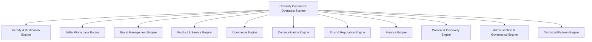

# Choosify Platform Blueprint

**Document ID:** BP-000
**Document Title:** Executive Summary
**Version:** 1.0.0
**Status:** Approved Draft
**Owner:** Choosify Architecture Team
**Classification:** Internal Product Specification
**Last Updated:** August 2026

---

## Table of Contents

1. [Purpose](#1-purpose)
2. [Vision Statement](#2-vision-statement)
3. [Mission](#3-mission)
4. [Platform Philosophy](#4-platform-philosophy)
5. [What Choosify Is](#5-what-choosify-is)
6. [What Choosify Is Not](#6-what-choosify-is-not)
7. [Strategic Objectives](#7-strategic-objectives)
8. [Core User Ecosystem](#8-core-user-ecosystem)
9. [Platform Architecture Overview](#9-platform-architecture-overview)
10. [Guiding Business Principles](#10-guiding-business-principles)
11. [Commerce Philosophy](#11-commerce-philosophy)
12. [Long-Term Vision](#12-long-term-vision)
13. [Blueprint Scope](#13-blueprint-scope)
14. [Document Structure](#14-document-structure)
15. [Acceptance Criteria](#15-acceptance-criteria)
16. [Revision History](#revision-history)

---

## 1. Purpose

This document provides the executive overview of the Choosify Commerce Operating System.

It establishes the business vision, platform philosophy, strategic objectives, architectural direction, and guiding principles that govern every future design and engineering decision.

This document serves as the entry point to the complete Choosify Blueprint.

Every engineer, designer, project manager, QA engineer, AI coding assistant, and future stakeholder should read this document before working on any part of the platform.

---

## 2. Vision Statement

Choosify exists to build Bangladesh's most trusted digital commerce ecosystem.

Unlike traditional marketplaces that prioritize listing volume, Choosify prioritizes trust, verified businesses, quality products, meaningful services, and enterprise-grade operational tools.

The platform is designed to empower both consumers and businesses by combining commerce, communication, finance, content, analytics, and administration into a single operating system.

---

## 3. Mission

To provide businesses with enterprise-level commerce infrastructure while helping consumers discover products and services through trust, transparency, education, and informed decision-making.

---

## 4. Platform Philosophy

Choosify is built upon five core principles.

### Trust First

Trust is earned through verified identity, consistent performance, authentic reviews, and transparent operations.

Trust can never be purchased.

### Business Enablement

Choosify is not merely a marketplace.

It is a complete operating system that enables businesses to manage products, services, communication, finance, marketing, and customer relationships from one platform.

### Consumer Confidence

Consumers should feel confident purchasing any product or service listed on Choosify.

Verification, moderation, escrow, reputation, and dispute resolution exist to reduce uncertainty and improve purchasing confidence.

### Transparency

Platform actions are visible whenever appropriate.

Sponsored content is clearly identified.

Marketplace decisions are auditable.

Administrative actions are recorded.

Financial transactions remain traceable.

### Continuous Improvement

Businesses should be encouraged to improve rather than immediately punished.

Trust, moderation, education, and analytics work together to help businesses continuously raise their standards.

---

## 5. What Choosify Is

Choosify is a Commerce Operating System consisting of multiple interconnected platforms.

These include:

- Multi-Vendor Marketplace
- Service Marketplace
- B2B Marketplace
- Rental Marketplace
- Auction Marketplace
- Travel Marketplace
- Hospitality Marketplace
- Real Estate Marketplace
- Creator Economy Platform
- Business Management Platform
- Content Discovery Platform
- Trust & Reputation Platform
- Communication Platform
- Finance Platform
- Administration Platform

These systems operate together under one unified architecture.

---

## 6. What Choosify Is Not

Choosify is not intended to become:

- A generic open marketplace
- A classified advertisement website
- A social media platform
- A simple online shop builder
- A basic seller dashboard
- A clone of existing marketplaces

The platform intentionally differentiates itself through verified participation, business tools, integrated communication, trust scoring, and curated commerce experiences.

---

## 7. Strategic Objectives

The long-term strategic objectives of Choosify are:

1. Become Bangladesh's most trusted commerce platform.
2. Enable businesses of every size to operate professionally.
3. Reduce fraudulent activity through verification and moderation.
4. Improve purchasing confidence through transparent information.
5. Integrate commerce, communication, finance, and content into one ecosystem.
6. Provide enterprise-grade operational tools to small and medium businesses.
7. Support future regional and international expansion through scalable architecture.

---

## 8. Core User Ecosystem

Choosify serves four primary user groups.

### Consumer

Individuals purchasing products and services.

### Seller

Verified businesses operating one or more brands.

Sellers manage products, services, orders, finance, communication, and brand identity.

### Creator

Verified individuals producing educational or promotional content that assists purchasing decisions.

Creators remain independent from seller accounts.

### Super Administrator

Platform operators responsible for governance, moderation, verification, finance, configuration, and ecosystem management.

---

## 9. Platform Architecture Overview

The platform is organized into multiple business engines.

These include:

- Identity & Verification Engine
- Seller Workspace Engine
- Brand Management Engine
- Product & Service Engine
- Commerce Engine
- Communication Engine
- Trust & Reputation Engine
- Finance Engine
- Content & Discovery Engine
- Administration & Governance Engine
- Technical Platform Engine

Each engine remains modular while operating within a unified platform architecture.

---

## 10. Guiding Business Principles

The following principles apply throughout the entire platform.

#### Verified Businesses

Marketplace participation is limited to verified businesses.

#### Verified Ownership

Brand ownership must be verified before marketplace publication.

#### Marketplace Visibility

Editing permissions and marketplace visibility are independent.

Businesses may continue managing their information even when marketplace visibility is temporarily disabled.

#### Single Source of Truth

Every business entity owns its own information.

Products reference Brands.

Brands reference Sellers.

Orders reference Products.

Information is never duplicated unnecessarily.

#### Permission-Based Access

Every action is governed by explicit permissions.

Frontend visibility never replaces backend authorization.

#### Auditability

Significant business actions create immutable audit records.

#### Transparency

Consumers should always understand:

- why something is featured,
- why something is promoted,
- why something is verified,
- and how platform decisions affect visibility.

---

## 11. Commerce Philosophy

Commerce extends beyond transactions.

Choosify combines:

- Shopping
- Services
- Communication
- Education
- Discovery
- Reviews
- Finance
- Customer Relationships

into one continuous customer journey.

---

## 12. Long-Term Vision

Choosify is designed as long-term digital infrastructure.

Future expansion includes:

- AI-assisted commerce
- Regional marketplace expansion
- API ecosystem
- Third-party integrations
- Business automation
- Enterprise services
- Cross-border commerce
- Native mobile applications
- Advanced logistics
- Intelligent commerce analytics

The architecture described throughout this Blueprint is intentionally designed to support these future capabilities without requiring fundamental redesign.

---

## 13. Blueprint Scope

The Choosify Blueprint defines:

- Business Architecture
- Platform Rules
- User Roles
- Commerce Workflows
- Trust Model
- Finance Model
- Communication Model
- Administration Model
- Technical Standards
- Engineering Principles

Implementation details belong to the Engineering Documentation and Sprint Specifications.

---

## 14. Document Structure

The Blueprint consists of the following documents:

BP-000 Executive Summary

BP-001 Vision & Constitution

BP-002 User Ecosystem

BP-003 Identity & Verification

BP-004 Seller Workspace & Brand Architecture

BP-005 Product & Service Engine

BP-006 Commerce Engine

BP-007 Communication Engine

BP-008 Trust & Reputation Engine

BP-009 Finance Engine

BP-010 Content & Discovery Engine

BP-011 Administration & Governance Engine

BP-012 Technical Architecture

Supporting appendices provide:

- Permission Matrix
- Role Matrix
- State Machines
- API Index
- Glossary
- Version History

---

## 15. Acceptance Criteria

This document is considered complete when:

- The platform vision is clearly defined.
- Strategic objectives are established.
- Core platform philosophy is documented.
- User groups are identified.
- Business principles are established.
- Platform scope is defined.
- Blueprint structure is introduced.
- Long-term architectural direction is documented.

---

## Revision History

| Version | Date | Description |
|----------|------|-------------|
| 1.0.0 | August 2026 | Initial Executive Summary |
