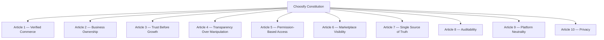

# Choosify Platform Blueprint

**Document ID:** BP-001
**Document Title:** Vision & Constitution
**Version:** 1.0.0
**Status:** Approved Draft
**Owner:** Choosify Architecture Team
**Classification:** Internal Product Specification
**Last Updated:** August 2026

---

## Table of Contents

1. [Purpose](#1-purpose)
2. [Scope](#2-scope)
3. [Platform Vision](#3-platform-vision)
4. [Mission Statement](#4-mission-statement)
5. [Core Values](#5-core-values)
6. [Constitutional Principles](#6-constitutional-principles)
7. [Marketplace Principles](#7-marketplace-principles)
8. [Consumer Principles](#8-consumer-principles)
9. [Seller Principles](#9-seller-principles)
10. [Creator Principles](#10-creator-principles)
11. [Administrative Principles](#11-administrative-principles)
12. [Financial Principles](#12-financial-principles)
13. [Communication Principles](#13-communication-principles)
14. [Trust Principles](#14-trust-principles)
15. [AI Principles](#15-ai-principles)
16. [Security Principles](#16-security-principles)
17. [Engineering Principles](#17-engineering-principles)
18. [Future Vision](#18-future-vision)
19. [Constitutional Amendments](#19-constitutional-amendments)
20. [Acceptance Criteria](#20-acceptance-criteria)
21. [Revision History](#revision-history)

---

## 1. Purpose

This document establishes the constitutional principles of the Choosify Commerce Operating System.

It defines the non-negotiable values, platform philosophy, governance principles, business ethics, and architectural rules that every module, feature, service, API, database, user interface, and engineering decision must follow.

If any future implementation conflicts with this Constitution, the Constitution always takes precedence.

---

## 2. Scope

This Constitution applies to every component of the Choosify ecosystem, including but not limited to:

- Storefront
- Consumer Portal
- Seller Workspace
- Creator Workspace
- Administration Portal
- Mobile Applications
- APIs
- CMS
- Finance
- Messaging
- Marketplace
- AI Services
- Integrations
- Future Products

No feature is exempt from these principles.

---

## 3. Platform Vision

Choosify exists to become Bangladesh's most trusted Commerce Operating System by connecting verified businesses, informed consumers, authentic creators, and responsible platform governance through one unified digital ecosystem.

Rather than maximizing the number of listings, Choosify maximizes confidence, transparency, and long-term business success.

---

## 4. Mission Statement

Choosify empowers businesses with enterprise-grade commerce tools while helping consumers discover products and services through trust, transparency, education, and meaningful engagement.

---

## 5. Core Values

Every decision must reinforce these values.

### 5.1 Trust

Trust is earned.

Trust cannot be purchased.

Trust is continuously maintained through responsible behavior.

### 5.2 Transparency

Consumers must understand:

- why a product appears,
- why a seller is verified,
- why content is promoted,
- why moderation actions occur.

Platform behavior should never intentionally mislead users.

### 5.3 Fairness

All verified businesses receive equal access to platform capabilities.

Visibility may vary based on trust, relevance, subscriptions, or promotions, but platform rules apply consistently.

### 5.4 Accountability

Every significant platform action must be attributable to:

- a user,
- a system,
- or an authorized administrator.

Every action should be auditable.

### 5.5 Continuous Improvement

The platform encourages businesses to improve through analytics, education, moderation, and guidance before applying severe enforcement measures where appropriate.

---

## 6. Constitutional Principles

The following principles are mandatory.

### Article 1 — Verified Commerce

Marketplace participation requires verification.

Anonymous businesses are not permitted to operate publicly.

### Article 2 — Business Ownership

Every public Brand must have a verified owner.

Ownership claims require administrative verification before editing rights are granted.

### Article 3 — Trust Before Growth

Platform growth must never compromise trust.

Increasing listing volume is never more important than maintaining platform integrity.

### Article 4 — Transparency Over Manipulation

Sponsored content must always be labeled.

Featured content must always be earned.

Consumers should always understand why content appears.

### Article 5 — Permission-Based Access

Every action requires explicit authorization.

Frontend visibility never replaces backend authorization.

### Article 6 — Marketplace Visibility

Marketplace publication and editing permissions are independent.

Businesses may continue maintaining their information while marketplace visibility is temporarily suspended.

### Article 7 — Single Source of Truth

Every business entity owns its own information.

Examples:

Brand owns Brand information.

Product references Brand.

Order references Product.

Review references Order.

No unnecessary duplication of business information is permitted.

### Article 8 — Auditability

Every significant action must generate an audit record.

Audit records are immutable.

### Article 9 — Platform Neutrality

Administrators govern the platform.

Administrators never compete within the marketplace as sellers.

Administrative authority and commercial participation remain separate.

### Article 10 — Privacy

Personal information shall only be accessed when required for legitimate operational purposes and according to platform policy.

---

## 7. Marketplace Principles

Choosify operates as a curated marketplace.

Marketplace quality takes precedence over marketplace quantity.

Businesses are evaluated before publication.

Marketplace participation remains a privilege maintained through continued compliance.

---

## 8. Consumer Principles

Consumers deserve:

- authentic products,
- authentic services,
- verified businesses,
- transparent pricing,
- secure payments,
- meaningful communication,
- fair dispute resolution,
- informed purchasing decisions.

---

## 9. Seller Principles

Verified Sellers receive access to professional commerce infrastructure.

They retain ownership of:

- Brand identity
- Products
- Services
- Media
- Pricing
- Customer relationships within platform policy
- Financial records
- Operational workflows

Marketplace access remains subject to ongoing compliance.

---

## 10. Creator Principles

Creators exist to educate consumers.

Recommendations must be authentic.

Creators may not intentionally mislead consumers regarding products or services.

Sponsored relationships must remain transparent.

---

## 11. Administrative Principles

Administration exists to protect the ecosystem.

Administrative powers are exercised through governance, moderation, verification, and operational oversight.

Administrative authority is never exercised for commercial advantage.

---

## 12. Financial Principles

Financial operations follow four constitutional rules.

- Transparency
- Traceability
- Security
- Accountability

All financial movements remain auditable.

Escrow protects all participating parties until transaction obligations are fulfilled.

---

## 13. Communication Principles

Communication exists to facilitate commerce.

Messaging is contextual.

Conversations are linked to:

- Products
- Services
- Orders
- Bookings
- Support
- Verification

Communication should never become an uncontrolled social network.

---

## 14. Trust Principles

Trust Scores represent platform confidence.

Trust cannot be:

- purchased,
- manually inflated,
- hidden from platform governance.

Trust changes through measurable platform activity.

---

## 15. AI Principles

Artificial Intelligence assists users.

Artificial Intelligence does not replace platform governance.

AI may recommend.

AI may summarize.

AI may detect anomalies.

Final business decisions remain human-controlled.

---

## 16. Security Principles

Security is mandatory.

Every engineering decision should minimize risk while preserving usability.

Authentication, authorization, auditing, and data protection are foundational responsibilities rather than optional features.

---

## 17. Engineering Principles

Every implementation must follow these architectural rules.

- API First
- Event Driven
- Role-Based Access Control
- Modular Architecture
- Single Source of Truth
- Version Controlled
- Backward Compatible where possible
- Observable
- Testable
- Maintainable

---

## 18. Future Vision

The Constitution is intentionally technology-independent.

Future versions of Choosify may introduce:

- AI Commerce
- Regional Expansion
- Cross-border Commerce
- Enterprise APIs
- Native Mobile Platforms
- Partner Ecosystems
- Automation Services

These future capabilities must continue operating within this Constitution.

---

## 19. Constitutional Amendments

This Constitution may only change through approved Blueprint revisions.

Every amendment must include:

- reason,
- affected modules,
- implementation impact,
- migration considerations,
- version increment.

---

## 20. Acceptance Criteria

This document is complete when:

- Platform philosophy is established.
- Core values are documented.
- Constitutional articles are defined.
- Business ethics are documented.
- Marketplace principles are defined.
- Engineering principles are established.
- Governance principles are documented.
- Amendment process is defined.

---

## Revision History

| Version | Date | Description |
|----------|------|-------------|
| 1.0.0 | August 2026 | Initial Constitution |
