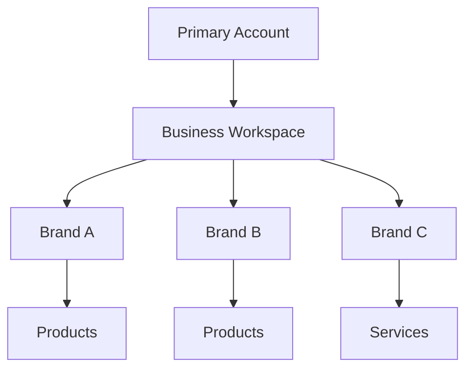
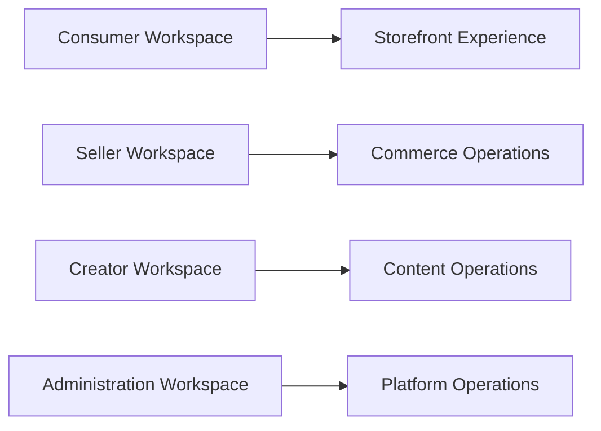
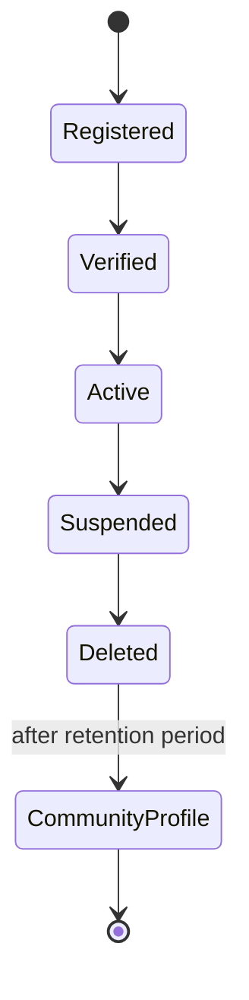
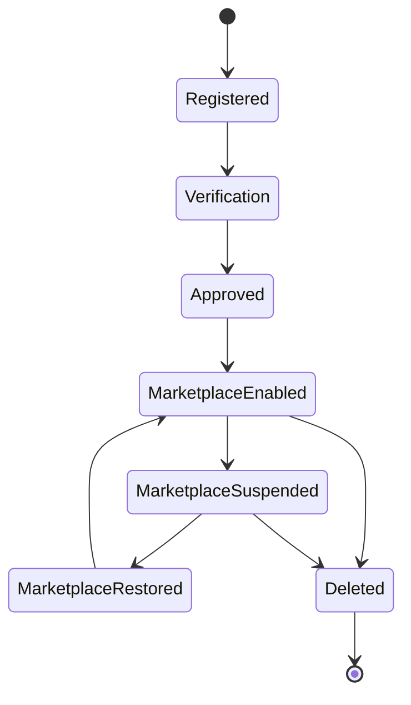
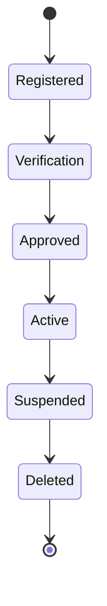
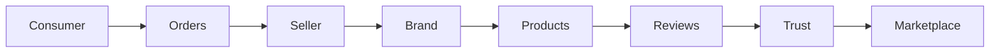

# Choosify Platform Blueprint

**Document ID:** BP-002
**Document Title:** User Ecosystem & Identity Model
**Version:** 1.0.0
**Status:** Approved Draft
**Owner:** Choosify Architecture Team
**Classification:** Internal Product Specification
**Last Updated:** August 2026

---

## Table of Contents

1. [Purpose](#1-purpose)
2. [Scope](#2-scope)
3. [User Ecosystem Overview](#3-user-ecosystem-overview)
4. [Consumer](#4-consumer)
5. [Seller](#5-seller)
6. [Creator](#6-creator)
7. [Super Administrator](#7-super-administrator)
8. [Staff Accounts](#8-staff-accounts)
9. [Account Hierarchy](#9-account-hierarchy)
10. [Multiple Brand Ownership](#10-multiple-brand-ownership)
11. [Active Brand Context](#11-active-brand-context)
12. [Workspace Separation](#12-workspace-separation)
13. [Role Switching](#13-role-switching)
14. [Identity Independence](#14-identity-independence)
15. [Marketplace Participation](#15-marketplace-participation)
16. [Account Lifecycle](#16-account-lifecycle)
17. [Account Deletion](#17-account-deletion)
18. [Relationships](#18-relationships)
19. [Business Rules](#19-business-rules)
20. [Acceptance Criteria](#20-acceptance-criteria)
21. [Revision History](#revision-history)

---

## 1. Purpose

This document defines every user participating in the Choosify ecosystem, their relationships, ownership hierarchy, permissions, lifecycle, identity model, and interactions.

The User Ecosystem serves as the foundation for authentication, authorization, marketplace participation, finance, communication, content creation, administration, and future platform expansion.

Every module throughout the platform references this document.

---

## 2. Scope

This document governs:

- User Types
- Account Types
- Identity Model
- Ownership
- Role Relationships
- Workspace Separation
- Multi-Brand Ownership
- Staff Management
- Marketplace Participation
- Account Lifecycle

---

## 3. User Ecosystem Overview

Choosify consists of four primary platform participants.

- Consumer
- Seller
- Creator
- Super Administrator

These four entities represent independent business identities.

Each has separate permissions, responsibilities, workflows, and interfaces.

---

## 4. Consumer

### Purpose

Consumers purchase products and services through the Choosify platform.

Consumers represent the demand side of the marketplace.

### Consumer Capabilities

Consumers may:

- Register an account
- Purchase Products
- Book Services
- Follow Brands
- Follow Creators
- Leave Reviews
- Send Product Inquiries
- Participate in Order Conversations
- Track Orders
- Save Wishlists
- Redeem Coupons
- Open Disputes
- Receive Refunds
- Build Private Collections (Future)

### Consumer Restrictions

Consumers cannot:

- Publish products
- Manage brands
- Access seller workspaces
- Moderate reviews
- Manage platform content
- View other consumers

### Consumer Reputation

Every Consumer begins with a **100% Trust Score**.

Trust changes through platform behaviour.

---

## 5. Seller

### Purpose

A Seller represents a verified business entity operating one or more Brands.

The Seller Workspace functions as the operational headquarters for that business.

### Seller Capabilities

Sellers may:

- Create Brands
- Manage Brands
- Claim Existing Brands
- Publish Products
- Publish Services
- Manage Inventory
- Process Orders
- Handle Returns
- Respond to Reviews
- Create Deals
- Create Coupons
- Publish Brand Stories
- Host Live Commerce
- Connect Social Channels
- View Analytics
- Manage Staff
- Maintain Financial Records
- Use Cashbook
- Receive Payouts

### Seller Restrictions

Sellers cannot:

- Edit another Seller's Brand
- Access another Seller's Orders
- View unrelated Consumers
- Moderate Platform Reviews
- Access Global CMS
- Change Platform Policies

---

## 6. Creator

### Purpose

Creators produce trusted educational content that helps consumers make purchasing decisions.

Creators remain independent from Sellers.

### Creator Capabilities

Creators may:

- Publish Guides
- Publish Reviews
- Publish Videos
- Publish Recommendations
- Host Live Commerce
- Build Collections
- Earn Revenue (Future)
- Receive Followers
- Receive Reviews

### Creator Restrictions

Creators cannot:

- Sell Products
- Manage Brands
- Publish Seller Products
- Access Seller Finance
- Modify Marketplace Listings

---

## 7. Super Administrator

### Purpose

Super Administrators govern the Choosify ecosystem.

They ensure trust, quality, security, compliance, and operational continuity.

### Administrator Responsibilities

Administrators manage:

- Marketplace
- Verification
- Trust
- Finance
- Categories
- CMS
- Moderation
- Reports
- Orders
- Appeals
- Configuration
- Platform Analytics

### Administrator Restrictions

Administrators never operate as marketplace sellers using administrative privileges.

Commercial participation requires a separate Seller Account operating under standard marketplace policies.

---

## 8. Staff Accounts

Staff Accounts extend a primary account.

Staff never own businesses.

Ownership remains with the primary account.

Supported for:

- Sellers
- Creators
- Platform Administration

### Staff Permissions

Examples include:

- Orders Only
- Inventory
- Finance
- Messaging
- Customer Support
- Analytics
- Marketing
- Brand Studio
- Product Studio

Permissions remain configurable by the account owner.

---

## 9. Account Hierarchy

The ownership hierarchy is defined as follows.

A single Seller may own multiple Brands.

Each Brand remains operationally independent while sharing the same Seller Workspace.

---

## 10. Multiple Brand Ownership

One Seller Account may own:

- One Brand
- Multiple Brands
- Product Brands
- Service Brands
- Mixed Commerce Brands

Each Brand has:

- Independent Profile
- Independent Products
- Independent Analytics
- Independent Deals
- Independent Brand Stories
- Independent Marketplace Visibility

Financial reporting remains available per Brand and across the Seller Workspace.

---

## 11. Active Brand Context

Where multiple Brands exist, the Seller Workspace maintains an Active Brand.

The Active Brand determines:

- Brand Studio
- Product Management
- Deals
- Coupons
- Analytics
- Reviews
- Messaging Context

Switching Active Brand does not require logging out.

---

## 12. Workspace Separation

Each user type operates inside an isolated workspace.

Data never crosses workspace boundaries without explicit authorization.

---

## 13. Role Switching

Consumers may become Sellers.

Consumers retain:

- Purchase History
- Wishlist
- Consumer Profile

Seller capabilities become available through the Seller Workspace.

Creators remain separate identities.

A Creator wishing to operate as a Seller must create a dedicated Seller Account.

Administrators never inherit Seller privileges.

---

## 14. Identity Independence

Each identity owns independent:

- Reputation
- Analytics
- Followers
- Notifications
- Settings
- Financial Records
- Dashboard

Identity information is never merged across roles.

---

## 15. Marketplace Participation

Marketplace publication requires:

- Account Verification
- Brand Verification
- Marketplace Approval

Without Marketplace Approval:

Brands remain editable.

Products remain manageable.

Public visibility remains disabled.

---

## 16. Account Lifecycle

### Consumer

### Seller

### Creator

---

## 17. Account Deletion

Deleted accounts enter a retention period.

After retention expires:

- Personal information is permanently removed.
- Business ownership is released.
- Brand Profiles become Community Profiles.
- Community Profiles become claimable by future verified owners.

Historical transactions remain preserved where legally required.

---

## 18. Relationships

This relationship forms the operational backbone of Choosify.

---

## 19. Business Rules

**BR-2.1**

A Seller may own multiple Brands.

**BR-2.2**

A Brand belongs to exactly one Seller Account.

**BR-2.3**

Brands never own Sellers.

Ownership direction is always:

Seller → Brand

**BR-2.4**

Marketplace Visibility does not determine editing permissions.

**BR-2.5**

Creators remain operationally independent from Seller Workspaces.

**BR-2.6**

Staff Accounts never own business assets.

**BR-2.7**

Every platform participant maintains an independent reputation profile.

---

## 20. Acceptance Criteria

This document is complete when:

- Every platform participant is defined.
- Ownership hierarchy is documented.
- Workspace separation is established.
- Multi-brand ownership is defined.
- Staff permissions are documented.
- Identity independence is established.
- Marketplace participation is defined.
- Account lifecycle is documented.
- Business rules governing ownership are complete.

---

## Revision History

| Version | Date | Description |
|----------|------|-------------|
| 1.0.0 | August 2026 | Initial User Ecosystem & Identity Model |
