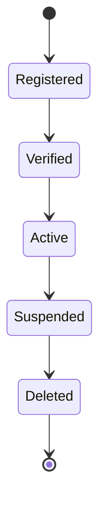
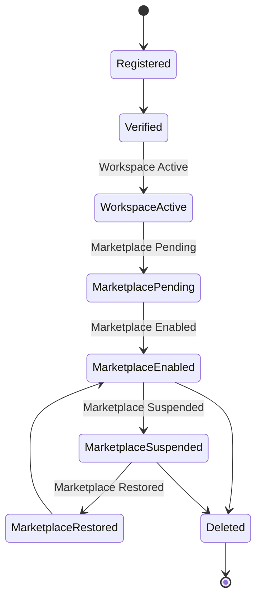
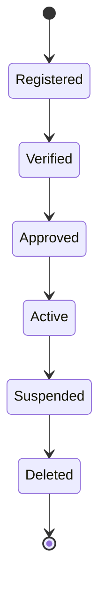

# Choosify Platform Blueprint

**Document ID:** BP-003
**Document Title:** Identity, Authentication & Verification Engine
**Version:** 1.0.0
**Status:** Approved Draft
**Owner:** Choosify Architecture Team
**Classification:** Internal Product Specification
**Last Updated:** August 2026

---

## Table of Contents

1. [Purpose](#1-purpose)
2. [Scope](#2-scope)
3. [Identity Philosophy](#3-identity-philosophy)
4. [Identity Types](#4-identity-types)
5. [Registration Workflows](#5-registration-workflows)
6. [Marketplace Approval](#6-marketplace-approval)
7. [Brand Verification](#7-brand-verification)
8. [Marketplace Lifecycle](#8-marketplace-lifecycle)
9. [Ownership Claims](#9-ownership-claims)
10. [Identity Verification](#10-identity-verification)
11. [Marketplace Status](#11-marketplace-status)
12. [Authentication](#12-authentication)
13. [Session Management](#13-session-management)
14. [Authorization](#14-authorization)
15. [Staff Access](#15-staff-access)
16. [Identity Recovery](#16-identity-recovery)
17. [Account Suspension](#17-account-suspension)
18. [Marketplace Suspension](#18-marketplace-suspension)
19. [Account Deletion](#19-account-deletion)
20. [Security Principles](#20-security-principles)
21. [Business Rules](#21-business-rules)
22. [Identity State Machine](#22-identity-state-machine)
23. [Dependencies](#23-dependencies)
24. [Acceptance Criteria](#24-acceptance-criteria)
25. [Revision History](#revision-history)

---

## 1. Purpose

This document defines how identities are created, authenticated, verified, secured, approved, suspended, restored, and permanently removed throughout the Choosify Commerce Operating System.

The Identity Engine serves as the trust foundation of the platform and governs every authenticated interaction.

No authenticated feature may bypass this engine.

---

## 2. Scope

This document governs:

- Registration
- Login
- Authentication
- Authorization
- Identity Verification
- Marketplace Verification
- Ownership Claims
- Session Management
- Security
- Account Recovery
- Account Suspension
- Account Deletion

---

## 3. Identity Philosophy

Identity represents accountability.

Every authenticated action performed inside Choosify must be attributable to a verified identity.

Anonymous commerce is not permitted.

Verified identity forms the foundation of:

- Trust
- Reputation
- Orders
- Payments
- Reviews
- Messaging
- Ownership
- Governance

---

## 4. Identity Types

Choosify supports four primary identities.

### Consumer

Individual purchasing products or services.

### Seller

Business owner operating one or more Brands.

### Creator

Verified content creator producing commerce-related educational content.

### Super Administrator

Platform operator responsible for governance and administration.

---

## 5. Registration Workflows

### Consumer Registration

Consumer completes:

- Name
- Email or Mobile Number
- Password
- Country
- Accept Terms

### Seller Registration

Seller completes:

- Business Name
- Owner Name
- Email
- Mobile
- Password
- Business Category
- Business Address
- Trade License (if applicable)
- NID / Passport
- Website (optional)

### Creator Registration

Creator completes:

- Name
- Email
- Password
- Profile Information
- Social Links
- Portfolio (optional)

---

## 6. Marketplace Approval

Seller registration does NOT automatically publish the business.

After registration:

Seller Workspace is immediately available.

Brand Studio is editable.

Products may be prepared.

Marketplace remains hidden until administrative approval.

This allows businesses to prepare their complete storefront before publication.

---

## 7. Brand Verification

Every public Brand requires ownership verification.

Verification may occur through:

- New Brand Registration
- Existing Brand Claim

Required evidence may include:

- Trade License
- Trademark
- Business Documents
- Website
- Social Media
- Supporting Documents

Additional verification may be requested.

---

## 8. Marketplace Lifecycle

Marketplace approval and Brand verification remain independent processes where necessary.

---

## 9. Ownership Claims

Existing public Brand profiles may be claimed.

Claim workflow:

Rejected claims never transfer ownership.

---

## 10. Identity Verification

Verification confirms the authenticity of an individual or organization.

Verification may require:

**Individuals**

- National ID
- Passport

**Businesses**

- Trade License
- Business Registration
- Tax Identification
- VAT Registration (where applicable)

Future verification methods may be introduced.

---

## 11. Marketplace Status

Each Brand maintains an operational marketplace status.

Possible states include:

- Draft
- Pending Review
- Marketplace Enabled
- Marketplace Suspended
- Marketplace Disabled
- Banned

Marketplace status never determines editing permissions.

---

## 12. Authentication

Authentication supports:

- Email Login
- Mobile Login (Future)
- Social Login (Future)

Session management uses secure authentication tokens.

Authentication verifies identity only.

Authorization remains a separate responsibility.

---

## 13. Session Management

Each authenticated session records:

- User
- Device
- Browser
- Login Time
- Last Activity

Future enhancements:

- Active Device Management
- Session Revocation
- Trusted Devices

---

## 14. Authorization

Choosify uses Role-Based Access Control.

Authorization determines:

- Accessible Workspaces
- Available Modules
- Editable Resources
- Administrative Privileges
- Financial Permissions

Frontend visibility never replaces backend authorization.

---

## 15. Staff Access

Primary account owners may invite Staff Members.

Invitation workflow:

Staff permissions remain configurable.

---

## 16. Identity Recovery

Recovery options include:

- Email Verification
- OTP
- Administrator Assistance (where appropriate)

Future:

- Passkeys
- Multi-Factor Authentication
- Hardware Keys

---

## 17. Account Suspension

Accounts may be suspended because of:

- Fraud
- Spam
- Fake Documents
- Policy Violations
- Security Risks

Suspension prevents marketplace participation while preserving business data unless permanent removal is required.

---

## 18. Marketplace Suspension

Marketplace suspension affects visibility only.

Marketplace suspension DOES NOT:

- Delete Products
- Delete Services
- Delete Orders
- Delete Finance
- Delete Brand Information

Seller continues managing the workspace.

If active customer orders exist, administrators receive operational warnings before marketplace enforcement actions.

---

## 19. Account Deletion

Deletion workflow:

Historical transactions remain preserved where legally required.

---

## 20. Security Principles

Identity security follows:

- Strong Authentication
- Secure Password Storage
- Token-Based Authentication
- Secure Session Management
- Principle of Least Privilege
- Audit Logging

Future enhancements include:

- MFA
- Device Verification
- Risk-Based Authentication

---

## 21. Business Rules

### BR-3.1

Registration does not automatically grant Marketplace Access.

### BR-3.2

Every Brand requires verified ownership before publication.

### BR-3.3

Marketplace visibility remains independent from editing permissions.

### BR-3.4

Ownership claims require administrative approval.

### BR-3.5

Only verified identities may operate publicly.

### BR-3.6

Staff members never own business assets.

### BR-3.7

Authentication and Authorization remain separate responsibilities.

### BR-3.8

Administrative approval may request additional verification documents.

### BR-3.9

Marketplace suspension does not remove operational access to the Seller Workspace.

### BR-3.10

Identity records must remain fully auditable.

---

## 22. Identity State Machine

### Consumer

### Seller

### Creator

---

## 23. Dependencies

Depends on:

- BP-000 Executive Summary
- BP-001 Vision & Constitution
- BP-002 User Ecosystem

Referenced by:

- Seller Workspace
- Product Engine
- Commerce Engine
- Trust Engine
- Finance Engine
- Administration Engine

---

## 24. Acceptance Criteria

This document is complete when:

- Registration workflows are defined.
- Identity verification is documented.
- Marketplace approval is documented.
- Ownership claims are defined.
- Authentication is documented.
- Authorization model is established.
- Session management is documented.
- Staff access is defined.
- Marketplace suspension behaviour is documented.
- Identity lifecycle is fully documented.
- Security principles are established.
- Business rules governing identity are complete.

---

## Revision History

| Version | Date | Description |
|----------|------|-------------|
| 1.0.0 | August 2026 | Initial Identity, Authentication & Verification Engine |
