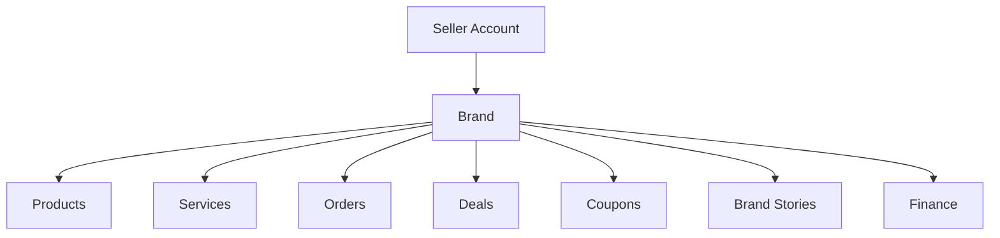
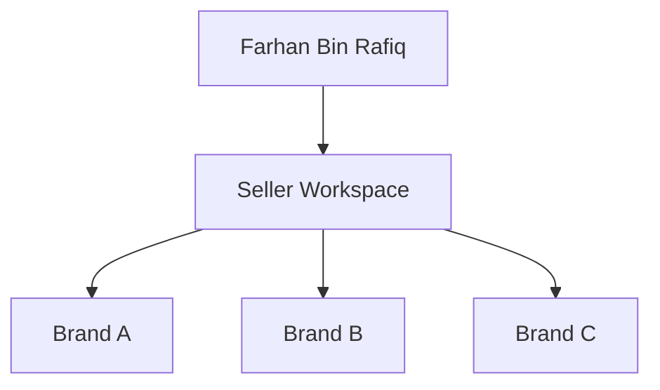
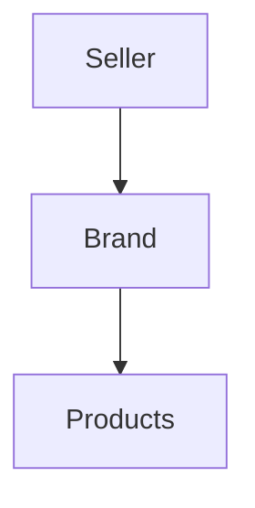
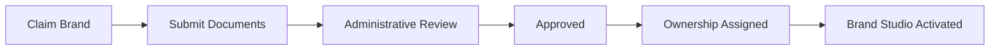

# Choosify Platform Blueprint

**Document ID:** BP-004
**Document Title:** Seller Workspace & Brand Architecture
**Version:** 1.0.0
**Status:** Approved Draft
**Owner:** Choosify Architecture Team
**Classification:** Internal Product Specification
**Last Updated:** August 2026

---

## Table of Contents

1. [Purpose](#1-purpose)
2. [Scope](#2-scope)
3. [Seller Workspace Philosophy](#3-seller-workspace-philosophy)
4. [Seller Account Model](#4-seller-account-model)
5. [Multi-Brand Architecture](#5-multi-brand-architecture)
6. [Active Brand Context](#6-active-brand-context)
7. [First-Time Seller Experience](#7-first-time-seller-experience)
8. [Brand Creation Wizard](#8-brand-creation-wizard)
9. [Brand Management Studio](#9-brand-management-studio)
10. [Marketplace Access](#10-marketplace-access)
11. [Marketplace Suspension](#11-marketplace-suspension)
12. [Brand Ownership](#12-brand-ownership)
13. [Staff Management](#13-staff-management)
14. [Brand Verification](#14-brand-verification)
15. [Marketplace Lifecycle](#15-marketplace-lifecycle)
16. [Brand Claim Process](#16-brand-claim-process)
17. [Brand Profile](#17-brand-profile)
18. [Brand Stories](#18-brand-stories)
19. [Live Commerce](#19-live-commerce)
20. [Deals & Promotions](#20-deals--promotions)
21. [Workspace Navigation](#21-workspace-navigation)
22. [Business Rules](#22-business-rules)
23. [Dependencies](#23-dependencies)
24. [Acceptance Criteria](#24-acceptance-criteria)
25. [Revision History](#revision-history)

---

## 1. Purpose

This document defines the complete Seller Workspace architecture of the Choosify Commerce Operating System.

The Seller Workspace is the operational headquarters of every verified business on the platform.

It provides the tools required to operate one or more Brands, manage commerce, communicate with customers, monitor finance, create content, and grow business operations.

This document governs all Brand-related functionality throughout the platform.

---

## 2. Scope

This document governs:

- Seller Workspace
- Brand Architecture
- Multi-Brand Ownership
- Brand Creation
- Brand Verification
- Marketplace Access
- Brand Management Studio
- Brand Staff
- Brand Lifecycle
- Brand Visibility
- Workspace Navigation
- Workspace Permissions

---

## 3. Seller Workspace Philosophy

The Seller Workspace is **not** an admin dashboard.

It is a Business Operating System.

A Seller should be able to operate an entire company from this workspace without needing third-party tools for day-to-day marketplace operations.

The workspace must remain scalable from:

- Individual entrepreneur

to

- National enterprise operating multiple Brands.

---

## 4. Seller Account Model

A Seller Account represents the legal owner.

A Brand represents the commercial identity.

Relationship:

Ownership always flows downward.

Brand ownership never flows upward.

---

## 5. Multi-Brand Architecture

A single Seller Account may own:

- One Brand
- Two Brands
- Hundreds of Brands

There is no architectural limitation.

Each Brand remains operationally independent.

Example:

Each Brand contains:

- Products
- Services
- Orders
- Analytics
- Deals
- Coupons
- Reviews
- Brand Stories
- Marketplace Status

---

## 6. Active Brand Context

When multiple Brands exist, the Seller Workspace maintains an Active Brand.

The Active Brand determines the operational context for:

- Brand Studio
- Products
- Inventory
- Reviews
- Deals
- Coupons
- Orders
- Messaging
- Analytics
- Finance

Changing Active Brand never requires logging out.

---

## 7. First-Time Seller Experience

Immediately after Seller registration:

Seller Workspace becomes available.

The Seller sees:

> Welcome to Choosify
>
> Create Your First Brand

No demo Brands.

No mock Brands.

No seeded Brands.

No automatic Brand creation.

The workspace begins completely empty.

---

## 8. Brand Creation Wizard

Creating a Brand follows a guided workflow.

**Step 1 — Business Information**

- Brand Name
- Category
- Business Description
- Contact Details

**Step 2 — Brand Identity**

- Logo
- Cover Image
- Brand Colors
- Brand Story
- Social Links
- Website

**Step 3 — Verification**

Upload:

- Trade License
- NID / Passport
- Supporting Documents

---

## 9. Brand Management Studio

Brand Management Studio serves as the CMS for one Brand.

It controls:

- Brand Identity
- Media
- About
- Contact
- FAQ
- Store Locations
- Social Links
- Business Hours
- Awards
- Certifications
- Brand Story
- Marketplace Configuration
- Reviews
- Analytics

Everything visible on the public Brand Profile originates here.

---

## 10. Marketplace Access

Marketplace Access determines public visibility.

Marketplace Access does NOT determine editing permissions.

Examples:

---

## 11. Marketplace Suspension

Marketplace suspension hides the Brand from:

- Search
- Categories
- Homepage
- Brand Directory
- Product Listings
- Service Listings
- Deals
- Recommendations

However:

Seller continues accessing:

- Brand Studio
- Products
- Orders
- Finance
- Messaging
- Inventory

Existing customer obligations continue until fulfilled.

---

## 12. Brand Ownership

Every Brand belongs to exactly one Seller Account.

Business Rule:

Ownership cannot be shared.

Operational access may be delegated through Staff Accounts.

---

## 13. Staff Management

Each Brand may invite staff.

Examples:

- Inventory Manager
- Marketing Manager
- Customer Support
- Finance Officer
- Brand Manager
- Content Manager
- Order Manager

Each staff member receives configurable permissions.

Staff members never become Brand owners.

---

## 14. Brand Verification

Every Brand progresses through:

Additional documentation may be requested.

Rejected applications return to Draft.

---

## 15. Marketplace Lifecycle

Marketplace Statuses:

- Draft
- Pending Verification
- Under Review
- Marketplace Enabled
- Marketplace Suspended
- Marketplace Disabled
- Banned

Status changes remain fully auditable.

---

## 16. Brand Claim Process

Some Brands already exist within Choosify.

Workflow:

If rejected:

Ownership remains unchanged.

---

## 17. Brand Profile

Public Brand Profile contains:

- Logo
- Cover
- Description
- Contact
- Website
- Social Links
- Store Locations
- Products
- Services
- Reviews
- Ratings
- Brand Stories
- Live Commerce
- Deals
- Trust Score
- Marketplace Status
- Verification Badge

Everything originates from Brand Studio.

---

## 18. Brand Stories

Every Brand may publish educational content.

Examples:

- Product Demonstrations
- Buying Guides
- Behind-the-Scenes
- Manufacturing Process
- Product Care
- Tutorials
- Announcements
- Live Streams
- Promotional Videos

Brand Stories appear:

- Brand Profile
- Discovery Feed
- Search
- Related Products

Content is labelled `Brand Content` to distinguish it from independent Creator content.

---

## 19. Live Commerce

Brands may create Live Sessions.

Supported sources:

- Facebook Live
- YouTube Live
- Instagram Live
- Future Native Streaming

Products and Services may be tagged directly inside a Live Session.

Consumers may purchase while watching.

---

## 20. Deals & Promotions

Existing Products may become Deals.

Workflow:

Deals reference Products.

Product information is never duplicated.

---

## 21. Workspace Navigation

The Seller Workspace provides access to:

- Dashboard
- Brand Management Studio
- Products & Inventory
- Orders
- Returns
- Logistics
- Reviews
- Messaging
- Notifications
- Finance
- My Cashbook
- Coupons
- Promotions
- Brand Stories
- Settings

Navigation remains scoped to the Active Brand where applicable.

---

## 22. Business Rules

### BR-4.1

Every Seller owns one or more Brands.

### BR-4.2

Every Brand belongs to exactly one Seller.

### BR-4.3

Marketplace Access is required before public publication.

### BR-4.4

Marketplace Access never controls editing permissions.

### BR-4.5

No Brand is automatically created during Seller registration.

### BR-4.6

Brand ownership is verified before marketplace publication.

### BR-4.7

Staff members never own Brands.

### BR-4.8

Brand Stories belong to Brands and are labelled as Brand Content.

### BR-4.9

Deals always reference existing Products or Services.

### BR-4.10

Live Commerce belongs to the Brand that created it.

---

## 23. Dependencies

Depends on:

- BP-000 Executive Summary
- BP-001 Vision & Constitution
- BP-002 User Ecosystem
- BP-003 Identity & Verification

Referenced by:

- Product Engine
- Commerce Engine
- Communication Engine
- Finance Engine
- Trust Engine
- Administration Engine

---

## 24. Acceptance Criteria

This document is complete when:

- Seller Workspace architecture is defined.
- Multi-Brand ownership is documented.
- Active Brand context is established.
- Brand Creation Wizard is specified.
- Brand Studio responsibilities are documented.
- Marketplace Access behaviour is defined.
- Marketplace suspension behaviour is defined.
- Brand Claim workflow is defined.
- Staff model is documented.
- Brand Stories are defined.
- Live Commerce integration is documented.
- Deals architecture is defined.
- Business rules governing Brand ownership are complete.

---

## Revision History

| Version | Date | Description |
|----------|------|-------------|
| 1.0.0 | August 2026 | Initial Seller Workspace & Brand Architecture |
