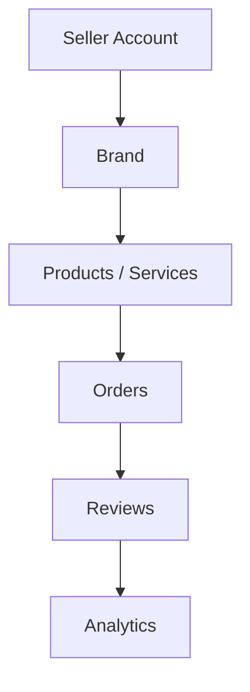
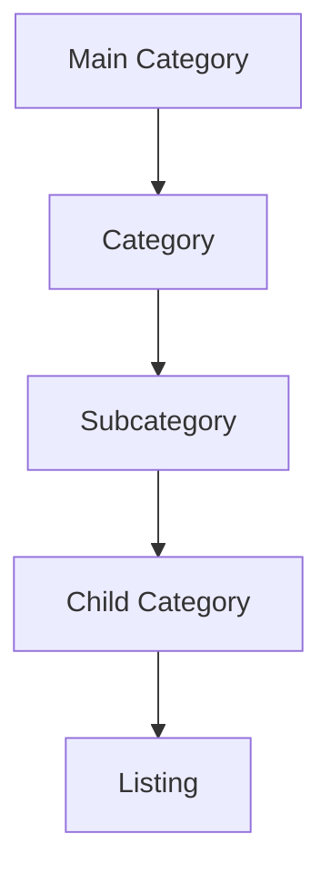
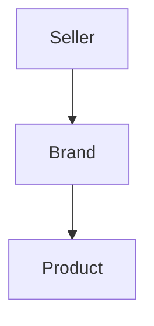
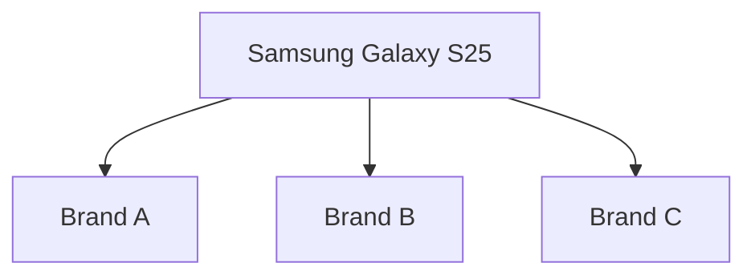
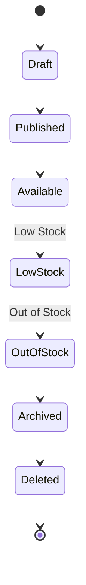
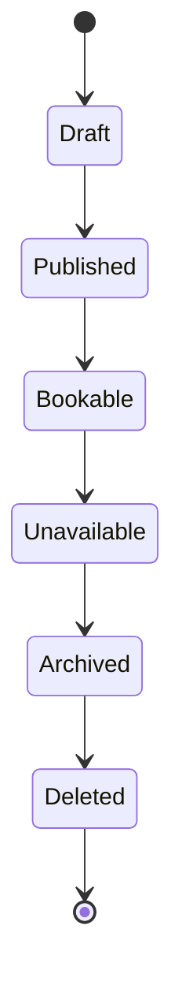
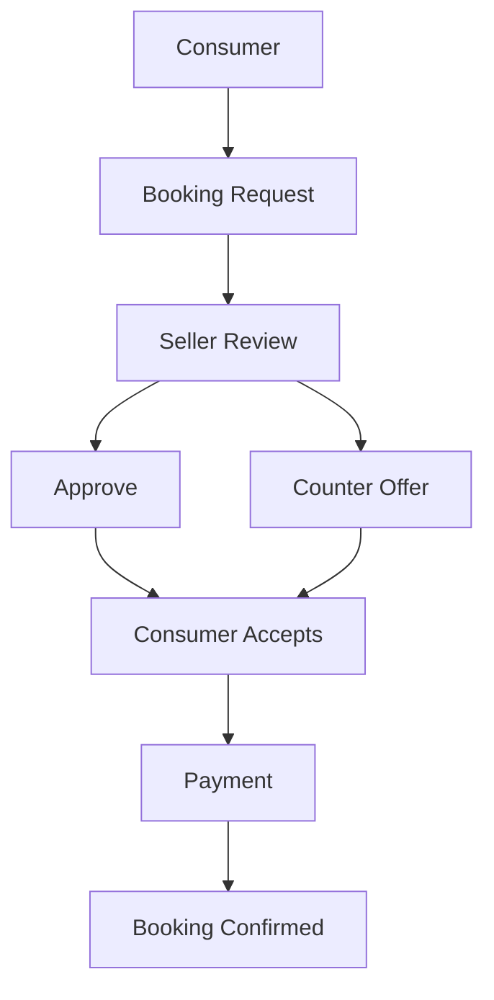

# Choosify Platform Blueprint

**Document ID:** BP-005
**Document Title:** Product & Service Engine
**Version:** 1.0.0
**Status:** Approved Draft
**Owner:** Choosify Architecture Team
**Classification:** Internal Product Specification
**Last Updated:** August 2026

---

## Table of Contents

1. [Purpose](#1-purpose)
2. [Scope](#2-scope)
3. [Product Philosophy](#3-product-philosophy)
4. [Product Architecture](#4-product-architecture)
5. [Supported Listing Types](#5-supported-listing-types)
6. [Category Architecture](#6-category-architecture)
7. [Primary Marketplace Categories](#7-primary-marketplace-categories)
8. [Product Creation](#8-product-creation)
9. [Service Creation](#9-service-creation)
10. [Product Ownership](#10-product-ownership)
11. [Multiple Sellers](#11-multiple-sellers)
12. [Product Comparison Engine](#12-product-comparison-engine)
13. [Search Engine](#13-search-engine)
14. [Inventory Management](#14-inventory-management)
15. [Product Lifecycle](#15-product-lifecycle)
16. [Service Lifecycle](#16-service-lifecycle)
17. [Pricing Engine](#17-pricing-engine)
18. [Service Booking](#18-service-booking)
19. [Service Availability](#19-service-availability)
20. [Product Variants](#20-product-variants)
21. [Product Attributes](#21-product-attributes)
22. [Marketplace Visibility](#22-marketplace-visibility)
23. [Product Bundles](#23-product-bundles)
24. [Add-ons](#24-add-ons)
25. [Digital Products](#25-digital-products)
26. [Deals](#26-deals)
27. [Product Reviews](#27-product-reviews)
28. [Business Rules](#28-business-rules)
29. [Dependencies](#29-dependencies)
30. [Acceptance Criteria](#30-acceptance-criteria)
31. [Revision History](#revision-history)

---

## 1. Purpose

This document defines the Product & Service Engine of the Choosify Commerce Operating System.

The Product & Service Engine governs how Brands create, organize, manage, publish, compare, inventory, price, promote, and retire both physical products and bookable services.

This engine powers every commercial listing throughout the Choosify ecosystem.

---

## 2. Scope

This document governs:

- Product Architecture
- Service Architecture
- Categories
- Attributes
- Variants
- Inventory
- Pricing
- Product Lifecycle
- Service Lifecycle
- Search
- Comparison Engine
- Marketplace Visibility
- Bundles
- Digital Products
- Promotions
- Product Ownership

---

## 3. Product Philosophy

Every listing on Choosify belongs to exactly one verified Brand.

Products and Services are treated as commercial assets owned by the Brand.

No listing exists independently.

Every listing must always have:

- Owner
- Category
- Status
- Marketplace Visibility
- Audit History

---

## 4. Product Architecture

Relationship:

Products always inherit ownership from their Brand.

---

## 5. Supported Listing Types

Choosify supports multiple commercial listing types.

### Physical Products

Examples

- Electronics
- Fashion
- Furniture
- Grocery
- Automotive
- Books
- Sports
- Jewelry

### Services

Examples

- Hotels
- Tours
- Doctors
- Salons
- Lawyers
- Consultants
- Home Services
- Event Management

### Digital Products

Examples

- Software
- Licenses
- E-books
- Templates
- Online Courses
- Digital Downloads

### Rental Listings

Examples

- Cars
- Equipment
- Properties
- Photography Gear

### Auction Listings

Future Module

---

## 6. Category Architecture

Choosify uses a hierarchical category system.

Each level may define:

- Attributes
- Variants
- Specifications
- Search Filters
- Comparison Rules

---

## 7. Primary Marketplace Categories

The platform initially supports:

- Fashion & Lifestyle
- Jewelry & Luxury
- Beauty, Health & Pharmacy
- Electronics
- Home, Furniture & Appliances
- Grocery & Food
- Baby, Kids & Toys
- Sports, Fitness & Outdoor
- Gaming & Entertainment
- Automotive
- Books, Education & Arts
- Pets & Agriculture
- Travel & Hospitality
- Real Estate
- Events & Wedding
- Professional & Home Services
- Industrial & Business
- Digital Products
- Financial & Government Services
- Jobs & Recruitment
- B2B Marketplace
- Rental Marketplace
- Used Products
- Auctions
- Community & Social Impact
- Bookings & Appointments

Additional categories may be added without architectural changes.

---

## 8. Product Creation

Products may only be created by:

- Marketplace Approved Sellers

Product creation requires:

- Active Brand
- Category
- Product Information
- Pricing
- Images
- Inventory
- Attributes

Products are immediately available inside Seller Workspace.

Public visibility depends on Marketplace status.

---

## 9. Service Creation

Services follow a similar workflow.

Additional information includes:

- Duration
- Availability
- Working Hours
- Booking Rules
- Cancellation Policy
- Pricing Model

---

## 10. Product Ownership

Every Product belongs to exactly one Brand.

A Product cannot exist without a Brand.

Ownership chain:

---

## 11. Multiple Sellers

Multiple Brands may sell the same commercial product.

Example:

Each Brand creates and manages its own listing.

Each listing has:

- Independent Pricing
- Independent Inventory
- Independent Warranty
- Independent Reviews
- Independent Shipping
- Independent Analytics

Consumers may compare these sellers.

---

## 12. Product Comparison Engine

Comparison is category-aware.

Consumers may compare only listings within compatible categories.

Examples:

✔ Phone ↔ Phone

✔ Laptop ↔ Laptop

✔ Hotel ↔ Hotel

✔ Tour ↔ Tour

✘ Phone ↔ Hotel

✘ Shoes ↔ Refrigerator

✘ Doctor ↔ Perfume

Comparison rules are defined per category.

---

## 13. Search Engine

Search supports:

- Keywords
- Synonyms
- Typo Correction
- AI Suggestions
- Natural Language
- Category Filters
- Brand Filters
- Seller Filters
- Price Filters
- Location Filters

Examples:

- Samsung Phone
- Phone under 50,000
- Gaming Laptop
- Hotel in Cox's Bazar
- Saint Martin Tour
- Lawyer in Dhaka

Search results may include:

- Products
- Services
- Brands
- Guides
- Brand Stories
- Creator Content
- Sponsored Listings

---

## 14. Inventory Management

Inventory belongs to the Brand.

Supported inventory states:

- In Stock
- Low Stock
- Out of Stock
- Archived

Inventory supports:

- SKU
- Barcode
- Quantity
- Warehouse
- Alerts
- Batch Tracking (Future)

---

## 15. Product Lifecycle

Products move through:

Products remain editable throughout their lifecycle.

Archived products are automatically removed after the configured retention period.

---

## 16. Service Lifecycle

Services move through:

---

## 17. Pricing Engine

Supported pricing models include:

**Products**

- Fixed Price

**Services**

- Hourly
- Daily
- Weekly
- Monthly
- Per Person
- Per Guest
- Per Room
- Per Session

Each category may define additional pricing methods.

---

## 18. Service Booking

Service booking workflow:

Counter offers remain optional.

Sellers may approve requests without modification.

---

## 19. Service Availability

Services may define:

- Working Days
- Working Hours
- Calendar Availability
- Capacity
- Advance Notice
- Blackout Dates

Availability integrates with booking workflows.

---

## 20. Product Variants

Variant definitions are category-specific.

Examples include:

- Color
- Size
- Material
- Storage
- Memory
- Weight
- Height
- Width
- Length
- Capacity
- Model
- Version
- Finish
- Pattern
- Flavor

Categories define their own variant schema.

No universal variant model is imposed.

---

## 21. Product Attributes

Administrators define category attributes.

Examples:

**Electronics**

- Processor
- RAM
- Storage
- Battery

**Hotels**

- Rooms
- Facilities
- Check-in Time

**Real Estate**

- Bedrooms
- Bathrooms
- Area
- Parking

Categories may expand independently.

---

## 22. Marketplace Visibility

Marketplace visibility depends on:

- Marketplace Approval
- Brand Status
- Product Status

Marketplace suspension hides listings from public discovery.

Seller Workspace remains fully operational.

---

## 23. Product Bundles

Brands may publish bundles.

Bundle components reference existing products.

Bundle information includes:

- Included Items
- Bundle Price
- Savings
- Optional Add-ons

Inventory remains linked to individual products.

---

## 24. Add-ons

Products and Services may define optional add-ons.

Examples:

- **Phone** — Extended Warranty, Insurance
- **Hotel** — Airport Pickup, Breakfast, Extra Bed
- **Tour** — Photography, Meals, Transport

Add-ons modify checkout pricing.

---

## 25. Digital Products

Digital products support:

- Instant Download
- License Keys
- Download Center
- Email Delivery
- Version History

Future:

- Subscription Downloads
- Update Notifications

---

## 26. Deals

Products may be promoted as Deals.

Deal information references existing listings.

Supported configuration:

- Discount
- Quantity
- Start Date
- End Date
- Featured Placement
- Flash Sale

---

## 27. Product Reviews

Reviews belong to completed transactions.

Only verified purchasers may submit product reviews.

Sellers may submit one official reply.

Administrative moderation remains available.

---

## 28. Business Rules

### BR-5.1

Every Product belongs to exactly one Brand.

### BR-5.2

Only Marketplace Approved Brands may publish listings.

### BR-5.3

Products remain editable during Marketplace suspension.

### BR-5.4

Comparison is restricted to compatible categories.

### BR-5.5

Category Administrators define attributes.

### BR-5.6

Variant models are category-specific.

### BR-5.7

Bundles reference existing Products.

### BR-5.8

Deals reference existing listings.

### BR-5.9

Services support optional counter offers.

### BR-5.10

Marketplace visibility never changes ownership.

---

## 29. Dependencies

Depends on:

- BP-000 Executive Summary
- BP-001 Vision & Constitution
- BP-002 User Ecosystem
- BP-003 Identity & Verification
- BP-004 Seller Workspace

Referenced by:

- Commerce Engine
- Messaging Engine
- Finance Engine
- Trust Engine
- Discovery Engine
- Administration Engine

---

## 30. Acceptance Criteria

This document is complete when:

- Product architecture is defined.
- Service architecture is defined.
- Category hierarchy is established.
- Product ownership is documented.
- Multi-seller support is defined.
- Inventory lifecycle is documented.
- Pricing models are defined.
- Service booking workflow is established.
- Variant architecture is documented.
- Search behaviour is specified.
- Comparison Engine is defined.
- Marketplace visibility is documented.
- Bundles and add-ons are supported.
- Digital products are supported.
- Business rules governing listings are complete.

---

## Revision History

| Version | Date | Description |
|----------|------|-------------|
| 1.0.0 | August 2026 | Initial Product & Service Engine |
