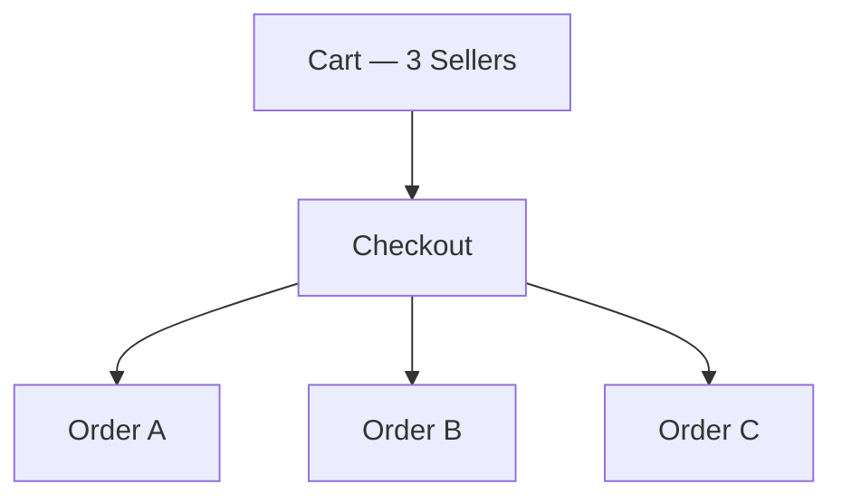
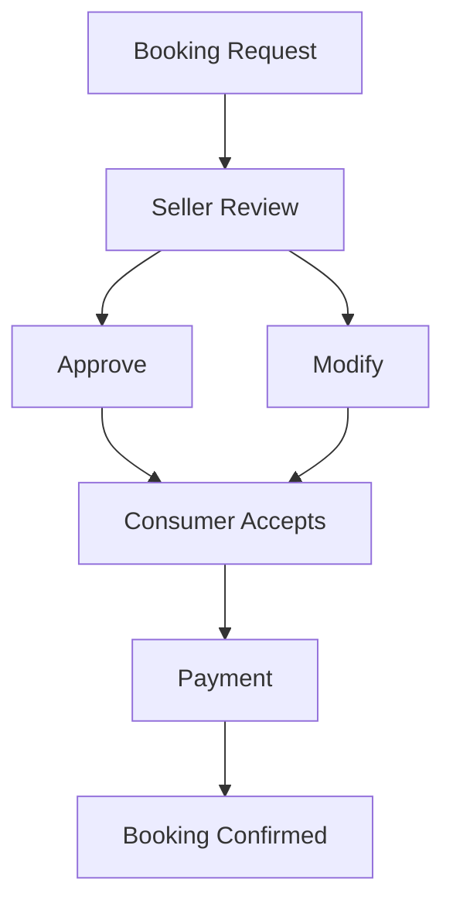
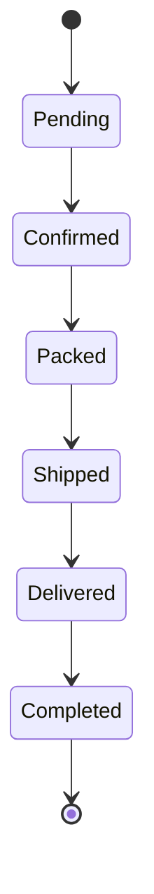
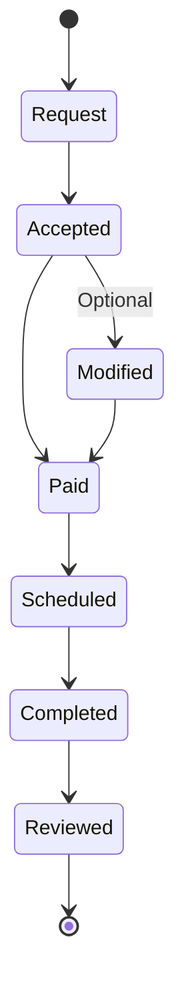
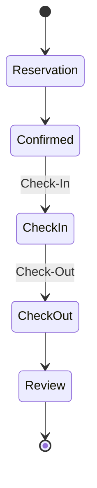
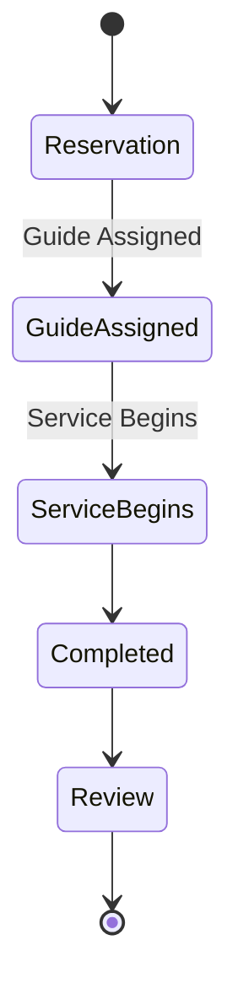
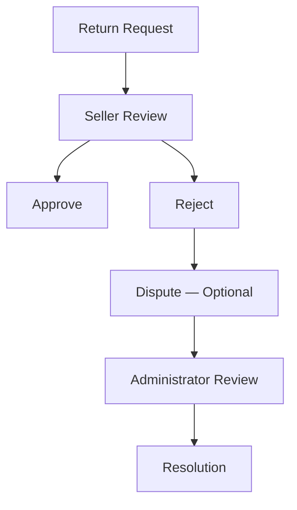

# Choosify Platform Blueprint

**Document ID:** BP-006
**Document Title:** Commerce Engine (Orders, Checkout & Payments)
**Version:** 1.0.0
**Status:** Approved Draft
**Owner:** Choosify Architecture Team
**Classification:** Internal Product Specification
**Last Updated:** August 2026

---

## Table of Contents

1. [Purpose](#1-purpose)
2. [Scope](#2-scope)
3. [Commerce Philosophy](#3-commerce-philosophy)
4. [Shopping Cart](#4-shopping-cart)
5. [Multi-Seller Checkout](#5-multi-seller-checkout)
6. [Product Checkout](#6-product-checkout)
7. [Service Checkout](#7-service-checkout)
8. [Booking Workflow](#8-booking-workflow)
9. [Shopping Cart Behaviour](#9-shopping-cart-behaviour)
10. [Payment Methods](#10-payment-methods)
11. [Partial Payments](#11-partial-payments)
12. [Escrow](#12-escrow)
13. [Product Order Lifecycle](#13-product-order-lifecycle)
14. [Service Order Lifecycle](#14-service-order-lifecycle)
15. [Hotel Lifecycle](#15-hotel-lifecycle)
16. [Tour Lifecycle](#16-tour-lifecycle)
17. [Digital Products](#17-digital-products)
18. [Shipping](#18-shipping)
19. [Order Messaging](#19-order-messaging)
20. [Counter Offers](#20-counter-offers)
21. [Returns](#21-returns)
22. [Refunds](#22-refunds)
23. [Cancellations](#23-cancellations)
24. [Coupons](#24-coupons)
25. [Gift Cards](#25-gift-cards)
26. [Wishlist](#26-wishlist)
27. [Reordering](#27-reordering)
28. [Invoice Engine](#28-invoice-engine)
29. [Trust Integration](#29-trust-integration)
30. [Business Rules](#30-business-rules)
31. [Dependencies](#31-dependencies)
32. [Acceptance Criteria](#32-acceptance-criteria)
33. [Revision History](#revision-history)

---

## 1. Purpose

This document defines the Commerce Engine responsible for transforming products and services into secure, traceable commercial transactions.

The Commerce Engine governs:

- Shopping Cart
- Checkout
- Orders
- Payments
- Escrow
- Shipping
- Booking
- Returns
- Refunds
- Invoices
- Coupons
- Gift Cards
- Order Lifecycle

The Commerce Engine is the operational heart of Choosify.

---

## 2. Scope

This document governs:

- Shopping Cart
- Checkout
- Orders
- Product Orders
- Service Orders
- Payment Engine
- Escrow
- Shipping
- Booking
- Order Status
- Refunds
- Returns
- Coupons
- Gift Cards
- Invoices

---

## 3. Commerce Philosophy

Commerce does not end when a customer clicks **Buy**.

Choosify treats commerce as a complete lifecycle.

Every transaction contributes to the Trust Engine.

---

## 4. Shopping Cart

Consumers use a unified shopping cart.

The cart may contain:

- Products
- Services
- Digital Products
- Rentals
- Bookings

All items remain in a single cart regardless of Seller.

---

## 5. Multi-Seller Checkout

Consumers complete checkout once.

After confirmation the Commerce Engine automatically separates items into independent Seller Orders.

Example:

Each Seller only sees their own order.

Consumers continue managing all orders from a unified Order History.

---

## 6. Product Checkout

Product checkout supports:

- Online Payment
- Cash on Delivery
- Partial Advance Payment
- Delivery Charge Collection
- Coupons
- Gift Cards

Sellers may configure payment behaviour according to category and platform policy.

---

## 7. Service Checkout

Services operate differently.

Workflow:

Counter Offers remain optional.

---

## 8. Booking Workflow

Supported service types include:

- Hotels
- Tours
- Doctors
- Salons
- Events
- Appointments
- Home Services
- Professional Services

Every booking generates a commercial order.

---

## 9. Shopping Cart Behaviour

The cart supports:

- Multiple Sellers
- Multiple Categories
- Multiple Service Types
- Saved Cart
- Quantity Updates
- Price Recalculation
- Promotion Validation
- Shipping Estimation

---

## 10. Payment Methods

Supported methods include:

- Cash on Delivery
- Debit Card
- Credit Card
- Mobile Financial Services
- Bank Transfer
- Wallet
- Installments
- Future Payment Gateways

Payment availability depends on Seller configuration and platform policy.

---

## 11. Partial Payments

Certain products and services require partial payment.

| Category | Consumer Pays Now | Remaining Balance |
|----------|-------------------|--------------------|
| Physical Products | Delivery Charge | Cash on Delivery |
| Hotels | Booking Deposit | Check-in |
| Tours | Advance Deposit | Service Date |

Partial payment rules are centrally configured by Administration and enabled by Sellers.

---

## 12. Escrow

Choosify acts as escrow holder.

Payments remain protected until transaction obligations are fulfilled.

Funds release only after:

- Delivery
- Service Completion
- Booking Completion
- Refund Resolution

Escrow protects:

- Consumers
- Sellers
- Platform

---

## 13. Product Order Lifecycle

Cancelled orders terminate the workflow.

---

## 14. Service Order Lifecycle

---

## 15. Hotel Lifecycle

---

## 16. Tour Lifecycle

---

## 17. Digital Products

Digital products support:

- Instant Download
- Email Delivery
- License Keys
- Download Centre
- Version Updates

No shipping is required.

---

## 18. Shipping

Shipping supports:

- Platform Couriers
- Seller Couriers
- Self Delivery
- Pickup
- Delivery Tracking

Shipping costs are calculated independently per Seller.

---

## 19. Order Messaging

Every order automatically generates an Order Conversation.

The conversation becomes the official communication channel for:

- Questions
- Updates
- Documents
- Status Changes
- Attachments

Order conversations remain linked permanently to the order.

---

## 20. Counter Offers

Service providers may modify:

- Price
- Schedule
- Duration
- Availability
- Included Services

Consumers may:

- Accept
- Reject
- Expire

Counter offers automatically expire after the configured validity period.

---

## 21. Returns

Return requests may be initiated by Consumers.

Workflow:

Return shipping responsibility depends on platform policy and dispute outcome.

---

## 22. Refunds

Refunds support:

- Full Refund
- Partial Refund
- Escrow Release
- Wallet Credit
- Original Payment Method

Refunds may be:

- Automatic
- Administrative
- Dispute Resolution

---

## 23. Cancellations

Consumers may cancel until Seller confirmation.

Sellers may cancel before dispatch.

Administrators may intervene at any stage where policy requires.

Cancellation reasons remain recorded for Trust calculations.

---

## 24. Coupons

Coupons may be issued by:

- Platform
- Sellers
- Creators (within approved limits)

Coupon types include:

- Percentage
- Fixed Amount
- Shipping
- Brand
- Category
- Campaign

Activation limits remain configurable.

---

## 25. Gift Cards

Gift Cards support:

- Fixed Value
- Custom Value
- Expiry
- Redemption Tracking

Future versions may support corporate gift programmes.

---

## 26. Wishlist

Wishlists are private.

Consumers may create multiple collections.

Future versions may support collaborative collections.

---

## 27. Reordering

Completed orders support:

Inventory and pricing are recalculated during checkout.

---

## 28. Invoice Engine

Invoices include:

- Invoice Number
- QR Code
- VAT
- Tax
- Item Breakdown
- Seller Details
- Consumer Details
- Payment History
- Downloadable PDF

Future versions may include digital signatures.

---

## 29. Trust Integration

Every commercial transaction contributes to:

- Seller Trust
- Consumer Trust
- Brand Trust
- Creator Trust (where applicable)

Commerce directly influences platform reputation.

---

## 30. Business Rules

### BR-6.1

One checkout may generate multiple Seller Orders.

### BR-6.2

Each Seller only accesses their own Orders.

### BR-6.3

All orders automatically create an Order Conversation.

### BR-6.4

Escrow protects all prepaid transactions until completion.

### BR-6.5

Service bookings support optional Counter Offers.

### BR-6.6

Marketplace suspension does not cancel active orders.

### BR-6.7

Coupons never duplicate product pricing.

### BR-6.8

Invoices are immutable after completion.

### BR-6.9

Every transaction updates the Trust Engine.

### BR-6.10

Commerce events remain permanently auditable.

---

## 31. Dependencies

Depends on:

- BP-000 Executive Summary
- BP-001 Vision & Constitution
- BP-002 User Ecosystem
- BP-003 Identity & Verification
- BP-004 Seller Workspace
- BP-005 Product & Service Engine

Referenced by:

- Communication Engine
- Finance Engine
- Trust Engine
- Administration Engine
- Logistics Engine

---

## 32. Acceptance Criteria

- Unified Shopping Cart is defined.
- Multi-Seller Checkout is documented.
- Product Checkout is defined.
- Service Checkout is defined.
- Escrow behaviour is specified.
- Payment methods are documented.
- Product lifecycle is defined.
- Service lifecycle is defined.
- Booking workflows are documented.
- Returns and refunds are specified.
- Coupon system is defined.
- Invoice Engine is documented.
- Commerce business rules are complete.

---

## Revision History

| Version | Date | Description |
|----------|------|-------------|
| 1.0.0 | August 2026 | Initial Commerce Engine (Orders, Checkout & Payments) |
