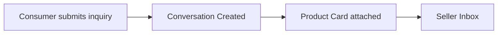
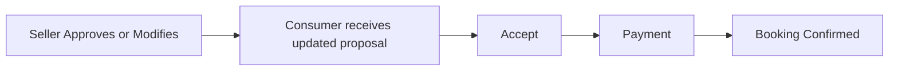
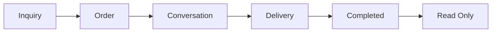
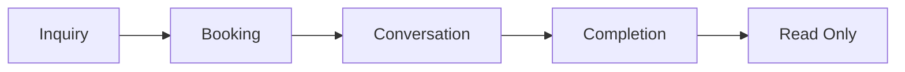
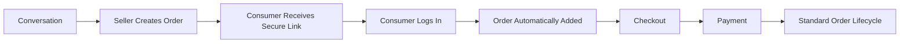
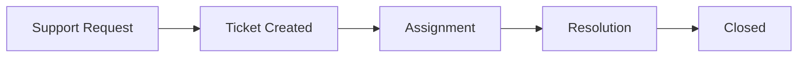

# Choosify Platform Blueprint

**Document ID:** BP-007
**Document Title:** Communication, Messaging & Customer Engagement Engine
**Version:** 1.0.0
**Status:** Approved Draft
**Owner:** Choosify Architecture Team
**Classification:** Internal Product Specification
**Last Updated:** August 2026

---

## Table of Contents

1. [Purpose](#1-purpose)
2. [Scope](#2-scope)
3. [Communication Philosophy](#3-communication-philosophy)
4. [Communication Participants](#4-communication-participants)
5. [Conversation Types](#5-conversation-types)
6. [Product Inquiry Workflow](#6-product-inquiry-workflow)
7. [Service Inquiry Workflow](#7-service-inquiry-workflow)
8. [Counter Offer Workflow](#8-counter-offer-workflow)
9. [Order Conversations](#9-order-conversations)
10. [Conversation Lifecycle](#10-conversation-lifecycle)
11. [Manual Orders](#11-manual-orders)
12. [Multi-Seller Orders](#12-multi-seller-orders)
13. [Social Inbox](#13-social-inbox)
14. [Unified Inbox](#14-unified-inbox)
15. [Live Commerce](#15-live-commerce)
16. [Brand Stories](#16-brand-stories)
17. [Notifications](#17-notifications)
18. [Support Tickets](#18-support-tickets)
19. [Attachments](#19-attachments)
20. [Communication Permissions](#20-communication-permissions)
21. [Moderation](#21-moderation)
22. [Business Rules](#22-business-rules)
23. [Dependencies](#23-dependencies)
24. [Acceptance Criteria](#24-acceptance-criteria)
25. [Revision History](#revision-history)

---

## 1. Purpose

This document defines the Communication & Customer Engagement Engine of the Choosify Commerce Operating System.

The Communication Engine enables secure, contextual, commerce-driven conversations between consumers, sellers, creators, and administrators.

Unlike traditional messaging platforms, communication inside Choosify always exists to support commerce, customer service, education, bookings, orders, or platform operations.

Messaging is never intended to function as an unrestricted social network.

---

## 2. Scope

This document governs:

- Consumer Messaging
- Seller Messaging
- Admin Messaging
- Order Conversations
- Service Conversations
- Support Tickets
- Social Inbox
- Live Commerce
- Notifications
- Message Permissions
- Attachments
- Communication Lifecycle

---

## 3. Communication Philosophy

Every conversation inside Choosify must belong to a business context.

Examples:

- Product Inquiry
- Service Booking
- Order
- Support Ticket
- Verification
- Dispute
- Return
- Live Commerce
- Brand Story

Free-form social messaging is not supported.

---

## 4. Communication Participants

Supported conversations:

✔ Consumer ↔ Seller

✔ Seller ↔ Consumer

✔ Seller ↔ Administrator

✔ Administrator ↔ Everyone

✔ Consumer ↔ Platform Support

✔ Seller Staff ↔ Consumer

Not Supported:

✘ Consumer ↔ Consumer

✘ Creator ↔ Consumer Direct Messaging

✘ Creator ↔ Brand Direct Messaging

✘ Seller ↔ Seller Marketplace Messaging

---

## 5. Conversation Types

Choosify supports multiple conversation contexts.

- Product Inquiry
- Service Booking
- Order Conversation
- Return Request
- Refund Discussion
- Dispute
- Platform Support
- Verification
- Live Commerce
- Manual Order
- General Business Inquiry

Every conversation belongs to exactly one context.

---

## 6. Product Inquiry Workflow

Consumer selects **Message Seller**.

Choosify displays a structured inquiry form.

Examples:

- Quantity
- Colour
- Size
- Budget
- Notes

---

## 7. Service Inquiry Workflow

Consumer selects **Book / Request**.

Service Request Form:

- Date
- Duration
- Guests
- Special Requests

---

## 8. Counter Offer Workflow

Seller may Approve or Modify Request.

Examples:

- Change Date
- Change Price
- Change Duration
- Add Services
- Remove Services

Counter offers expire automatically after the configured validity period.

---

## 9. Order Conversations

Every successful order automatically generates an Order Conversation.

Consumers do not need to manually create conversations after purchasing.

The conversation becomes permanently linked to that Order.

Conversation includes:

- Order Timeline
- Status Updates
- Attachments
- Tracking
- Seller Messages
- Consumer Messages

---

## 10. Conversation Lifecycle

### Product Orders

### Services

Once completed, conversations remain accessible but become read-only.

---

## 11. Manual Orders

Sellers may create Manual Orders.

Workflow:

The Manual Order becomes indistinguishable from platform-created orders.

---

## 12. Multi-Seller Orders

One checkout may create multiple Seller Orders.

Each Seller receives:

- Independent Conversation
- Independent Order
- Independent Timeline

Consumers manage all conversations from a unified inbox.

---

## 13. Social Inbox

Sellers may connect external platforms.

Supported integrations:

- Facebook Messenger
- Instagram Direct
- WhatsApp Business

Future:

- Telegram
- Email

Messages remain manageable inside Seller Workspace.

---

## 14. Unified Inbox

Seller Inbox combines:

- Platform Messages
- Order Conversations
- Service Requests
- Facebook Messages
- Instagram Messages
- WhatsApp Messages
- Support

Conversation source remains clearly identified.

---

## 15. Live Commerce

Brands may publish Live Sessions.

Supported platforms:

- Facebook Live
- YouTube Live
- Instagram Live

Products and Services may be tagged inside Live Sessions.

Consumers may purchase directly from Live content.

---

## 16. Brand Stories

Brands may publish:

- Articles
- Videos
- Buying Guides
- Tutorials
- Promotions
- Product Demonstrations

Brand Stories appear:

- Brand Profile
- Discovery Feed
- Search

Stories remain labelled `Brand Content`.

---

## 17. Notifications

Supported notification channels:

- In-App
- Email
- SMS
- Push Notification
- WhatsApp
- Broadcast Inbox

Notification preferences remain user configurable.

---

## 18. Support Tickets

Platform Support operates independently.

Workflow:

Support conversations never merge with commercial conversations.

---

## 19. Attachments

Supported attachment types:

- Images
- PDFs
- Documents
- Invoices
- Booking Confirmations

Future:

- Voice Messages
- Video Clips

All uploads remain subject to moderation.

---

## 20. Communication Permissions

Consumers may only contact:

- Sellers they interact with
- Existing Orders
- Existing Services

Sellers may only contact:

- Consumers with Orders
- Consumers with Conversations

Administrators may contact every participant.

---

## 21. Moderation

Communication is monitored for:

- Spam
- Fraud
- Abuse
- Harassment
- Scam Attempts
- Copyright Violations

AI assists moderation.

Final actions remain administrative.

---

## 22. Business Rules

### BR-7.1

Every conversation belongs to a business context.

### BR-7.2

Every completed Order automatically creates a Conversation.

### BR-7.3

Consumers cannot directly message unrelated Sellers without initiating a commercial interaction.

### BR-7.4

Completed commercial conversations become read-only.

### BR-7.5

Manual Orders become standard Orders after consumer confirmation.

### BR-7.6

Counter Offers automatically expire after the configured validity period.

### BR-7.7

Social Inbox messages remain distinguishable from platform conversations.

### BR-7.8

Brand Stories belong exclusively to the Brand that created them.

### BR-7.9

Live Commerce supports tagged Products and Services.

### BR-7.10

Platform Support operates independently from commercial messaging.

---

## 23. Dependencies

Depends on:

- BP-000 Executive Summary
- BP-001 Vision & Constitution
- BP-002 User Ecosystem
- BP-003 Identity & Verification
- BP-004 Seller Workspace
- BP-005 Product & Service Engine
- BP-006 Commerce Engine

Referenced by:

- Trust Engine
- Finance Engine
- Administration Engine
- Notification Engine
- AI Assistant

---

## 24. Acceptance Criteria

- Business-context messaging is defined.
- Product Inquiry workflow is documented.
- Service Booking workflow is documented.
- Counter Offers are defined.
- Order Conversations are automatic.
- Manual Orders are supported.
- Multi-Seller messaging is defined.
- Social Inbox integrations are documented.
- Brand Stories are integrated.
- Live Commerce integration is defined.
- Notification channels are documented.
- Support Ticket workflow is established.
- Communication permissions are fully defined.
- Business rules governing communication are complete.

---

## Revision History

| Version | Date | Description |
|----------|------|-------------|
| 1.0.0 | August 2026 | Initial Communication, Messaging & Customer Engagement Engine |
