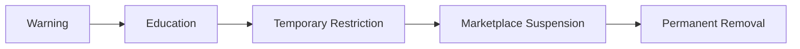

# Choosify Platform Blueprint

**Document ID:** BP-008
**Document Title:** Trust, Reputation, Moderation & Governance Engine
**Version:** 1.0.0
**Status:** Approved Draft
**Owner:** Choosify Architecture Team
**Classification:** Internal Product Specification
**Last Updated:** August 2026

---

## Table of Contents

1. [Purpose](#1-purpose)
2. [Scope](#2-scope)
3. [Trust Philosophy](#3-trust-philosophy)
4. [Trust Participants](#4-trust-participants)
5. [Initial Trust Score](#5-initial-trust-score)
6. [Seller Trust Factors](#6-seller-trust-factors)
7. [Consumer Trust Factors](#7-consumer-trust-factors)
8. [Creator Trust Factors](#8-creator-trust-factors)
9. [Brand Trust](#9-brand-trust)
10. [Featured vs Promoted](#10-featured-vs-promoted)
11. [Search Ranking](#11-search-ranking)
12. [Reviews](#12-reviews)
13. [Seller Replies](#13-seller-replies)
14. [Fake Reviews](#14-fake-reviews)
15. [Consumer Reviews by Sellers](#15-consumer-reviews-by-sellers)
16. [Reports](#16-reports)
17. [AI Moderation](#17-ai-moderation)
18. [Duplicate Listing Protection](#18-duplicate-listing-protection)
19. [Moderation Centre](#19-moderation-centre)
20. [Marketplace Enforcement](#20-marketplace-enforcement)
21. [Marketplace Suspension](#21-marketplace-suspension)
22. [Consumer Protection](#22-consumer-protection)
23. [Business Rules](#23-business-rules)
24. [Dependencies](#24-dependencies)
25. [Acceptance Criteria](#25-acceptance-criteria)
26. [Revision History](#revision-history)

---

## 1. Purpose

This document defines the Trust, Reputation, Moderation & Governance Engine of the Choosify Commerce Operating System.

The Trust Engine is responsible for maintaining confidence across the entire marketplace by measuring behaviour, enforcing platform policies, moderating content, protecting users, and ensuring long-term marketplace quality.

Trust is one of Choosify's primary competitive advantages and influences visibility, discovery, verification, moderation, and platform reputation.

---

## 2. Scope

This document governs:

- Seller Trust
- Brand Trust
- Consumer Trust
- Creator Trust
- Reviews
- Ratings
- Reputation
- Moderation
- Reports
- Fraud Detection
- Marketplace Enforcement
- Governance
- AI Moderation
- Administrative Actions

---

## 3. Trust Philosophy

Trust is earned.

Trust cannot be purchased.

Trust is continuously measured through real platform behaviour.

Marketplace participation is built upon maintaining trust rather than simply completing verification.

---

## 4. Trust Participants

Every participant maintains an independent Trust Profile.

Supported entities:

- Consumer
- Seller
- Brand
- Creator

Trust never transfers between entities.

---

## 5. Initial Trust Score

Every newly approved participant begins with a **100% Trust Score**.

This represents verified platform confidence at onboarding.

Future behaviour determines whether Trust is maintained or reduced.

Trust is not designed to exceed the initial baseline through artificial inflation.

Recognition for exceptional performance is provided through badges, featured placement, and reputation achievements rather than increasing the base Trust Score.

---

## 6. Seller Trust Factors

Seller Trust is continuously evaluated using measurable platform behaviour.

Signals include:

- Product Quality
- Review Rating
- Order Completion Rate
- Response Time
- Cancellation Rate
- Return Rate
- Dispute Outcomes
- Marketplace Compliance
- Customer Support Quality
- Policy Violations
- Fraud Incidents
- Copyright Violations

---

## 7. Consumer Trust Factors

Consumers also maintain platform reputation.

Signals include:

- Fake Orders
- Refused Deliveries
- Payment Reliability
- Fake Reviews
- Spam Behaviour
- Harassment
- Dispute Abuse
- Communication Conduct
- Cancellation Abuse

Consumers begin with full trust and may lose trust through repeated misconduct.

---

## 8. Creator Trust Factors

Creators are evaluated using:

- Content Authenticity
- Disclosure Compliance
- Community Reports
- Platform Violations
- Educational Quality
- Recommendation Accuracy

Creators may only recommend products they have genuinely evaluated or are transparently sponsored to present.

---

## 9. Brand Trust

Brand Trust reflects commercial reputation.

Brand Trust considers:

- Seller Trust
- Product Reviews
- Service Reviews
- Returns
- Complaints
- Marketplace Compliance
- Customer Satisfaction

Brand Trust contributes to storefront visibility.

---

## 10. Featured vs Promoted

Choosify distinguishes earned visibility from paid visibility.

### Featured

Featured Brands earn visibility through reputation.

Criteria may include:

- High Trust
- Excellent Reviews
- Strong Service
- Platform Performance

Displayed as: `⭐ Featured`

### Promoted

Promoted placement is paid advertising.

Displayed as: `💎 Promoted`

Promoted placement never hides its commercial nature.

---

## 11. Search Ranking

Search ranking combines multiple signals.

Examples include:

- Relevance
- Availability
- Brand Trust
- Consumer Behaviour
- Sponsored Placement
- Featured Status
- Product Quality
- Delivery Performance

Trust influences ranking.

Sponsored placement influences advertising positions.

These remain independent systems.

---

## 12. Reviews

Reviews are available for:

- Products
- Services
- Brands
- Creators

Reviews originate only from verified transactions where applicable.

---

## 13. Seller Replies

Sellers may publish one official reply per review.

Replies remain permanently associated with the review.

Additional replies require administrative intervention.

---

## 14. Fake Reviews

Consumers may not submit fraudulent reviews.

When verified as fraudulent:

- Review Removed
- Public Moderation Notice Displayed
- Consumer Warned
- Trust Score Reduced
- Escalation Recorded

Repeated abuse may result in suspension.

---

## 15. Consumer Reviews by Sellers

Following completed transactions, Sellers may evaluate Consumers.

Evaluation contributes to Consumer Trust.

Examples include:

- Payment Reliability
- Communication
- Pickup Behaviour
- Delivery Acceptance
- Overall Experience

---

## 16. Reports

Platform participants may report:

- Fake Products
- Fake Reviews
- Spam
- Copyright
- Harassment
- Abuse
- Counterfeit Goods
- Identity Fraud

Reports generate moderation cases.

---

## 17. AI Moderation

Artificial Intelligence assists moderation.

AI may:

- Detect Spam
- Detect Fake Listings
- Detect Duplicate Listings
- Detect Suspicious Reviews
- Detect Copyright Violations
- Detect Fraud Patterns
- Detect Offensive Content

AI recommends actions.

Administrators approve final decisions.

---

## 18. Duplicate Listing Protection

Copying another Seller's listing is prohibited.

Detection methods include:

- Text Similarity
- Image Matching
- Metadata Analysis
- Manual Reports

Flagged listings enter moderation.

---

## 19. Moderation Centre

The Moderation Centre manages:

- User Reports
- Fraud
- Copyright
- Fake Accounts
- Spam
- AI Alerts
- Manual Investigations

Every moderation case receives:

- Case ID
- Assigned Moderator
- Timeline
- Decision
- Audit History

---

## 20. Marketplace Enforcement

Enforcement follows progressive action whenever appropriate.

Typical progression:

Severe fraud may bypass progressive enforcement.

---

## 21. Marketplace Suspension

Suspension affects:

- Search
- Brand Visibility
- Product Visibility
- Deals
- Recommendations

Suspension does not remove:

- Orders
- Messaging
- Finance
- Brand Studio
- Inventory

Active customer commitments continue.

---

## 22. Consumer Protection

Consumers receive:

- Escrow Protection
- Verified Sellers
- Verified Reviews
- Transparent Promotions
- Secure Payments
- Dispute Resolution
- Marketplace Moderation

These protections form part of the platform's trust promise.

---

## 23. Business Rules

### BR-8.1

Trust cannot be purchased.

### BR-8.2

Every verified participant begins with 100% Trust.

### BR-8.3

Trust is reduced through measurable negative behaviour.

### BR-8.4

Featured placement is earned.

### BR-8.5

Promoted placement is paid and must always be labelled.

### BR-8.6

Only verified transactions generate marketplace reviews where applicable.

### BR-8.7

Sellers may publish one official reply per review.

### BR-8.8

Fraudulent reviews are removed while leaving a public moderation notice.

### BR-8.9

Duplicate listings are prohibited.

### BR-8.10

AI assists moderation but never replaces administrative authority.

### BR-8.11

Marketplace enforcement follows progressive discipline unless severe violations require immediate action.

### BR-8.12

Trust directly influences platform discovery and reputation but never overrides clearly identified sponsored placement.

---

## 24. Dependencies

Depends on:

- BP-000 Executive Summary
- BP-001 Vision & Constitution
- BP-002 User Ecosystem
- BP-003 Identity & Verification
- BP-004 Seller Workspace
- BP-005 Product & Service Engine
- BP-006 Commerce Engine
- BP-007 Communication Engine

Referenced by:

- Finance Engine
- Content & Discovery Engine
- Administration Engine
- Search Engine
- Recommendation Engine

---

## 25. Acceptance Criteria

- Trust philosophy is defined.
- Seller Trust is documented.
- Consumer Trust is documented.
- Creator Trust is documented.
- Brand Trust is documented.
- Featured vs Promoted behaviour is established.
- Review lifecycle is documented.
- Fake review handling is defined.
- Seller-to-consumer reviews are supported.
- AI moderation responsibilities are documented.
- Duplicate listing detection is defined.
- Marketplace enforcement lifecycle is documented.
- Trust business rules are complete.

---

## Revision History

| Version | Date | Description |
|----------|------|-------------|
| 1.0.0 | August 2026 | Initial Trust, Reputation, Moderation & Governance Engine |
