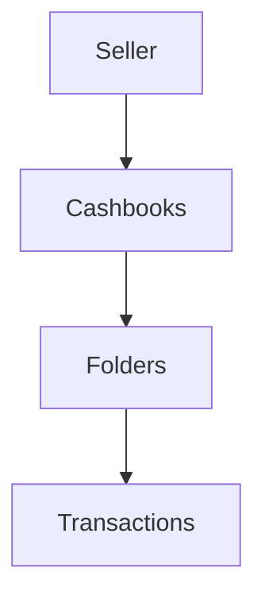

# Choosify Platform Blueprint

**Document ID:** BP-009
**Document Title:** Finance, Escrow & Accounting Engine
**Version:** 1.0.0
**Status:** Approved Draft
**Owner:** Choosify Architecture Team
**Classification:** Internal Product Specification
**Last Updated:** August 2026

---

## Table of Contents

1. [Purpose](#1-purpose)
2. [Scope](#2-scope)
3. [Finance Philosophy](#3-finance-philosophy)
4. [Financial Participants](#4-financial-participants)
5. [Escrow](#5-escrow)
6. [Escrow Lifecycle](#6-escrow-lifecycle)
7. [Seller Balance](#7-seller-balance)
8. [Earnings](#8-earnings)
9. [Platform Revenue](#9-platform-revenue)
10. [Commission Engine](#10-commission-engine)
11. [Subscription Plans](#11-subscription-plans)
12. [Marketplace Billing](#12-marketplace-billing)
13. [Payout Engine](#13-payout-engine)
14. [My Cashbook](#14-my-cashbook)
15. [Administrative Cashbook View](#15-administrative-cashbook-view)
16. [Refund Accounting](#16-refund-accounting)
17. [Taxes & VAT](#17-taxes--vat)
18. [Financial Reports](#18-financial-reports)
19. [Administrative Finance](#19-administrative-finance)
20. [Audit Trail](#20-audit-trail)
21. [Financial Security](#21-financial-security)
22. [Business Rules](#22-business-rules)
23. [Dependencies](#23-dependencies)
24. [Acceptance Criteria](#24-acceptance-criteria)
25. [Revision History](#revision-history)

---

## 1. Purpose

This document defines the Finance, Escrow & Accounting Engine of the Choosify Commerce Operating System.

The Finance Engine governs every financial movement occurring throughout the platform.

It is responsible for:

- Escrow
- Seller Earnings
- Platform Revenue
- Commissions
- Subscription Billing
- Payouts
- Cashbook
- Tax
- VAT
- Financial Reporting
- Refund Accounting
- Financial Auditing

Every financial event occurring inside Choosify originates from this engine.

---

## 2. Scope

This document governs:

- Escrow
- Earnings
- Payouts
- Wallet
- Cashbook
- Commission
- Subscription Billing
- Platform Revenue
- Refund Accounting
- Taxes
- VAT
- Financial Reports
- Audit Logs

---

## 3. Finance Philosophy

Finance must always be:

- Transparent
- Traceable
- Secure
- Auditable
- Automated where appropriate

Money should never move without generating a permanent financial record.

Every financial event must be explainable.

---

## 4. Financial Participants

The Finance Engine manages money belonging to:

- Consumer
- Seller
- Brand
- Platform
- Courier (Future)
- Creator (Future)

Each maintains independent financial records.

---

## 5. Escrow

Choosify operates an escrow-based marketplace.

Funds collected from Consumers remain under platform protection until transaction obligations are fulfilled.

Escrow protects:

- Consumer
- Seller
- Platform

Funds release only after successful completion or approved settlement.

---

## 6. Escrow Lifecycle

Refunds interrupt the normal settlement flow.

---

## 7. Seller Balance

Every Seller Workspace maintains a financial balance.

Balance includes:

- Available Funds
- Pending Settlement
- Escrow Balance
- Refund Reserve
- Withdrawable Balance

Balance updates automatically.

---

## 8. Earnings

Seller earnings originate from:

- Product Sales
- Service Sales
- Booking Revenue
- Digital Products

Future:

- Live Commerce
- Brand Collaborations
- Affiliate Sales

---

## 9. Platform Revenue

Platform revenue originates from:

- Marketplace Commission
- Subscription Plans
- Sponsored Listings
- Advertising
- Featured Placement
- Promotional Campaigns
- Financial Services (Future)

Revenue sources remain independently reportable.

---

## 10. Commission Engine

Commission rules support:

- Flat Amount
- Percentage
- Category Based
- Subscription Based
- Campaign Based

Commission is calculated automatically during settlement.

Historical commission calculations remain immutable.

---

## 11. Subscription Plans

Subscription Plans apply to Seller Accounts.

Subscriptions determine:

- Product Limits
- Storage
- Analytics
- Advertisement Allowances
- Team Members
- Premium Features
- API Access (Future)

Supported billing cycles:

- Monthly
- Yearly

Subscription expiry never deletes Seller data.

---

## 12. Marketplace Billing

Marketplace participation may require:

- Subscription
- Transaction Fees
- Optional Services

Marketplace suspension due to subscription expiry follows configurable platform policy.

---

## 13. Payout Engine

Seller payouts support:

- Bank Transfer
- Mobile Financial Services
- Wallet (Future)

Payout workflow:

Rejected payouts remain fully logged.

---

## 14. My Cashbook

Every Seller receives a private Cashbook.

Cashbook functions independently from marketplace accounting.

Supported capabilities:

- Multiple Folders
- Income Records
- Expense Records
- Notes
- Attachments
- Manual Entries
- Financial Categories

Cashbook belongs entirely to the Seller.

---

## 15. Administrative Cashbook View

Administrators may view Cashbooks for operational and compliance purposes.

Hierarchy:

Administrative access remains read-only unless policy requires intervention.

---

## 16. Refund Accounting

Refunds automatically generate financial adjustments.

Supported:

- Full Refund
- Partial Refund
- Escrow Release
- Platform Adjustment

Financial history remains immutable.

---

## 17. Taxes & VAT

Invoices support:

- VAT
- Tax
- Platform Fees
- Discounts
- Shipping Charges

Tax calculations remain configurable.

Future regional tax rules may be added.

---

## 18. Financial Reports

Seller reports include:

- Revenue
- Orders
- Refunds
- Taxes
- Commissions
- Net Profit
- Best Products
- Best Services
- Settlement History

Reports may be filtered by:

- Brand
- Date
- Category
- Payment Method

---

## 19. Administrative Finance

Administrators manage:

- Platform Revenue
- Seller Settlements
- Escrow
- Refunds
- Commissions
- Subscription Billing
- Financial Audits
- Outstanding Balances

Administrative finance remains isolated from Seller accounting.

---

## 20. Audit Trail

Every financial action generates:

- Transaction ID
- Timestamp
- Actor
- Amount
- Currency
- Source
- Destination
- Related Entity
- Audit Record

Financial history is immutable.

---

## 21. Financial Security

Finance operations require:

- Authentication
- Authorization
- Audit Logging
- Fraud Detection
- Secure Settlement
- Encryption

Future:

- Multi-Signature Approval
- Risk Scoring
- AML Integrations

---

## 22. Business Rules

### BR-9.1

All consumer payments enter escrow before settlement.

### BR-9.2

Funds release only after transaction obligations are fulfilled or an approved resolution is reached.

### BR-9.3

Every Seller maintains an independent financial ledger.

### BR-9.4

Platform commission is calculated automatically according to configured rules.

### BR-9.5

Subscription Plans belong to Seller Accounts, not individual Brands.

### BR-9.6

Cashbook is private to each Seller.

### BR-9.7

Administrators may access Seller financial records only through authorized governance workflows.

### BR-9.8

Financial records are immutable.

Corrections are recorded as adjustments rather than overwriting historical transactions.

### BR-9.9

Every payout remains fully auditable.

### BR-9.10

Every financial event generates a permanent audit record.

---

## 23. Dependencies

Depends on:

- BP-000 Executive Summary
- BP-001 Vision & Constitution
- BP-002 User Ecosystem
- BP-003 Identity & Verification
- BP-004 Seller Workspace
- BP-005 Product & Service Engine
- BP-006 Commerce Engine
- BP-007 Communication Engine
- BP-008 Trust Engine

Referenced by:

- Administration Engine
- Reporting Engine
- Subscription Engine
- Tax Engine
- Audit Engine

---

## 24. Acceptance Criteria

- Escrow model is defined.
- Seller earnings are documented.
- Platform revenue is documented.
- Commission engine is defined.
- Subscription billing is documented.
- Payout workflow is defined.
- Cashbook architecture is established.
- Administrative financial oversight is documented.
- Refund accounting is specified.
- Tax and VAT handling is documented.
- Financial audit requirements are defined.
- Business rules governing finance are complete.

---

## Revision History

| Version | Date | Description |
|----------|------|-------------|
| 1.0.0 | August 2026 | Initial Finance, Escrow & Accounting Engine |
