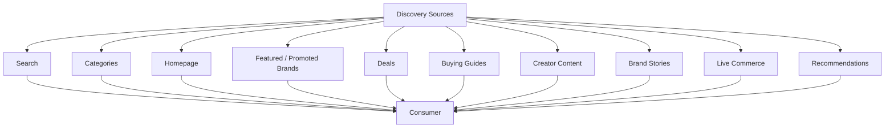

# Choosify Platform Blueprint

**Document ID:** BP-010
**Document Title:** Content, Discovery & Engagement Engine
**Version:** 1.0.0
**Status:** Approved Draft
**Owner:** Choosify Architecture Team
**Classification:** Internal Product Specification
**Last Updated:** August 2026

---

## Table of Contents

1. [Purpose](#1-purpose)
2. [Scope](#2-scope)
3. [Discovery Philosophy](#3-discovery-philosophy)
4. [Discovery Sources](#4-discovery-sources)
5. [Homepage](#5-homepage)
6. [Discovery Feed](#6-discovery-feed)
7. [Search Engine](#7-search-engine)
8. [Brand Stories](#8-brand-stories)
9. [Creator Content](#9-creator-content)
10. [Buying Guides](#10-buying-guides)
11. [Live Commerce](#11-live-commerce)
12. [Product Tagging](#12-product-tagging)
13. [Deals](#13-deals)
14. [Featured Content](#14-featured-content)
15. [Promoted Content](#15-promoted-content)
16. [Recommendation Engine](#16-recommendation-engine)
17. [Trending Engine](#17-trending-engine)
18. [Personalization](#18-personalization)
19. [SEO](#19-seo)
20. [AI Discovery Assistant](#20-ai-discovery-assistant)
21. [Content Moderation](#21-content-moderation)
22. [Business Rules](#22-business-rules)
23. [Dependencies](#23-dependencies)
24. [Acceptance Criteria](#24-acceptance-criteria)
25. [Revision History](#revision-history)

---

## 1. Purpose

This document defines the Content, Discovery & Engagement Engine of the Choosify Commerce Operating System.

This engine transforms Choosify from a traditional marketplace into a commerce discovery platform where products, services, brands, creators, educational content, promotions, live commerce, and recommendations work together to help consumers make informed purchasing decisions.

Discovery is not limited to search.

Consumers should discover products through content, trust, education, recommendations, and community engagement.

---

## 2. Scope

This document governs:

- Homepage
- Discovery Feed
- Search
- Brand Stories
- Creator Content
- Buying Guides
- Live Commerce
- Recommendations
- Featured Brands
- Promoted Content
- Deals
- Trending Content
- SEO
- Personalization

---

## 3. Discovery Philosophy

Discovery should answer one question:

> "Help me find the right product or service."

Choosify should never overwhelm users with random listings.

Instead it should guide consumers using:

- Trust
- Education
- Relevance
- Personalization
- Transparency

---

## 4. Discovery Sources

Consumers may discover commerce through:

- Search
- Categories
- Homepage
- Featured Brands
- Promoted Brands
- Deals
- Buying Guides
- Creator Content
- Brand Stories
- Live Commerce
- Recommendations
- Similar Products
- Related Services

Every discovery source follows the same Trust principles.

---

## 5. Homepage

The homepage is dynamic.

Modules may include:

- Hero Banner
- Featured Brands
- Promoted Brands
- Trending Products
- Trending Services
- Flash Deals
- Buying Guides
- Brand Stories
- Live Commerce
- Creator Recommendations
- Recently Added
- Categories
- Seasonal Campaigns

Each section remains independently configurable by Administrators.

---

## 6. Discovery Feed

The Discovery Feed combines commerce and educational content.

Supported content includes:

- Products
- Services
- Brand Stories
- Creator Posts
- Buying Guides
- Live Commerce
- Announcements
- Deals

Consumers receive a curated experience rather than a chronological feed.

---

## 7. Search Engine

Search operates across the entire platform.

Search indexes:

- Products
- Services
- Brands
- Categories
- Creators
- Guides
- Stories
- Deals
- Live Sessions

Search supports:

- Typo Correction
- Synonyms
- AI Suggestions
- Natural Language
- Voice Search (Future)

---

## 8. Brand Stories

Brands may publish educational content.

Examples include:

- Product Tutorials
- Product Launches
- Behind the Brand
- Manufacturing Process
- Sustainability
- Customer Success Stories
- Buying Advice
- Maintenance Tips

Brand Stories belong to the Brand Profile and Discovery Feed.

Brand Stories are always labelled `Brand Content`.

---

## 9. Creator Content

Creators publish independent educational content.

Examples:

- Reviews
- Comparisons
- Buying Guides
- Product Testing
- Industry News
- Tutorials

Creator Content appears in:

- Discovery Feed
- Search
- Creator Profiles
- Product Pages
- Category Pages

Sponsored collaborations must be disclosed.

---

## 10. Buying Guides

Buying Guides help consumers understand products before purchasing.

Examples:

- Best Phones Under 50,000 BDT
- Choosing the Right Hotel
- DSLR Buying Guide
- Laptop Buying Guide
- Travel Tips
- Home Appliance Comparison

Guides may originate from:

- Brands
- Creators
- Administrators

Source attribution always remains visible.

---

## 11. Live Commerce

Brands and approved Creators may publish Live Commerce sessions.

Supported integrations:

- Facebook Live
- YouTube Live
- Instagram Live

Future:

- Native Choosify Live

During a Live Session participants may:

- View Products
- View Services
- Ask Questions
- Purchase
- Book Services

---

## 12. Product Tagging

Content creators may tag:

- Products
- Services
- Brands

Tags create relationships rather than duplicate information.

Consumers may purchase directly from tagged content.

---

## 13. Deals

Deals reference existing listings.

Supported deal types:

- Flash Sale
- Daily Deal
- Weekend Deal
- Bundle Offer
- Limited Quantity
- Festival Campaign

Deals automatically expire according to schedule.

---

## 14. Featured Content

Featured placement is earned.

Eligibility considers:

- Trust Score
- Consumer Satisfaction
- Platform Quality
- Operational Excellence

Displayed as: `⭐ Featured`

---

## 15. Promoted Content

Promoted placement is paid advertising.

Supported promotions:

- Brands
- Products
- Services
- Guides
- Campaigns

Displayed as: `💎 Promoted`

Sponsored placement never disguises itself as earned recommendation.

---

## 16. Recommendation Engine

Recommendations combine multiple signals.

Examples:

- Related Products
- Similar Services
- Previously Viewed
- Brand Affinity
- Purchase History
- Category Interest
- Trust
- Quality
- Availability

Recommendation algorithms remain transparent and auditable.

---

## 17. Trending Engine

Trending considers:

- Views
- Orders
- Engagement
- Saves
- Shares
- Reviews
- Growth Velocity

Trending remains time-sensitive.

Old popularity alone should not dominate discovery.

---

## 18. Personalization

Personalization may use:

- Purchase History
- Wishlist
- Browsing History
- Location
- Category Interests
- Favourite Brands

Consumers retain control over personalization preferences.

---

## 19. SEO

Every public page supports SEO.

Examples:

- Product Pages
- Brand Pages
- Guides
- Categories
- Creator Profiles

SEO includes:

- Structured Data
- Canonical URLs
- Meta Tags
- Open Graph
- Sitemap
- Schema Markup

---

## 20. AI Discovery Assistant

Future versions introduce Emi AI.

Responsibilities include:

- Product Summaries
- Comparison Summaries
- Buying Advice
- Search Assistance
- Guide Recommendations
- Seller Assistance

Emi AI never replaces official product information.

It summarizes existing platform information.

---

## 21. Content Moderation

Published content undergoes moderation.

Applies to:

- Stories
- Guides
- Videos
- Reviews
- Live Commerce
- Comments (Future)

AI assists moderation.

Administrators remain final decision makers.

---

## 22. Business Rules

### BR-10.1

Discovery prioritizes relevance and trust over listing volume.

### BR-10.2

Brand Stories always belong to their originating Brand.

### BR-10.3

Creator Content always displays creator attribution.

### BR-10.4

Featured placement is earned.

### BR-10.5

Promoted placement is paid and always labelled.

### BR-10.6

Deals always reference existing Products or Services.

### BR-10.7

Recommendations never duplicate listing information.

### BR-10.8

Search indexes all public commerce content.

### BR-10.9

AI Discovery Assistant summarizes existing information rather than inventing facts.

### BR-10.10

Content remains subject to platform moderation policies.

---

## 23. Dependencies

Depends on:

- BP-000 Executive Summary
- BP-001 Vision & Constitution
- BP-004 Seller Workspace
- BP-005 Product & Service Engine
- BP-006 Commerce Engine
- BP-007 Communication Engine
- BP-008 Trust Engine
- BP-009 Finance Engine

Referenced by:

- Homepage
- Search Engine
- Recommendation Engine
- Creator Platform
- Marketing Platform

---

## 24. Acceptance Criteria

- Discovery philosophy is documented.
- Homepage architecture is defined.
- Discovery Feed is specified.
- Search Engine is documented.
- Brand Stories are defined.
- Creator Content is defined.
- Buying Guides are supported.
- Live Commerce is documented.
- Product tagging is defined.
- Featured and Promoted behaviour is documented.
- Recommendation Engine is specified.
- SEO strategy is documented.
- Emi AI responsibilities are defined.
- Business rules governing discovery are complete.

---

## Revision History

| Version | Date | Description |
|----------|------|-------------|
| 1.0.0 | August 2026 | Initial Content, Discovery & Engagement Engine |
