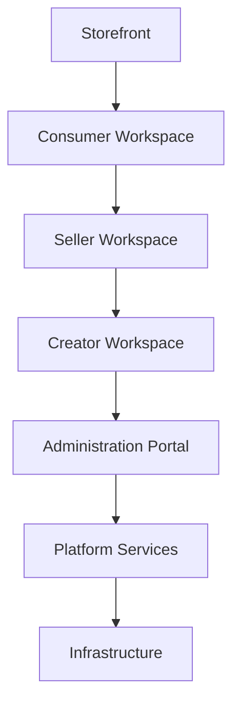
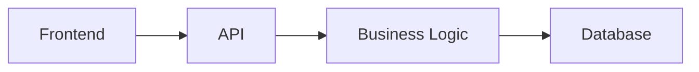
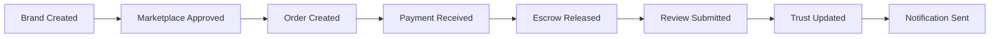
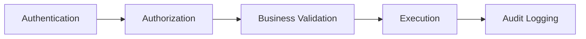
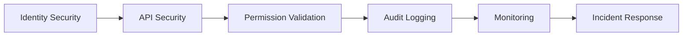
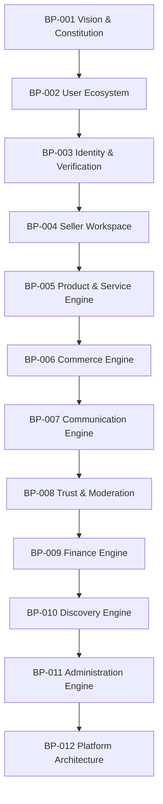

# Choosify Platform Blueprint

**Document ID:** BP-012
**Document Title:** Platform Architecture, System Boundaries & Technical Constitution
**Version:** 1.0.0
**Status:** Approved Draft
**Owner:** Choosify Architecture Team
**Classification:** Internal Product Specification
**Last Updated:** August 2026

---

## Table of Contents

1. [Purpose](#1-purpose)
2. [Scope](#2-scope)
3. [Platform Overview](#3-platform-overview)
4. [Core Platform Modules](#4-core-platform-modules)
5. [Single Source of Truth](#5-single-source-of-truth)
6. [Workspace Architecture](#6-workspace-architecture)
7. [Ownership Hierarchy](#7-ownership-hierarchy)
8. [API Philosophy](#8-api-philosophy)
9. [Event Driven Architecture](#9-event-driven-architecture)
10. [Authentication & Authorization](#10-authentication--authorization)
11. [Security Model](#11-security-model)
12. [Data Ownership](#12-data-ownership)
13. [Audit Requirements](#13-audit-requirements)
14. [Scalability](#14-scalability)
15. [AI Integration](#15-ai-integration)
16. [Platform Principles](#16-platform-principles)
17. [Technology Independence](#17-technology-independence)
18. [Future Expansion](#18-future-expansion)
19. [Blueprint Dependency Map](#19-blueprint-dependency-map)
20. [Technical Constitution](#20-technical-constitution)
21. [Acceptance Criteria](#21-acceptance-criteria)
22. [Revision History](#revision-history)

---

## 1. Purpose

This document defines the complete technical architecture of the Choosify Commerce Operating System.

Unlike previous blueprint documents that define business behaviour, this document defines how every system fits together.

It serves as the master architectural contract for developers, architects, AI coding assistants, QA engineers, DevOps engineers and future contributors.

Every future implementation must comply with this document.

---

## 2. Scope

This blueprint governs:

- Overall Architecture
- Platform Boundaries
- Service Boundaries
- Database Ownership
- APIs
- Event Flow
- Authentication
- Authorization
- Workspaces
- Scalability
- Security
- Performance
- Future Expansion

---

## 3. Platform Overview

Choosify is not a traditional e-commerce website.

It is a Commerce Operating System composed of multiple interconnected applications operating on one unified platform.

Every workspace consumes the same backend services while exposing different capabilities based on authorization.

---

## 4. Core Platform Modules

The platform is divided into the following domains.

- Identity
- Marketplace
- Brand Management
- Product Management
- Commerce
- Finance
- Messaging
- Content
- Discovery
- Trust
- Moderation
- Administration
- Analytics
- Notifications
- Website CMS
- Infrastructure

Each module owns its own business logic.

Modules communicate through APIs and events.

---

## 5. Single Source of Truth

Every business entity has exactly one owner.

Examples:

- Consumer owns Consumer Profile.
- Seller owns Brand.
- Brand owns Products.
- Product owns Inventory.
- Order owns Order Timeline.
- Finance owns Transactions.
- Messaging owns Conversations.
- Trust owns Reputation.

No duplicated ownership is permitted.

---

## 6. Workspace Architecture

The platform exposes four primary workspaces.

### Consumer Workspace

**Purpose:** Shopping and purchasing.

**Capabilities:**

- Orders
- Wishlist
- Reviews
- Messages
- Profile

### Seller Workspace

**Purpose:** Business operations.

**Capabilities:**

- Brand Studio
- Products
- Inventory
- Orders
- Finance
- Messaging
- Brand Stories
- Analytics

### Creator Workspace

**Purpose:** Content operations.

**Capabilities:**

- Guides
- Recommendations
- Reviews
- Live Commerce
- Analytics

### Administration Portal

**Purpose:** Platform governance.

**Capabilities:**

- Verification
- Moderation
- Finance
- CMS
- Analytics
- Configuration

---

## 7. Ownership Hierarchy

Ownership always flows downward.

---

## 8. API Philosophy

Every client communicates exclusively through APIs.

Clients never access databases directly.

Business rules must never exist only inside the frontend.

---

## 9. Event Driven Architecture

Major platform actions emit events.

Examples:

Events allow independent modules to remain loosely coupled.

---

## 10. Authentication & Authorization

Authentication answers: "Who are you?"

Authorization answers: "What may you do?"

These responsibilities remain completely independent.

Every API request passes through:

---

## 11. Security Model

Platform security follows multiple layers.

Future enhancements include:

- MFA
- Device Trust
- Passkeys
- Risk-Based Authentication

---

## 12. Data Ownership

Every module owns its own data.

Examples:

- Identity owns Users.
- Marketplace owns Brands.
- Catalog owns Products.
- Commerce owns Orders.
- Finance owns Transactions.
- Messaging owns Conversations.
- Trust owns Reputation.
- Administration owns Configuration.

Cross-module access occurs only through APIs.

---

## 13. Audit Requirements

Every important platform action generates immutable audit records.

Audit records contain:

- Actor
- Timestamp
- Action
- Previous State
- New State
- Source
- Related Entity

Audit history is never overwritten.

---

## 14. Scalability

The architecture supports:

- Multiple Brands per Seller
- Unlimited Products
- Millions of Consumers
- Millions of Orders
- Multiple Payment Providers
- Multiple Courier Providers
- Multiple AI Services
- Future Regional Expansion

Scalability is a core architectural requirement rather than an afterthought.

---

## 15. AI Integration

AI services remain assistants.

Responsibilities include:

- Search Assistance
- Product Summaries
- Seller Suggestions
- Customer Support
- Moderation Assistance

AI never becomes the system of record.

Human-approved business data always takes precedence.

---

## 16. Platform Principles

The following principles apply everywhere.

- API First
- Modular
- Event Driven
- Secure by Default
- Least Privilege
- Single Source of Truth
- Audit Everything
- No Hidden Business Logic
- Clear Ownership
- Horizontal Scalability

---

## 17. Technology Independence

This blueprint intentionally avoids dependence on any specific framework.

The architecture may evolve from:

- React
- Next.js
- NestJS
- Express
- PostgreSQL
- Firestore
- Cloud Services

without requiring changes to business architecture.

Technology choices implement the architecture.

They never define it.

---

## 18. Future Expansion

Future platform capabilities may include:

- Native Mobile Apps
- AI Commerce
- International Expansion
- Multi-Currency
- Multi-Language
- Franchise Marketplace
- Enterprise APIs
- POS Integration
- ERP Integration
- Warehouse Management
- Affiliate Network
- White Label Commerce

Future features must comply with the constitutional principles defined in BP-001.

---

## 19. Blueprint Dependency Map

Every future specification references one or more of these documents.

---

## 20. Technical Constitution

Every implementation must satisfy the following:

- Uses API-first architecture.
- Preserves module ownership.
- Does not duplicate business logic.
- Uses role-based authorization.
- Maintains auditability.
- Preserves data ownership.
- Supports future scalability.
- Maintains backward compatibility where practical.
- Protects trust before growth.
- Prioritizes maintainability over shortcuts.

---

## 21. Acceptance Criteria

This document is complete when:

- Platform architecture is documented.
- Workspace boundaries are defined.
- Module ownership is established.
- API philosophy is documented.
- Event-driven architecture is defined.
- Security principles are documented.
- Audit requirements are established.
- Scalability goals are documented.
- AI integration boundaries are defined.
- Future expansion strategy is documented.
- Blueprint dependency map is complete.
- Technical Constitution is established.

---

## Revision History

| Version | Date | Description |
|----------|------|-------------|
| 1.0.0 | August 2026 | Initial Platform Architecture, System Boundaries & Technical Constitution |
