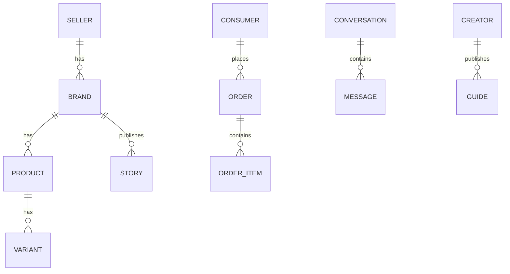

# Choosify Engineering Specification

**Document ID:** ES-001
**Title:** PostgreSQL Database Architecture & Entity Relationship Model
**Version:** 1.0.0
**Status:** Draft
**Priority:** Critical

**Depends On:**

- BP-001
- BP-002
- BP-003
- BP-004
- BP-005
- BP-006
- BP-007
- BP-008
- BP-009
- BP-010
- BP-011
- BP-012

---

## Table of Contents

1. [Purpose](#1-purpose)
2. [Database Philosophy](#2-database-philosophy)
3. [Database Principles](#3-database-principles)
4. [Naming Convention](#4-naming-convention)
5. [Primary Key Strategy](#5-primary-key-strategy)
6. [Timestamp Convention](#6-timestamp-convention)
7. [Ownership Convention](#7-ownership-convention)
8. [Database Domains](#8-database-domains)
9. [Initial Database Modules](#9-initial-database-modules)
10. [Relationship Rules](#10-relationship-rules)
11. [Soft Delete Policy](#11-soft-delete-policy)
12. [Index Strategy](#12-index-strategy)
13. [Constraints](#13-constraints)
14. [Database Scalability](#14-database-scalability)
15. [Migration Rules](#15-migration-rules)
16. [Future Tables](#16-future-tables)
17. [Acceptance Criteria](#17-acceptance-criteria)
18. [Revision History](#revision-history)

---

## 1. Purpose

This document defines the complete relational database architecture of the Choosify Commerce Operating System.

It serves as the single source of truth for:

- PostgreSQL schema
- Prisma Models
- Relationships
- Foreign Keys
- Constraints
- UUID Strategy
- Indexes
- Ownership
- Soft Deletes
- Auditing
- Scalability

No database table may be introduced without complying with this specification.

---

## 2. Database Philosophy

The database is designed using Domain Driven Design.

Every table belongs to exactly one domain.

```mermaid
graph TD
    Identity["Identity Domain"] --> Users["Users"]
    Identity --> Sessions["Sessions"]
    Identity --> RefreshTokens["Refresh Tokens"]
    Identity --> Verification["Verification"]

    Marketplace["Marketplace Domain"] --> Brands["Brands"]
    Marketplace --> Claims["Claims"]
    Marketplace --> MarketplaceAccess["Marketplace Access"]

    Catalog["Catalog Domain"] --> Products["Products"]
    Catalog --> Inventory["Inventory"]
    Catalog --> Categories["Categories"]

    Commerce["Commerce Domain"] --> Orders["Orders"]
    Commerce --> Payments["Payments"]
    Commerce --> Escrow["Escrow"]

    Finance["Finance Domain"] --> Transactions["Transactions"]
    Finance --> Cashbook["Cashbook"]
    Finance --> Invoices["Invoices"]

    Messaging["Messaging Domain"] --> Conversations["Conversations"]
    Messaging --> Messages["Messages"]
    Messaging --> Attachments["Attachments"]

    Trust["Trust Domain"] --> Reviews["Reviews"]
    Trust --> Scores["Scores"]
    Trust --> Reports["Reports"]

    Administration["Administration Domain"] --> AuditLogs["Audit Logs"]
    Administration --> CMS["CMS"]
    Administration --> Settings["Settings"]
```



---

## 3. Database Principles

Every table follows these principles.

- UUID Primary Keys
- `created_at`
- `updated_at`
- `deleted_at` (soft delete where applicable)
- `created_by` (where applicable)
- `updated_by` (where applicable)
- Audit support
- Row ownership

---

## 4. Naming Convention

**Tables** — `snake_case`

Examples: `users`, `brands`, `products`, `orders`, `cashbook_entries`

**Columns** — `snake_case`

Examples: `brand_id`, `seller_id`, `created_at`, `updated_at`

**Foreign Keys** — always named `xxxxx_id`

Examples: `brand_id`, `seller_id`, `consumer_id`, `creator_id`

---

## 5. Primary Key Strategy

Every entity uses UUID.

```sql
id UUID PRIMARY KEY
```

No auto increment integers.

---

## 6. Timestamp Convention

Every mutable table contains:

- `created_at`
- `updated_at`
- `deleted_at`

`deleted_at` remains NULL unless soft deleted.

---

## 7. Ownership Convention

Every business entity must have an owner.

| Entity | Owner Field |
|--------|-------------|
| Brand | `seller_id` |
| Product | `brand_id` |
| Conversation | `order_id` |
| Order | `consumer_id` |
| Review | `order_id` |

---

## 8. Database Domains

The database is divided into domains.

- Identity
- Marketplace
- Catalog
- Commerce
- Finance
- Messaging
- Trust
- Discovery
- Administration
- Analytics
- Notifications

Each domain owns its own tables.

Cross-domain writes are prohibited.

---

## 9. Initial Database Modules

**Identity**

- Users
- Roles
- Permissions
- Sessions
- Verification
- Refresh Tokens
- Devices

**Marketplace**

- Brands
- Brand Claims
- Marketplace Access
- Brand Staff

**Catalog**

- Categories
- Products
- Services
- Variants
- Inventory
- Attributes
- Media

**Commerce**

- Cart
- Orders
- Order Items
- Payments
- Escrow
- Coupons
- Gift Cards

**Finance**

- Transactions
- Invoices
- Payouts
- Subscriptions
- Cashbooks

**Messaging**

- Conversations
- Messages
- Attachments
- Social Inbox

**Trust**

- Reviews
- Review Replies
- Reports
- Trust Scores
- Moderation Cases

**Administration**

- Audit Logs
- CMS Pages
- Settings
- Feature Flags

**Notifications**

- Templates
- Notification Queue

**Analytics**

- Events
- Metrics
- Reports

**Search**

- Search Index
- Recommendations
- Trending

---

## 10. Relationship Rules



---

## 11. Soft Delete Policy

| Category | Policy |
|----------|--------|
| Business entities | Soft Delete |
| Financial records | Never Delete |
| Audit Logs | Never Delete |
| Escrow | Never Delete |
| Orders | Never Delete |
| Products | Soft Delete |
| Brands | Soft Delete |
| Consumers | Retention Policy |

---

## 12. Index Strategy

Every table shall index:

- Primary Key
- Foreign Keys
- `created_at`
- `status`
- Search columns

Additional composite indexes shall be created where performance requires.

---

## 13. Constraints

Examples:

- Email UNIQUE
- Brand Slug UNIQUE
- Product Slug UNIQUE
- Conversation UUID UNIQUE
- Order Number UNIQUE
- Invoice Number UNIQUE
- Coupon Code UNIQUE

---

## 14. Database Scalability

Database shall support:

- Millions of Products
- Millions of Orders
- Millions of Messages
- Millions of Consumers
- Unlimited Sellers
- Unlimited Brands
- Unlimited Categories
- Unlimited Reviews

without architectural redesign.

---

## 15. Migration Rules


Direct production schema edits are prohibited.

---

## 16. Future Tables

Future modules may introduce new tables.

New tables must:

- Belong to one domain
- Follow naming conventions
- Include ownership
- Include auditing
- Support UUID
- Support migrations

---

## 17. Acceptance Criteria

This specification is complete when:

- Database philosophy defined
- Domains defined
- Naming standards defined
- UUID strategy defined
- Timestamp policy defined
- Ownership strategy defined
- Relationship strategy defined
- Soft delete policy defined
- Scalability goals defined
- Migration policy defined

---

## Revision History

| Version | Date | Description |
|----------|------|-------------|
| 1.0.0 | August 2026 | Initial Database Architecture |
