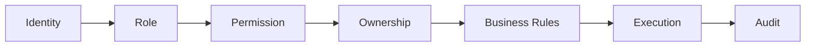

# Choosify Engineering Specification

**Document ID:** ES-002
**Title:** API Architecture & Service Contracts
**Version:** 1.0.0
**Status:** Draft
**Priority:** Critical

**Depends On:**

- BP-001 through BP-012
- ES-001 Database Architecture

---

## Table of Contents

1. [Purpose](#1-purpose)
2. [API Philosophy](#2-api-philosophy)
3. [Architectural Principles](#3-architectural-principles)
4. [Service Domains](#4-service-domains)
5. [API Versioning](#5-api-versioning)
6. [Authentication](#6-authentication)
7. [Authorization](#7-authorization)
8. [Standard Request Format](#8-standard-request-format)
9. [Standard Response Format](#9-standard-response-format)
10. [HTTP Status Codes](#10-http-status-codes)
11. [Resource Naming](#11-resource-naming)
12. [CRUD Convention](#12-crud-convention)
13. [Filtering](#13-filtering)
14. [Pagination](#14-pagination)
15. [Sorting](#15-sorting)
16. [Searching](#16-searching)
17. [Validation](#17-validation)
18. [File Uploads](#18-file-uploads)
19. [Event Emission](#19-event-emission)
20. [Idempotency](#20-idempotency)
21. [Rate Limiting](#21-rate-limiting)
22. [API Documentation](#22-api-documentation)
23. [Error Handling](#23-error-handling)
24. [API Security](#24-api-security)
25. [Business Rules](#25-business-rules)
26. [Future API Domains](#26-future-api-domains)
27. [Acceptance Criteria](#27-acceptance-criteria)
28. [Revision History](#revision-history)

---

## 1. Purpose

This document defines the API architecture of the Choosify Commerce Operating System.

It establishes the standards governing every REST endpoint, service contract, authentication mechanism, authorization rule, request validation, response format, error handling, pagination, filtering, versioning, and API lifecycle.

Every frontend application—including Storefront, Seller Workspace, Creator Workspace, Administration Portal, Mobile Apps, and future third-party integrations—must communicate exclusively through these APIs.

Direct database access from client applications is prohibited.

---

## 2. API Philosophy

Choosify follows an API-First architecture.

Every business capability must exist as an API before a user interface is implemented.

User Interfaces become API consumers.

Business logic belongs exclusively to backend services.

---

## 3. Architectural Principles

Every API must follow:

- Stateless communication
- REST conventions
- JWT Authentication
- Role-Based Authorization
- Resource Ownership Validation
- Request Validation
- Response Consistency
- Audit Logging
- Event Emission
- Version Compatibility

---

## 4. Service Domains

The API is divided into business domains.

- Identity
- Marketplace
- Catalog
- Commerce
- Finance
- Messaging
- Trust
- Content
- Discovery
- Notifications
- Administration
- Analytics
- Search

Each domain owns its own endpoints.

Cross-domain communication occurs only through service interfaces.

---

## 5. API Versioning

Base URL: `/api/v1/`

Future breaking changes require: `/api/v2/`

Older versions remain supported according to platform deprecation policy.

---

## 6. Authentication

Supported Authentication:

- JWT Access Token
- Refresh Token

Future:

- OAuth
- Passkeys
- SSO

Every authenticated request must include:

```
Authorization: Bearer <access_token>
```

---

## 7. Authorization

Authentication determines identity.

Authorization determines permissions.

Every protected endpoint validates:



---

## 8. Standard Request Format

Every endpoint accepts:

**Headers**

- Authentication
- Content-Type
- Accept
- Localization

**Body**

- Validated JSON

**Path Parameters**

- Resource IDs

**Query Parameters**

- Filtering
- Pagination
- Sorting
- Searching
- Projection

---

## 9. Standard Response Format

Successful responses:

```json
{
  "success": true,
  "data": {},
  "meta": {},
  "errors": null
}
```

Error responses:

```json
{
  "success": false,
  "data": null,
  "errors": [],
  "traceId": ""
}
```

Every response should be predictable.

---

## 10. HTTP Status Codes

| Code | Meaning |
|------|---------|
| 200 | OK |
| 201 | Created |
| 202 | Accepted |
| 204 | No Content |
| 400 | Validation Error |
| 401 | Unauthorized |
| 403 | Forbidden |
| 404 | Not Found |
| 409 | Conflict |
| 422 | Business Rule Failed |
| 429 | Rate Limited |
| 500 | Internal Error |

---

## 11. Resource Naming

Plural nouns.

Examples: `/users`, `/brands`, `/products`, `/orders`, `/reviews`, `/messages`

Avoid verbs in resource names.

Operations use HTTP methods.

---

## 12. CRUD Convention

| Method | Operation |
|--------|-----------|
| GET | Retrieve |
| POST | Create |
| PATCH | Partial Update |
| PUT | Replace |
| DELETE | Soft Delete unless otherwise specified |

---

## 13. Filtering

Every collection endpoint should support filtering.

Examples:

- status
- category
- brand
- seller
- date
- price
- location
- trust
- verification

---

## 14. Pagination

| Setting | Value |
|---------|-------|
| Default Page Size | 25 |
| Maximum | 100 |

Metadata returned:

- page
- pageSize
- totalItems
- totalPages

---

## 15. Sorting

Every list endpoint supports:

- sortBy
- sortDirection

Examples: `created_at`, `updated_at`, `price`, `rating`, `trust_score`

---

## 16. Searching

Collection endpoints may support `search=`.

Search behavior is delegated to the Search Engine.

---

## 17. Validation

Validation occurs before business logic.

Validation covers:

- Required fields
- Types
- Length
- Ranges
- Formats
- Ownership
- Permissions

---

## 18. File Uploads

Supported resources:

- Brand Logo
- Brand Cover
- Products
- Stories
- Guides
- Documents
- Invoices
- Verification

Uploads return media references.

Binary data is never stored directly inside relational tables.

---

## 19. Event Emission

Every write operation emits events.

Examples:

- BrandCreated
- ProductUpdated
- OrderCreated
- PaymentCaptured
- ReviewSubmitted
- TrustUpdated
- NotificationQueued

---

## 20. Idempotency

Operations involving financial transactions support idempotency.

Examples:

- Payments
- Refunds
- Escrow
- Withdrawals
- Order Confirmation

---

## 21. Rate Limiting

Rate limits apply according to endpoint category.

- Public APIs
- Authenticated APIs
- Administrative APIs
- Financial APIs
- Webhook APIs

Limits remain configurable.

---

## 22. API Documentation

Every endpoint documents:

- Purpose
- Authentication
- Authorization
- Parameters
- Request Body
- Validation
- Responses
- Errors
- Events
- Permissions
- Dependencies

---

## 23. Error Handling

Errors follow a unified format.

Every error includes:

- Error Code
- Message
- HTTP Status
- Trace ID
- Field (if validation)
- Documentation Reference

---

## 24. API Security

Security includes:

- JWT
- HTTPS
- CORS
- CSRF Protection (where applicable)
- Input Validation
- Output Encoding
- Rate Limiting
- Audit Logging
- Permission Validation

---

## 25. Business Rules

### BR-2.1

Clients never access databases directly.

### BR-2.2

Business rules execute only on backend services.

### BR-2.3

Every write operation generates an audit record.

### BR-2.4

Every write operation emits domain events.

### BR-2.5

API versioning must preserve backwards compatibility whenever practical.

### BR-2.6

Authorization requires both permission and ownership validation.

### BR-2.7

Collection endpoints support filtering, sorting and pagination.

### BR-2.8

Financial APIs require idempotency.

### BR-2.9

All endpoints return standardized responses.

### BR-2.10

Every endpoint belongs to exactly one service domain.

---

## 26. Future API Domains

- Public API
- Partner API
- Webhook API
- GraphQL Gateway (Future)
- Internal Service APIs
- AI Service APIs

---

## 27. Acceptance Criteria

- API philosophy defined
- Versioning defined
- Authentication documented
- Authorization documented
- Request standards defined
- Response standards defined
- CRUD conventions documented
- Validation strategy documented
- Event emission documented
- Error handling documented
- Security standards documented
- Business rules completed

---

## Revision History

| Version | Date | Description |
|----------|------|-------------|
| 1.0.0 | August 2026 | Initial API Architecture & Service Contracts |
