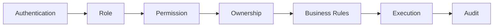
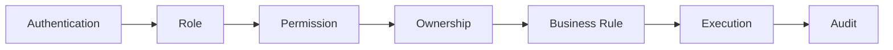

# Choosify Engineering Specification

**Document ID:** ES-003
**Title:** Role-Based Access Control (RBAC) & Permission Matrix
**Version:** 1.0.0
**Status:** Draft
**Priority:** Critical

**Depends On:**

- BP-001 through BP-012
- ES-001 Database Architecture
- ES-002 API Architecture

---

## Table of Contents

1. [Purpose](#1-purpose)
2. [Authorization Philosophy](#2-authorization-philosophy)
3. [RBAC Layers](#3-rbac-layers)
4. [System Roles](#4-system-roles)
5. [Workspace Separation](#5-workspace-separation)
6. [Staff Roles](#6-staff-roles)
7. [Permission Naming Convention](#7-permission-naming-convention)
8. [Permission Domains](#8-permission-domains)
9. [Permission Levels](#9-permission-levels)
10. [Ownership Rules](#10-ownership-rules)
11. [Consumer Permissions](#11-consumer-permissions)
12. [Seller Permissions](#12-seller-permissions)
13. [Creator Permissions](#13-creator-permissions)
14. [Administrator Permissions](#14-administrator-permissions)
15. [Super Administrator](#15-super-administrator)
16. [Permission Evaluation](#16-permission-evaluation)
17. [Resource Ownership](#17-resource-ownership)
18. [Delegated Permissions](#18-delegated-permissions)
19. [Temporary Permissions](#19-temporary-permissions)
20. [Permission Groups](#20-permission-groups)
21. [Future Dynamic Policies](#21-future-dynamic-policies)
22. [Security Rules](#22-security-rules)
23. [Business Rules](#23-business-rules)
24. [Future Permission Domains](#24-future-permission-domains)
25. [Acceptance Criteria](#25-acceptance-criteria)
26. [Revision History](#revision-history)

---

## 1. Purpose

This document defines the complete Role-Based Access Control (RBAC) architecture of the Choosify Commerce Operating System.

RBAC determines:

- Who may access a resource
- What operations may be performed
- Which resources belong to whom
- Administrative privileges
- Staff delegation
- Workspace separation

RBAC is enforced exclusively on the backend.

Frontend visibility never grants permission.

---

## 2. Authorization Philosophy

Authentication answers: "Who are you?"

Authorization answers: "What are you allowed to do?"

Ownership answers: "Does this resource belong to you?"

Business Rules answer: "Can this action happen right now?"

All four layers must pass before execution.

---

## 3. RBAC Layers

---

## 4. System Roles

**Primary Roles**

- Consumer
- Seller
- Creator
- Administrator
- Super Administrator

**Administrative Roles**

- Marketplace Administrator
- Finance Administrator
- Moderation Administrator
- Verification Officer
- Marketing Administrator
- Support Administrator
- Analytics Administrator
- Content Administrator

Each role inherits permissions according to policy.

---

## 5. Workspace Separation

- Consumers access the Consumer Workspace
- Sellers access the Seller Workspace
- Creators access the Creator Workspace
- Administrators access the Administration Portal

Cross-workspace access is prohibited unless explicitly authorized.

---

## 6. Staff Roles

Primary account owners may invite staff.

Examples:

- Inventory Manager
- Order Manager
- Finance Manager
- Marketing Manager
- Customer Support
- Content Editor
- Warehouse Manager
- Brand Manager

Staff permissions are configurable.

---

## 7. Permission Naming Convention

Permissions follow `domain.action`.

Examples:

- `brand.view`
- `brand.create`
- `brand.update`
- `brand.delete`
- `product.publish`
- `order.refund`
- `review.reply`
- `finance.withdraw`
- `notification.broadcast`

---

## 8. Permission Domains

- Identity
- Brand
- Marketplace
- Product
- Inventory
- Category
- Orders
- Commerce
- Payments
- Escrow
- Finance
- Cashbook
- Messaging
- Reviews
- Trust
- Moderation
- Discovery
- CMS
- Analytics
- Notifications
- Administration
- System

---

## 9. Permission Levels

Every permission defines:

- View
- Create
- Update
- Delete
- Approve
- Suspend
- Restore
- Export
- Manage

Example: `brand.view`, `brand.update`, `brand.approve`, `brand.suspend`

---

## 10. Ownership Rules

Every resource belongs to an owner.

| Resource | Owner |
|----------|-------|
| Brand | Seller |
| Product | Brand |
| Order | Consumer |
| Conversation | Order |
| Review | Completed Order |

Ownership validation executes before permission validation.

---

## 11. Consumer Permissions

**May:**

- Register
- Purchase
- Review
- Message Sellers
- Track Orders
- Manage Profile
- Wishlist
- Disputes
- Notifications

**Cannot:**

- Manage Brands
- Publish Products
- Access Seller Workspace
- Moderate Content

---

## 12. Seller Permissions

**May:**

- Manage Brands
- Manage Products
- Manage Inventory
- Manage Orders
- Manage Staff
- Manage Finance
- Manage Deals
- Manage Coupons
- Manage Brand Stories
- Manage Live Commerce
- Reply Reviews
- Manage Messages
- Manage Cashbook

**Cannot:**

- Edit Other Brands
- View Other Sellers
- Access Platform CMS
- Modify Categories
- Approve Marketplace

---

## 13. Creator Permissions

**May:**

- Publish Guides
- Publish Reviews
- Publish Recommendations
- Host Live Commerce
- Manage Profile
- Manage Analytics

**Cannot:**

- Sell Products
- Manage Brands
- Access Seller Finance
- Approve Marketplace

---

## 14. Administrator Permissions

**May:**

- Manage Marketplace
- Verify Brands
- Approve Marketplace
- Moderate Reviews
- Moderate Listings
- Manage Consumers
- Manage Creators
- Manage Sellers
- Manage Analytics
- Manage CMS
- Manage Website

Administrators never become marketplace participants.

---

## 15. Super Administrator

Super Administrator possesses unrestricted platform authority.

Responsibilities include:

- Platform Configuration
- Security
- Finance
- System Settings
- Feature Flags
- Administrative Management
- Infrastructure Integration
- Audit Review

---

## 16. Permission Evaluation

Every request evaluates:

Failure at any stage terminates execution.

---

## 17. Resource Ownership

**Seller owns:**

- Brands
- Products
- Inventory
- Orders
- Finance
- Messages
- Stories

**Consumers own:**

- Orders
- Wishlist
- Reviews
- Messages

**Creators own:**

- Guides
- Recommendations
- Content

**Administrators own:**

- Platform Configuration

---

## 18. Delegated Permissions

Staff receive delegated permissions.

**Inventory Staff**

- May: Inventory, Products
- Cannot: Finance, Cashbook, Payouts

**Marketing Staff**

- May: Deals, Stories, Coupons
- Cannot: Orders, Finance, Verification

---

## 19. Temporary Permissions

Permissions may be:

- Granted
- Scheduled
- Expired
- Revoked

Every permission change generates an audit log.

---

## 20. Permission Groups

Permissions may be grouped.

Examples:

- Marketplace Management
- Commerce
- Finance
- Customer Service
- Moderation
- Analytics
- Website CMS
- Security

Groups simplify role administration.

---

## 21. Future Dynamic Policies

Future versions may support:

- Attribute-Based Access Control
- Location Restrictions
- Time Restrictions
- Risk-Based Authorization
- Device-Based Authorization
- Temporary Elevation

RBAC remains the primary authorization model.

---

## 22. Security Rules

- No permission exists exclusively on the frontend.
- No hidden administrative routes.
- No bypass mechanisms.
- Backend authorization remains authoritative.

---

## 23. Business Rules

### BR-3.1

Authentication alone never grants access.

### BR-3.2

Ownership validation is mandatory.

### BR-3.3

Frontend permissions are informational only.

### BR-3.4

Backend authorization is authoritative.

### BR-3.5

Every permission belongs to one domain.

### BR-3.6

Administrative permissions remain separate from marketplace permissions.

### BR-3.7

Staff never inherit ownership.

### BR-3.8

Every permission change generates an audit record.

### BR-3.9

Temporary permissions expire automatically.

### BR-3.10

Permission evaluation occurs before business logic execution.

---

## 24. Future Permission Domains

- API
- Webhooks
- Integrations
- AI
- Enterprise
- POS
- ERP
- Warehouse

Future domains follow the same naming convention.

---

## 25. Acceptance Criteria

- RBAC philosophy defined
- Roles documented
- Staff model documented
- Permission naming defined
- Permission domains documented
- Ownership validation defined
- Delegation documented
- Evaluation pipeline documented
- Security principles documented
- Business rules completed

---

## Revision History

| Version | Date | Description |
|----------|------|-------------|
| 1.0.0 | August 2026 | Initial Role-Based Access Control & Permission Matrix |
