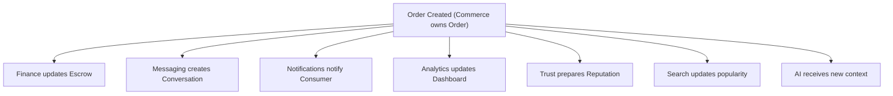
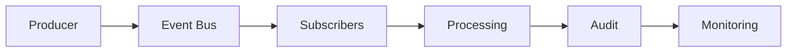
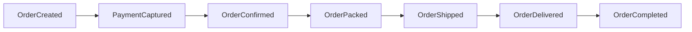
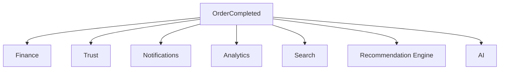
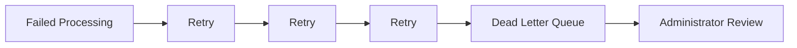

# Choosify Engineering Specification

**Document ID:** ES-004
**Title:** Event Bus, Domain Events & System Messaging
**Version:** 1.0.0
**Status:** Draft
**Priority:** Critical

**Depends On:**

- BP-001 through BP-012
- ES-001 Database Architecture
- ES-002 API Architecture
- ES-003 RBAC

---

## Table of Contents

1. [Purpose](#1-purpose)
2. [Philosophy](#2-philosophy)
3. [Event Architecture](#3-event-architecture)
4. [Event Categories](#4-event-categories)
5. [Event Naming Convention](#5-event-naming-convention)
6. [Identity Events](#6-identity-events)
7. [Marketplace Events](#7-marketplace-events)
8. [Product Events](#8-product-events)
9. [Commerce Events](#9-commerce-events)
10. [Payment Events](#10-payment-events)
11. [Messaging Events](#11-messaging-events)
12. [Review Events](#12-review-events)
13. [Moderation Events](#13-moderation-events)
14. [Content Events](#14-content-events)
15. [Administration Events](#15-administration-events)
16. [Analytics Events](#16-analytics-events)
17. [Notification Events](#17-notification-events)
18. [Event Metadata](#18-event-metadata)
19. [Event Ordering](#19-event-ordering)
20. [Event Reliability](#20-event-reliability)
21. [Event Consumers](#21-event-consumers)
22. [Retry Policy](#22-retry-policy)
23. [Event Versioning](#23-event-versioning)
24. [Audit Integration](#24-audit-integration)
25. [Security](#25-security)
26. [Future Integrations](#26-future-integrations)
27. [Business Rules](#27-business-rules)
28. [Acceptance Criteria](#28-acceptance-criteria)
29. [Revision History](#revision-history)

---

## 1. Purpose

This document defines the Event Bus Architecture of the Choosify Commerce Operating System.

The Event Bus enables independent platform modules to communicate through domain events without direct coupling.

Rather than one module directly invoking another, business events are published once and consumed by any interested module.

This architecture improves scalability, maintainability, extensibility, observability, and future microservice readiness.

---

## 2. Philosophy

Business logic belongs to one domain.

Business consequences may belong to many domains.

Commerce knows nothing about those systems.

---

## 3. Event Architecture

No service directly invokes unrelated services.

---

## 4. Event Categories

- Identity
- Marketplace
- Brand
- Catalog
- Inventory
- Commerce
- Finance
- Payments
- Messaging
- Trust
- Moderation
- Content
- Discovery
- Notifications
- Administration
- Analytics
- System

---

## 5. Event Naming Convention

Every event follows `EntityAction`.

Examples:

- UserRegistered
- SellerVerified
- BrandCreated
- BrandApproved
- MarketplaceEnabled
- ProductCreated
- InventoryUpdated
- OrderCreated
- PaymentCaptured
- EscrowReleased
- ConversationCreated
- ReviewSubmitted
- TrustUpdated
- NotificationQueued

---

## 6. Identity Events

- UserRegistered
- UserVerified
- UserLoggedIn
- UserLoggedOut
- PasswordChanged
- SessionExpired
- RoleChanged
- PermissionGranted
- PermissionRevoked
- AccountDeleted

---

## 7. Marketplace Events

- BrandCreated
- BrandUpdated
- BrandClaimSubmitted
- BrandClaimApproved
- BrandClaimRejected
- MarketplaceEnabled
- MarketplaceSuspended
- MarketplaceRestored
- MarketplaceDisabled

---

## 8. Product Events

- ProductCreated
- ProductUpdated
- ProductDeleted
- ProductArchived
- ProductPublished
- VariantCreated
- VariantUpdated
- InventoryChanged
- InventoryLow
- InventoryOutOfStock

---

## 9. Commerce Events

- CartCreated
- CartUpdated
- CheckoutStarted
- CheckoutCompleted
- OrderCreated
- OrderConfirmed
- OrderCancelled
- OrderPacked
- OrderShipped
- OrderDelivered
- OrderCompleted

---

## 10. Payment Events

- PaymentInitiated
- PaymentAuthorized
- PaymentCaptured
- PaymentFailed
- PaymentRefunded
- EscrowCreated
- EscrowReleased
- EscrowCancelled
- WithdrawalRequested
- WithdrawalApproved
- WithdrawalRejected

---

## 11. Messaging Events

- ConversationCreated
- MessageSent
- MessageEdited
- AttachmentUploaded
- ConversationClosed
- CounterOfferCreated
- CounterOfferAccepted
- CounterOfferExpired

---

## 12. Review Events

- ReviewSubmitted
- ReviewUpdated
- ReviewRemoved
- ReviewReported
- SellerReplyAdded
- ConsumerRated
- TrustUpdated

---

## 13. Moderation Events

- ListingFlagged
- ReviewFlagged
- FraudDetected
- SpamDetected
- CopyrightViolation
- CaseCreated
- CaseResolved
- MarketplaceWarningIssued

---

## 14. Content Events

- GuidePublished
- StoryPublished
- LiveStarted
- LiveEnded
- RecommendationPublished
- DealPublished
- DealExpired
- CouponActivated

---

## 15. Administration Events

- AdminApprovedBrand
- AdminSuspendedMarketplace
- AdminChangedSettings
- AdminPublishedBanner
- AdminDeletedListing
- AdminBroadcastSent

---

## 16. Analytics Events

- AnalyticsRecorded
- MetricUpdated
- SearchIndexed
- RecommendationUpdated
- TrendingCalculated
- DashboardUpdated

---

## 17. Notification Events

- NotificationQueued
- NotificationSent
- NotificationDelivered
- NotificationRead
- NotificationFailed
- BroadcastStarted
- BroadcastCompleted

---

## 18. Event Metadata

Every event contains:

- Event ID
- Event Name
- Timestamp
- Producer
- Domain
- Aggregate ID
- Actor
- Correlation ID
- Payload
- Version

---

## 19. Event Ordering

Events are processed in chronological order within the same aggregate.

Illegal ordering is rejected.

---

## 20. Event Reliability

Events are:

- Immutable
- Replayable
- Auditable
- Idempotent

Failures never silently discard events.

---

## 21. Event Consumers

Multiple consumers may subscribe.

Every subscriber operates independently.

---

## 22. Retry Policy

No event may disappear.

---

## 23. Event Versioning

Events remain backward compatible.

Breaking changes require a New Version.

Existing subscribers continue operating.

---

## 24. Audit Integration

Every event creates:

- Audit Entry
- Correlation ID
- Execution Time
- Result
- Errors
- Processing History

---

## 25. Security

Events inherit authorization.

Subscribers may not access data beyond their domain permissions.

Sensitive payloads remain encrypted where required.

---

## 26. Future Integrations

Future consumers include:

- ERP
- POS
- Warehouse
- Accounting
- CRM
- Partner APIs
- AI Services
- Business Intelligence

No producer changes required.

---

## 27. Business Rules

### BR-4.1

Every write operation emits at least one domain event.

### BR-4.2

Events are immutable.

### BR-4.3

Events never contain business logic.

### BR-4.4

Subscribers remain independent.

### BR-4.5

Events are replayable.

### BR-4.6

Every event includes a Correlation ID.

### BR-4.7

Events are versioned.

### BR-4.8

Event failures never interrupt completed business transactions.

### BR-4.9

Dead Letter Queues retain failed events.

### BR-4.10

Every event is auditable.

---

## 28. Acceptance Criteria

- Event philosophy defined
- Naming conventions established
- Event categories documented
- Event metadata defined
- Ordering strategy documented
- Retry strategy documented
- Dead Letter Queue documented
- Versioning defined
- Security documented
- Business rules completed

---

## Revision History

| Version | Date | Description |
|----------|------|-------------|
| 1.0.0 | August 2026 | Initial Event Bus, Domain Events & System Messaging |
