# Choosify Engineering Specification

**Document ID:** ES-005
**Title:** Workflow State Machines & Business Lifecycles
**Version:** 1.0.0
**Status:** Draft
**Priority:** Critical

**Depends On:**

- BP-001 through BP-012
- ES-001 Database Architecture
- ES-002 API Architecture
- ES-003 RBAC
- ES-004 Event Bus

---

## Table of Contents

1. [Purpose](#1-purpose)
2. [State Machine Philosophy](#2-state-machine-philosophy)
3. [State Machine Requirements](#3-state-machine-requirements)
4. [Seller Account Lifecycle](#4-seller-account-lifecycle)
5. [Seller Onboarding Evaluation](#5-seller-onboarding-evaluation)
6. [Brand Creation Lifecycle](#6-brand-creation-lifecycle)
7. [Multiple Brand Lifecycle](#7-multiple-brand-lifecycle)
8. [Marketplace Access State Machine](#8-marketplace-access-state-machine)
9. [Marketplace Access vs Ownership](#9-marketplace-access-vs-ownership)
10. [Marketplace Suspension Behaviour](#10-marketplace-suspension-behaviour)
11. [Active Order Suspension Guard](#11-active-order-suspension-guard)
12. [Ownership Claim Lifecycle](#12-ownership-claim-lifecycle)
13. [Claim Rejection Rule](#13-claim-rejection-rule)
14. [Product Lifecycle](#14-product-lifecycle)
15. [Product Publishing Eligibility](#15-product-publishing-eligibility)
16. [Product Suspension Behaviour](#16-product-suspension-behaviour)
17. [Out-of-Stock Lifecycle](#17-out-of-stock-lifecycle)
18. [Product Archive Lifecycle](#18-product-archive-lifecycle)
19. [Service Listing Lifecycle](#19-service-listing-lifecycle)
20. [Service Request Lifecycle](#20-service-request-lifecycle)
21. [Service Acceptance Lifecycle](#21-service-acceptance-lifecycle)
22. [Service Counter Offer Lifecycle](#22-service-counter-offer-lifecycle)
23. [Counter Offer Expiration](#23-counter-offer-expiration)
24. [Service Pricing States](#24-service-pricing-states)
25. [Hotel Booking Lifecycle](#25-hotel-booking-lifecycle)
26. [Tour Booking Lifecycle](#26-tour-booking-lifecycle)
27. [Product Order Lifecycle](#27-product-order-lifecycle)
28. [Order Creation and Conversation](#28-order-creation-and-conversation)
29. [Multi-Seller Cart Lifecycle](#29-multi-seller-cart-lifecycle)
30. [Mixed Product and Service Checkout](#30-mixed-product-and-service-checkout)
31. [Manual Order Lifecycle](#31-manual-order-lifecycle)
32. [External Social Commerce Order](#32-external-social-commerce-order)
33. [Product Cancellation Rules](#33-product-cancellation-rules)
34. [Payment Lifecycle](#34-payment-lifecycle)
35. [Payment Options](#35-payment-options)
36. [Partial Payment Lifecycle](#36-partial-payment-lifecycle)
37. [Escrow Lifecycle](#37-escrow-lifecycle)
38. [Escrow Exception Paths](#38-escrow-exception-paths)
39. [Shipping Lifecycle](#39-shipping-lifecycle)
40. [Return Lifecycle](#40-return-lifecycle)
41. [Return Shipping Responsibility](#41-return-shipping-responsibility)
42. [Dispute Lifecycle](#42-dispute-lifecycle)
43. [Dispute Trust Consequences](#43-dispute-trust-consequences)
44. [Refund Lifecycle](#44-refund-lifecycle)
45. [Review Lifecycle](#45-review-lifecycle)
46. [Seller Review Reply Lifecycle](#46-seller-review-reply-lifecycle)
47. [Fake Review Lifecycle](#47-fake-review-lifecycle)
48. [Trust Score Lifecycle](#48-trust-score-lifecycle)
49. [Progressive Seller Enforcement](#49-progressive-seller-enforcement)
50. [Consumer Enforcement Lifecycle](#50-consumer-enforcement-lifecycle)
51. [Moderation Case Lifecycle](#51-moderation-case-lifecycle)
52. [Duplicate Listing Moderation](#52-duplicate-listing-moderation)
53. [Payout Lifecycle](#53-payout-lifecycle)
54. [Subscription Lifecycle](#54-subscription-lifecycle)
55. [Cashbook Lifecycle](#55-cashbook-lifecycle)
56. [Conversation Lifecycle](#56-conversation-lifecycle)
57. [Service Conversation Expiration](#57-service-conversation-expiration)
58. [Support Ticket Lifecycle](#58-support-ticket-lifecycle)
59. [Deal Lifecycle](#59-deal-lifecycle)
60. [Coupon Lifecycle](#60-coupon-lifecycle)
61. [Live Commerce Lifecycle](#61-live-commerce-lifecycle)
62. [Digital Product Lifecycle](#62-digital-product-lifecycle)
63. [Account Deletion Lifecycle](#63-account-deletion-lifecycle)
64. [Community Profile After Deletion](#64-community-profile-after-deletion)
65. [Transition Authorization](#65-transition-authorization)
66. [Transition Concurrency](#66-transition-concurrency)
67. [Transition Idempotency](#67-transition-idempotency)
68. [Transition Events](#68-transition-events)
69. [Transition Audit](#69-transition-audit)
70. [Invalid Transitions](#70-invalid-transitions)
71. [State Machine Ownership](#71-state-machine-ownership)
72. [Business Rules](#72-business-rules)
73. [Acceptance Criteria](#73-acceptance-criteria)
74. [Revision History](#revision-history)

---

## 1. Purpose

This document defines the authoritative workflow state machines and business lifecycles of the Choosify Commerce Operating System.

Every entity that progresses through statuses must follow an explicit state machine.

State transitions must be validated by backend services.

Frontend applications may request transitions but may never determine whether a transition is valid.

This specification governs:

- Seller onboarding
- Brand lifecycle
- Marketplace Access
- Ownership Claims
- Products
- Inventory
- Product Deals
- Service Requests
- Service Bookings
- Hotel Bookings
- Tour Bookings
- Orders
- Multi-Seller Orders
- Manual Orders
- Payments
- Escrow
- Shipping
- Returns
- Refunds
- Disputes
- Reviews
- Moderation
- Payouts
- Subscriptions
- Messaging
- Support Tickets
- Live Commerce
- Account deletion and restoration

---

## 2. State Machine Philosophy

Every business entity has:

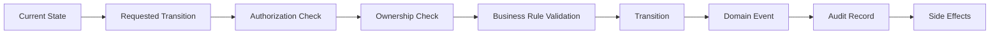

A state cannot be changed by directly modifying its database value.

State changes must occur through approved transition commands.

---

## 3. State Machine Requirements

Every state machine must define:

- States
- Initial State
- Terminal States
- Allowed Transitions
- Forbidden Transitions
- Authorized Actors
- Preconditions
- Resulting Events
- Side Effects
- Audit Requirements

---

## 4. Seller Account Lifecycle

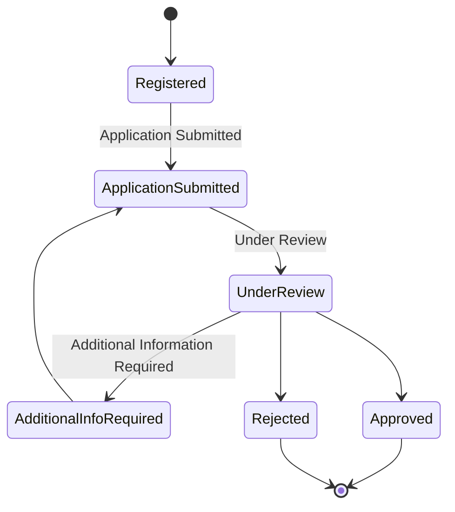

Seller approval alone does not necessarily mean Marketplace Access is enabled for every Brand.

Seller identity and Brand Marketplace Access remain separate concepts.

---

## 5. Seller Onboarding Evaluation

Seller onboarding may evaluate:

- Legal documentation
- Business authenticity
- Product/service quality
- Brand value
- Historical reputation
- Customer service history
- Fraud indicators
- Platform suitability

A Seller with valid legal documents may still be rejected if their commercial or customer-service history fails Choosify's onboarding standards.

---

## 6. Brand Creation Lifecycle

A Seller with an authenticated Seller Account may create one or more Brands.

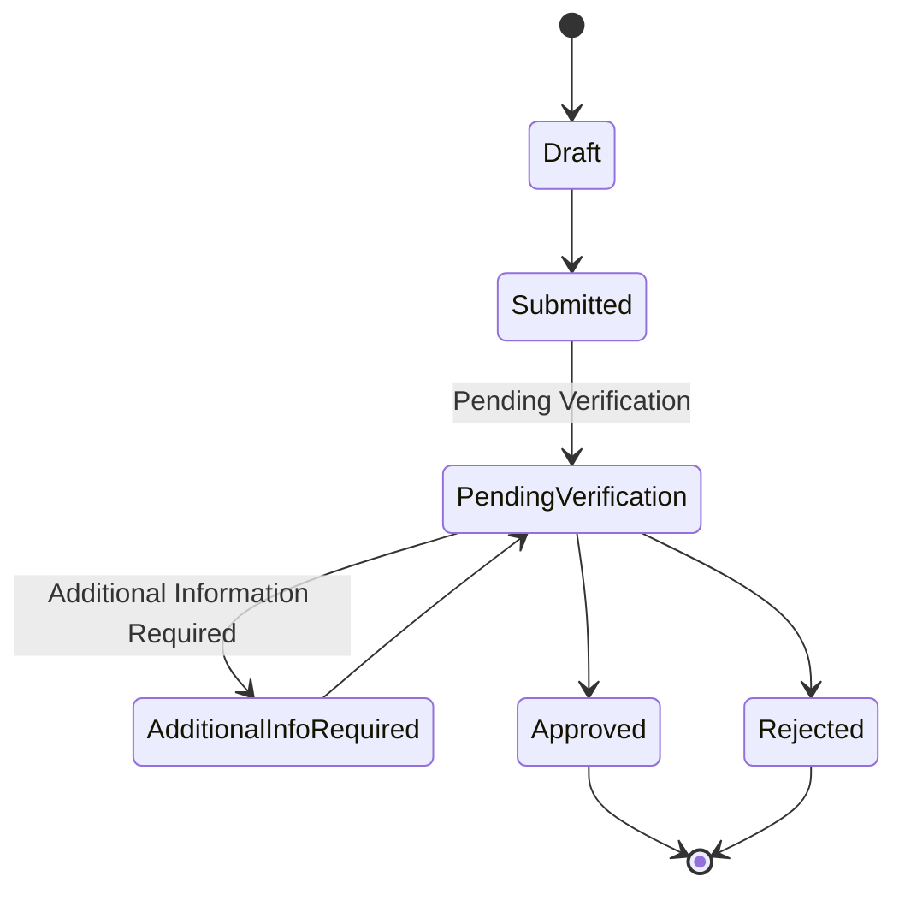

Brand creation must never automatically grant Marketplace Access.

---

## 7. Multiple Brand Lifecycle

One Seller Account may own multiple Brands:

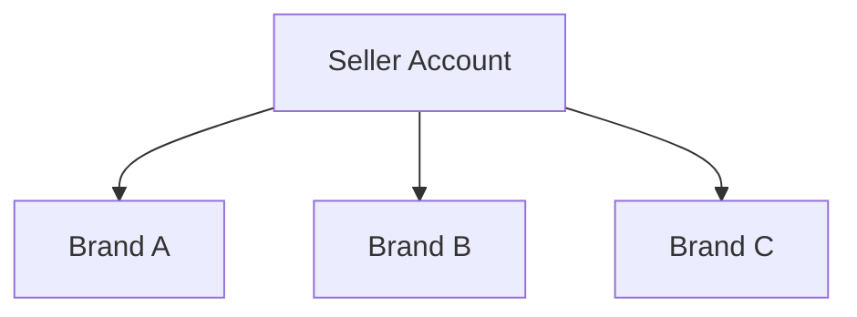

Each Brand maintains an independent:

- Verification State
- Marketplace State
- Trust Score
- Product Portfolio
- Service Portfolio
- Order Portfolio
- Moderation State
- Suspension State

A problem affecting Brand A must not automatically suspend Brand B unless the Seller Account itself is subject to platform-level enforcement.

---

## 8. Marketplace Access State Machine

Marketplace Access controls public marketplace visibility.

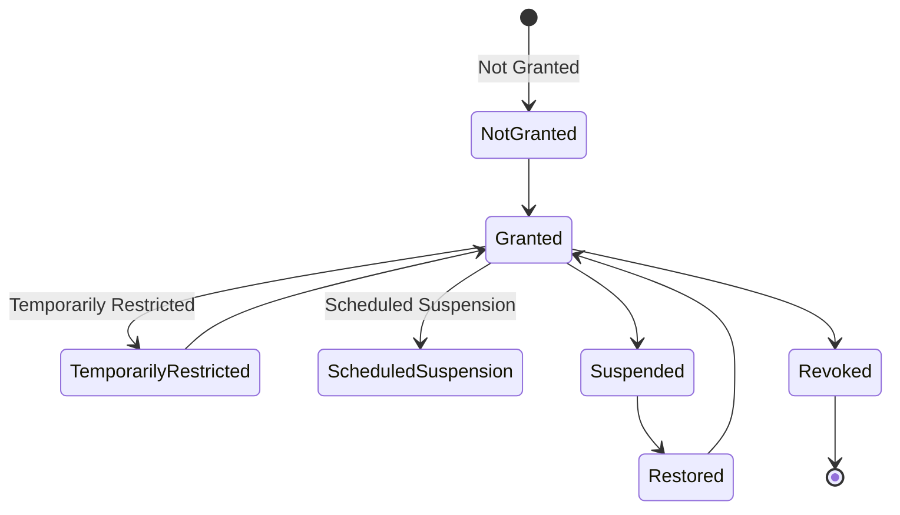

Marketplace Access may also have a scheduled or time-limited window when explicitly configured.

---

## 9. Marketplace Access vs Ownership

Marketplace Access does not determine ownership.

If Marketplace Access becomes unavailable, Seller retains ownership of:

- Brand
- Products
- Services
- Inventory
- Orders
- Finance records
- Messages
- Brand Stories
- Business data

Marketplace Access controls whether marketplace-facing resources may be publicly discovered or transacted upon.

---

## 10. Marketplace Suspension Behaviour

When Marketplace Access becomes suspended, the following is hidden from new public marketplace discovery:

- Brand Profile
- Products
- Services
- Deals
- Ads
- Promotional Content
- New booking opportunities

Existing operational commitments remain accessible.

Seller may continue managing:

- Existing Orders
- Existing Bookings
- Existing Conversations
- Returns
- Refund responsibilities
- Finance
- Inventory
- Brand Studio

The platform must not abandon Consumers with active transactions because a Seller becomes suspended.

---

## 11. Active Order Suspension Guard

Before Marketplace Access is suspended, the Administration Portal must determine whether the affected Seller/Brand has active Orders or Bookings.

If active commitments exist, administrators receive a warning.

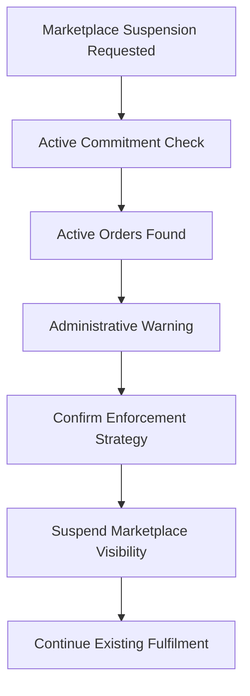

This warning does not necessarily prevent suspension.

It ensures active obligations are handled intentionally.

---

## 12. Ownership Claim Lifecycle

Existing profiles created by Choosify may be claimable.

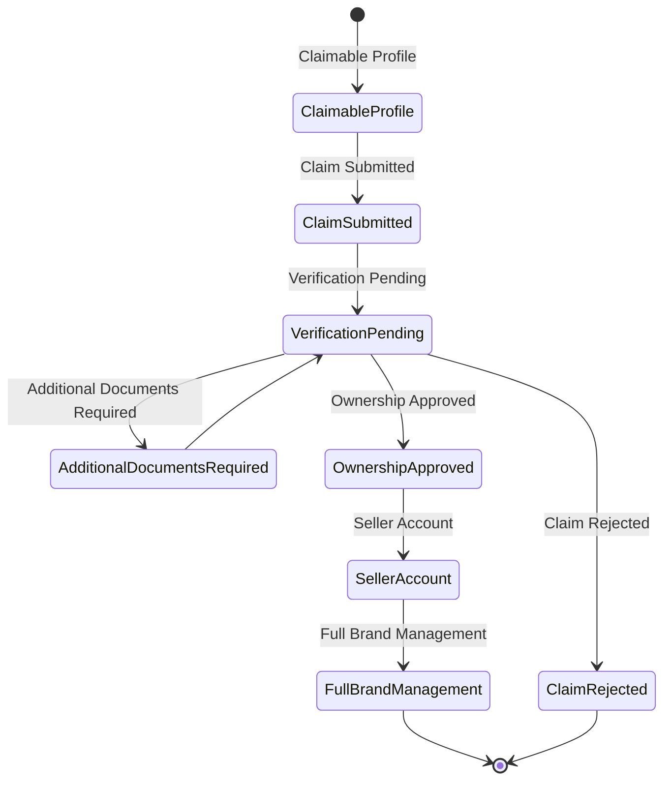

---

## 13. Claim Rejection Rule

A rejected ownership claim must not leave ownership assigned to the rejected claimant.

Any provisional ownership relationship established during verification must be removed or invalidated.

---

## 14. Product Lifecycle

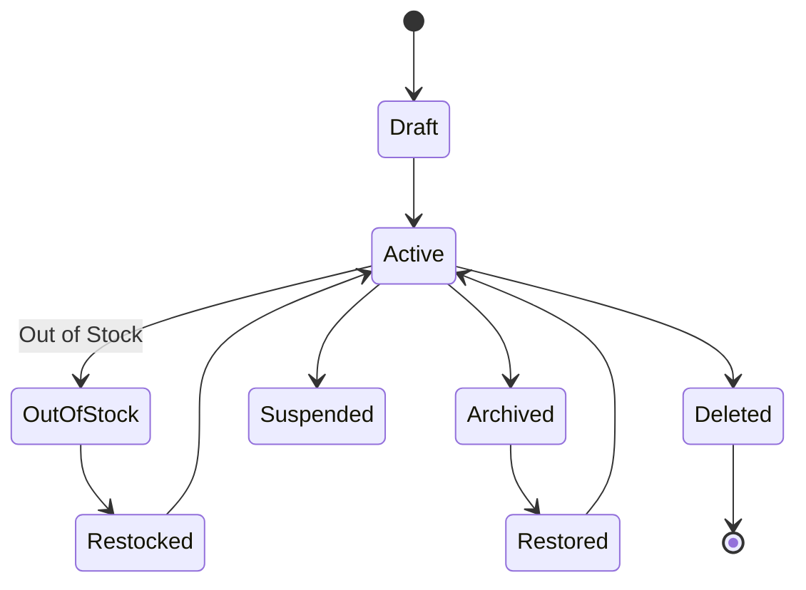

---

## 15. Product Publishing Eligibility

Initial product publishing requires Marketplace Access.


Once Marketplace Access has been granted, Seller may create listings without requiring individual administrative approval for every product.

Listings remain subject to moderation.

---

## 16. Product Suspension Behaviour

If Marketplace Access is suspended after products already exist:

Products remain stored.

Products remain manageable.

Products remain associated with inventory and historical orders.

Products disappear from public marketplace discovery until Marketplace Access is restored.

---

## 17. Out-of-Stock Lifecycle

When inventory reaches zero:

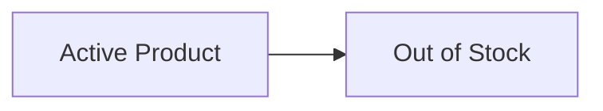

The listing is not immediately deleted.

Out-of-stock listings may remain discoverable according to storefront rules but should receive reduced discovery priority and must clearly indicate unavailable stock.

Seller inventory interfaces move the listing into the appropriate Out-of-Stock state/view.

---

## 18. Product Archive Lifecycle

Seller may manually archive a listing.

Additionally, products remaining unrestocked for the configured inactivity period may automatically transition to archive.

Initial policy:

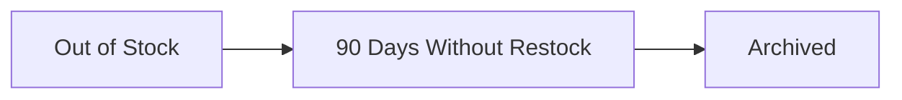

Archived products remain recoverable during the configured retention window.

After retention expires, they become eligible for permanent deletion according to platform retention policy.

---

## 19. Service Listing Lifecycle

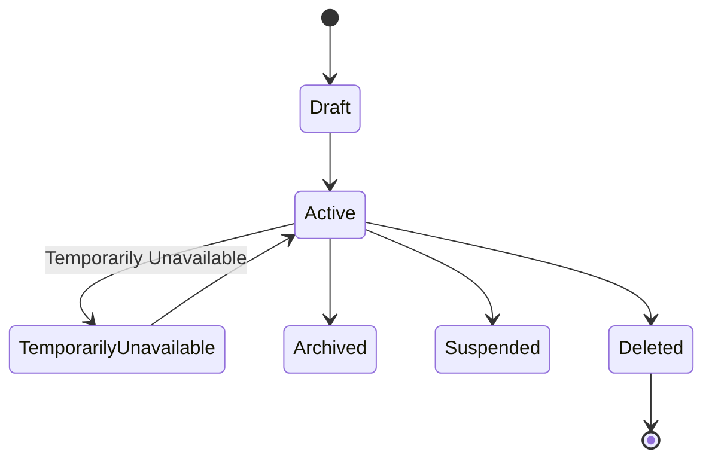

Availability may depend on calendars, schedules, capacity, working hours, location, and Seller configuration.

---

## 20. Service Request Lifecycle

Service purchase begins as a request.

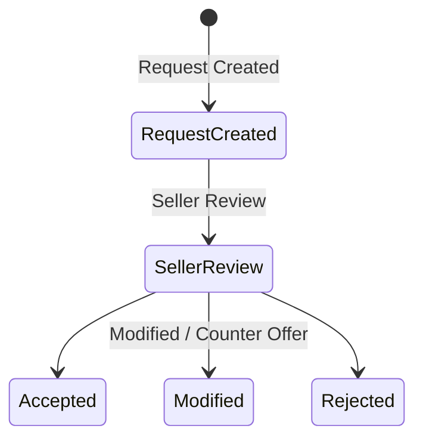

---

## 21. Service Acceptance Lifecycle

If Seller accepts without changes:

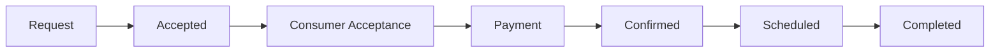

---

## 22. Service Counter Offer Lifecycle

If changes are necessary:

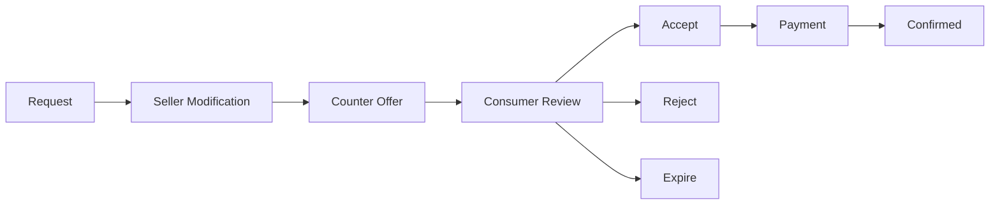

---

## 23. Counter Offer Expiration

Service Counter Offers use a validity window.

Default initial business requirement:

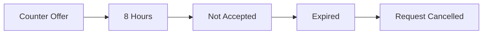

The exact duration should remain configurable rather than hard-coded.

---

## 24. Service Pricing States

Service pricing may use:

- Fixed
- Hourly
- Daily
- Weekly
- Monthly
- Per Person
- Per Guest
- Per Room

Pricing calculations may change when quantity, duration, dates, capacity, or options change.

Any Seller modification affecting price must generate a new offer version.

---

## 25. Hotel Booking Lifecycle

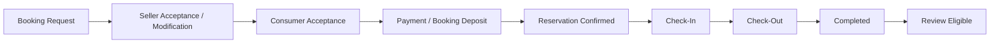

---

## 26. Tour Booking Lifecycle


---

## 27. Product Order Lifecycle

Standard Product Order:

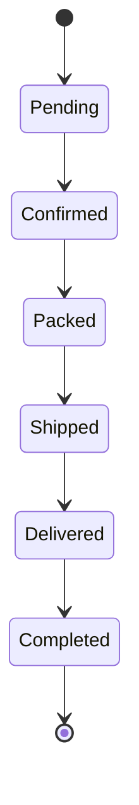

Cancellation may branch from eligible states.

---

## 28. Order Creation and Conversation

Every Order automatically creates a contextual Conversation.

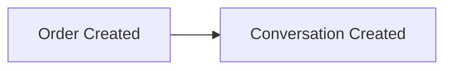

This applies even if the Consumer did not message the Seller before checkout.

---

## 29. Multi-Seller Cart Lifecycle

Consumers may maintain Products/Services from multiple Sellers in one Cart.

```mermaid
graph TD
    Cart["Unified Cart"] --> Checkout["Checkout"] --> Order["Order Placement"] --> Split["Split by Seller/Brand"]
    Split --> A["Seller Order A"]
    Split --> B["Seller Order B"]
    Split --> C["Seller Order C"]
```

Each resulting Seller Order receives its own:

- Order ID
- Seller relationship
- Fulfilment lifecycle
- Conversation
- Payment allocation
- Settlement record
- Return/refund lifecycle

The Consumer continues viewing these through a unified order experience.

---

## 30. Mixed Product and Service Checkout

A single Cart may contain different commerce types.

Checkout creates appropriate downstream workflows.

```mermaid
graph TD
    Cart["Cart"] --> Product["Product"]
    Cart --> Hotel["Hotel Booking"]
    Cart --> Service["Professional Service"]

    Checkout["Checkout"] --> ProductLifecycle["Product Order Lifecycle"]
    Checkout --> HotelLifecycle["Hotel Booking Lifecycle"]
    Checkout --> ServiceLifecycle["Service Request Lifecycle"]
```

The checkout interface may be unified while fulfilment lifecycles remain independent.

---

## 31. Manual Order Lifecycle

Seller may create an Order from a valid Consumer interaction, including supported external Social Inbox interactions.

```mermaid
graph LR
    A["Seller Creates Manual Order"] --> B["Pending Consumer Association"] --> C["Secure Confirmation Link"] --> D["Consumer Login / Registration"] --> E["Identity Association"] --> F["Order Added to Consumer Account"] --> G["Consumer Review"] --> H["Confirmation"] --> I["Payment"] --> J["Standard Order Lifecycle"]
```

Manual Orders must transition into the standard Order system after confirmation.

They must not remain a parallel commerce system.

---

## 32. External Social Commerce Order

Supported Social Inbox sources include:

- Facebook Messenger
- Instagram
- WhatsApp

Where permitted by integration capabilities:

```mermaid
graph LR
    A["External Conversation"] --> B["Seller Creates Manual Order"] --> C["Consumer Confirmation Link"] --> D["Choosify Authentication"] --> E["Order Association"] --> F["Standard Checkout"]
```

---

## 33. Product Cancellation Rules

**Consumer:** May cancel until Seller confirmation.

**Seller:** May cancel until dispatch.

**Administrator:** May intervene throughout the lifecycle when authorized by platform policy, dispute resolution, fraud handling, or support requirements.

Every cancellation requires:

- Actor
- Reason
- Timestamp
- State
- Audit Record

---

## 34. Payment Lifecycle

```mermaid
stateDiagram-v2
    [*] --> Initiated
    Initiated --> Pending
    Pending --> Authorized
    Authorized --> Captured
    Pending --> Failed
    Pending --> Cancelled
    Captured --> [*]
    Failed --> [*]
    Cancelled --> [*]
```

Refund paths occur after successful capture where applicable.

---

## 35. Payment Options

Supported payment models include:

- Full Online Payment
- COD
- Partial Advance
- Booking Deposit
- Bank Payment
- Wallet
- Installment where supported

Seller may activate payment options from platform-defined payment policies made available by Administration.

Seller cannot invent payment rules outside permitted platform configurations.

---

## 36. Partial Payment Lifecycle

**Example Product**

| Item | Amount |
|------|--------|
| Order Total | BDT 5,000 |
| Delivery Charge | BDT 150 |

Configured COD policy may require:

```mermaid
graph LR
    A["BDT 150 Online"] --> B["Order Confirmed"] --> C["BDT 5,000 Due at Delivery"]
```

**Example Service**

| Item | Amount |
|------|--------|
| Booking Total | BDT 10,000 |
| Booking Deposit | 30% |

```mermaid
graph LR
    A["30% Booking Deposit"] --> B["Reservation Confirmed"] --> C["70% Remaining Balance"]
```

Percentages and amounts remain configurable.

---

## 37. Escrow Lifecycle

Platform-collected payment enters escrow.

```mermaid
graph LR
    A["Payment Captured"] --> B["Escrow Held"] --> C["Fulfilment"] --> D["Successful Completion"] --> E["Settlement Eligible"] --> F["Seller Settlement"]
```

Money must not be released simply because payment was received.

---

## 38. Escrow Exception Paths

```mermaid
stateDiagram-v2
    EscrowHeld: Escrow Held
    EscrowHeld --> Settlement
    EscrowHeld --> FullRefund: Full Refund
    EscrowHeld --> PartialRefund: Partial Refund
    EscrowHeld --> DisputeHold: Dispute Hold
    EscrowHeld --> AdministrativeAdjustment: Administrative Adjustment
```

Every transition creates financial ledger entries.

---

## 39. Shipping Lifecycle

```mermaid
stateDiagram-v2
    [*] --> PendingFulfilment: Pending Fulfilment
    PendingFulfilment --> Packed
    Packed --> CourierAssigned: Courier Assigned
    CourierAssigned --> PickedUp: Picked Up
    PickedUp --> InTransit: In Transit
    InTransit --> OutForDelivery: Out for Delivery
    OutForDelivery --> Delivered
    InTransit --> DeliveryFailed: Delivery Failed
    InTransit --> ReturnedToSeller: Returned to Seller
    InTransit --> LostInvestigation: Lost / Investigation
    Delivered --> [*]
```

---

## 40. Return Lifecycle

```mermaid
stateDiagram-v2
    [*] --> ReturnRequested: Return Requested
    ReturnRequested --> EligibilityValidation: Eligibility Validation
    EligibilityValidation --> SellerReview: Seller Review
    SellerReview --> Accepted
    SellerReview --> Rejected
    Accepted --> ReturnShipment: Return Shipment
    ReturnShipment --> ItemReceived: Item Received / Validated
    ItemReceived --> RefundProcessing: Refund Processing
    RefundProcessing --> Closed
    Closed --> [*]
    Rejected --> [*]
```

---

## 41. Return Shipping Responsibility

Return shipping responsibility is determined by reason.

**Seller responsibility may include:**

- Incorrect Product
- Defective Product
- Misrepresentation
- Damaged Product attributable to Seller/Fulfilment

**Consumer responsibility** may apply to eligible change-of-mind scenarios where platform policy permits.

The decision must be recorded.

---

## 42. Dispute Lifecycle

If Seller rejects a Return or another qualifying disagreement occurs:

```mermaid
stateDiagram-v2
    [*] --> DisputeCreated: Dispute Created
    DisputeCreated --> EvidenceCollection: Evidence Collection
    EvidenceCollection --> AdministrativeReview: Administrative Review
    AdministrativeReview --> Decision
    Decision --> Refund
    Decision --> PartialRefund: Partial Refund
    Decision --> ReturnRequired: Return Required
    Decision --> SellerFavoured: Seller Favoured
    Decision --> ConsumerFavoured: Consumer Favoured
    Decision --> CaseClosedWithoutRefund: Case Closed Without Refund
```

---

## 43. Dispute Trust Consequences

Dispute outcomes may affect reputation.

Seller-at-fault outcomes may reduce Seller Trust.

Consumer abuse or fraudulent dispute outcomes may reduce Consumer Trust.

Merely participating in a dispute must not automatically reduce Trust.

---

## 44. Refund Lifecycle

```mermaid
stateDiagram-v2
    [*] --> RefundRequested: Refund Requested
    RefundRequested --> CaseReview: Eligibility / Case Review
    CaseReview --> Approved
    CaseReview --> Rejected
    Approved --> FinancialProcessing: Financial Processing
    FinancialProcessing --> Completed
    Completed --> [*]
    Rejected --> [*]
```

Refunds may be:

- Full
- Partial
- Escrow Reversal

Administrative authorization applies according to policy.

---

## 45. Review Lifecycle

```mermaid
graph LR
    A["Transaction Completed"] --> B["Review Eligible"] --> C["Review Submitted"] --> D["Published"]
```

Reviews remain subject to moderation.

---

## 46. Seller Review Reply Lifecycle

Seller may publish one official reply.

```mermaid
graph LR
    A["Review"] --> B["Seller Reply"] --> C["Reply Published"]
```

Additional Seller replies are prohibited unless administrative intervention permits modification.

---

## 47. Fake Review Lifecycle

```mermaid
graph LR
    A["Review Published"] --> B["Flagged"] --> C["Moderation Review"] --> D["Confirmed Fake"] --> E["Review Removed"] --> F["Public Moderation Notice"] --> G["Consumer Warning"] --> H["Trust Adjustment"]
```

The public record may indicate that Choosify removed the review for violating platform policy without retaining prohibited content.

---

## 48. Trust Score Lifecycle

Approved users/entities begin at **100%**.

Behaviour continuously feeds Trust evaluation.

Signals may include:

- Reviews
- Returns
- Cancellation Ratio
- Response Performance
- Fulfilment
- Disputes
- Fraud
- Spam
- Policy Violations

Trust may be maintained or reduced according to governed scoring rules.

---

## 49. Progressive Seller Enforcement

Negative Seller behaviour should generally follow progressive enforcement.

```mermaid
graph LR
    A["Issue Detected"] --> B["Communication / Warning"] --> C["Improvement Opportunity"] --> D["Restriction"] --> E["Temporary Marketplace Suspension"] --> F["Extended Suspension / Revocation"]
```

Severe fraud, safety issues, legal requirements, or malicious behaviour may bypass intermediate steps.

---

## 50. Consumer Enforcement Lifecycle

```mermaid
graph LR
    A["Violation"] --> B["Warning"] --> C["Trust Reduction"] --> D["Restriction"] --> E["Suspension"] --> F["Ban"]
```

Severity and repeat offences determine escalation.

---

## 51. Moderation Case Lifecycle

```mermaid
stateDiagram-v2
    [*] --> Created
    Created --> Queued
    Queued --> Assigned
    Assigned --> Investigating
    Investigating --> DecisionPending: Decision Pending
    DecisionPending --> Resolved
    Resolved --> Closed
    Closed --> [*]
```

Cases may be reopened only through authorized administrative procedures.

---

## 52. Duplicate Listing Moderation

Suspected copying:

```mermaid
stateDiagram-v2
    [*] --> ListingCreated: Listing Created / Updated
    ListingCreated --> SimilarityDetection: Similarity Detection
    SimilarityDetection --> Flagged
    Flagged --> Moderation
    Moderation --> Decision
    Decision --> Cleared
    Decision --> ModificationRequired: Modification Required
    Decision --> Removed
    Decision --> Enforcement
```

---

## 53. Payout Lifecycle

```mermaid
stateDiagram-v2
    [*] --> SellerBalance: Seller Balance
    SellerBalance --> SettlementEligible: Settlement Eligible
    SettlementEligible --> AvailableBalance: Available Balance
    AvailableBalance --> WithdrawalRequested: Withdrawal Requested
    WithdrawalRequested --> ReviewProcessing: Review / Processing
    ReviewProcessing --> Approved
    ReviewProcessing --> Rejected
    Approved --> Transferred
    Transferred --> Completed
    Completed --> [*]
    Rejected --> [*]
```

Rejected funds return/remain available according to applicable financial rules.

---

## 54. Subscription Lifecycle

```mermaid
stateDiagram-v2
    [*] --> PlanSelected: Plan Selected
    PlanSelected --> Payment
    Payment --> Active
    Active --> RenewalDue: Renewal Due
    RenewalDue --> Renewed
    Renewed --> Active
    RenewalDue --> PaymentFailed: Payment Failed
    PaymentFailed --> GracePeriod: Grace Period
    GracePeriod --> Expired
    Expired --> [*]
```

Subscription expiry must not delete Seller data.

If a Marketplace entitlement depends upon the subscription, access changes follow Marketplace Access policy.

---

## 55. Cashbook Lifecycle

Cashbook is Seller-owned private accounting data.

```mermaid
stateDiagram-v2
    [*] --> EntryCreated: Entry Created
    EntryCreated --> Active
    Active --> Edited
    Edited --> Active
    Active --> DeletedArchived: Deleted / Archived
    DeletedArchived --> [*]
```

Cashbook records must remain separated from authoritative Choosify marketplace financial ledgers.

Administrative access is governed separately through authorized oversight permissions.

---

## 56. Conversation Lifecycle

Commerce conversation:

```mermaid
graph LR
    A["Created"] --> B["Active"] --> C["Transaction Progress"] --> D["Transaction Completed"] --> E["Read Only"]
```

Conversation history remains accessible.

---

## 57. Service Conversation Expiration

Where a Service Request requires Consumer confirmation within a validity window:

```mermaid
graph LR
    A["Conversation Active"] --> B["Offer Pending"] --> C["Expiration Reached"] --> D["Request Cancelled"] --> E["Conversation Read Only"]
```

---

## 58. Support Ticket Lifecycle

```mermaid
stateDiagram-v2
    [*] --> Opened
    Opened --> Assigned
    Assigned --> InProgress: In Progress
    InProgress --> WaitingForUser: Waiting for User
    WaitingForUser --> InProgress
    InProgress --> Resolved
    Resolved --> Closed
    Closed --> [*]
```

Tickets may be reopened according to support policy.

---

## 59. Deal Lifecycle

Deals reference existing listings.

```mermaid
stateDiagram-v2
    [*] --> Draft
    Draft --> Scheduled
    Scheduled --> Active
    Active --> Expired
    Draft --> Cancelled
    Scheduled --> Cancelled
    Active --> Cancelled
    Expired --> [*]
    Cancelled --> [*]
```

Deal expiration restores the listing's normal commercial configuration.

---

## 60. Coupon Lifecycle

```mermaid
stateDiagram-v2
    [*] --> Draft
    Draft --> Scheduled
    Scheduled --> Active
    Active --> Expired
    Active --> Deactivated
    Expired --> [*]
    Deactivated --> [*]
```

Seller and Creator coupon limits remain governed by platform policy.

Initial requirement: Seller active coupon allowance may be capped while allowing additional inactive/draft coupons.

---

## 61. Live Commerce Lifecycle

```mermaid
graph LR
    A["Draft"] --> B["Scheduled"] --> C["Live"] --> D["Ended"] --> E["Archived"]
```

Live sessions may reference:

- Products
- Services
- Brands
- Guides

Ending the Live does not delete tagged listings.

---

## 62. Digital Product Lifecycle

```mermaid
graph LR
    A["Order"] --> B["Payment Confirmed"] --> C["Delivery Authorized"] --> D["Download / License Available"] --> E["Completed"]
```

Delivery may include:

- Download
- License Key
- Email
- Download Center

---

## 63. Account Deletion Lifecycle

User-requested deletion:

```mermaid
graph LR
    A["Deletion Requested"] --> B["Account Deactivated"] --> C["Retention Period"] --> D["Permanent Personal Data Deletion"]
```

Initial retention requirement: **60 Days**.

Legal, financial, fraud-prevention, audit, or regulatory records that cannot legally or operationally be deleted must be handled under separate retention/anonymization policies.

---

## 64. Community Profile After Deletion

Where applicable to public Brand/Profile entities:

After deletion and retention processing, Choosify may preserve or recreate a non-owned public community/claimable profile.

It must:

- Contain no deleted private account data
- Contain no credentials
- Contain no private financial information
- Contain no private messages
- Not restore previous ownership automatically

Future ownership requires a new Claim process.

---

## 65. Transition Authorization

Every transition defines authorized actors.

Examples:

- Seller
- Consumer
- Creator
- Staff
- Administrator
- System

No actor may execute transitions outside their permissions.

---

## 66. Transition Concurrency

Transitions must protect against simultaneous conflicting updates.

Example: Consumer cancels an order while the Seller simultaneously confirms the same order.

Only one valid transition may succeed against the expected state/version.

Optimistic concurrency control or equivalent transactional protection must be implemented.

---

## 67. Transition Idempotency

Repeated identical transition requests must not duplicate side effects.

Critical examples:

- Payment Capture
- Order Confirmation
- Refund
- Escrow Release
- Payout
- Marketplace Approval

---

## 68. Transition Events

Every successful state transition emits a domain event.

Example: `Order: Pending → Confirmed` emits `OrderConfirmed`.

Event consumers then perform appropriate downstream operations.

---

## 69. Transition Audit

Every transition records:

- Entity
- Previous State
- New State
- Actor
- Role
- Timestamp
- Reason
- Correlation ID
- Source
- Metadata

Administrative overrides additionally require justification.

---

## 70. Invalid Transitions

Invalid state transitions return a domain error.

Example: `Delivered → Packed` must fail.

The API must never silently repair an invalid transition by selecting another state.

---

## 71. State Machine Ownership

Each domain owns its own state machines.

Examples:

- Commerce owns Orders.
- Finance owns Escrow.
- Marketplace owns Marketplace Access.
- Catalog owns Products.
- Trust owns Moderation/Trust lifecycle.
- Messaging owns Conversations.

Other domains consume emitted events rather than modifying states directly.

---

## 72. Business Rules

### BR-5.1

Every lifecycle-changing entity must have an explicit state machine.

### BR-5.2

State transitions are backend-authoritative.

### BR-5.3

Direct frontend state mutation is prohibited.

### BR-5.4

Every successful transition emits a domain event.

### BR-5.5

Every successful transition creates an audit record.

### BR-5.6

Invalid transitions must fail explicitly.

### BR-5.7

Marketplace suspension hides marketplace visibility without destroying Seller-owned data.

### BR-5.8

Existing customer commitments survive marketplace suspension and remain operable until resolution.

### BR-5.9

Multi-Seller checkout produces independently manageable Seller Orders.

### BR-5.10

Every Order automatically creates a contextual Conversation.

### BR-5.11

Service modifications create explicit Counter Offers rather than silently modifying Consumer requests.

### BR-5.12

Escrow settlement occurs only after the applicable fulfilment condition.

### BR-5.13

Dispute participation alone does not reduce Trust; governed outcomes may affect Trust.

### BR-5.14

Seller/Consumer enforcement should be progressive except where severity justifies immediate escalation.

### BR-5.15

Manual Orders transition into the standard Commerce lifecycle after Consumer confirmation.

### BR-5.16

Financial transitions must be idempotent.

### BR-5.17

Concurrent conflicting transitions must be transactionally protected.

### BR-5.18

Account deletion must respect retention, audit, financial, and regulatory obligations.

### BR-5.19

Claim rejection must never leave rejected ownership attached to the claimant.

### BR-5.20

A Seller's ownership of business data remains independent from Marketplace Access.

---

## 73. Acceptance Criteria

- Seller onboarding lifecycle defined
- Brand lifecycle defined
- Multi-brand independence defined
- Marketplace Access lifecycle defined
- Marketplace suspension behaviour defined
- Active-order suspension guard defined
- Ownership Claim lifecycle defined
- Product lifecycle defined
- Inventory/out-of-stock behaviour defined
- Product archive lifecycle defined
- Service lifecycle defined
- Counter Offer lifecycle defined
- Hotel Booking lifecycle defined
- Tour Booking lifecycle defined
- Product Order lifecycle defined
- Multi-Seller checkout lifecycle defined
- Mixed Commerce checkout defined
- Manual Order lifecycle defined
- Payment lifecycle defined
- Partial Payment behaviour defined
- Escrow lifecycle defined
- Shipping lifecycle defined
- Returns lifecycle defined
- Refund lifecycle defined
- Dispute lifecycle defined
- Reviews lifecycle defined
- Trust lifecycle defined
- Moderation lifecycle defined
- Payout lifecycle defined
- Subscription lifecycle defined
- Conversation lifecycle defined
- Support lifecycle defined
- Deal lifecycle defined
- Coupon lifecycle defined
- Live Commerce lifecycle defined
- Digital Product lifecycle defined
- Account deletion lifecycle defined
- Transition authorization defined
- Concurrency protection defined
- Idempotency requirements defined
- Audit requirements defined
- Business rules completed

---

## Revision History

| Version | Date | Description |
|----------|------|-------------|
| 1.0.0 | August 2026 | Initial Workflow State Machines & Business Lifecycles |
