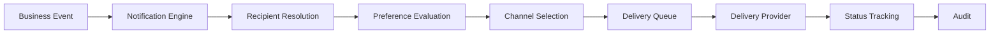
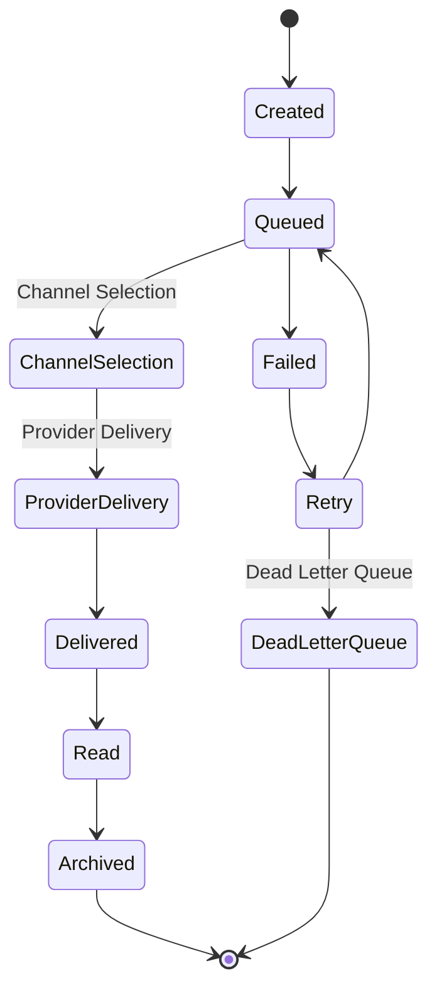
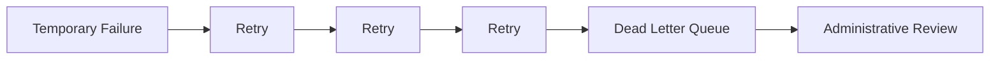

# Choosify Engineering Specification

**Document ID:** ES-006
**Title:** Notification Matrix & Multi-Channel Delivery Architecture
**Version:** 1.0.0
**Status:** Draft
**Priority:** Critical

**Depends On:**

- BP-001 through BP-012
- ES-001 Database Architecture
- ES-002 API Architecture
- ES-003 RBAC
- ES-004 Event Bus
- ES-005 Workflow State Machines

---

## Table of Contents

1. [Purpose](#1-purpose)
2. [Notification Philosophy](#2-notification-philosophy)
3. [Notification Categories](#3-notification-categories)
4. [Supported Delivery Channels](#4-supported-delivery-channels)
5. [Notification Priorities](#5-notification-priorities)
6. [Recipient Types](#6-recipient-types)
7. [Notification Lifecycle](#7-notification-lifecycle)
8. [User Preferences](#8-user-preferences)
9. [Platform Notifications](#9-platform-notifications)
10. [Authentication Notifications](#10-authentication-notifications)
11. [Marketplace Notifications](#11-marketplace-notifications)
12. [Product Notifications](#12-product-notifications)
13. [Commerce Notifications](#13-commerce-notifications)
14. [Service Notifications](#14-service-notifications)
15. [Payment Notifications](#15-payment-notifications)
16. [Messaging Notifications](#16-messaging-notifications)
17. [Review Notifications](#17-review-notifications)
18. [Moderation Notifications](#18-moderation-notifications)
19. [Marketing Notifications](#19-marketing-notifications)
20. [Broadcast Notifications](#20-broadcast-notifications)
21. [Notification Templates](#21-notification-templates)
22. [Delivery Providers](#22-delivery-providers)
23. [Retry Policy](#23-retry-policy)
24. [Notification History](#24-notification-history)
25. [Delivery Rules](#25-delivery-rules)
26. [Business Rules](#26-business-rules)
27. [Acceptance Criteria](#27-acceptance-criteria)
28. [Revision History](#revision-history)

---

## 1. Purpose

This document defines the Notification Architecture of the Choosify Commerce Operating System.

Notifications ensure that important platform events are delivered to the correct recipients through the appropriate communication channels while respecting user preferences, privacy settings, delivery priorities, and notification policies.

Notifications are event-driven.

Business modules emit events.

The Notification Engine determines:

- Who should receive the notification
- Which channels should be used
- Whether delivery is immediate or scheduled
- Retry policy
- Delivery status

---

## 2. Notification Philosophy

Business systems never send notifications directly.



---

## 3. Notification Categories

- Platform Notifications
- Order Notifications
- Service Notifications
- Booking Notifications
- Finance Notifications
- Messaging Notifications
- Trust Notifications
- Moderation Notifications
- Marketing Notifications
- System Notifications
- Security Notifications
- Administrative Notifications

---

## 4. Supported Delivery Channels

- In-App Notifications
- Email
- SMS
- Push Notification
- WhatsApp
- Broadcast Inbox

Future:

- Telegram
- Slack
- Microsoft Teams
- Partner APIs

---

## 5. Notification Priorities

- Critical
- High
- Normal
- Low
- Background

Priority determines delivery timing.

---

## 6. Recipient Types

- Consumer
- Seller
- Creator
- Seller Staff
- Creator Staff
- Administrator
- Platform Staff
- System

One notification may target multiple recipient types.

---

## 7. Notification Lifecycle



---

## 8. User Preferences

Users may configure:

- Email
- SMS
- Push
- WhatsApp
- Marketing
- Announcements
- Order Updates
- Message Alerts
- Review Alerts
- Deal Alerts

Preference changes affect future notifications only.

---

## 9. Platform Notifications

Examples:

- System Maintenance
- New Feature
- Policy Changes
- Terms Update
- Security Notice
- Platform Announcement

May be targeted globally or by audience.

---

## 10. Authentication Notifications

Examples:

- Account Created
- Login Detected
- Password Changed
- Device Added
- Suspicious Login
- Password Reset
- Email Verification
- Phone Verification

These are High or Critical priority.

---

## 11. Marketplace Notifications

Examples:

- Marketplace Approved
- Marketplace Suspended
- Marketplace Restored
- Brand Verified
- Ownership Claim Approved
- Ownership Claim Rejected
- Additional Documents Required

---

## 12. Product Notifications

Examples:

- Product Published
- Product Suspended
- Inventory Low
- Out of Stock
- Deal Approved
- Deal Expired
- Listing Flagged

---

## 13. Commerce Notifications

Examples:

- Order Created
- Order Confirmed
- Order Packed
- Order Shipped
- Out For Delivery
- Delivered
- Completed
- Cancelled
- Order Split
- Multi-Seller Checkout Completed

Every affected Seller receives only their own Order notifications.

Consumers receive unified order notifications.

---

## 14. Service Notifications

Examples:

- Booking Request
- Counter Offer
- Counter Offer Expiring
- Booking Confirmed
- Booking Scheduled
- Check-in Reminder
- Tour Reminder
- Appointment Reminder
- Service Completed

---

## 15. Payment Notifications

Examples:

- Payment Successful
- Payment Failed
- Refund Processed
- Refund Approved
- Refund Rejected
- Escrow Created
- Escrow Released
- Withdrawal Requested
- Withdrawal Approved
- Withdrawal Rejected
- Invoice Generated

---

## 16. Messaging Notifications

Examples:

- New Message
- Attachment Received
- Conversation Started
- Conversation Closed
- Counter Offer Received
- Order Conversation Created

Message delivery respects active conversation rules.

---

## 17. Review Notifications

Examples:

- Review Received
- Seller Reply
- Review Flagged
- Review Removed
- Review Approved
- Trust Score Updated

---

## 18. Moderation Notifications

Examples:

- Listing Flagged
- Case Opened
- Additional Information Required
- Policy Warning
- Marketplace Restriction
- Suspension Notice
- Ban Notice

---

## 19. Marketing Notifications

Examples:

- Flash Sale
- New Deal
- Coupon Available
- Wishlist Discount
- Recommended Products
- Recommended Services
- Brand Campaign

Marketing notifications always respect user preferences.

---

## 20. Broadcast Notifications

Administrators may create broadcasts.

Supported audiences:

- Everyone
- Consumers
- Sellers
- Creators
- Selected Brands
- Selected Categories
- Selected Regions
- Selected Subscription Plans

Broadcasts support scheduling.

---

## 21. Notification Templates

Templates support variables.

Example:

```
Hello {{first_name}}

Your order {{order_number}} has been shipped.
```

Templates are managed centrally.

---

## 22. Delivery Providers

- Email Provider
- SMS Gateway
- Push Provider
- WhatsApp Business API
- Internal Notification Service

Provider switching should not affect business logic.

---

## 23. Retry Policy



Retries are configurable by channel.

---

## 24. Notification History

Every notification records:

- Notification ID
- Recipient
- Channel
- Priority
- Status
- Timestamp
- Read Status
- Template
- Payload
- Correlation ID

History remains searchable.

---

## 25. Delivery Rules

- Critical notifications ignore marketing preferences.
- Marketing notifications respect opt-out settings.
- Duplicate notifications should be avoided.
- Delivery ordering should be preserved where required.

---

## 26. Business Rules

### BR-6.1

Business modules never deliver notifications directly.

### BR-6.2

Notifications are event-driven.

### BR-6.3

Notification preferences are user-controlled.

### BR-6.4

Critical security notifications cannot be disabled.

### BR-6.5

Every notification receives a delivery status.

### BR-6.6

Delivery failures enter retry workflow.

### BR-6.7

Notification history is auditable.

### BR-6.8

Marketing notifications require user consent where applicable.

### BR-6.9

Broadcast notifications support audience targeting.

### BR-6.10

Templates remain centralized.

---

## 27. Acceptance Criteria

- Notification architecture defined
- Delivery channels documented
- Notification categories documented
- User preferences documented
- Delivery lifecycle documented
- Broadcast architecture documented
- Template strategy documented
- Retry policy documented
- Delivery history documented
- Business rules completed

---

## Revision History

| Version | Date | Description |
|----------|------|-------------|
| 1.0.0 | August 2026 | Initial Notification Matrix & Multi-Channel Delivery Architecture |
