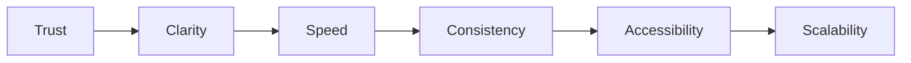

# Choosify Engineering Specification

**Document ID:** ES-007
**Title:** User Interface Architecture, Design System & UX Specifications
**Version:** 1.0.0
**Status:** Draft
**Priority:** Critical

**Depends On:**

- BP-001 through BP-012
- ES-001 Database Architecture
- ES-002 API Architecture
- ES-003 RBAC
- ES-004 Event Bus
- ES-005 Workflow State Machines
- ES-006 Notification Architecture

---

## Table of Contents

1. [Purpose](#1-purpose)
2. [UI Philosophy](#2-ui-philosophy)
3. [Design Principles](#3-design-principles)
4. [Layout Architecture](#4-layout-architecture)
5. [Responsive Breakpoints](#5-responsive-breakpoints)
6. [Navigation](#6-navigation)
7. [Page Structure](#7-page-structure)
8. [Dashboard Standards](#8-dashboard-standards)
9. [Table Standards](#9-table-standards)
10. [Forms](#10-forms)
11. [Buttons](#11-buttons)
12. [Dialogs](#12-dialogs)
13. [Wizards](#13-wizards)
14. [Cards](#14-cards)
15. [Lists](#15-lists)
16. [Search Experience](#16-search-experience)
17. [Filters](#17-filters)
18. [Loading States](#18-loading-states)
19. [Empty States](#19-empty-states)
20. [Error States](#20-error-states)
21. [Notifications](#21-notifications)
22. [Color Usage](#22-color-usage)
23. [Icons](#23-icons)
24. [Typography](#24-typography)
25. [Accessibility](#25-accessibility)
26. [Animations](#26-animations)
27. [Data Visualization](#27-data-visualization)
28. [Mobile UX](#28-mobile-ux)
29. [Workspace Identity](#29-workspace-identity)
30. [Future UI Components](#30-future-ui-components)
31. [Business Rules](#31-business-rules)
32. [Acceptance Criteria](#32-acceptance-criteria)
33. [Revision History](#revision-history)

---

## 1. Purpose

This document defines the User Interface Engineering Standards for the Choosify Commerce Operating System.

It establishes consistent rules for:

- Storefront
- Consumer Dashboard
- Seller Workspace
- Creator Workspace
- Administration Portal
- Mobile Applications

The objective is to create one unified experience across every Choosify product.

---

## 2. UI Philosophy

Choosify is not a collection of unrelated pages.

It is one operating system.

Every workspace must feel like different departments inside the same software.

---

## 3. Design Principles

Every interface should be:

- Simple
- Consistent
- Predictable
- Responsive
- Accessible
- Fast
- Professional
- Minimal
- Data-driven
- Action-oriented

---

## 4. Layout Architecture

- Storefront
- Consumer Dashboard
- Seller Workspace
- Creator Workspace
- Administration Portal

Each workspace uses:

- Header
- Sidebar (if applicable)
- Content Area
- Context Panel
- Footer

---

## 5. Responsive Breakpoints

| Device | Breakpoint |
|--------|------------|
| Desktop | ≥1440px |
| Laptop | ≥1200px |
| Tablet | 768px |
| Mobile | ≤767px |

Every page must support responsive layouts.

---

## 6. Navigation

Navigation should remain consistent.

- Top Navigation
- Primary Navigation
- Breadcrumbs
- Sidebar
- Context Menu
- Quick Actions
- Back Navigation
- Search
- Notifications
- Profile Menu

---

## 7. Page Structure

Every page contains:

- Title
- Subtitle
- Primary Action
- Secondary Actions
- Filters
- Search
- Content
- Pagination
- Empty State
- Loading State
- Error State

---

## 8. Dashboard Standards

Every dashboard includes:

- Overview Cards
- Charts
- Recent Activity
- Quick Actions
- Alerts
- Notifications
- Pending Tasks
- Performance Indicators

---

## 9. Table Standards

Tables support:

- Sorting
- Filtering
- Searching
- Pagination
- Bulk Selection
- Bulk Actions
- Export
- Column Visibility
- Sticky Header
- Responsive Collapse

---

## 10. Forms

Forms support:

- Validation
- Auto Save (where applicable)
- Drafts
- Progress Indicators
- Tooltips
- Context Help
- Undo (where appropriate)
- Confirmation Dialogs

---

## 11. Buttons

- Primary
- Secondary
- Danger
- Success
- Ghost
- Link
- Loading
- Disabled

Button behavior remains consistent platform-wide.

---

## 12. Dialogs

Supported dialog types:

- Confirmation
- Delete
- Warning
- Information
- Success
- Error
- Wizard
- Preview

---

## 13. Wizards

Multi-step processes use:

- Progress Indicator
- Validation
- Save Draft
- Previous
- Next
- Finish

Examples:

- Seller Registration
- Brand Creation
- Verification
- Checkout
- Marketplace Approval

---

## 14. Cards

Cards display:

- Products
- Brands
- Services
- Guides
- Stories
- Creators
- Analytics
- Notifications

Cards support responsive layouts.

---

## 15. Lists

Lists support:

- Infinite Scroll (where appropriate)
- Pagination
- Filtering
- Searching
- Grouping
- Sorting

---

## 16. Search Experience

- Global Search
- Context Search
- Advanced Search
- Search Suggestions
- Recent Searches
- Trending Searches
- AI Suggestions (Future)

---

## 17. Filters

Supported filter types:

- Checkbox
- Dropdown
- Range Slider
- Date Range
- Price Range
- Rating
- Trust Score
- Availability
- Location
- Brand
- Category

---

## 18. Loading States

Every asynchronous operation provides:

- Skeleton Loader
- Progress Indicator
- Spinner
- Incremental Loading

No blank pages.

---

## 19. Empty States

Every empty page explains:

- Why nothing exists
- What users can do next
- Primary Action

Examples:

- No Orders
- No Products
- No Messages
- No Brands

---

## 20. Error States

Errors display:

- Clear Message
- Reason
- Recovery Action
- Retry Option
- Support Link

Technical details remain hidden from normal users.

---

## 21. Notifications

- Toast
- Banner
- Modal
- Badge
- Inbox
- Broadcast

Notification style depends on severity.

---

## 22. Color Usage

Platform colors follow the Choosify Design System.

Color is never the only indicator.

Icons and labels accompany colors.

---

## 23. Icons

Icons remain consistent.

Icon usage should improve recognition.

Decorative icons should not replace labels.

---

## 24. Typography

Typography hierarchy:

- Display
- Heading
- Subheading
- Body
- Caption
- Metadata

Typography remains consistent across workspaces.

---

## 25. Accessibility

Platform targets WCAG compliance.

Requirements:

- Keyboard Navigation
- Screen Readers
- Focus Indicators
- High Contrast
- ARIA Labels
- Accessible Forms
- Accessible Tables

---

## 26. Animations

Animations must be:

- Purposeful
- Fast
- Subtle
- Optional where accessibility requires

Animations never delay workflow.

---

## 27. Data Visualization

Charts support:

- Line
- Bar
- Area
- Pie
- Donut
- Table
- Heatmap

Analytics must remain understandable.

---

## 28. Mobile UX

Mobile prioritizes:

- Speed
- One-handed use
- Large touch targets
- Bottom Navigation
- Simplified layouts
- Offline tolerance (Future)

---

## 29. Workspace Identity

Each workspace maintains unique branding while preserving the unified Choosify identity.

| Workspace | Color |
|-----------|-------|
| Consumer | Blue |
| Seller | Orange |
| Creator | Purple |
| Administration | Dark Navy |

Color themes remain configurable.

---

## 30. Future UI Components

Future additions include:

- Command Palette
- AI Assistant Panel
- Split View
- Workflow Designer
- Dashboard Builder
- Widget Marketplace

---

## 31. Business Rules

### BR-7.1

Every page must provide loading states.

### BR-7.2

Every page must provide empty states.

### BR-7.3

Every page must provide error states.

### BR-7.4

Navigation remains consistent.

### BR-7.5

Accessibility is mandatory.

### BR-7.6

Responsive support is mandatory.

### BR-7.7

Design System components remain reusable.

### BR-7.8

No page should require horizontal scrolling on supported devices.

### BR-7.9

User actions should receive immediate visual feedback.

### BR-7.10

Every workspace follows the same interaction patterns.

---

## 32. Acceptance Criteria

- UI philosophy defined
- Layout standards documented
- Responsive rules documented
- Navigation standards documented
- Dashboard standards documented
- Table standards documented
- Form standards documented
- Component standards documented
- Accessibility documented
- Design system documented
- Business rules completed

---

## Revision History

| Version | Date | Description |
|----------|------|-------------|
| 1.0.0 | August 2026 | Initial User Interface Architecture, Design System & UX Specifications |
