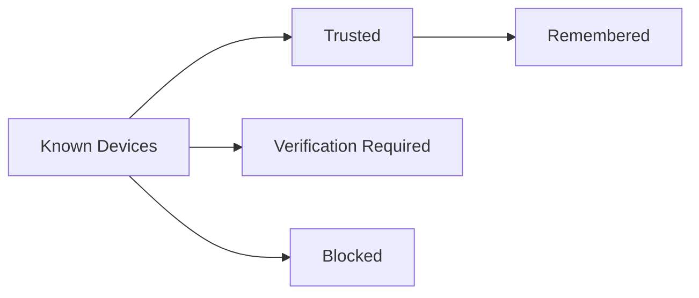
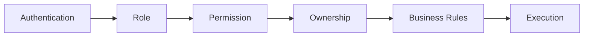
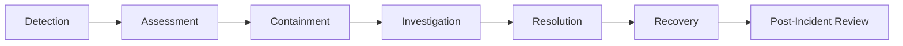

# Choosify Engineering Specification

**Document ID:** ES-008
**Title:** Security Architecture, Privacy & Compliance Engineering
**Version:** 1.0.0
**Status:** Draft
**Priority:** Critical

**Depends On:**

- BP-001 through BP-012
- ES-001 Database Architecture
- ES-002 API Architecture
- ES-003 RBAC
- ES-004 Event Bus
- ES-005 Workflow State Machines
- ES-006 Notification Architecture
- ES-007 UI Architecture

---

## Table of Contents

1. [Purpose](#1-purpose)
2. [Security Philosophy](#2-security-philosophy)
3. [Security Layers](#3-security-layers)
4. [Authentication](#4-authentication)
5. [Password Policy](#5-password-policy)
6. [Session Management](#6-session-management)
7. [Device Trust](#7-device-trust)
8. [Multi-Factor Authentication](#8-multi-factor-authentication)
9. [Authorization](#9-authorization)
10. [API Security](#10-api-security)
11. [Rate Limiting](#11-rate-limiting)
12. [Input Validation](#12-input-validation)
13. [Output Security](#13-output-security)
14. [Encryption](#14-encryption)
15. [Secrets Management](#15-secrets-management)
16. [File Security](#16-file-security)
17. [Data Classification](#17-data-classification)
18. [Personal Information](#18-personal-information)
19. [Payment Security](#19-payment-security)
20. [Audit Logging](#20-audit-logging)
21. [Privacy](#21-privacy)
22. [Data Retention](#22-data-retention)
23. [Account Deletion](#23-account-deletion)
24. [Fraud Detection](#24-fraud-detection)
25. [Administrative Security](#25-administrative-security)
26. [Monitoring](#26-monitoring)
27. [Incident Response](#27-incident-response)
28. [Disaster Recovery](#28-disaster-recovery)
29. [Business Continuity](#29-business-continuity)
30. [Infrastructure Security](#30-infrastructure-security)
31. [Compliance](#31-compliance)
32. [Third-Party Integrations](#32-third-party-integrations)
33. [Security Reviews](#33-security-reviews)
34. [Future Security](#34-future-security)
35. [Business Rules](#35-business-rules)
36. [Acceptance Criteria](#36-acceptance-criteria)
37. [Revision History](#revision-history)

---

## 1. Purpose

This document defines the complete security architecture of the Choosify Commerce Operating System.

Security is a platform-wide responsibility.

Every service, API, database, integration, administrator, seller, creator, consumer, and staff account must comply with this specification.

This document governs:

- Authentication
- Authorization
- Data Protection
- Encryption
- API Security
- Infrastructure Security
- Secrets Management
- Audit
- Privacy
- Compliance
- Incident Response
- Disaster Recovery
- Business Continuity

---

## 2. Security Philosophy

Choosify follows a Zero Trust architecture.

Every request must be verified.

Every action must be authorized.

Every sensitive operation must be auditable.

No user, system or device is trusted by default.

---

## 3. Security Layers

```mermaid
graph LR
    Identity --> Authentication --> Authorization --> Ownership["Ownership Validation"] --> BusinessRule["Business Rule Validation"] --> API["API Protection"] --> DB["Database Protection"] --> Infra["Infrastructure Security"] --> Monitoring --> Audit --> Incident["Incident Response"]
```

---

## 4. Authentication

Supported:

- JWT Access Token
- Refresh Token

Future:

- OAuth
- Passkeys
- Multi-Factor Authentication
- Biometric Authentication
- Enterprise SSO

Authentication never grants permissions.

---

## 5. Password Policy

Passwords require:

- Minimum Length
- Uppercase
- Lowercase
- Numbers
- Special Characters

Passwords are never stored in plaintext.

Passwords are hashed using approved algorithms.

---

## 6. Session Management

Every authenticated session records:

- Session ID
- User
- Device
- Browser
- IP Address
- Country
- Login Time
- Expiration
- Revocation Status

Users may terminate active sessions.

Administrators may revoke sessions.

---

## 7. Device Trust

Future releases may introduce device reputation.

---

## 8. Multi-Factor Authentication

Future support includes:

- Authenticator Apps
- Email OTP
- SMS OTP
- Hardware Keys
- Passkeys
- Recovery Codes

MFA is recommended for all users and mandatory for Administrators.

---

## 9. Authorization

Authorization follows ES-003.

---

## 10. API Security

All APIs require:

- HTTPS
- JWT Validation
- Permission Validation
- Ownership Validation
- Rate Limiting
- Input Validation
- Output Encoding
- Audit Logging

---

## 11. Rate Limiting

Rate limits apply by:

- IP
- User
- API Key
- Role
- Endpoint

Limits remain configurable.

---

## 12. Input Validation

Every request validates:

- Required Fields
- Length
- Format
- Data Type
- Allowed Values
- Ownership
- Business Rules

Invalid input never reaches business logic.

---

## 13. Output Security

Responses never expose:

- Internal IDs
- Secrets
- Database Structure
- Server Paths
- Stack Traces
- Internal Configuration

---

## 14. Encryption

**Encryption in Transit**

- HTTPS
- TLS

**Encryption at Rest**

- Database Encryption
- Backup Encryption
- File Encryption
- Secrets Encryption

---

## 15. Secrets Management

Secrets include:

- JWT Secrets
- API Keys
- Payment Credentials
- SMS Credentials
- Email Credentials
- Cloud Credentials
- Social API Credentials

Secrets are never committed to source control.

---

## 16. File Security

Protected uploads include:

- Verification Documents
- Invoices
- Product Images
- Videos
- Attachments

Files are scanned before becoming available.

Executable uploads are prohibited.

---

## 17. Data Classification

- Public
- Internal
- Confidential
- Restricted

Each data class follows its own handling policy.

---

## 18. Personal Information

Examples:

- Names
- Email
- Phone
- NID
- Passport
- TIN
- Business License
- Addresses

Personal information receives additional protection.

---

## 19. Payment Security

Choosify never stores raw payment credentials.

Payment providers remain responsible for sensitive payment information.

Only references and transaction metadata are stored.

---

## 20. Audit Logging

Every critical action records:

- Actor
- Timestamp
- Action
- Entity
- Old Value
- New Value
- IP Address
- Device
- Correlation ID

Audit logs are immutable.

---

## 21. Privacy

Privacy principles:

- Data Minimization
- Purpose Limitation
- User Transparency
- Consent
- Retention
- Deletion
- Legal Compliance

Users control their own personal information where permitted.

---

## 22. Data Retention

Examples:

- Orders
- Financial Records
- Audit Logs
- Messages
- Verification Documents

Each data type follows its own retention schedule.

Retention policies comply with applicable legal requirements.

---

## 23. Account Deletion

Deletion follows ES-005.

Personal data is removed after retention.

Platform records required for Legal, Financial, Fraud Prevention, and Audit purposes remain preserved according to policy.

---

## 24. Fraud Detection

Examples:

- Fake Reviews
- Fake Sellers
- Fake Consumers
- Spam
- Duplicate Listings
- Identity Abuse
- Payment Abuse
- Coupon Abuse
- Suspicious Login

Fraud events trigger moderation workflows.

---

## 25. Administrative Security

Administrative accounts require:

- MFA
- Strong Passwords
- Audit Logging
- Restricted Permissions
- Session Monitoring

Sensitive actions require confirmation.

---

## 26. Monitoring

Security monitoring includes:

- Authentication
- Authorization
- Payments
- API Abuse
- Rate Limits
- Infrastructure
- Database
- Errors
- Suspicious Activity
- Alerts

---

## 27. Incident Response

Every incident receives an Incident ID.

---

## 28. Disaster Recovery

Platform supports:

- Automated Backups
- Encrypted Backups
- Recovery Testing
- Regional Redundancy
- Infrastructure Recovery
- Database Recovery

Recovery procedures are tested periodically.

---

## 29. Business Continuity

Critical systems include:

- Authentication
- Orders
- Payments
- Messaging
- Finance
- Administration

Recovery priorities are documented separately.

---

## 30. Infrastructure Security

Infrastructure includes:

- Firewalls
- HTTPS
- Private Networks
- Cloud IAM
- Secret Management
- Container Security
- Database Security
- Backup Security

---

## 31. Compliance

Platform architecture supports compliance with applicable privacy and security regulations.

Examples may include:

- GDPR Principles
- CCPA Principles
- PCI-related integration requirements
- Local Bangladesh regulations

Platform policies remain configurable.

---

## 32. Third-Party Integrations

Examples:

- Meta
- Google
- Payment Gateways
- Courier Providers
- Email
- SMS
- Cloud Storage

Every integration receives:

- Credentials
- Scopes
- Audit
- Monitoring
- Revocation

---

## 33. Security Reviews

Regular reviews include:

- Access Review
- Permission Review
- Dependency Review
- Infrastructure Review
- Secret Rotation
- Penetration Testing
- Vulnerability Scanning

---

## 34. Future Security

Future enhancements:

- Passkeys
- Hardware Keys
- Risk-Based Authentication
- Behavior Analytics
- AI Fraud Detection
- Adaptive Authentication
- Device Reputation
- Geo-Risk Detection

---

## 35. Business Rules

### BR-8.1

Zero Trust architecture applies platform-wide.

### BR-8.2

Every request requires authentication where applicable.

### BR-8.3

Every action requires authorization.

### BR-8.4

Sensitive data is encrypted.

### BR-8.5

Secrets never exist in source code.

### BR-8.6

Critical actions generate immutable audit logs.

### BR-8.7

Administrative accounts require stronger protection.

### BR-8.8

Payment credentials are never stored by Choosify.

### BR-8.9

Personal information follows privacy policies.

### BR-8.10

Security incidents follow documented response procedures.

---

## 36. Acceptance Criteria

- Security philosophy defined
- Authentication documented
- Authorization documented
- API security documented
- Encryption strategy documented
- Secrets management documented
- Privacy documented
- Audit documented
- Monitoring documented
- Incident response documented
- Disaster recovery documented
- Compliance documented
- Business rules completed

---

## Revision History

| Version | Date | Description |
|----------|------|-------------|
| 1.0.0 | August 2026 | Initial Security Architecture, Privacy & Compliance Engineering |
