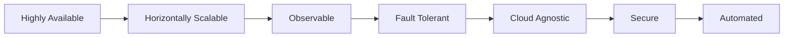
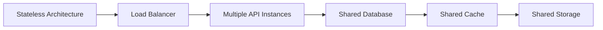
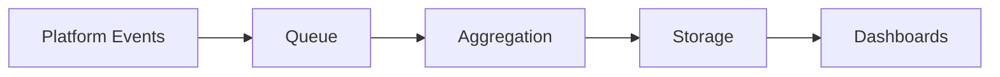

# Choosify Engineering Specification

**Document ID:** ES-009
**Title:** Performance, Scalability & Infrastructure Engineering
**Version:** 1.0.0
**Status:** Draft
**Priority:** Critical

**Depends On:**

- BP-001 through BP-012
- ES-001 Database Architecture
- ES-002 API Architecture
- ES-003 RBAC
- ES-004 Event Bus
- ES-005 Workflow State Machines
- ES-006 Notification Architecture
- ES-007 UI Architecture
- ES-008 Security Architecture

---

## Table of Contents

1. [Purpose](#1-purpose)
2. [Infrastructure Philosophy](#2-infrastructure-philosophy)
3. [High Availability](#3-high-availability)
4. [Scalability Strategy](#4-scalability-strategy)
5. [Horizontal Scaling](#5-horizontal-scaling)
6. [Database Performance](#6-database-performance)
7. [Caching Strategy](#7-caching-strategy)
8. [Content Delivery Network](#8-content-delivery-network)
9. [Media Optimization](#9-media-optimization)
10. [Queue Architecture](#10-queue-architecture)
11. [Background Jobs](#11-background-jobs)
12. [Search Performance](#12-search-performance)
13. [API Performance](#13-api-performance)
14. [Database Transactions](#14-database-transactions)
15. [Logging](#15-logging)
16. [Monitoring](#16-monitoring)
17. [Observability](#17-observability)
18. [Alerting](#18-alerting)
19. [Backup Strategy](#19-backup-strategy)
20. [Restore Strategy](#20-restore-strategy)
21. [File Storage](#21-file-storage)
22. [Search Index Lifecycle](#22-search-index-lifecycle)
23. [Analytics Pipeline](#23-analytics-pipeline)
24. [Infrastructure Automation](#24-infrastructure-automation)
25. [Deployment Strategy](#25-deployment-strategy)
26. [Performance Targets](#26-performance-targets)
27. [Future Infrastructure](#27-future-infrastructure)
28. [Business Rules](#28-business-rules)
29. [Acceptance Criteria](#29-acceptance-criteria)
30. [Revision History](#revision-history)

---

## 1. Purpose

This document defines the performance, scalability, infrastructure, monitoring, observability and operational engineering standards of the Choosify Commerce Operating System.

Choosify is designed to support millions of users, products, orders and interactions without requiring architectural redesign.

This specification governs:

- Infrastructure
- Scalability
- High Availability
- Performance
- Queue Systems
- Caching
- CDN
- Search
- Media
- Monitoring
- Logging
- Background Jobs
- Backup
- Disaster Recovery

---

## 2. Infrastructure Philosophy

Infrastructure must be:

Infrastructure should support future migration between cloud providers with minimal architectural change.

---

## 3. High Availability

Critical services should avoid single points of failure.

Core services include:

- Authentication
- API
- Database
- Payments
- Orders
- Messaging
- Notifications
- Search
- Administration
- Monitoring

---

## 4. Scalability Strategy

Platform scaling should support:

- Millions of Consumers
- Unlimited Sellers
- Unlimited Brands
- Millions of Products
- Millions of Orders
- Millions of Messages
- Millions of Reviews
- Millions of Notifications
- Millions of Analytics Events

Scalability must occur without redesigning business logic.

---

## 5. Horizontal Scaling

Application servers must support:

No request should depend on local server memory.

---

## 6. Database Performance

Performance techniques include:

- Indexes
- Query Optimization
- Connection Pooling
- Pagination
- Partitioning (Future)
- Read Replicas (Future)
- Archiving

Every production query should be optimized.

---

## 7. Caching Strategy

Caching layers include:

- Application Cache
- API Cache
- Search Cache
- Configuration Cache
- Session Cache
- CDN Cache

Cache invalidation follows domain events.

---

## 8. Content Delivery Network

Static assets should use CDN.

Examples:

- Images
- Videos
- JavaScript
- CSS
- Documents
- Public Downloads

Media should be geographically distributed.

---

## 9. Media Optimization

**Images support:**

- Compression
- Responsive Sizes
- Lazy Loading
- Modern Formats

**Video supports:**

- Adaptive Streaming
- Thumbnail Generation
- Compression
- Background Processing

---

## 10. Queue Architecture

Background processing uses queues.

Examples:

- Email
- SMS
- WhatsApp
- Push Notifications
- Search Indexing
- Image Processing
- Video Processing
- Analytics
- Reports
- Escrow Processing

Queues isolate slow operations from user requests.

---

## 11. Background Jobs

Examples:

- Nightly Reports
- Trust Recalculation
- Search Reindexing
- Cache Cleanup
- Archive Cleanup
- Subscription Renewal
- Coupon Expiration
- Analytics Aggregation
- Scheduled Notifications

Jobs should be retryable.

---

## 12. Search Performance

Search infrastructure supports:

- Autocomplete
- Fuzzy Search
- Synonyms
- Filters
- Ranking
- Suggestions
- Search Index Updates

Indexes update asynchronously through events.

---

## 13. API Performance

Target response times:

| API Type | Target |
|----------|--------|
| Simple APIs | <200ms |
| Standard APIs | <500ms |
| Heavy APIs | <1000ms |

Long-running operations should execute asynchronously.

---

## 14. Database Transactions

Transactions must be:

- Atomic
- Consistent
- Isolated
- Durable

Financial operations require strict transactional guarantees.

---

## 15. Logging

Every service generates logs.

Examples:

- API Requests
- Errors
- Authentication
- Payments
- Marketplace Events
- Moderation
- Infrastructure

Logs should be centralized.

---

## 16. Monitoring

Platform monitoring includes:

- CPU
- Memory
- Disk
- Database
- API Latency
- Queue Length
- Search Health
- Payment Health
- Notification Health
- Infrastructure Health

---

## 17. Observability

Every request should support tracing.

Includes:

- Request ID
- Correlation ID
- Service Timeline
- Database Calls
- External Calls
- Queue Processing

Tracing assists debugging across services.

---

## 18. Alerting

Alerts include:

- API Failure
- Database Failure
- Payment Failure
- Queue Failure
- High Latency
- Disk Usage
- Infrastructure Failure
- Security Alerts

Alerts are prioritized.

---

## 19. Backup Strategy

Platform backups include:

- Database
- Media
- Configuration
- Secrets
- Audit

Schedules remain configurable.

Backups are encrypted.

---

## 20. Restore Strategy

Recovery includes:

- Point-in-Time Recovery
- Full Restore
- Partial Restore
- Disaster Recovery

Recovery procedures are tested regularly.

---

## 21. File Storage

Files include:

- Images
- Videos
- Documents
- Invoices
- Verification Files
- Attachments

Storage should support:

- Versioning
- Encryption
- CDN
- Access Control
- Lifecycle Policies

---

## 22. Search Index Lifecycle

Search indexes remain derived data.

The database remains the source of truth.

---

## 23. Analytics Pipeline

Analytics processing should not delay user requests.

---

## 24. Infrastructure Automation

Automation includes:

- Deployment
- Scaling
- Backup
- Monitoring
- Certificate Renewal
- Health Checks

Infrastructure should minimize manual intervention.

---

## 25. Deployment Strategy

Supported environments:

- Development
- Testing
- Staging
- Production

Deployments should support rollback.

---

## 26. Performance Targets

| Surface | Target |
|---------|--------|
| Homepage | <2 seconds |
| Dashboard | <2 seconds |
| Search | <1 second |
| Checkout | <2 seconds |
| Messaging | Near Real-Time |
| Notifications | Near Real-Time |

Background processing remains asynchronous.

---

## 27. Future Infrastructure

Future capabilities include:

- Microservices
- Regional Deployment
- Multi-Region Database
- Serverless Workers
- Edge Computing
- AI Processing Cluster
- Event Streaming
- Real-Time Analytics

---

## 28. Business Rules

### BR-9.1

Infrastructure must remain horizontally scalable.

### BR-9.2

Application servers remain stateless.

### BR-9.3

Background jobs execute outside user requests.

### BR-9.4

Search indexes are derived from source data.

### BR-9.5

Queues isolate long-running operations.

### BR-9.6

Critical operations are monitored.

### BR-9.7

Centralized logging is mandatory.

### BR-9.8

Backups are encrypted.

### BR-9.9

Performance targets are measurable.

### BR-9.10

Deployment supports rollback.

---

## 29. Acceptance Criteria

- Infrastructure philosophy documented
- Scalability strategy documented
- Queue architecture documented
- Caching documented
- CDN documented
- Search performance documented
- Logging documented
- Monitoring documented
- Backup strategy documented
- Deployment documented
- Performance targets documented
- Business rules completed

---

## Revision History

| Version | Date | Description |
|----------|------|-------------|
| 1.0.0 | August 2026 | Initial Performance, Scalability & Infrastructure Engineering |
