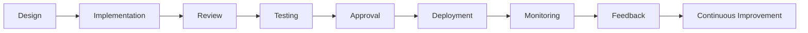
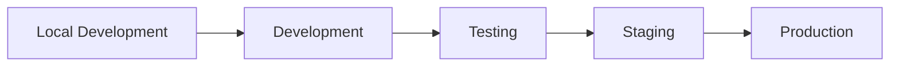
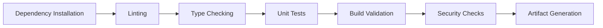
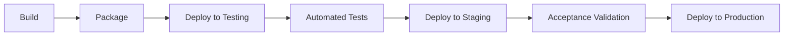
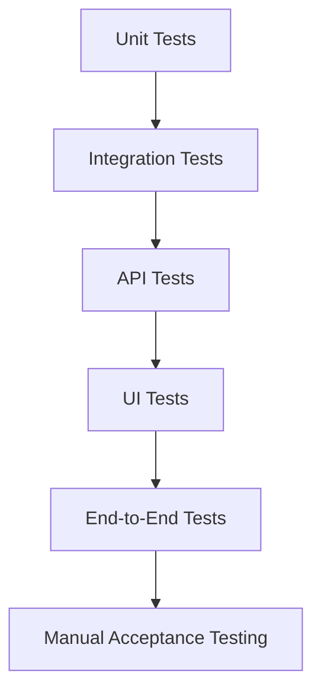
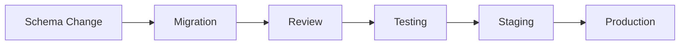
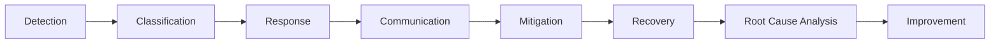

# Choosify Engineering Specification

**Document ID:** ES-010
**Title:** DevOps, Deployment, CI/CD & Operational Excellence
**Version:** 1.0.0
**Status:** Draft
**Priority:** Critical

**Depends On:**

- BP-001 through BP-012
- ES-001 through ES-009

---

## Table of Contents

1. [Purpose](#1-purpose)
2. [DevOps Philosophy](#2-devops-philosophy)
3. [Environment Strategy](#3-environment-strategy)
4. [Source Control](#4-source-control)
5. [Branch Strategy](#5-branch-strategy)
6. [Pull Request Workflow](#6-pull-request-workflow)
7. [Code Review Standards](#7-code-review-standards)
8. [Coding Standards](#8-coding-standards)
9. [Documentation Requirements](#9-documentation-requirements)
10. [Continuous Integration (CI)](#10-continuous-integration-ci)
11. [Continuous Delivery (CD)](#11-continuous-delivery-cd)
12. [Testing Strategy](#12-testing-strategy)
13. [Quality Gates](#13-quality-gates)
14. [Database Migration Workflow](#14-database-migration-workflow)
15. [Feature Flags](#15-feature-flags)
16. [Release Strategy](#16-release-strategy)
17. [Rollback Strategy](#17-rollback-strategy)
18. [Monitoring After Deployment](#18-monitoring-after-deployment)
19. [Incident Management](#19-incident-management)
20. [Operational Runbooks](#20-operational-runbooks)
21. [Dependency Management](#21-dependency-management)
22. [Configuration Management](#22-configuration-management)
23. [Secrets Management](#23-secrets-management)
24. [Logging Standards](#24-logging-standards)
25. [Observability](#25-observability)
26. [Production Readiness Checklist](#26-production-readiness-checklist)
27. [Maintenance](#27-maintenance)
28. [Technical Debt](#28-technical-debt)
29. [Architecture Governance](#29-architecture-governance)
30. [Future DevOps](#30-future-devops)
31. [Business Rules](#31-business-rules)
32. [Acceptance Criteria](#32-acceptance-criteria)
33. [Revision History](#revision-history)

---

## 1. Purpose

This document defines the DevOps, deployment, release management, software delivery, quality assurance, operational excellence and production lifecycle standards of the Choosify Commerce Operating System.

The objective is to ensure that every deployment is:

- Predictable
- Reproducible
- Secure
- Automated
- Observable
- Recoverable

No code reaches production outside this workflow.

---

## 2. DevOps Philosophy

Production changes are never performed manually unless emergency procedures apply.

---

## 3. Environment Strategy

The platform maintains independent environments.

Each environment has isolated:

- Database
- Storage
- Secrets
- Configuration
- Logging
- Monitoring

---

## 4. Source Control

Git is the single source of truth.

Repositories include:

- Choosify Admin
- Choosify Web

Future repositories:

- Mobile
- API
- Infrastructure
- Documentation
- AI Services

---

## 5. Branch Strategy

Recommended branches:

| Branch | Purpose |
|--------|---------|
| `main` | Production-ready code |
| `develop` | Integration branch |
| `feature/*` | Individual features |
| `bugfix/*` | Bug fixes |
| `hotfix/*` | Emergency production fixes |
| `release/*` | Release preparation |

Direct commits to `main` are prohibited.

---

## 6. Pull Request Workflow

Every Pull Request requires:

- Description
- Linked task
- Review
- Passing CI
- Approval
- Merge

Large Pull Requests should be avoided.

---

## 7. Code Review Standards

Review covers:

- Architecture
- Security
- Performance
- Maintainability
- Testing
- Documentation
- Naming
- Consistency
- Business Rules

No review should focus solely on syntax.

---

## 8. Coding Standards

Every contribution follows:

- Consistent naming
- Small functions
- Single responsibility
- No duplicated logic
- Clear documentation
- Type safety
- Reusable components
- Readable architecture

Business logic belongs in services.

---

## 9. Documentation Requirements

Every feature must update:

- Blueprints (if business rules change)
- Engineering Specifications (if architecture changes)
- API documentation
- Database documentation
- Decision Records (ADR)

Code comments explain intent rather than obvious implementation.

---

## 10. Continuous Integration (CI)

Only successful builds may proceed.

---

## 11. Continuous Delivery (CD)

Production deployment requires approval.

---

## 12. Testing Strategy

Testing pyramid:

Critical business logic requires automated tests.

---

## 13. Quality Gates

Every release must pass:

- Compilation
- Linting
- Unit Tests
- Integration Tests
- API Validation
- Security Checks
- Migration Validation
- Performance Checks
- Accessibility Checks
- Documentation Review

---

## 14. Database Migration Workflow

Direct production database edits are prohibited.

---

## 15. Feature Flags

Features may be:

- Enabled
- Disabled
- Scheduled
- Limited
- Experimental

Feature Flags allow gradual rollout without redeployment.

---

## 16. Release Strategy

Releases include:

- Major
- Minor
- Patch
- Emergency Hotfix

Versioning follows Semantic Versioning where practical.

---

## 17. Rollback Strategy

Every deployment supports rollback.

Rollback includes:

- Application
- Database (where safe)
- Configuration
- Feature Flags

Rollback procedures must be tested.

---

## 18. Monitoring After Deployment

Every deployment monitors:

- API Errors
- Performance
- Database
- Queues
- Payments
- Authentication
- Infrastructure
- Business KPIs

Production health is observed before closing deployment.

---

## 19. Incident Management

Every incident receives documentation.

---

## 20. Operational Runbooks

Runbooks exist for:

- Deployment
- Rollback
- Database Recovery
- Payment Failure
- Queue Failure
- Search Failure
- Notification Failure
- Security Incident
- Infrastructure Failure

Runbooks remain version controlled.

---

## 21. Dependency Management

Dependencies must:

- Remain updated
- Receive security reviews
- Avoid unnecessary packages
- Document major upgrades

Deprecated dependencies require replacement planning.

---

## 22. Configuration Management

Configuration remains external.

Examples:

- Environment Variables
- Secrets
- API Keys
- Feature Flags
- URLs

Configuration never lives inside business logic.

---

## 23. Secrets Management

Secrets include:

- Database Credentials
- JWT Secrets
- Payment Keys
- Cloud Credentials
- Meta API Credentials
- Email Credentials
- SMS Credentials

Secrets rotate periodically.

---

## 24. Logging Standards

Every service logs:

- Startup
- Shutdown
- Errors
- Warnings
- Critical Actions
- Business Events

Logs support troubleshooting without exposing sensitive data.

---

## 25. Observability

Observability combines:

- Metrics
- Logs
- Tracing
- Alerts
- Dashboards
- Health Checks

Every production issue should be traceable.

---

## 26. Production Readiness Checklist

Before production:

- Documentation Complete
- Database Reviewed
- Security Reviewed
- API Reviewed
- Testing Passed
- Monitoring Ready
- Rollback Ready
- Feature Flags Configured
- Release Approved

---

## 27. Maintenance

Regular maintenance includes:

- Dependency Updates
- Database Optimization
- Index Review
- Security Review
- Performance Review
- Infrastructure Review
- Backup Validation
- Disaster Recovery Testing

---

## 28. Technical Debt

Technical debt must be:

- Documented
- Prioritized
- Reviewed
- Reduced incrementally

Hidden technical debt is discouraged.

---

## 29. Architecture Governance

Major architectural changes require:

- Engineering Review
- Architecture Review
- Documentation Update
- ADR Creation
- Approval

Architecture evolves intentionally.

---

## 30. Future DevOps

Future enhancements:

- Blue/Green Deployment
- Canary Releases
- GitOps
- Infrastructure as Code
- Kubernetes
- Service Mesh
- Progressive Delivery
- AI-assisted Release Validation

---

## 31. Business Rules

### BR-10.1

No production deployment bypasses CI/CD.

### BR-10.2

Every feature requires testing.

### BR-10.3

Database changes require migrations.

### BR-10.4

Documentation evolves with code.

### BR-10.5

Secrets never exist in repositories.

### BR-10.6

Feature Flags control gradual rollout.

### BR-10.7

Production supports rollback.

### BR-10.8

Operational runbooks remain maintained.

### BR-10.9

Every incident receives a post-incident review.

### BR-10.10

Architecture decisions are documented through ADRs.

---

## 32. Acceptance Criteria

- DevOps philosophy documented
- Environment strategy defined
- Git workflow documented
- CI pipeline documented
- CD pipeline documented
- Testing strategy documented
- Release management documented
- Rollback documented
- Monitoring documented
- Incident response documented
- Operational runbooks documented
- Business rules completed

---

## Revision History

| Version | Date | Description |
|----------|------|-------------|
| 1.0.0 | August 2026 | Initial DevOps, Deployment, CI/CD & Operational Excellence |
