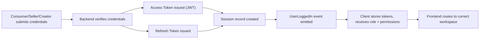
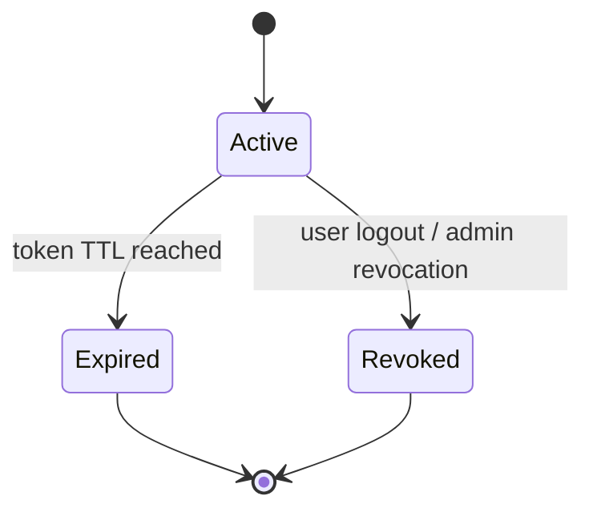

# Choosify Implementation Specification

**Document ID:** IS-001
**Title:** Identity, Authentication & Session Implementation
**Version:** 1.0.0
**Status:** Draft
**Priority:** Critical

**Derived From:**

- BP-001 Vision & Constitution
- BP-002 User Ecosystem & Identity Model
- BP-003 Identity, Authentication & Verification Engine
- ES-001 Database Architecture
- ES-002 API Architecture
- ES-003 RBAC & Permission Matrix
- ES-004 Event Bus
- ES-006 Notification Matrix
- ES-008 Security Architecture

This is a documentation-only Implementation Specification. It does not redesign the platform, invent new business rules, simplify architecture, or replace any BP/ES decision. It translates the already-approved architecture into an executable plan. No production code, schema migration, or implementation is contained in this document.

---

## Table of Contents

1. [Purpose](#1-purpose)
2. [Scope](#2-scope)
3. [Dependencies](#3-dependencies)
4. [Module Responsibilities](#4-module-responsibilities)
5. [Files/Folders Affected](#5-filesfolders-affected)
6. [Database Changes](#6-database-changes)
7. [API Endpoints](#7-api-endpoints)
8. [Backend Implementation](#8-backend-implementation)
9. [Frontend Implementation](#9-frontend-implementation)
10. [Authentication Flow](#10-authentication-flow)
11. [Session Flow](#11-session-flow)
12. [JWT Lifecycle](#12-jwt-lifecycle)
13. [Refresh Tokens](#13-refresh-tokens)
14. [Password Reset](#14-password-reset)
15. [Email Verification](#15-email-verification)
16. [Role Assignment](#16-role-assignment)
17. [Workspace Switching](#17-workspace-switching)
18. [RBAC Integration](#18-rbac-integration)
19. [Event Bus Integration](#19-event-bus-integration)
20. [Notification Integration](#20-notification-integration)
21. [Audit Logging](#21-audit-logging)
22. [Security Considerations](#22-security-considerations)
23. [Testing Checklist](#23-testing-checklist)
24. [Acceptance Criteria](#24-acceptance-criteria)
25. [Rollback Strategy](#25-rollback-strategy)
26. [Future Enhancements](#26-future-enhancements)
27. [Revision History](#revision-history)

---

## 1. Purpose

This document defines the implementation plan for the Identity, Authentication & Session subsystem of the Choosify Commerce Operating System, as governed by BP-003.

It translates BP-003's registration, authentication, session, authorization, recovery, suspension, and identity-lifecycle rules — together with the technical conventions of ES-001 (database), ES-002 (API), ES-003 (RBAC), ES-004 (events), ES-006 (notifications), and ES-008 (security) — into a concrete, sequenced implementation plan for engineering teams.

No authenticated feature elsewhere in the platform may bypass this subsystem (BP-003 §1).

---

## 2. Scope

In scope:

- Consumer, Seller, and Creator registration workflows (BP-003 §5)
- Email/OTP verification and identity verification intake (BP-003 §5, §10)
- Authentication (login, logout) via JWT Access Token + Refresh Token (ES-002 §6, ES-008 §4)
- Session management and device/session records (BP-003 §13, ES-008 §6)
- Password reset and identity recovery (BP-003 §16)
- Role assignment at registration and role-based workspace routing (BP-002 §6, §13; ES-003 §4–§5)
- Staff invitation and delegated permission assignment (BP-003 §15; ES-003 §6, §18)
- Account suspension and account deletion state transitions (BP-003 §17, §19)
- RBAC enforcement wiring for identity-owned endpoints (ES-003)
- Event emission and notification triggers tied to identity actions (ES-004 §6, ES-006 §10)
- Audit logging for all identity-changing operations (BP-003 §20, ES-008 §20)

Out of scope (governed elsewhere, not duplicated here):

- Brand/Marketplace verification and approval workflow — BP-004, future IS
- Seller Workspace and Brand Studio features — BP-004, future IS
- Trust Score computation — BP-008, future IS
- MFA, Passkeys, OAuth, SSO — explicitly marked "Future" in BP-003 §16, §20 and ES-008 §4, §8; not implemented in this phase

---

## 3. Dependencies

This IS cannot be implemented ahead of, or in contradiction to:

| Document | Relevance |
|----------|-----------|
| BP-001 | Constitutional Articles 1, 2, 5, 7, 8, 10 (verified commerce, ownership, permission-based access, single source of truth, auditability, privacy) |
| BP-002 | User Ecosystem roles, workspace separation, staff accounts, account lifecycle |
| BP-003 | Authoritative source for this IS — registration, authentication, verification, session, suspension, deletion |
| ES-001 | `users`, `sessions`, `refresh_tokens`, `verification` tables live in the Identity Domain; UUID PK, `created_at`/`updated_at`/`deleted_at`, ownership convention |
| ES-002 | `/api/v1/` base URL, JWT bearer auth, standard request/response envelope, HTTP status codes, CRUD conventions |
| ES-003 | RBAC layers (Authentication → Role → Permission → Ownership → Business Rules → Execution → Audit), System Roles, Staff Roles |
| ES-004 | Identity Events: `UserRegistered`, `UserVerified`, `UserLoggedIn`, `UserLoggedOut`, `PasswordChanged`, `SessionExpired`, `RoleChanged`, `PermissionGranted`, `PermissionRevoked`, `AccountDeleted` |
| ES-006 | Authentication Notifications category (Account Created, Login Detected, Password Changed, Device Added, Suspicious Login, Password Reset, Email Verification, Phone Verification) |
| ES-008 | Password policy, session record fields, Device Trust states, MFA (future), Zero Trust security layers, audit logging fields |

---

## 4. Module Responsibilities

Per ES-001 §2 and ES-002 §4, Identity is a single owning domain. This IS assigns implementation responsibility as follows:

| Responsibility | Owner |
|-----------------|-------|
| User record, credentials, verification state | Identity module (backend) |
| Session and refresh token issuance/revocation | Identity module (backend) |
| Role assignment at registration | Identity module (backend), consuming ES-003 System Roles |
| Permission evaluation on every request | RBAC middleware (ES-003), invoked by every domain, not owned by Identity |
| Workspace routing after login | Frontend shell, driven by the role returned from Identity |
| Staff invitation/acceptance | Identity module (backend), permission set delegated per ES-003 §18 |
| Notification dispatch on identity events | Notification Engine (ES-006), triggered via Event Bus — Identity never sends notifications directly (ES-006 §2) |
| Audit trail for identity actions | Administration/Audit module, populated via emitted events + direct audit writes (ES-008 §20) |

---

## 5. Files/Folders Affected

This section maps the plan onto the existing admin repository structure. No files are created or modified by this document — this is a target map for the implementation phase.

**Backend (`server/`)**

- `server/auth/` — existing home for auth domain logic (`authErrors.ts`, `authProfile.ts`); extend with registration, verification, password-reset, and session-issuance logic per this plan
- `server/authRouter.ts` — existing identity API router; extend with endpoints listed in §7
- `server/middleware/auth.ts` — existing JWT verification middleware; aligns with ES-002 §6 bearer token contract
- `server/middleware/authorization.ts` — existing RBAC enforcement point; aligns with ES-003 §3/§16 evaluation pipeline
- `server/permissions/authorization.ts` — existing permission evaluation logic; extend to cover Identity domain permissions per ES-003 §7–§9
- `server/validation/auth/` — existing request validation folder for auth payloads; extend per ES-002 §17
- `server/db/` — Identity Domain tables (§6) belong here per ES-001 §2/§8
- `server/db/seedDevUsers.ts` — existing dev-only seed; out of scope for production identity flow, unaffected by this plan

**Frontend (`src/`)**

- `src/contexts/AuthContext.tsx` — existing session/identity context; extend to carry role, workspace, and session metadata per §11
- `src/contexts/RbacContext.tsx` — existing RBAC context; consumes permissions resolved by backend, never grants access independently (ES-003 §1, §22)
- `src/pages/LoginPage.tsx` — existing login screen; aligns with §10
- `src/lib/authLoginErrorMessage.ts` — existing error-mapping helper for login failures

New frontend/backend surfaces required by this plan (registration wizard steps, password-reset screens, staff-invitation screens, workspace switcher) are identified conceptually in this document; concrete file paths are determined at implementation time, not fixed here.

---

## 6. Database Changes

Per ES-001 §9 (Identity module), the following tables are in scope. Column-level DDL is explicitly out of scope for this document (schema migration is excluded per the task instructions) — this section states table responsibility and relationships only.

| Table | Owns | Key Relationships |
|-------|------|--------------------|
| `users` | Consumer, Seller, Creator, Administrator accounts | Referenced by `sessions`, `refresh_tokens`, `verification` via `user_id` |
| `roles` | System role definitions (ES-003 §4) | Referenced by `users` |
| `permissions` | `domain.action` permission catalog (ES-003 §7) | Referenced by role/permission assignment tables |
| `sessions` | Active authenticated sessions (BP-003 §13, ES-008 §6) | `user_id`, device, browser, IP, login time, expiration, revocation status |
| `refresh_tokens` | Refresh token records (§13 below) | `user_id`, issued/expiry/revocation state |
| `verification` | Identity/business verification submissions (BP-003 §10) | `user_id`, document references, review status |
| `devices` | Known device records (ES-001 §9, ES-008 §7 Device Trust) | `user_id` |

All tables follow ES-001 conventions: UUID primary keys (§5), `created_at`/`updated_at`/`deleted_at` (§6), `snake_case` naming (§4), and indexing on primary key, foreign keys, `created_at`, and `status` (§12). `users`, `sessions`, `refresh_tokens`, `verification`, and `devices` belong to the Identity Domain; cross-domain writes are prohibited (ES-001 §8).

Soft delete applies to `users` per ES-001 §11 ("Consumers" → Retention Policy; extends analogously to Sellers/Creators). `sessions` and `refresh_tokens` are revoked, not soft-deleted, since they are transient security state rather than business records.

Schema migration itself is out of scope for this document per ES-001 §15 (Migration Rules: Schema Change → Migration → Review → Approval → Deployment) and per this IS's own constraints.

---

## 7. API Endpoints

All endpoints follow ES-002 conventions: base path `/api/v1/`, plural resource nouns, standard JSON envelope (§9), standard HTTP status codes (§10), and JWT bearer authentication where noted (§6).

| Method | Endpoint | Purpose | Auth Required |
|--------|----------|---------|----------------|
| POST | `/api/v1/auth/register/consumer` | Consumer registration (BP-003 §5) | No |
| POST | `/api/v1/auth/register/seller` | Seller registration (BP-003 §5) | No |
| POST | `/api/v1/auth/register/creator` | Creator registration (BP-003 §5) | No |
| POST | `/api/v1/auth/verify-email` | Email/OTP verification | No (token-based) |
| POST | `/api/v1/auth/login` | Authenticate, issue access + refresh token (BP-003 §12) | No |
| POST | `/api/v1/auth/logout` | Revoke current session | Yes |
| POST | `/api/v1/auth/refresh` | Exchange refresh token for new access token (§13) | Refresh token |
| POST | `/api/v1/auth/password/forgot` | Initiate password reset (§14) | No |
| POST | `/api/v1/auth/password/reset` | Complete password reset (§14) | Reset token |
| GET | `/api/v1/auth/me` | Return current identity, role, permissions, active sessions | Yes |
| GET | `/api/v1/auth/sessions` | List active sessions for current user (BP-003 §13) | Yes |
| DELETE | `/api/v1/auth/sessions/{id}` | Revoke a specific session (BP-003 §13 future: Session Revocation) | Yes |
| POST | `/api/v1/auth/staff/invite` | Invite a Staff Member (BP-003 §15) | Yes (owner permission) |
| POST | `/api/v1/auth/staff/accept` | Accept staff invitation, complete role/permission assignment | Token-based |
| GET | `/api/v1/auth/workspaces` | List workspaces available to current identity (§17) | Yes |
| POST | `/api/v1/auth/workspaces/switch` | Switch Active Brand/Workspace context (BP-002 §11) | Yes |

Every write endpoint emits a domain event (§19) and generates an audit record (§21), per ES-002 BR-2.3/BR-2.4.

---

## 8. Backend Implementation

Implementation order, each step gated on the previous per ES-010 §13 Quality Gates:

1. **Data layer** — Identity Domain tables per §6, following ES-001 migration workflow (Schema Change → Migration → Review → Approval → Deployment).
2. **Registration services** — one service per identity type (Consumer, Seller, Creator), each implementing the corresponding workflow in BP-003 §5. Seller registration explicitly does not grant Marketplace Access (BP-003 §6, BR-3.1) — that remains BP-004 scope.
3. **Authentication service** — credential verification, JWT issuance, refresh token issuance, following ES-002 §6 and ES-008 §4–§5.
4. **Session service** — session record creation/lookup/revocation per BP-003 §13 and ES-008 §6.
5. **Verification intake service** — accepts identity verification documents per BP-003 §10; routes to administrative review (approval/rejection itself is BP-011 Administration scope, referenced not duplicated here).
6. **Recovery service** — password reset and identity recovery per BP-003 §16.
7. **Staff invitation service** — invite/accept/role-assignment/permission-assignment per BP-003 §15 and ES-003 §6/§18.
8. **RBAC wiring** — every new endpoint passes through the ES-003 §16 evaluation pipeline (Authentication → Role → Permission → Ownership → Business Rule → Execution → Audit) via existing `server/middleware/authorization.ts` and `server/permissions/authorization.ts`.
9. **Event emission** — wire each service action to the events in §19.
10. **Audit logging** — wire each state-changing action to the audit fields in §21.

Authentication verifies identity only; it never grants permissions (BP-003 §12, ES-008 §4). Authorization is evaluated separately on every request (BR-3.7).

---

## 9. Frontend Implementation

- **Registration flows** — one wizard per identity type reflecting BP-003 §5 field sets (Consumer: name/email-or-mobile/password/country/terms; Seller: business name/owner name/email/mobile/password/category/address/trade license/NID-passport/website; Creator: name/email/password/profile/social links/portfolio). Wizard UX follows ES-007 §13 (Wizards) conventions already established for the platform.
- **Login/session** — extends `src/contexts/AuthContext.tsx` to hold identity, role, active workspace, and session metadata; extends `src/pages/LoginPage.tsx` and `src/lib/authLoginErrorMessage.ts` for error states per ES-007 §20.
- **RBAC-aware rendering** — `src/contexts/RbacContext.tsx` consumes the permission set returned by `/api/v1/auth/me`; frontend permission checks remain informational only and never substitute for backend authorization (ES-003 §22, BR-3.3).
- **Password reset / email verification screens** — follow ES-007 form and loading/empty/error state standards (§10, §18–§20).
- **Staff invitation UI** — available inside Seller/Creator/Administration workspaces per BP-003 §15; staff never see options to claim ownership (BR-3.6 / ES-003 BR-3.7).
- **Workspace switcher** — implements §17 below, following BP-002 §11 Active Brand Context and BP-002 §12 Workspace Separation.

---

## 10. Authentication Flow

Derived from BP-003 §12 and ES-002 §6/§7:

Authentication determines identity only; every subsequent request is independently authorized per the ES-003 §16 pipeline.

---

## 11. Session Flow

Per BP-003 §13 and ES-008 §6, every session records: Session ID, User, Device, Browser, IP Address, Country, Login Time, Expiration, Revocation Status.

Users may terminate their own active sessions; administrators may revoke any session (BP-003 §13). Session expiration emits `SessionExpired` (ES-004 §6).

---

## 12. JWT Lifecycle

Per ES-002 §6 and ES-008 §4:

- Access tokens are short-lived JWTs sent as `Authorization: Bearer <access_token>` on every authenticated request.
- Access tokens verify identity only; they carry no implicit permission grant (BP-003 §12).
- Expired access tokens are rejected with `401 Unauthorized` (ES-002 §10); the client uses the refresh token to obtain a new one (§13).
- JWT secrets are managed per ES-008 §15 (Secrets Management) and never committed to source control (BR-8.5).

---

## 13. Refresh Tokens

Per ES-002 §6 (Refresh Token supported) and BP-003 §13:

- Refresh tokens are issued alongside the access token at login and stored server-side (`refresh_tokens` table, §6) so they can be revoked.
- `POST /api/v1/auth/refresh` exchanges a valid, non-revoked refresh token for a new access token.
- Refresh tokens are revoked on logout, password change, and administrative session revocation.
- Refresh token issuance/consumption follows the idempotency and auditability requirements of ES-002 BR-2.3/BR-2.4 and ES-008 BR-8.6.

---

## 14. Password Reset

Per BP-003 §16 (Identity Recovery) and ES-006 §10 (Authentication Notifications):

Passwords are never stored in plaintext and are hashed using approved algorithms (ES-008 §5). A successful reset revokes existing sessions and refresh tokens as a security precaution and triggers the `PasswordChanged` event (ES-004 §6) and the corresponding "Password Reset" / "Password Changed" notifications (ES-006 §10).

---

## 15. Email Verification

Per BP-003 §5 (Registration Workflows):

- Consumer and Creator registration require Email/OTP verification before the account is fully active (BP-003 §22 Identity State Machine: `Registered → Verified`).
- Seller registration requires Identity Verification before the Seller Workspace becomes active (BP-003 §22 Seller state machine: `Registered → Verified → Workspace Active`).
- Verification success emits `UserVerified` (ES-004 §6) and triggers the "Email Verification" notification (ES-006 §10).
- Unverified accounts cannot progress to Marketplace Access regardless of any other state (BP-003 BR-3.1).

---

## 16. Role Assignment

Per BP-002 §4 (Core User Ecosystem) and ES-003 §4 (System Roles):

- Role is assigned at registration based on the workflow used (`/auth/register/consumer`, `/auth/register/seller`, `/auth/register/creator`); Administrator/Super Administrator roles are never self-registered and are assigned only through authorized administrative provisioning (BP-002 §7, out of scope here).
- Role assignment changes emit `RoleChanged` (ES-004 §6) and require an audit record (§21).
- A role determines workspace access only; it does not itself grant fine-grained permissions — those are evaluated per-request through RBAC (§18).

---

## 17. Workspace Switching

Per BP-002 §11 (Active Brand Context) and BP-002 §12 (Workspace Separation):

- `GET /api/v1/auth/workspaces` returns the workspaces available to the authenticated identity (e.g., a Seller Account's multiple Brands).
- `POST /api/v1/auth/workspaces/switch` changes the Active Brand/workspace context without requiring re-authentication (BP-002 §11: "Switching Active Brand does not require logging out").
- Cross-workspace access outside what the identity owns is prohibited unless explicitly authorized (ES-003 §5).

---

## 18. RBAC Integration

Per ES-003, every Identity endpoint in §7 passes through the same evaluation pipeline used platform-wide:

Identity-domain permissions follow the `domain.action` convention (ES-003 §7), e.g. `identity.session.revoke`, `identity.staff.invite`. Staff invited under this subsystem receive delegated permissions only and never inherit ownership (ES-003 BR-3.7). Frontend permission checks (`RbacContext`) are informational only; backend authorization is authoritative (ES-003 BR-3.3/BR-3.4).

---

## 19. Event Bus Integration

Per ES-004 §6 (Identity Events), this subsystem emits:

- `UserRegistered` — on successful registration (any identity type)
- `UserVerified` — on successful email/OTP or identity verification
- `UserLoggedIn` — on successful authentication
- `UserLoggedOut` — on logout / session revocation
- `PasswordChanged` — on successful password reset or change
- `SessionExpired` — on natural session expiry
- `RoleChanged` — on role assignment change
- `PermissionGranted` / `PermissionRevoked` — on staff permission delegation changes
- `AccountDeleted` — on completion of account deletion (§25 Rollback Strategy is not related; see BP-003 §19)

Every event carries the standard metadata defined in ES-004 §18 (Event ID, Event Name, Timestamp, Producer, Domain, Aggregate ID, Actor, Correlation ID, Payload, Version). Identity never calls other domains directly — Finance, Trust, Messaging, Notifications, and Analytics subscribe independently (ES-004 §2).

---

## 20. Notification Integration

Per ES-006 §10 (Authentication Notifications) and §2 (Notification Philosophy — business modules never deliver notifications directly):

| Trigger | Notification | Priority |
|---------|---------------|----------|
| Registration complete | Account Created | High |
| Login from new context | Login Detected | High |
| Password changed | Password Changed | Critical |
| New device recognized | Device Added | High |
| Suspicious login pattern | Suspicious Login | Critical |
| Password reset requested/completed | Password Reset | Critical |
| Email verification sent/completed | Email Verification | High |
| Phone verification sent/completed | Phone Verification | High |

Identity emits the events in §19; the Notification Engine (ES-006) resolves recipients, applies preferences, and delivers through the appropriate channel. Critical security notifications (Password Changed, Suspicious Login) cannot be disabled by user preference (ES-006 BR-6.4).

---

## 21. Audit Logging

Per BP-003 §20 (Security Principles), BR-3.10 ("Identity records must remain fully auditable"), and ES-008 §20:

Every identity-changing action records: Actor, Timestamp, Action, Entity, Old Value, New Value, IP Address, Device, Correlation ID. Audit logs are immutable (ES-008 §20, BR-8.6).

Minimum audited actions for this subsystem: registration, verification decisions, login, logout, session revocation, password change/reset, role changes, staff invite/accept, permission grants/revocations, account suspension, account deletion.

---

## 22. Security Considerations

Per ES-008:

- Zero Trust: every request is independently verified and authorized (§2); no session or device is trusted by default.
- Passwords: minimum length, uppercase, lowercase, numbers, special characters; hashed with an approved algorithm, never stored in plaintext (§5).
- Sessions: full session metadata recorded (§6); user- and admin-initiated revocation supported.
- Device Trust: Known Devices resolve to Trusted / Remembered / Verification Required / Blocked (§7); this subsystem must record device fingerprint data to support that state machine, though enforcement policy is configured centrally.
- MFA, Passkeys, OAuth, SSO, Risk-Based Authentication are explicitly Future scope in BP-003 §16/§20 and ES-008 §4/§8/§34 — not implemented in this phase, but session/device data captured now should not preclude adding them later.
- Rate limiting applies to authentication endpoints per ES-002 §21 and ES-008 §11 (by IP, User, Role, Endpoint).
- Input validation occurs before business logic on every endpoint (ES-002 §17, ES-008 §12).
- Output responses never expose internal IDs, secrets, stack traces, or internal configuration (ES-008 §13).

---

## 23. Testing Checklist

- [ ] Consumer, Seller, and Creator registration each follow their BP-003 §5 workflow and produce the correct initial state (BP-003 §22)
- [ ] Seller registration never auto-enables Marketplace Access (BR-3.1)
- [ ] Login issues a valid access token and refresh token, and creates a session record with full metadata (§11)
- [ ] Expired access token is rejected; refresh flow issues a new valid access token (§12–§13)
- [ ] Logout and admin-initiated revocation invalidate the session and refresh token
- [ ] Password reset revokes existing sessions and requires re-authentication
- [ ] Unverified accounts cannot access identity-gated resources
- [ ] Role assignment at registration matches the workflow used; no self-assignment of Administrator roles
- [ ] Staff invitation issues only delegated permissions; staff cannot claim ownership (BR-3.6)
- [ ] Workspace switch changes Active Brand context without requiring re-login (BP-002 §11)
- [ ] Every endpoint in §7 rejects requests that fail any stage of the ES-003 §16 pipeline
- [ ] Every write action in this subsystem emits the correct event from §19 with complete metadata
- [ ] Every write action in this subsystem produces an immutable audit record per §21
- [ ] Notifications in §20 are triggered via events, never called directly from Identity code
- [ ] Rate limiting is enforced on login, registration, and password-reset endpoints
- [ ] No endpoint response exposes internal IDs, secrets, or stack traces

---

## 24. Acceptance Criteria

This IS is considered complete when:

- All endpoints in §7 are implemented and pass the RBAC pipeline (§18)
- Registration, authentication, session, refresh, and recovery flows match BP-003 exactly, with no deviation from its states or business rules (BR-3.1–BR-3.10)
- All Identity Events in ES-004 §6 relevant to this subsystem are emitted with correct metadata
- All Authentication Notifications in ES-006 §10 are triggered via the Event Bus, never directly
- All state-changing actions are audited per ES-008 §20
- Security requirements in §22 are verifiably met
- The testing checklist in §23 passes in full
- No BP or ES document required modification to complete this implementation

---

## 25. Rollback Strategy

- Each implementation step in §8 is deployed independently and behind standard release gates (ES-010 §11 Continuous Delivery), allowing rollback to the prior deployed version without data loss.
- Database changes follow the ES-001 §15 migration workflow; every migration is paired with a tested down-migration before Production deployment (ES-010 §14).
- Session and refresh token issuance can be disabled via feature flag (ES-010 §15) to fall back to the prior authentication mechanism without a code rollback, if a prior mechanism exists in the target environment.
- Because Identity is upstream of every other domain (§4), rollback of this subsystem must be validated against Seller Workspace, Commerce, and Messaging login-dependent flows before being executed in Production.
- Audit logs and emitted events are never rolled back or deleted, preserving traceability across any rollback event (ES-008 BR-8.6).

---

## 26. Future Enhancements

Explicitly deferred, per BP-003 §16/§20 and ES-008 §4/§8/§34 (not implemented in this IS):

- Multi-Factor Authentication (Authenticator Apps, Email OTP, SMS OTP, Hardware Keys, Recovery Codes)
- Passkeys
- OAuth / Enterprise SSO
- Mobile and Social Login
- Active Device Management and Trusted Devices UI
- Risk-Based Authentication and Device Reputation
- Biometric Authentication

These remain future scope; this IS's session and device data model is designed not to require rework when they are introduced.

---

## Revision History

| Version | Date | Description |
|----------|------|-------------|
| 1.0.0 | August 2026 | Initial Identity, Authentication & Session Implementation Specification |
