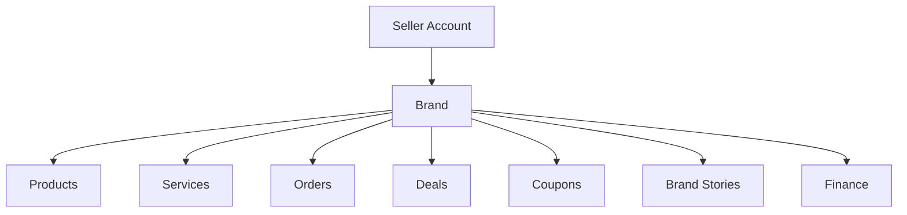
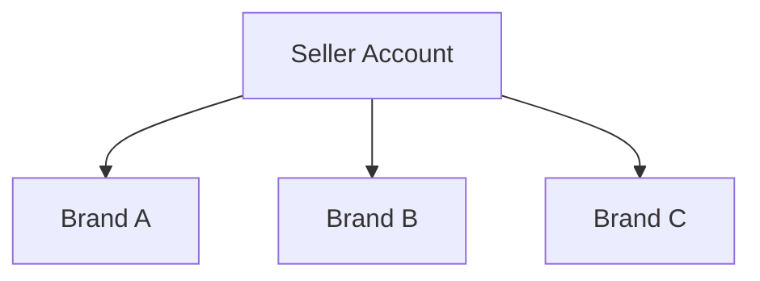
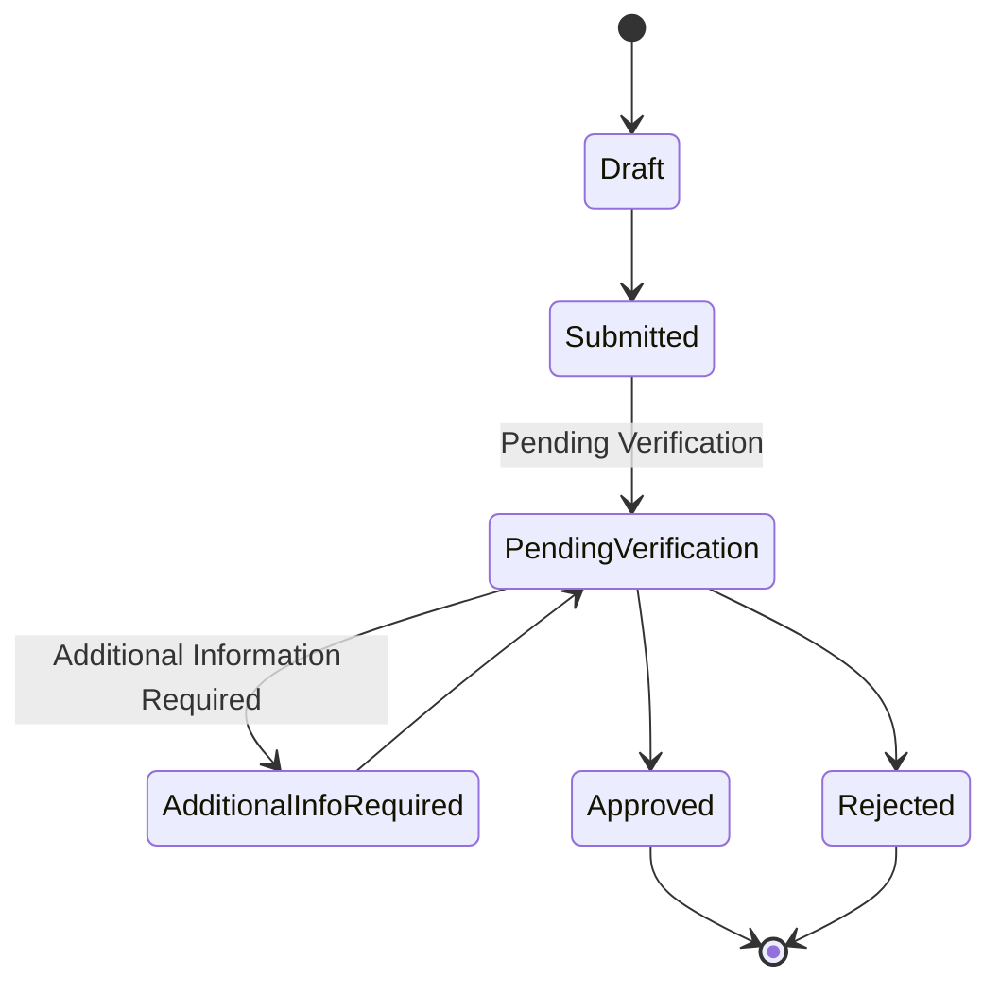
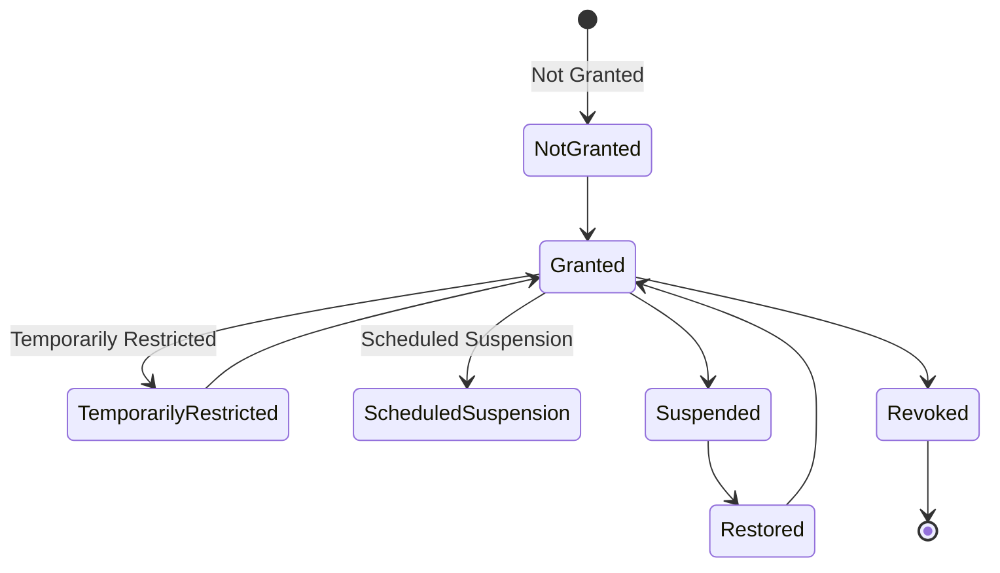
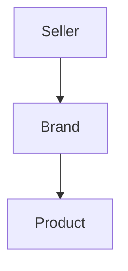

# Choosify Implementation Specification

**Document ID:** IS-002
**Title:** Seller Workspace & Brand Ownership Implementation
**Version:** 1.0.0
**Status:** Draft
**Priority:** Critical

**Derived From:**

- BP-001 Vision & Constitution
- BP-002 User Ecosystem & Identity Model
- BP-003 Identity, Authentication & Verification Engine
- BP-004 Seller Workspace & Brand Architecture
- BP-005 Product & Service Engine
- BP-007 Communication, Messaging & Customer Engagement Engine
- BP-008 Trust, Reputation, Moderation & Governance Engine
- BP-009 Finance, Escrow & Accounting Engine
- ES-001 Database Architecture
- ES-002 API Architecture
- ES-003 RBAC & Permission Matrix
- ES-004 Event Bus
- ES-005 Workflow State Machines
- ES-006 Notification Matrix
- ES-008 Security Architecture

This is a documentation-only Implementation Specification. It does not redesign the platform, invent new business rules, simplify architecture, or replace any BP/ES decision. No production code, schema migration, or implementation is contained in this document.

---

## Table of Contents

1. [Purpose](#1-purpose)
2. [Scope](#2-scope)
3. [Dependencies](#3-dependencies)
4. [Seller Account Architecture](#4-seller-account-architecture)
5. [Multi-Brand Ownership](#5-multi-brand-ownership)
6. [Brand Creation Wizard](#6-brand-creation-wizard)
7. [Marketplace Access](#7-marketplace-access)
8. [Brand Verification Workflow](#8-brand-verification-workflow)
9. [Brand Switching](#9-brand-switching)
10. [Staff & Moderators](#10-staff--moderators)
11. [Seller Dashboard](#11-seller-dashboard)
12. [Brand Studio](#12-brand-studio)
13. [Products & Inventory Relationship](#13-products--inventory-relationship)
14. [Service Relationship](#14-service-relationship)
15. [Analytics Integration](#15-analytics-integration)
16. [Trust Score Integration](#16-trust-score-integration)
17. [Finance Integration](#17-finance-integration)
18. [Cashbook Integration](#18-cashbook-integration)
19. [Messaging Integration](#19-messaging-integration)
20. [Event Bus Integration](#20-event-bus-integration)
21. [RBAC Requirements](#21-rbac-requirements)
22. [API Endpoints](#22-api-endpoints)
23. [Database Dependencies](#23-database-dependencies)
24. [Backend Services](#24-backend-services)
25. [Frontend Components](#25-frontend-components)
26. [Notification Requirements](#26-notification-requirements)
27. [Audit Logging](#27-audit-logging)
28. [Acceptance Criteria](#28-acceptance-criteria)
29. [Rollback Strategy](#29-rollback-strategy)
30. [Future Extensions](#30-future-extensions)
31. [Revision History](#revision-history)

---

## 1. Purpose

This document defines the implementation plan for the Seller Workspace and Brand Ownership subsystem of the Choosify Commerce Operating System, as governed by BP-004.

It translates BP-004's Seller Account model, Multi-Brand architecture, Brand Creation, Marketplace Access, Brand Verification, Staff Management, and Brand Studio rules — together with ES-001 through ES-006 and ES-008 technical conventions — into a concrete, sequenced implementation plan.

The Seller Workspace is the operational headquarters of every verified business; it is a Business Operating System, not an admin dashboard (BP-004 §3).

---

## 2. Scope

In scope:

- Seller Account model and its relationship to Brand entities (BP-004 §4)
- Multi-Brand ownership and Active Brand context (BP-004 §5–§6)
- First-time Seller experience and Brand Creation Wizard (BP-004 §7–§8)
- Brand Management Studio responsibilities (BP-004 §9)
- Marketplace Access state and its independence from editing permissions (BP-004 §10–§11)
- Brand ownership rules and Brand Staff delegation (BP-004 §12–§13)
- Brand Verification and Marketplace Lifecycle (BP-004 §14–§15)
- Brand Claim process for existing/community profiles (BP-004 §16)
- Brand Profile composition (BP-004 §17)
- Workspace navigation scope (BP-004 §21)
- Integration points into Products/Inventory (BP-005), Trust (BP-008), Finance/Cashbook (BP-009), and Messaging (BP-007), to the extent each is triggered by Seller/Brand actions

Out of scope (governed elsewhere, referenced not duplicated):

- Product/Service creation and lifecycle mechanics — BP-005, future IS
- Trust Score computation formulas — BP-008, future IS
- Escrow, payout, and cashbook internals — BP-009, future IS
- Brand Stories and Live Commerce content mechanics — BP-004 §18–§19, BP-010, future IS
- Deals & Promotions mechanics — BP-004 §20, future IS
- Administrative moderation/marketplace-approval decisioning UI — BP-011, future IS
- Identity registration and authentication mechanics — already specified in IS-001

---

## 3. Dependencies

| Document | Relevance |
|----------|-----------|
| BP-001 | Constitutional Articles 2 (Business Ownership), 6 (Marketplace Visibility), 7 (Single Source of Truth), 9 (Platform Neutrality) |
| BP-002 | Seller identity type, Multi-Brand Ownership (§10), Active Brand Context (§11), Workspace Separation (§12) |
| BP-003 | Seller registration produces the Seller Account this subsystem builds on (BP-003 §5, §22); Marketplace Approval is independent of registration (BR-3.1) |
| BP-004 | Authoritative source for this IS |
| BP-005 | Product Ownership chain `Seller → Brand → Product` (§10); Marketplace Visibility gating of listings (§22) |
| BP-007 | Every Order automatically creates a Conversation (§9); Brand Stories labelled `Brand Content` (BR-7.8) |
| BP-008 | Brand Trust considers Seller Trust, reviews, returns, compliance (§9) |
| BP-009 | Seller Balance, Cashbook is private to the Seller (§7, §14, BR-9.6) |
| ES-001 | `brands`, `brand_claims`, `marketplace_access`, `brand_staff` tables in the Marketplace Domain (§9); Ownership Convention `Product.brand_id`, `Brand.seller_id` (§7) |
| ES-002 | `/api/v1/` conventions, standard envelope, CRUD conventions |
| ES-003 | Seller Permissions (§12), Staff Roles (§6), Delegated Permissions pattern (§18), Ownership Rules `Brand → Seller`, `Product → Brand` (§10) |
| ES-004 | Marketplace Events: `BrandCreated`, `BrandUpdated`, `BrandClaimSubmitted`, `BrandClaimApproved`, `BrandClaimRejected`, `MarketplaceEnabled`, `MarketplaceSuspended`, `MarketplaceRestored`, `MarketplaceDisabled` (§7) |
| ES-005 | Brand Creation Lifecycle (§6), Multiple Brand Lifecycle (§7), Marketplace Access State Machine (§8), Marketplace Access vs Ownership (§9), Marketplace Suspension Behaviour (§10), Active Order Suspension Guard (§11), Ownership Claim Lifecycle (§12), Claim Rejection Rule (§13) |
| ES-006 | Marketplace Notifications category (§11) |
| ES-008 | Audit logging fields (§20), file security for verification document uploads (§16) |

---

## 4. Seller Account Architecture

Per BP-004 §4: a Seller Account represents the legal owner; a Brand represents the commercial identity. Ownership always flows downward — Brand ownership never flows upward.

Implementation responsibility: the Seller Account record is created during Seller registration (IS-001, BP-003 §5) and is not re-created here. This subsystem is responsible for everything that hangs beneath it — Brand entities and their operational surfaces.

---

## 5. Multi-Brand Ownership

Per BP-004 §5 and ES-005 §7: a single Seller Account may own one Brand, several Brands, or an unlimited number of Brands, with no architectural ceiling. Each Brand maintains an independent Verification State, Marketplace State, Trust Score, Product Portfolio, Service Portfolio, Order Portfolio, Moderation State, and Suspension State.

A problem affecting Brand A must not automatically suspend Brand B unless the Seller Account itself is subject to platform-level enforcement (ES-005 §7). This IS must implement Brand-level isolation of state so that enforcement actions never cascade across Brands implicitly.

---

## 6. Brand Creation Wizard

Per BP-004 §7–§8: immediately after Seller registration, the workspace is completely empty — no demo, mock, or seeded Brands, and no automatic Brand creation (BR-4.5).

Wizard steps:

1. **Business Information** — Brand Name, Category, Business Description, Contact Details
2. **Brand Identity** — Logo, Cover Image, Brand Colors, Brand Story, Social Links, Website
3. **Verification** — Trade License, NID/Passport, Supporting Documents

Brand creation must never automatically grant Marketplace Access (ES-005 §6, BR-4.5). On submit, the workspace becomes "Workspace Ready — Marketplace Disabled" (BP-004 §8).

---

## 7. Marketplace Access

Per BP-004 §10–§11 and ES-005 §8–§10: Marketplace Access determines public visibility only; it never determines editing permissions (BR-4.4).

When suspended, the Brand is hidden from Search, Categories, Homepage, Brand Directory, Product/Service Listings, Deals, and Recommendations — but the Seller continues to access Brand Studio, Products, Orders, Finance, Messaging, and Inventory (BP-004 §11). Before suspension, an Active Order Suspension Guard checks for active Orders/Bookings and warns administrators without necessarily blocking suspension (ES-005 §11) — the enforcement decision itself belongs to BP-011 Administration and is out of scope here; this IS is responsible for exposing the active-commitment check as a queryable signal.

---

## 8. Brand Verification Workflow

Per BP-004 §14–§15:

Marketplace Statuses: Draft, Pending Verification, Under Review, Marketplace Enabled, Marketplace Suspended, Marketplace Disabled, Banned. Every status change is fully auditable (BP-004 §15, §27 below). Rejected applications return to Draft; additional documentation may be requested.

Brand ownership is verified before marketplace publication (BR-4.6); Brand Verification and Marketplace Review remain independent processes where necessary (BP-003 §8).

---

## 9. Brand Switching

Per BP-004 §6 (Active Brand Context) and BP-002 §11: when a Seller owns multiple Brands, the workspace maintains an Active Brand that scopes Brand Studio, Products, Inventory, Reviews, Deals, Coupons, Orders, Messaging, Analytics, and Finance. Changing Active Brand never requires logging out.

Implementation requirement: Active Brand context must be resolvable per-request (e.g., from a session/workspace-context header or claim) so that every domain service downstream (Catalog, Commerce, Finance, Messaging) can scope its queries without re-deriving ownership independently.

---

## 10. Staff & Moderators

Per BP-004 §13 and ES-003 §6/§18: each Brand may invite staff — Inventory Manager, Marketing Manager, Customer Support, Finance Officer, Brand Manager, Content Manager, Order Manager. Staff receive configurable, delegated permissions and never become Brand owners (BR-4.7).

| Staff Role (example) | May | Cannot |
|------------------------|-----|--------|
| Inventory Staff | Inventory, Products | Finance, Cashbook, Payouts |
| Marketing Staff | Deals, Stories, Coupons | Orders, Finance, Verification |

"Moderators" in this subsystem's context are platform Moderation Administrators (BP-011 scope) acting on Brand verification/enforcement — they are not Brand-level staff and are not owned by this IS; this IS only exposes the data (verification submissions, marketplace status, flags) that moderation acts upon.

---

## 11. Seller Dashboard

Per BP-004 §21 (Workspace Navigation): the Seller Workspace exposes Dashboard, Brand Management Studio, Products & Inventory, Orders, Returns, Logistics, Reviews, Messaging, Notifications, Finance, My Cashbook, Coupons, Promotions, Brand Stories, and Settings, scoped to the Active Brand where applicable.

The Dashboard aggregates, per Active Brand: Marketplace Status, recent Orders, Inventory alerts, pending Reviews, Messaging activity, and Finance summary. It composes data already owned by other domains (Commerce, Trust, Finance, Messaging) rather than owning any of it itself — this subsystem is a read aggregation surface plus Brand/Workspace-management writes.

---

## 12. Brand Studio

Per BP-004 §9: Brand Management Studio is the CMS for one Brand and controls Brand Identity, Media, About, Contact, FAQ, Store Locations, Social Links, Business Hours, Awards, Certifications, Brand Story, Marketplace Configuration, Reviews (surface, not moderation), and Analytics (surface). Everything visible on the public Brand Profile (BP-004 §17: Logo, Cover, Description, Contact, Website, Social Links, Store Locations, Products, Services, Reviews, Ratings, Brand Stories, Live Commerce, Deals, Trust Score, Marketplace Status, Verification Badge) originates from Brand Studio writes plus read-through composition from Catalog, Trust, and Content domains.

---

## 13. Products & Inventory Relationship

Per BP-005 §10 and ES-003 §10: every Product belongs to exactly one Brand (`Product.brand_id`); a Product cannot exist without a Brand.

This subsystem owns the Brand side of this relationship only. Product creation, inventory management, and product lifecycle mechanics are BP-005/Catalog domain responsibility (ES-001 §8: Catalog owns Products/Inventory/Categories) and are out of scope for this IS beyond validating that a Product's `brand_id` resolves to a Brand owned by the acting Seller (ownership check, ES-003 §10/§16).

---

## 14. Service Relationship

Per BP-005 §5/§9: Service listings follow the same Brand-ownership chain as Products (`Service.brand_id`). This subsystem's responsibility mirrors §13 — validating Brand ownership on Service-referencing requests — while Service creation/booking mechanics remain BP-005/BP-006 scope.

---

## 15. Analytics Integration

Per BP-004 §9/§21 (Analytics appears in Brand Studio and Workspace Navigation) and ES-001 §9 (Analytics domain owns Events/Metrics/Reports): this subsystem does not own analytics computation. It is responsible for:

- Scoping analytics queries to the Active Brand (§9)
- Ensuring Brand-level events relevant to analytics (creation, verification, marketplace status changes) are emitted on the Event Bus (§20) so the Analytics domain can consume them independently, per the Event Bus's decoupled-consumer model (ES-004 §2)

---

## 16. Trust Score Integration

Per BP-008 §9 (Brand Trust) and BP-004 §17 (Trust Score appears on Brand Profile): Brand Trust considers Seller Trust, Product/Service Reviews, Returns, Complaints, Marketplace Compliance, and Customer Satisfaction — computed and owned entirely by the Trust domain (BP-008, ES-001 §9: Trust owns Reviews/Scores/Reports).

This subsystem's responsibility is limited to:

- Surfacing the current Trust Score on Brand Profile reads (read-through, not computed here)
- Emitting the Marketplace/Brand events (§20) that the Trust domain subscribes to when computing Brand Trust (e.g., `BrandCreated`, `BrandClaimApproved`, `MarketplaceSuspended`)

---

## 17. Finance Integration

Per BP-009 §7 (Seller Balance) and BP-004 §4 (Brand → Finance): Finance records (Available Funds, Pending Settlement, Escrow Balance, Refund Reserve, Withdrawable Balance) are owned entirely by the Finance domain (ES-001 §9: Finance owns Transactions/Cashbook/Invoices).

This subsystem's responsibility is limited to exposing Brand/Seller identity to Finance for scoping (Finance queries are always scoped by `seller_id`/`brand_id` resolved here) and ensuring Marketplace Suspension does not interrupt Finance access (BP-004 §11: "Seller continues accessing... Finance").

---

## 18. Cashbook Integration

Per BP-009 §14 (My Cashbook) and BR-9.6 ("Cashbook is private to each Seller"): Cashbook is Seller-owned private accounting data, entirely independent of marketplace accounting, and is not owned by this subsystem. This IS is responsible only for ensuring "My Cashbook" remains reachable from Workspace Navigation (BP-004 §21) regardless of Marketplace Access state (BP-004 §11).

---

## 19. Messaging Integration

Per BP-007 §9 (Order Conversations) and BR-7.8 (Brand Stories labelled Brand Content): Messaging/Conversation mechanics are owned by the Communication Engine (BP-007), not this subsystem. This IS's responsibility:

- Ensure Brand context (Active Brand) is available to Messaging so Order Conversations and product inquiries route to the correct Brand's inbox (BP-004 §6: Messaging is part of Active Brand context)
- Ensure Marketplace Suspension does not remove access to existing Conversations (BP-004 §11)

---

## 20. Event Bus Integration

Per ES-004 §7 (Marketplace Events), this subsystem emits:

- `BrandCreated` — on successful Brand creation (§6)
- `BrandUpdated` — on Brand Studio edits (§12)
- `BrandClaimSubmitted` — on Brand Claim submission (BP-004 §16)
- `BrandClaimApproved` / `BrandClaimRejected` — on administrative claim decision (consumed from Administration domain, re-emitted or observed here per ownership boundary)
- `MarketplaceEnabled` — on Marketplace Access granted (§7)
- `MarketplaceSuspended` — on Marketplace Access suspended (§7)
- `MarketplaceRestored` — on Marketplace Access restored (§7)
- `MarketplaceDisabled` — on Marketplace Access revoked/disabled (§7)

Every event carries standard ES-004 §18 metadata (Event ID, Name, Timestamp, Producer, Domain, Aggregate ID, Actor, Correlation ID, Payload, Version). This subsystem does not call Trust, Analytics, Finance, or Notification services directly — those domains subscribe independently (ES-004 §2, §21).

---

## 21. RBAC Requirements

Per ES-003 §12 (Seller Permissions) and §10 (Ownership Rules: `Brand → Seller`, `Product → Brand`):

**Seller may:** Manage Brands, Manage Products, Manage Inventory, Manage Orders, Manage Staff, Manage Finance, Manage Deals, Manage Coupons, Manage Brand Stories, Manage Live Commerce, Reply Reviews, Manage Messages, Manage Cashbook.

**Seller cannot:** Edit Other Brands, View Other Sellers, Access Platform CMS, Modify Categories, Approve Marketplace.

Every Brand-scoped endpoint validates the full ES-003 §16 pipeline: Authentication → Role → Permission → Ownership (the requesting Seller/Staff must own or be delegated to the target Brand) → Business Rule → Execution → Audit. Staff permissions follow the `domain.action` convention (ES-003 §7), e.g. `brand.update`, `brand.staff.invite`, `marketplace.access.view`. Marketplace approval (`marketplace.access.approve`) belongs exclusively to Administrator roles (ES-003 §12: Seller cannot Approve Marketplace) and is out of scope for Seller-facing endpoints in this IS.

---

## 22. API Endpoints

All endpoints follow ES-002 conventions (`/api/v1/`, standard envelope, CRUD conventions, plural nouns).

| Method | Endpoint | Purpose | Auth |
|--------|----------|---------|------|
| GET | `/api/v1/brands` | List Brands owned by (or delegated to) current Seller | Yes |
| POST | `/api/v1/brands` | Create a new Brand (Wizard submit) | Yes |
| GET | `/api/v1/brands/{id}` | Retrieve Brand details (Brand Studio read) | Yes (ownership) |
| PATCH | `/api/v1/brands/{id}` | Update Brand Studio fields | Yes (ownership) |
| POST | `/api/v1/brands/{id}/verification` | Submit/resubmit verification documents | Yes (ownership) |
| GET | `/api/v1/brands/{id}/marketplace-access` | Read current Marketplace Access status | Yes (ownership) |
| POST | `/api/v1/brands/{id}/claim` | Submit a Brand Claim for an existing/community profile | Yes |
| GET | `/api/v1/brands/{id}/claim/status` | Read claim status | Yes (claimant) |
| POST | `/api/v1/brands/{id}/staff/invite` | Invite Brand staff | Yes (owner permission) |
| POST | `/api/v1/brands/staff/accept` | Accept staff invitation | Token-based |
| GET | `/api/v1/brands/{id}/staff` | List Brand staff and permissions | Yes (ownership) |
| PATCH | `/api/v1/brands/{id}/staff/{staffId}` | Update staff permissions | Yes (owner permission) |
| DELETE | `/api/v1/brands/{id}/staff/{staffId}` | Revoke staff access | Yes (owner permission) |
| GET | `/api/v1/seller/workspace/active-brand` | Read current Active Brand context | Yes |
| POST | `/api/v1/seller/workspace/active-brand` | Switch Active Brand (§9) | Yes |
| GET | `/api/v1/seller/dashboard` | Aggregated dashboard for Active Brand (§11) | Yes |

Marketplace approval/suspension decision endpoints belong to the Administration API surface (BP-011) and are intentionally not listed here — this subsystem exposes read access to Marketplace Access status, not the administrative decision itself.

---

## 23. Database Dependencies

Per ES-001 §9 (Marketplace module) and §7 (Ownership Convention):

| Table | Owns | Key Fields |
|-------|------|------------|
| `brands` | Brand identity/profile records | `id`, `seller_id` (owner, ES-001 §7), `slug` (UNIQUE, ES-001 §13), `marketplace_status` |
| `brand_claims` | Ownership Claim submissions (BP-004 §16, ES-005 §12) | `brand_id`, `claimant_user_id`, `status`, documents |
| `marketplace_access` | Marketplace Access state machine (§7) | `brand_id`, `status`, scheduled window fields (ES-005 §8) |
| `brand_staff` | Delegated staff assignments (§10) | `brand_id`, `user_id`, permission set |

All tables follow ES-001 conventions: UUID primary keys, `created_at`/`updated_at`/`deleted_at`, `snake_case` naming. `brands` uses Soft Delete per ES-001 §11. `marketplace_access` status transitions must be fully auditable (BP-004 §15) — audit trail is a separate concern (§27), not a table redesign.

Schema migration itself is out of scope for this document per ES-001 §15 and this IS's own constraints.

---

## 24. Backend Services

Implementation order, gated per ES-010 §13 Quality Gates:

1. **Brand service** — CRUD for Brand entities, enforcing `Product/Brand → Seller` ownership (ES-003 §10) and the Draft → Submitted → Pending Verification → Approved lifecycle (§6). Extends the existing `server/catalog/brandOwnership.ts` and `server/catalog/sellerWorkspace.ts` (already present in the admin repo) rather than introducing a parallel module, consistent with ES-001 §8 (single domain owner) and ES-010 §8 ("no duplicated logic").
2. **Marketplace Access service** — implements the state machine in §7, exposes read access, and raises the Active Order Suspension Guard signal (ES-005 §11) for Administration to act on.
3. **Brand Verification service** — intake of verification documents (§8), status transitions, resubmission handling.
4. **Brand Claim service** — implements §12/§13 of ES-005 (Ownership Claim Lifecycle, Claim Rejection Rule): a rejected claim must never leave ownership assigned to the rejected claimant.
5. **Staff service** — invite/accept/permission-management for Brand staff (§10), wired through `server/middleware/brandStudioAuth.ts` (existing) and ES-003 §18 delegated-permission rules.
6. **Active Brand context service** — resolves and persists the Seller's Active Brand selection (§9), consumed by Catalog, Commerce, Finance, and Messaging domains.
7. **Dashboard aggregation service** — read-only composition across Commerce, Trust, Finance, Messaging for the Seller Dashboard (§11); introduces no new ownership, only aggregated reads.
8. **RBAC wiring** — every endpoint in §22 passes through `server/middleware/authorization.ts` / `server/permissions/authorization.ts` (existing) per the ES-003 §16 pipeline.
9. **Event emission** — wire each service action to the events in §20.
10. **Audit logging** — wire each state-changing action to the fields in §27.

---

## 25. Frontend Components

- **Brand Creation Wizard** — implements the 3-step flow in §6, following ES-007 §13 (Wizards) conventions already used elsewhere in the admin app (e.g. `src/pages/admin/BrandEditStudio.tsx`, `src/pages/admin/BrandImageUploadField.tsx`, which already exist and should be extended rather than duplicated).
- **Brand Studio** — extends existing `src/pages/admin/BrandEditStudio.tsx`, `src/pages/admin/BrandDetails.tsx`, and `src/contexts/BrandProfilesContext.tsx` per §12.
- **Brand list / Brands Studio List** — extends existing `src/pages/admin/Brands.tsx` and `src/pages/admin/BrandsStudioList.tsx` to reflect Multi-Brand ownership (§5) and Marketplace Access status (§7).
- **Brand Verification screen** — extends existing `src/pages/admin/BrandVerification.tsx` per §8.
- **Active Brand switcher** — new workspace-chrome component consumed wherever Brand-scoped UI is rendered (Dashboard, Products, Orders, Messaging, Finance), implementing §9; must not require re-authentication.
- **Staff management UI** — invite/list/edit/revoke screens for Brand staff (§10), gated by `brandStudioAuth` middleware server-side and `RbacContext` client-side (informational only, per ES-003 BR-3.3).
- **Seller Dashboard** — aggregated view per §11, composing data from existing `src/contexts/InventoryContext.tsx`, `src/contexts/CashBookContext.tsx`, and Commerce/Trust/Messaging contexts without owning that state itself.

---

## 26. Notification Requirements

Per ES-006 §11 (Marketplace Notifications):

| Trigger | Notification |
|---------|---------------|
| Brand verification approved | Marketplace Approved |
| Marketplace Access suspended | Marketplace Suspended |
| Marketplace Access restored | Marketplace Restored |
| Brand ownership verified | Brand Verified |
| Ownership Claim approved | Ownership Claim Approved |
| Ownership Claim rejected | Ownership Claim Rejected |
| Additional verification documents requested | Additional Documents Required |

Notifications are triggered exclusively via the events emitted in §20 (ES-006 §2: business modules never deliver notifications directly); this subsystem never calls the Notification Engine directly.

---

## 27. Audit Logging

Per BP-004 §15 ("Status changes remain fully auditable") and ES-008 §20: every state-changing action in this subsystem records Actor, Timestamp, Action, Entity, Old Value, New Value, IP Address, Device, Correlation ID, and produces an immutable audit record.

Minimum audited actions: Brand creation, Brand Studio updates, verification submission/decision, Marketplace Access transitions (every state in §7), Brand Claim submission/decision, staff invite/accept/permission-change/revocation, Active Brand switch (lower-severity, still logged for traceability per BP-001 Article 8).

---

## 28. Acceptance Criteria

This IS is considered complete when:

- Brand Creation Wizard produces Brands in the exact lifecycle defined in §6/ES-005 §6, with no automatic Marketplace Access grant (BR-4.5)
- Multi-Brand ownership supports an unlimited number of Brands per Seller with fully isolated per-Brand state (§5)
- Marketplace Access transitions match the state machine in §7 exactly, and editing permissions remain unaffected by Marketplace Access state in every case (BR-4.4)
- Brand Verification and Brand Claim workflows match BP-004 §14/§16 and ES-005 §12/§13 exactly, including the Claim Rejection Rule
- Active Brand switching requires no re-authentication (§9)
- Staff delegation never grants ownership (BR-4.7) and is fully permission-scoped (ES-003 §18)
- All endpoints in §22 pass the ES-003 §16 RBAC pipeline including ownership validation
- All events in §20 are emitted with correct ES-004 §18 metadata
- All notifications in §26 are triggered via events only
- All actions in §27 produce immutable audit records
- No BP or ES document required modification to complete this implementation

---

## 29. Rollback Strategy

- Each backend service in §24 is deployed independently behind standard release gates (ES-010 §11), allowing rollback to the prior deployed version without data loss.
- Database changes follow the ES-001 §15 migration workflow; every migration is paired with a tested down-migration before Production deployment.
- Marketplace Access transitions are never destructive — suspension/restoration only toggles visibility (BP-004 §11), so rollback of this subsystem cannot orphan Products, Orders, or Finance records, which remain owned by their respective domains regardless of this subsystem's deployment state.
- Because Brand/Seller context is consumed by Catalog, Commerce, Finance, and Messaging (§9), rollback must be validated against those domains' Active-Brand-dependent flows before execution in Production.
- Audit logs and emitted events are never rolled back or deleted (ES-008 BR-8.6).

---

## 30. Future Extensions

Explicitly out of scope for this IS but anticipated by the source documents:

- Brand Stories and Live Commerce content mechanics (BP-004 §18–§19) — future IS
- Deals & Promotions mechanics (BP-004 §20) — future IS
- Administrative Brand Portfolio management and marketplace-approval UI (BP-011) — future IS
- Multi-region/franchise Brand structures (BP-012 §18 Future Expansion)
- Enterprise API access for Brand management (BP-012 §18)

---

## Revision History

| Version | Date | Description |
|----------|------|-------------|
| 1.0.0 | August 2026 | Initial Seller Workspace & Brand Ownership Implementation Specification |
