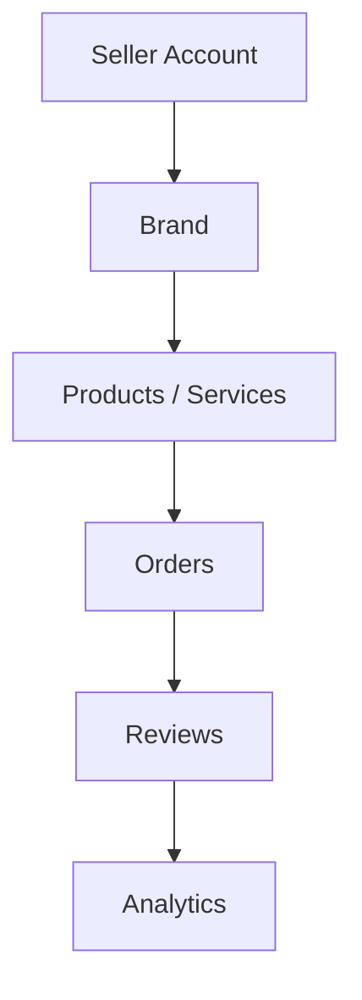
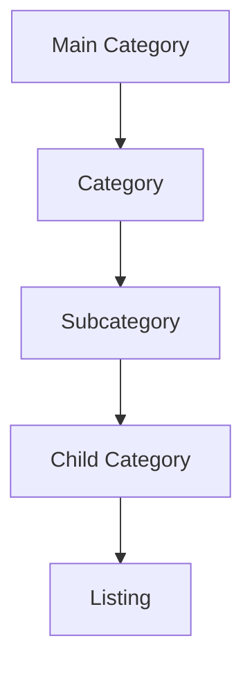
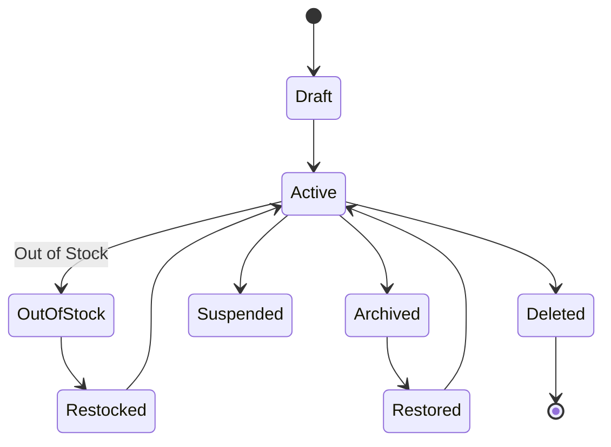
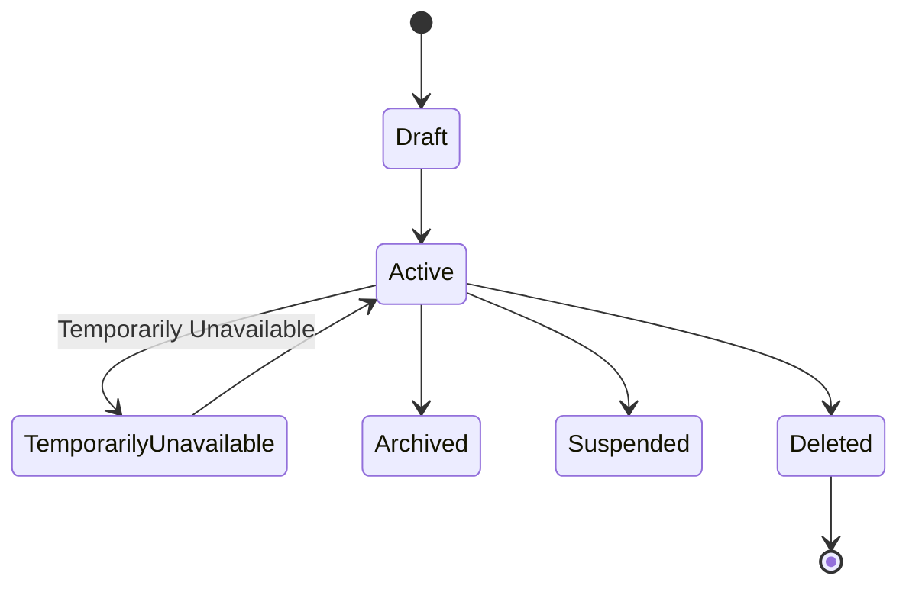
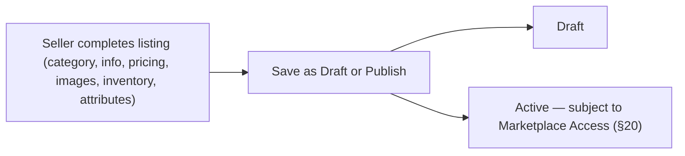
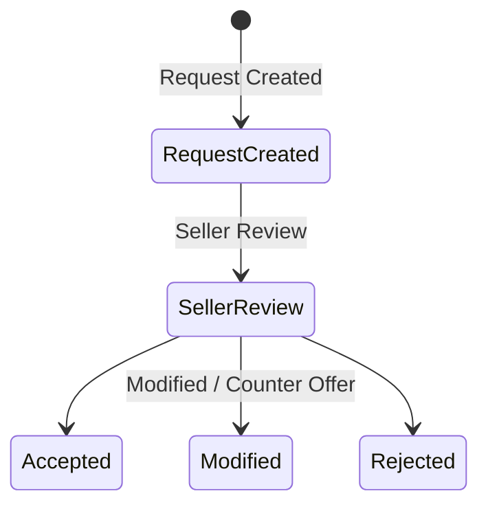
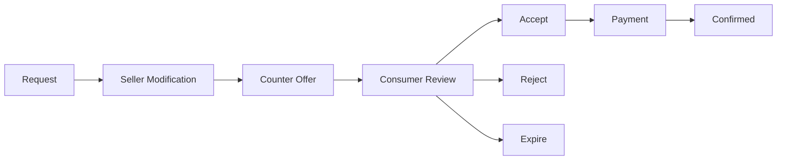

# Choosify Implementation Specification

**Document ID:** IS-003
**Title:** Product, Service & Inventory Engine Implementation
**Version:** 1.0.0
**Status:** Draft
**Priority:** Critical

**Derived From:**

- BP-001 Vision & Constitution
- BP-004 Seller Workspace & Brand Architecture
- BP-005 Product & Service Engine
- BP-006 Commerce Engine
- BP-007 Communication, Messaging & Customer Engagement Engine
- BP-008 Trust, Reputation, Moderation & Governance Engine
- BP-010 Content, Discovery & Engagement Engine
- ES-001 Database Architecture
- ES-002 API Architecture
- ES-003 RBAC & Permission Matrix
- ES-004 Event Bus
- ES-005 Workflow State Machines
- ES-006 Notification Matrix
- ES-008 Security Architecture
- ES-009 Performance, Scalability & Infrastructure Engineering

This is a documentation-only Implementation Specification. It does not redesign the platform, invent new business rules, simplify architecture, or replace any BP/ES decision. No production code or database migration is contained in this document.

---

## Table of Contents

1. [Purpose](#1-purpose)
2. [Scope](#2-scope)
3. [Dependencies](#3-dependencies)
4. [Product Architecture](#4-product-architecture)
5. [Service Architecture](#5-service-architecture)
6. [Category Hierarchy](#6-category-hierarchy)
7. [Branch Categories](#7-branch-categories)
8. [Subcategories](#8-subcategories)
9. [Dynamic Category Attributes](#9-dynamic-category-attributes)
10. [Dynamic Variant Engine](#10-dynamic-variant-engine)
11. [Product Attribute Engine](#11-product-attribute-engine)
12. [Service Attribute Engine](#12-service-attribute-engine)
13. [Inventory Architecture](#13-inventory-architecture)
14. [Warehouse Support (Future-Ready)](#14-warehouse-support-future-ready)
15. [Product Lifecycle](#15-product-lifecycle)
16. [Service Lifecycle](#16-service-lifecycle)
17. [Inventory Lifecycle](#17-inventory-lifecycle)
18. [Marketplace Visibility Rules](#18-marketplace-visibility-rules)
19. [Marketplace Suspension Behaviour](#19-marketplace-suspension-behaviour)
20. [Product Approval Rules](#20-product-approval-rules)
21. [Service Approval Rules](#21-service-approval-rules)
22. [Product Publishing Workflow](#22-product-publishing-workflow)
23. [Product Archive Workflow](#23-product-archive-workflow)
24. [Out-of-Stock Behaviour](#24-out-of-stock-behaviour)
25. [Product Restore Workflow](#25-product-restore-workflow)
26. [Digital Product Support](#26-digital-product-support)
27. [Bundle Products](#27-bundle-products)
28. [Add-on Products](#28-add-on-products)
29. [Add-on Services](#29-add-on-services)
30. [Service Pricing Models](#30-service-pricing-models)
31. [Availability Calendar](#31-availability-calendar)
32. [Working Hours](#32-working-hours)
33. [Capacity Management](#33-capacity-management)
34. [Instant Booking](#34-instant-booking)
35. [Booking Request](#35-booking-request)
36. [Counter Offer Workflow](#36-counter-offer-workflow)
37. [Product Comparison Integration](#37-product-comparison-integration)
38. [Seller Comparison Integration](#38-seller-comparison-integration)
39. [Search Index Integration](#39-search-index-integration)
40. [SEO Metadata](#40-seo-metadata)
41. [AI Readiness (Future)](#41-ai-readiness-future)
42. [Product Media Management](#42-product-media-management)
43. [Product Videos](#43-product-videos)
44. [Brand Stories Integration](#44-brand-stories-integration)
45. [Live Commerce Integration](#45-live-commerce-integration)
46. [Deals Integration](#46-deals-integration)
47. [Coupon Integration](#47-coupon-integration)
48. [Inventory Events](#48-inventory-events)
49. [Product Events](#49-product-events)
50. [Service Events](#50-service-events)
51. [Event Bus Integration](#51-event-bus-integration)
52. [RBAC Requirements](#52-rbac-requirements)
53. [Database Dependencies](#53-database-dependencies)
54. [API Endpoints](#54-api-endpoints)
55. [Backend Services](#55-backend-services)
56. [Frontend Components](#56-frontend-components)
57. [Admin Components](#57-admin-components)
58. [Seller Components](#58-seller-components)
59. [Notification Requirements](#59-notification-requirements)
60. [Audit Logging](#60-audit-logging)
61. [Performance Considerations](#61-performance-considerations)
62. [Security Considerations](#62-security-considerations)
63. [Testing Checklist](#63-testing-checklist)
64. [Acceptance Criteria](#64-acceptance-criteria)
65. [Rollback Strategy](#65-rollback-strategy)
66. [Future Extensions](#66-future-extensions)
67. [Revision History](#revision-history)

---

## 1. Purpose

This document defines the implementation plan for the Product, Service & Inventory Engine of the Choosify Commerce Operating System, as governed by BP-005.

Every listing on Choosify belongs to exactly one verified Brand and always carries an Owner, Category, Status, Marketplace Visibility, and Audit History (BP-005 §3). This IS translates that architecture — plus the Multi-Brand ownership model from BP-004, and the technical conventions of ES-001 through ES-009 — into a concrete implementation plan for engineering teams.

---

## 2. Scope

In scope:

- Product and Service architecture and their shared ownership chain (BP-005 §4, §10)
- Category hierarchy, category-specific attributes and variants (BP-005 §6, §20–§21)
- Inventory management including forward-compatible warehouse support (BP-005 §14)
- Product and Service lifecycles, including publishing, archiving, out-of-stock, and restore workflows (BP-005 §15–§16, ES-005 §14–§19)
- Marketplace visibility and suspension behaviour for listings (BP-005 §22, ES-005 §15–§16)
- Bundles, Add-ons, Digital Products (BP-005 §23–§25)
- Service pricing models, availability, booking requests, and counter offers (BP-005 §17–§19, ES-005 §20–§24)
- Product Comparison Engine and Seller comparison (BP-005 §12)
- Search index and SEO integration points (BP-005 §13)
- Integration boundaries with Brand Stories, Live Commerce, Deals, and Coupons (BP-004 §18–§20, BP-010)
- Event Bus, RBAC, notification, and audit wiring for this domain

Out of scope (governed elsewhere, referenced not duplicated):

- Brand/Seller ownership mechanics themselves — already specified in IS-002
- Order, checkout, and payment mechanics — BP-006, future IS
- Escrow, invoicing, and Cashbook — BP-009, future IS
- Order Conversations and messaging mechanics — BP-007, future IS
- Trust Score computation — BP-008, future IS
- Content Discovery ranking/recommendation algorithms — BP-010, future IS
- AI Discovery Assistant (Emi AI) implementation — BP-010 §20, explicitly Future
- Administrative moderation decisioning UI — BP-011, future IS

---

## 3. Dependencies

| Document | Relevance |
|----------|-----------|
| BP-001 | Article 7 (Single Source of Truth: Product references Brand, no duplication) |
| BP-004 | Multi-Brand ownership (§5); Marketplace Access independence from editing permissions (§10, BR-4.4); each Brand's Products/Services/Inventory are independent (§5) |
| BP-005 | Authoritative source for this IS |
| BP-006 | Booking generates a commercial Order (§8); Escrow/Payment triggered downstream of Service acceptance — referenced, not owned here |
| BP-007 | Product Inquiry and Service Inquiry workflows create Conversations referencing this domain's listings (§6–§7) — Messaging owns the conversation, this domain owns the listing card attached to it |
| BP-008 | Duplicate Listing Protection (§18) and AI Moderation of listings (§17) are Trust domain responsibility; this IS exposes listing data for that moderation, not the moderation logic itself |
| BP-010 | Brand Stories, Buying Guides, and Deals reference Products/Services without duplicating listing data (§8, §13) |
| ES-001 | `products`, `services`, `variants`, `inventory`, `categories`, `attributes`, `media` tables in the Catalog Domain (§9); Ownership Convention `Product.brand_id` (§7) |
| ES-002 | `/api/v1/` conventions, standard envelope, filtering/pagination/sorting conventions (§13–§15) |
| ES-003 | Seller Permissions include Manage Products, Manage Inventory (§12); Ownership Rule `Product → Brand` (§10) |
| ES-004 | Product Events (§8): `ProductCreated`, `ProductUpdated`, `ProductDeleted`, `ProductArchived`, `ProductPublished`, `VariantCreated`, `VariantUpdated`, `InventoryChanged`, `InventoryLow`, `InventoryOutOfStock` |
| ES-005 | Product Lifecycle (§14), Product Publishing Eligibility (§15), Product Suspension Behaviour (§16), Out-of-Stock Lifecycle (§17), Product Archive Lifecycle (§18), Service Listing Lifecycle (§19), Service Request/Acceptance/Counter Offer Lifecycles (§20–§23), Service Pricing States (§24) |
| ES-006 | Product Notifications category (§12) |
| ES-008 | File security for product media/verification uploads (§16), input validation (§12) |
| ES-009 | Search performance (§12), media optimization/CDN (§8–§9), database performance/indexing (§6) |

---

## 4. Product Architecture

Per BP-005 §4: every Product inherits ownership from its Brand.

Supported listing types (BP-005 §5): Physical Products, Services, Digital Products, Rental Listings, and Auction Listings (Future Module — not implemented in this phase). Every listing must always carry Owner, Category, Status, Marketplace Visibility, and Audit History (BP-005 §3).

---

## 5. Service Architecture

Per BP-005 §9: Services follow the same Brand-ownership chain as Products but carry additional fields — Duration, Availability, Working Hours, Booking Rules, Cancellation Policy, Pricing Model. A Service cannot exist without a Brand, mirroring Product Ownership (§10 below).

---

## 6. Category Hierarchy

Per BP-005 §6: Choosify uses a hierarchical category system.

Each level may define Attributes, Variants, Specifications, Search Filters, and Comparison Rules (§9–§10, §37).

---

## 7. Branch Categories

BP-005 §7 lists the platform's Primary Marketplace Categories (Fashion & Lifestyle, Jewelry & Luxury, Beauty/Health/Pharmacy, Electronics, Home/Furniture/Appliances, Grocery & Food, Baby/Kids/Toys, Sports/Fitness/Outdoor, Gaming & Entertainment, Automotive, Books/Education/Arts, Pets & Agriculture, Travel & Hospitality, Real Estate, Events & Wedding, Professional & Home Services, Industrial & Business, Digital Products, Financial & Government Services, Jobs & Recruitment, B2B Marketplace, Rental Marketplace, Used Products, Auctions, Community & Social Impact, Bookings & Appointments) — these are the "Main Category" / top-level branch nodes in §6's hierarchy. Additional categories may be added without architectural changes (BP-005 §7); this IS implements category creation as data configuration, not code deployment.

---

## 8. Subcategories

Subcategories and Child Categories are the second/third levels of the §6 hierarchy, each independently able to define its own Attributes, Variants, and Comparison Rules (BP-005 §6). This IS implements the hierarchy as a self-referencing category tree (parent/child relationship), not a fixed number of levels, so depth can grow without schema change.

---

## 9. Dynamic Category Attributes

Per BP-005 §21: Administrators define category attributes, and categories expand independently — e.g. Electronics (Processor, RAM, Storage, Battery), Hotels (Rooms, Facilities, Check-in Time), Real Estate (Bedrooms, Bathrooms, Area, Parking). Attribute definitions are category-specific configuration, not hardcoded per listing type (BR-5.5: Category Administrators define attributes).

Implementation requirement: attribute schema is stored as category-level metadata that listings reference, not duplicated per-listing, consistent with the Single Source of Truth principle (BP-001 Article 7).

---

## 10. Dynamic Variant Engine

Per BP-005 §20: variant definitions (Color, Size, Material, Storage, Memory, Weight, Height, Width, Length, Capacity, Model, Version, Finish, Pattern, Flavor) are category-specific; no universal variant model is imposed (BR-5.6). This IS implements variants as a category-scoped schema, mirroring the attribute engine in §9, so that a category's variant set can be extended without affecting unrelated categories.

---

## 11. Product Attribute Engine

Product Attributes are the per-listing values populated against the category's Dynamic Category Attribute schema (§9). This engine is responsible for validating that a Product's submitted attribute values match the attribute schema of its assigned category — nothing more; the schema itself is owned by category configuration, not by individual products.

---

## 12. Service Attribute Engine

Mirrors §11 for Services, additionally covering the Service-specific fields introduced in BP-005 §9 (Duration, Availability, Working Hours, Booking Rules, Cancellation Policy, Pricing Model), each validated against category-specific rules where the category defines them (e.g. Hotels: Rooms, Facilities, Check-in Time per §9/§21).

---

## 13. Inventory Architecture

Per BP-005 §14: Inventory belongs to the Brand and supports SKU, Barcode, Quantity, Warehouse, Alerts, and Batch Tracking (Future). Supported inventory states: In Stock, Low Stock, Out of Stock, Archived.

Implementation requirement: the `warehouse` field is present in the inventory model from day one (per the "Warehouse Support" special requirement below), even though multi-warehouse allocation logic is Future scope — this avoids a later schema redesign.

---

## 14. Warehouse Support (Future-Ready)

Per the special implementation requirement ("Inventory must support future warehouse expansion without requiring architectural redesign") and BP-005 §14 (`Warehouse` already listed as a supported inventory field): this phase implements a single implicit warehouse per Brand (or a nullable warehouse reference), with the inventory table already carrying a `warehouse_id` foreign key so that multi-warehouse allocation, transfer, and per-warehouse stock levels can be added later purely as new business logic — no table redesign required. Multi-warehouse allocation/transfer workflows themselves are Future scope (§66).

---

## 15. Product Lifecycle

Per BP-005 §15 and ES-005 §14:

Products remain editable throughout their lifecycle (BP-005 §15). This IS treats "Published/Available" (BP-005 §15 naming) and "Active" (ES-005 §14 naming) as the same operative state — both source documents describe the identical lifecycle from different angles and are not in conflict.

---

## 16. Service Lifecycle

Per BP-005 §16 and ES-005 §19:

Availability may depend on calendars, schedules, capacity, working hours, location, and Seller configuration (ES-005 §19, §31–§33 below).

---

## 17. Inventory Lifecycle

Inventory state transitions follow directly from the Product Lifecycle (§15) and the Out-of-Stock (§24) and Archive (§23) workflows: In Stock → Low Stock → Out of Stock → (Restocked → In Stock) or → Archived. Inventory state is a driver of Product Lifecycle transitions (e.g. reaching zero quantity triggers `Active → OutOfStock`, ES-005 §17), not a separately-branching lifecycle.

---

## 18. Marketplace Visibility Rules

Per BP-005 §22: Marketplace visibility depends on Marketplace Approval, Brand Status, and Product Status. Marketplace suspension hides listings from public discovery; the Seller Workspace remains fully operational (BR-5.3: Products remain editable during Marketplace suspension).

---

## 19. Marketplace Suspension Behaviour

Per ES-005 §16 and the special implementation requirement ("Marketplace suspension hides listings but never deletes seller-owned data"): if Marketplace Access is suspended after products already exist, products remain stored, remain manageable, and remain associated with inventory and historical orders — they simply disappear from public marketplace discovery until Marketplace Access is restored. This subsystem must never issue a delete or soft-delete as a side effect of a Marketplace Access change; suspension and deletion are entirely separate operations (§23, §25).

---

## 20. Product Approval Rules

Per BP-005 §8 and the special implementation requirement ("Products are created without individual admin approval once Marketplace Access has been granted"): Product creation requires an Active Brand, Category, Product Information, Pricing, Images, Inventory, and Attributes, and is restricted to Marketplace Approved Sellers (BR-5.2). Once Marketplace Access has been granted, the Seller may create listings without per-product administrative approval (ES-005 §15) — listings remain subject to moderation after the fact (BP-005 §8, BP-008 §17), which is Trust/Administration domain responsibility, not a pre-publication gate owned by this IS.

---

## 21. Service Approval Rules

Mirrors §20: Service listings follow the identical approval boundary — Marketplace Access is the gate, not per-listing administrative review. Service-specific approval considerations (e.g. category-specific licensing requirements such as Doctors, Lawyers per BP-005 §5) are category attribute/verification concerns (§9, §12), not a separate approval pipeline.

---

## 22. Product Publishing Workflow

Publishing a listing while Marketplace Access is not granted results in the listing existing in a non-publicly-visible state (§18); this is a visibility outcome, not a blocked write (BR-5.3 applies symmetrically: editing is never blocked by Marketplace state).

---

## 23. Product Archive Workflow

Per ES-005 §18 and the special implementation requirement ("Products archived for the configured retention period — currently 90 days without restocking — become eligible for automatic deletion according to platform policy"):

Sellers may also manually archive a listing at any time. Archived products remain recoverable during the configured retention window (§25); after retention expires, they become eligible for permanent deletion according to platform retention policy (BP-005 §15, ES-005 §18) — "eligible for" is intentionally not "immediately," consistent with the source documents, so this IS implements the 90-day threshold as a scheduled background job candidate (ES-009 §11 Background Jobs) rather than a synchronous deletion trigger.

---

## 24. Out-of-Stock Behaviour

Per ES-005 §17 and the special implementation requirement ("Out-of-stock products remain listed but receive lower visibility and appear in the seller's Out-of-Stock tab"):

The listing is not immediately deleted or hidden entirely — it may remain discoverable per storefront rules but receives reduced discovery priority and must clearly indicate unavailable stock (ES-005 §17). The Seller inventory interface moves the listing into an Out-of-Stock view/tab (§13, §58).

---

## 25. Product Restore Workflow

Per ES-005 §14/§18: `OutOfStock → Restocked → Active` and `Archived → Restored → Active`. Restoring an archived product before the retention window expires (§23) returns it to Active status; restoring inventory (adding stock) on an Out-of-Stock product returns it to Active automatically.

---

## 26. Digital Product Support

Per BP-005 §25 and the special implementation requirement ("digital products and downloadable products are first-class product types"): Digital Products support Instant Download, License Keys, Download Center, Email Delivery, and Version History, with Subscription Downloads and Update Notifications marked Future (BP-005 §25). Digital Products follow the same Product Lifecycle (§15) and Brand ownership chain (§4) as physical products — they are a `product_type` distinction, not a parallel entity, consistent with BP-005 §5 listing them as one of five Supported Listing Types.

---

## 27. Bundle Products

Per BP-005 §23 and the special implementation requirement ("Bundles... are first-class product types"): Bundle components reference existing Products; Bundle information includes Included Items, Bundle Price, Savings, and Optional Add-ons. Inventory remains linked to individual products (BP-005 §23) — a Bundle does not carry its own independent inventory record; its availability is derived from its component products' inventory.

---

## 28. Add-on Products

Per BP-005 §24 and the special requirement ("add-ons... are first-class product types"): Products may define optional add-ons (e.g. Phone → Extended Warranty, Insurance). Add-ons modify checkout pricing (BP-005 §24) but the checkout calculation itself belongs to BP-006 Commerce Engine — this IS is responsible only for defining and attaching add-on options to a Product/Service listing.

---

## 29. Add-on Services

Mirrors §28 for Services (e.g. Hotel → Airport Pickup, Breakfast, Extra Bed; Tour → Photography, Meals, Transport, per BP-005 §24).

---

## 30. Service Pricing Models

Per BP-005 §17 and ES-005 §24: Products use Fixed Price; Services support Hourly, Daily, Weekly, Monthly, Per Person, Per Guest, Per Room, and Per Session pricing models. Each category may define additional pricing methods (BP-005 §17). Any Seller modification affecting price must generate a new offer version (ES-005 §24) — relevant to Counter Offers (§36).

---

## 31. Availability Calendar

Per BP-005 §19: Services may define Calendar Availability alongside Working Days, Capacity, Advance Notice, and Blackout Dates. Availability integrates with the booking workflows in §34–§36.

---

## 32. Working Hours

Per BP-005 §19 (Working Days/Working Hours) and BP-005 §9 (Working Hours listed as Service creation information): Working Hours are a Service-level configuration consumed by the Availability Calendar (§31) and Booking Request (§35) flows to determine bookable slots.

---

## 33. Capacity Management

Per BP-005 §19: Services may define Capacity (e.g. number of guests, rooms, or concurrent bookings). Capacity is validated at Booking Request time (§35) to prevent overbooking; capacity enforcement is a Service-domain concern, distinct from Commerce's order-quantity validation for physical Products.

---

## 34. Instant Booking

BP-005 §18 describes the Service Booking workflow as Booking Request → Seller Review → Approve (or Counter Offer) → Payment → Confirmed, with Sellers able to "approve requests without modification" (§18). Where a Seller's configuration allows automatic approval without manual review, this constitutes Instant Booking — implemented as a Seller-configurable flag on the Service that, when enabled, auto-transitions `Seller Review → Accepted` (ES-005 §20) without waiting for manual action. This is a configuration of the existing Service Request Lifecycle (§35), not a separate lifecycle.

---

## 35. Booking Request

Per BP-005 §18 and ES-005 §20:

If the Seller accepts without changes (ES-005 §21): Request → Accepted → Consumer Acceptance → Payment → Confirmed → Scheduled → Completed. Payment and Order confirmation are BP-006 Commerce Engine responsibility, referenced not owned here.

---

## 36. Counter Offer Workflow

Per BP-005 §18 (BR-5.9: Services support optional counter offers) and ES-005 §22–§23:

Counter Offers use a validity window (default 8 hours per ES-005 §23, explicitly configurable rather than hard-coded); expiration cancels the request. Any price-affecting modification generates a new offer version (ES-005 §24).

---

## 37. Product Comparison Integration

Per BP-005 §12 and the special implementation requirement ("Product comparison is limited to compatible categories"): comparison is category-aware — Phone↔Phone, Laptop↔Laptop, Hotel↔Hotel, Tour↔Tour are valid; Phone↔Hotel, Shoes↔Refrigerator, Doctor↔Perfume are not (BR-5.4). This IS is responsible for exposing a `comparable_category_id` (or equivalent) on listings so the Comparison Engine (owned by Discovery/BP-010, consuming this data) can enforce the rule — the comparison UI/ranking logic itself is out of scope here.

---

## 38. Seller Comparison Integration

Per BP-005 §11 and the special implementation requirement ("Seller comparison is limited to sellers offering the same product/service category"): multiple Brands may sell the same commercial product (e.g. Samsung Galaxy S25 sold by Brand A/B/C), each with independent Pricing, Inventory, Warranty, Reviews, Shipping, and Analytics. This subsystem exposes the shared "commercial product" reference (where applicable) so Discovery can group and compare sellers of the same underlying product/category — grouping/ranking logic itself belongs to BP-010/Discovery.

---

## 39. Search Index Integration

Per BP-005 §13 and ES-009 §12: Search indexes Products, Services, Brands, Guides, Stories, Creators, and Deals, and supports Typo Correction, Synonyms, AI Suggestions (Future), and Natural Language queries. Per ES-009 §22 (Search Index Lifecycle), the search index is derived data — the database (this domain's Product/Service tables) remains the source of truth. This IS's responsibility is limited to emitting the events (§49–§50) that the Search domain consumes to keep its index current; it does not own indexing or ranking logic.

---

## 40. SEO Metadata

Per ES-007 §19 (cross-referenced; general platform SEO standard) and BP-005 §13 (Search Engine scope): each public listing surfaces canonical URL, meta tags, Open Graph, and structured/schema data. This IS is responsible for storing SEO-relevant fields (title, description, canonical slug) as part of the listing record; rendering and sitemap generation are frontend/platform concerns outside this domain.

---

## 41. AI Readiness (Future)

Per BP-010 §20 (Emi AI, explicitly Future) and BP-012 §15 (AI Integration — assistant only, never system of record): this domain's listing and category data must remain structured and consistently labelled (category, attributes, variants) so a future AI assistant can summarize or compare listings without requiring a schema change. No AI functionality is implemented in this IS.

---

## 42. Product Media Management

Per ES-002 §18 (File Uploads: Products, media references returned, binary data never stored in relational tables) and ES-008 §16 (File Security: scanned before availability, executables prohibited): Product/Service media (images) are uploaded via the existing media pipeline and referenced by ID from the listing record, consistent with `lib/vercel-catalog/mediaUpload.ts` already present in the admin repo.

---

## 43. Product Videos

Mirrors §42 for video assets. Per ES-009 §9 (Media Optimization): video supports Adaptive Streaming, Thumbnail Generation, Compression, and Background Processing — processing is a background job (ES-009 §11), not a synchronous part of listing save.

---

## 44. Brand Stories Integration

Per BP-004 §18 and BR-7.8 (Brand Stories labelled Brand Content): Brand Stories may reference Products/Services for contextual tagging (BP-010 §12 Product Tagging). This subsystem exposes listings for tagging; Brand Story content management itself is BP-004 §18/BP-010 scope, not owned here.

---

## 45. Live Commerce Integration

Per BP-004 §19 and BR-4.10 (Live Commerce belongs to the Brand that created it): Products and Services may be tagged directly inside a Live Session, and Consumers may purchase while watching (BP-004 §19). This subsystem's responsibility is limited to exposing listings as taggable entities; Live Session mechanics are BP-004 §19/BP-010 scope.

---

## 46. Deals Integration

Per BP-005 §26 and BR-5.8 (Deals reference existing listings, never duplicating listing information): Deal configuration (Discount, Quantity, Start Date, End Date, Featured Placement, Flash Sale) references a Product/Service by ID. This subsystem is responsible for exposing listings as deal-eligible; Deal scheduling/promotion logic is BP-004 §20/Commerce-adjacent and out of scope here.

---

## 47. Coupon Integration

Per BP-006 §24 (Coupons may target Brand or Category scope): Coupon eligibility rules that reference Category or Product scope consume this domain's category/listing data read-only. Coupon issuance and redemption logic is BP-006 Commerce Engine scope.

---

## 48. Inventory Events

Per ES-004 §8 (Product Events, inventory-relevant subset):

- `InventoryChanged` — on any stock quantity change
- `InventoryLow` — on crossing the configured low-stock threshold
- `InventoryOutOfStock` — on quantity reaching zero (triggers §24 Out-of-Stock Behaviour)

---

## 49. Product Events

Per ES-004 §8:

- `ProductCreated` — on Product creation (§22)
- `ProductUpdated` — on any Product field change
- `ProductPublished` — on transition to Active/publicly-visible eligible state
- `ProductArchived` — on manual or automatic archive (§23)
- `ProductDeleted` — on permanent deletion following retention expiry (§23)
- `VariantCreated` / `VariantUpdated` — on variant configuration changes (§10)

---

## 50. Service Events

Services reuse the Product Event names in §49 where applicable (`ProductCreated`/`ProductUpdated`/`ProductPublished`/`ProductArchived`/`ProductDeleted` apply to any listing, per ES-004 §8's `Entity` + `Domain` event metadata distinguishing Product vs Service at the payload level) — ES-004 does not define a separate `ServiceCreated` event family, so this IS does not invent one. Service booking-lifecycle events (`OrderCreated`, etc.) belong to ES-004 §9 Commerce Events and BP-006, not this domain.

---

## 51. Event Bus Integration

Every event in §48–§50 carries standard ES-004 §18 metadata (Event ID, Name, Timestamp, Producer, Domain: Catalog, Aggregate ID, Actor, Correlation ID, Payload, Version). Per ES-004 §2, this domain never calls Search, Discovery, Trust, or Notification services directly — those domains subscribe independently. Event ordering within a single listing's aggregate is chronological (ES-004 §19).

---

## 52. RBAC Requirements

Per ES-003 §12 (Seller Permissions: Manage Products, Manage Inventory) and §10 (Ownership Rule: `Product → Brand`): every Catalog endpoint validates the full ES-003 §16 pipeline — Authentication → Role → Permission → Ownership (the acting Seller/Staff must own or be delegated to the Product's Brand, per IS-002 §9 Active Brand context) → Business Rule → Execution → Audit.

Sellers cannot Modify Categories (ES-003 §12 "Cannot" list) — category/attribute/variant schema management (§9–§10) is an Administrator permission (`category.manage`, `attribute.manage`), consistent with BP-005 §21 ("Administrators define category attributes").

---

## 53. Database Dependencies

Per ES-001 §9 (Catalog module) and §7 (Ownership Convention):

| Table | Owns | Key Fields |
|-------|------|------------|
| `categories` | Category hierarchy (§6–§8) | `id`, `parent_category_id` (self-referencing), `slug` (UNIQUE) |
| `attributes` | Category-scoped attribute schema (§9) | `category_id`, `name`, `type` |
| `products` | Physical/Digital/Bundle Product records | `id`, `brand_id` (owner, ES-001 §7), `category_id`, `product_type`, `slug` (UNIQUE), `status` |
| `services` | Service records | `id`, `brand_id`, `category_id`, `pricing_model`, `status` |
| `variants` | Category-scoped variant schema + per-product variant values (§10) | `product_id`, `category_id` |
| `inventory` | Stock records | `product_id`, `sku`, `barcode`, `quantity`, `warehouse_id` (nullable, §14), `status` |
| `media` | Image/video references (§42–§43) | `owner_type`, `owner_id` |

All tables follow ES-001 conventions: UUID primary keys, `created_at`/`updated_at`/`deleted_at`, `snake_case` naming, indexes on primary key/foreign keys/`created_at`/`status`/search columns (§12). `products` and `services` use Soft Delete per ES-001 §11. Schema migration itself is out of scope for this document.

---

## 54. API Endpoints

All endpoints follow ES-002 conventions.

| Method | Endpoint | Purpose | Auth |
|--------|----------|---------|------|
| GET | `/api/v1/categories` | List category hierarchy | No |
| GET | `/api/v1/categories/{id}/attributes` | Read category attribute/variant schema | No |
| GET | `/api/v1/products` | List/search/filter Products (§39) | No |
| POST | `/api/v1/products` | Create Product (§22) | Yes (ownership) |
| GET | `/api/v1/products/{id}` | Retrieve Product | No |
| PATCH | `/api/v1/products/{id}` | Update Product | Yes (ownership) |
| POST | `/api/v1/products/{id}/archive` | Archive Product (§23) | Yes (ownership) |
| POST | `/api/v1/products/{id}/restore` | Restore Product (§25) | Yes (ownership) |
| GET | `/api/v1/products/{id}/inventory` | Read inventory state | Yes (ownership) |
| PATCH | `/api/v1/products/{id}/inventory` | Update stock quantity | Yes (ownership) |
| POST | `/api/v1/products/{id}/bundle` | Configure Bundle components (§27) | Yes (ownership) |
| POST | `/api/v1/products/{id}/addons` | Configure Add-ons (§28) | Yes (ownership) |
| GET | `/api/v1/services` | List/search/filter Services | No |
| POST | `/api/v1/services` | Create Service | Yes (ownership) |
| PATCH | `/api/v1/services/{id}` | Update Service | Yes (ownership) |
| POST | `/api/v1/services/{id}/availability` | Configure Availability Calendar (§31–§33) | Yes (ownership) |
| POST | `/api/v1/services/{id}/booking-requests` | Create a Booking Request (§35) | Yes (consumer) |
| POST | `/api/v1/services/booking-requests/{id}/counter-offer` | Submit Counter Offer (§36) | Yes (ownership) |
| POST | `/api/v1/services/booking-requests/{id}/respond` | Accept/reject a Counter Offer | Yes (consumer) |
| GET | `/api/v1/products/{id}/compare` | Retrieve category-restricted comparison candidates (§37) | No |

Category/attribute/variant-schema write endpoints (`POST /api/v1/categories`, `POST /api/v1/categories/{id}/attributes`) are Administrator-only per §52 and are intentionally not exposed on the Seller-facing surface.

---

## 55. Backend Services

Implementation order, gated per ES-010 §13 Quality Gates:

1. **Category service** — hierarchy CRUD (Admin-only writes), attribute/variant schema management (§9–§10).
2. **Product service** — CRUD, lifecycle transitions (§15), extending existing `lib/vercel-catalog/catalogStore.ts` / `catalogContract.ts` / `catalogTypes.ts` in the admin repo rather than introducing a parallel catalog module (ES-010 §8 "no duplicated logic").
3. **Service listing service** — CRUD, lifecycle transitions (§16), pricing model configuration (§30).
4. **Inventory service** — stock tracking, threshold alerts, warehouse-ready schema (§13–§14), driving Product Lifecycle transitions (§17).
5. **Variant/Attribute validation service** — validates listing submissions against category schema (§11–§12).
6. **Bundle/Add-on service** — component/option configuration referencing existing listings only (§27–§29).
7. **Availability/Booking service** — Availability Calendar, Working Hours, Capacity (§31–§33), Booking Request and Counter Offer state machines (§35–§36).
8. **Archive/retention job** — scheduled background job implementing the 90-day Out-of-Stock → Archived transition and retention-expiry deletion eligibility (§23), per ES-009 §11 Background Jobs.
9. **RBAC wiring** — every endpoint in §54 passes through `server/middleware/authorization.ts` / `server/permissions/authorization.ts` (existing).
10. **Event emission** — wire each service action to §48–§50.
11. **Audit logging** — wire each state-changing action to §60.

---

## 56. Frontend Components

- **Category/attribute-aware listing forms** — dynamically render fields based on the category schema from §9–§10, rather than a single generic product form.
- **Product/Service list & detail views** — extend existing `src/pages/admin/Products.tsx` and `src/pages/admin/ProductStudio.tsx`.
- **Inventory view** — including an explicit Out-of-Stock tab (§24) and Archive view (§23), reflecting the states in §13/§17.
- **Availability Calendar UI** — for Service listings (§31–§33), following ES-007 §13 (Wizards) and general form conventions.
- **Booking Request / Counter Offer UI** — Seller-side review/response screens (§35–§36).
- **Bundle/Add-on configuration UI** — reference pickers over existing listings (§27–§29), never free-text duplication of listing data.
- **Comparison surface** — category-restricted comparison UI (§37), consuming the backend's category-restricted candidate list.

---

## 57. Admin Components

- **Category & Attribute Manager** — Administrator-only UI for defining category hierarchy, attributes, and variant schemas (§9–§10, per BP-005 §21 "Administrators define category attributes").
- **Listing Moderation Queue surface** — read-only exposure of listings for Trust/Moderation domain consumption (BP-008 §17–§18); this IS provides the data surface, moderation decisioning UI itself is BP-011 scope.

---

## 58. Seller Components

- **Brand-scoped Product/Service management**, consistent with IS-002 §9 Active Brand context — every Catalog screen operates against the currently Active Brand.
- **Out-of-Stock tab** and **Archived tab** as explicit Seller Workspace views (§13, §23–§24), matching the special implementation requirement wording exactly ("appear in the seller's Out-of-Stock tab").
- **Digital Product delivery configuration** (License Keys, Download Center settings) scoped per listing (§26).

---

## 59. Notification Requirements

Per ES-006 §12 (Product Notifications):

| Trigger | Notification |
|---------|---------------|
| Product published | Product Published |
| Product suspended (Marketplace suspension, §19) | Product Suspended |
| Inventory crosses low-stock threshold | Inventory Low |
| Inventory reaches zero | Out of Stock |
| Deal approved | Deal Approved |
| Deal expired | Deal Expired |
| Listing flagged by moderation | Listing Flagged |

Per ES-006 §2, this domain emits the events in §48–§50; the Notification Engine resolves recipients and delivers — this domain never calls the Notification Engine directly.

---

## 60. Audit Logging

Per ES-008 §20 and BP-005 §3 (every listing must always have Audit History): every state-changing action records Actor, Timestamp, Action, Entity, Old Value, New Value, IP Address, Device, Correlation ID, and produces an immutable audit record.

Minimum audited actions: Product/Service creation, updates, publish, archive, restore, delete-eligibility, inventory quantity changes, category/attribute/variant schema changes (Admin), Bundle/Add-on configuration changes, Booking Request decisions and Counter Offer submissions.

---

## 61. Performance Considerations

Per ES-009:

- Product/Service list and search endpoints target the API performance bands in ES-009 §13 (Simple <200ms, Standard <500ms, Heavy <1000ms); category-filtered listing queries are "Standard," full-text/AI-assisted search is "Heavy."
- Inventory quantity updates are high-frequency writes; per ES-009 §6, these require indexing on `product_id` and `status` and should avoid full-table locks.
- Media (§42–§43) is served via CDN per ES-009 §8, with responsive sizes/compression per §9; video processing is background-job-based, never synchronous with listing save (§11).
- Search indexing is asynchronous and event-driven (§39, ES-009 §12/§22) — listing writes must never block on search index updates.
- The category/attribute/variant schema is expected to be read far more often than written; it is a strong caching candidate per ES-009 §7 (Configuration Cache), invalidated on category/attribute changes via the Event Bus.

---

## 62. Security Considerations

Per ES-008:

- Every write endpoint in §54 validates input before business logic (§12) and enforces ownership (§52) before executing.
- Product media uploads are scanned before becoming available; executable uploads are prohibited (ES-008 §16).
- Category/attribute/variant schema mutation is restricted to Administrator permissions only (§52) — Sellers cannot alter the schema their own listings are validated against.
- Digital Product license keys and download links are treated as sensitive references (ES-008 §13: responses never expose internal IDs/secrets) — delivery uses signed/expiring references, not direct file paths, at implementation time.
- Rate limiting applies to listing-creation and booking-request endpoints per ES-002 §21 / ES-008 §11.

---

## 63. Testing Checklist

- [ ] Category hierarchy supports arbitrary depth without schema change (§6–§8)
- [ ] Category-specific attribute/variant schemas are enforced per category, not globally (§9–§12, BR-5.5/BR-5.6)
- [ ] Product creation succeeds only for Marketplace Approved Sellers, without requiring per-product admin approval once approved (§20, BR-5.2)
- [ ] Product Lifecycle transitions match §15 exactly, including the Out-of-Stock and Archive branches
- [ ] Service Lifecycle transitions match §16 exactly
- [ ] Marketplace suspension hides listings from public discovery while leaving all Seller-owned data intact and editable (§18–§19, BR-5.3)
- [ ] Out-of-Stock listings remain accessible in the Seller's Out-of-Stock tab with reduced discovery priority (§24)
- [ ] Products unrestocked for 90 days automatically transition to Archived, and archived-then-retention-expired products become eligible (not automatically forced) for deletion (§23)
- [ ] Bundles and Add-ons reference only existing Products/Services, never duplicate their data (§27–§29, BR-5.7)
- [ ] Digital Products, Bundles, and Add-ons are creatable and manageable as first-class listing types
- [ ] Product Comparison rejects incompatible category pairs (§37, BR-5.4)
- [ ] Seller Comparison groups only sellers of the same product/service category (§38)
- [ ] Booking Request → Seller Review → Accept/Counter Offer/Reject matches §35–§36 exactly, including the configurable expiration window
- [ ] Every Catalog endpoint enforces the full ES-003 §16 RBAC pipeline, including Brand ownership
- [ ] Every write action emits the correct event (§48–§50) with complete ES-004 §18 metadata
- [ ] Every notification in §59 is triggered via events only, never directly
- [ ] Every state-changing action produces an immutable audit record (§60)
- [ ] Inventory writes and search reads meet the performance targets in §61

---

## 64. Acceptance Criteria

This IS is considered complete when:

- Product and Service architecture, category hierarchy, and dynamic attribute/variant engines match BP-005 §4–§6, §20–§21 exactly
- Inventory architecture includes a warehouse-ready schema without requiring redesign for future multi-warehouse support (§14)
- Product and Service lifecycles, including publishing, suspension, out-of-stock, archive, and restore, match BP-005 §15–§16 and ES-005 §14–§19 exactly
- Bundles, Add-ons, and Digital Products are implemented as first-class product types (§26–§29)
- Service pricing, availability, booking request, and counter offer flows match BP-005 §17–§19 and ES-005 §20–§24 exactly
- Product and Seller comparison are restricted to compatible categories (§37–§38, BR-5.4)
- All endpoints in §54 pass the ES-003 §16 RBAC pipeline including ownership validation
- All events in §48–§50 are emitted with correct ES-004 §18 metadata
- All notifications in §59 are triggered via events only
- All actions in §60 produce immutable audit records
- The testing checklist in §63 passes in full
- No BP or ES document required modification to complete this implementation

---

## 65. Rollback Strategy

- Each backend service in §55 is deployed independently behind standard release gates (ES-010 §11), allowing rollback to the prior deployed version without data loss.
- Database changes follow the ES-001 §15 migration workflow; every migration is paired with a tested down-migration before Production deployment.
- The archive/retention background job (§55 step 8) is feature-flagged (ES-010 §15) so automatic archiving/deletion-eligibility can be paused instantly without a code rollback if a defect is found.
- Marketplace suspension/visibility logic never deletes data (§19), so rollback of this subsystem cannot orphan Orders, Reviews, or Finance records owned by other domains.
- Because Product/Service data is consumed by Commerce, Messaging, Discovery, and Trust (§3), rollback must be validated against those domains' listing-dependent flows before execution in Production.
- Audit logs and emitted events are never rolled back or deleted (ES-008 BR-8.6).

---

## 66. Future Extensions

Explicitly deferred, per the source documents:

- Multi-warehouse allocation, transfer, and per-warehouse stock views (§14) — architecture is prepared for this; the workflow itself is future scope
- Batch Tracking for inventory (BP-005 §14, marked Future)
- Auction Listings (BP-005 §5, marked "Future Module")
- Subscription Downloads and Update Notifications for Digital Products (BP-005 §25, marked Future)
- AI-assisted comparison, summarization, and search suggestions (§41, BP-010 §20 Emi AI)
- Voice Search (BP-005 §13, marked Future)
- Native Choosify Live streaming for Live Commerce (BP-004 §19, marked Future — currently Facebook/YouTube/Instagram only)

---

## Revision History

| Version | Date | Description |
|----------|------|-------------|
| 1.0.0 | August 2026 | Initial Product, Service & Inventory Engine Implementation Specification |
