# Choosify Implementation Specification

**Document ID:** IS-004
**Title:** Commerce, Checkout & Order Management Implementation
**Version:** 1.0.0
**Status:** Draft
**Priority:** Critical

**Derived From:**

- BP-001 Vision & Constitution
- BP-004 Seller Workspace & Brand Architecture
- BP-005 Product & Service Engine
- BP-006 Commerce Engine (Orders, Checkout & Payments)
- BP-007 Communication, Messaging & Customer Engagement Engine
- BP-008 Trust, Reputation, Moderation & Governance Engine
- BP-009 Finance, Escrow & Accounting Engine
- ES-001 Database Architecture
- ES-002 API Architecture
- ES-003 RBAC & Permission Matrix
- ES-004 Event Bus
- ES-005 Workflow State Machines
- ES-006 Notification Matrix
- ES-008 Security Architecture
- ES-009 Performance, Scalability & Infrastructure Engineering
- ES-010 DevOps, Deployment, CI/CD & Operational Excellence

This is a documentation-only Implementation Specification. It does not redesign the platform, invent new business rules, simplify architecture, or replace any BP/ES decision. No production code or database migration is contained in this document.

---

## Table of Contents

1. [Purpose](#1-purpose)
2. [Scope](#2-scope)
3. [Dependencies](#3-dependencies)
4. [Commerce Architecture](#4-commerce-architecture)
5. [Shopping Cart Architecture](#5-shopping-cart-architecture)
6. [Mixed Cart (Products + Services)](#6-mixed-cart-products--services)
7. [Multi-Seller Cart](#7-multi-seller-cart)
8. [Checkout Architecture](#8-checkout-architecture)
9. [Split Order Engine](#9-split-order-engine)
10. [Order Number Strategy](#10-order-number-strategy)
11. [Product Checkout](#11-product-checkout)
12. [Service Checkout](#12-service-checkout)
13. [Hotel Booking Checkout](#13-hotel-booking-checkout)
14. [Tour Booking Checkout](#14-tour-booking-checkout)
15. [Manual Orders](#15-manual-orders)
16. [External Social Commerce Orders](#16-external-social-commerce-orders)
17. [Order Association After Login](#17-order-association-after-login)
18. [Unified Consumer Order History](#18-unified-consumer-order-history)
19. [Seller Order Dashboard](#19-seller-order-dashboard)
20. [Multi-Brand Order Handling](#20-multi-brand-order-handling)
21. [Order Lifecycle](#21-order-lifecycle)
22. [Service Lifecycle](#22-service-lifecycle)
23. [Hotel Booking Lifecycle](#23-hotel-booking-lifecycle)
24. [Tour Booking Lifecycle](#24-tour-booking-lifecycle)
25. [Order Status Management](#25-order-status-management)
26. [Shipment Management](#26-shipment-management)
27. [Courier Integration (Future-Ready)](#27-courier-integration-future-ready)
28. [Partial Payment Engine](#28-partial-payment-engine)
29. [COD Workflow](#29-cod-workflow)
30. [Deposit Payment Workflow](#30-deposit-payment-workflow)
31. [Full Payment Workflow](#31-full-payment-workflow)
32. [Installment Support](#32-installment-support)
33. [Wallet Support](#33-wallet-support)
34. [Escrow Engine](#34-escrow-engine)
35. [Escrow Release Rules](#35-escrow-release-rules)
36. [Refund Engine](#36-refund-engine)
37. [Return Engine](#37-return-engine)
38. [Dispute Integration](#38-dispute-integration)
39. [Invoice Generation](#39-invoice-generation)
40. [PDF Invoice](#40-pdf-invoice)
41. [QR Code Support](#41-qr-code-support)
42. [VAT & Tax Integration](#42-vat--tax-integration)
43. [Digital Signature Support (Future)](#43-digital-signature-support-future)
44. [Order Messaging Integration](#44-order-messaging-integration)
45. [Conversation Auto-Creation](#45-conversation-auto-creation)
46. [Counter Offer Integration](#46-counter-offer-integration)
47. [Coupon Integration](#47-coupon-integration)
48. [Gift Card Integration](#48-gift-card-integration)
49. [Wishlist Integration](#49-wishlist-integration)
50. [Save For Later Integration](#50-save-for-later-integration)
51. [Reorder Workflow](#51-reorder-workflow)
52. [Order Events](#52-order-events)
53. [Payment Events](#53-payment-events)
54. [Escrow Events](#54-escrow-events)
55. [Notification Requirements](#55-notification-requirements)
56. [Event Bus Integration](#56-event-bus-integration)
57. [RBAC Requirements](#57-rbac-requirements)
58. [Database Dependencies](#58-database-dependencies)
59. [API Endpoints](#59-api-endpoints)
60. [Backend Services](#60-backend-services)
61. [Frontend Components](#61-frontend-components)
62. [Admin Components](#62-admin-components)
63. [Seller Components](#63-seller-components)
64. [Consumer Components](#64-consumer-components)
65. [Audit Logging](#65-audit-logging)
66. [Performance Considerations](#66-performance-considerations)
67. [Security Considerations](#67-security-considerations)
68. [Testing Checklist](#68-testing-checklist)
69. [Acceptance Criteria](#69-acceptance-criteria)
70. [Rollback Strategy](#70-rollback-strategy)
71. [Future Extensions](#71-future-extensions)
72. [Implementation Order](#72-implementation-order)
73. [Revision History](#revision-history)

---

## 1. Purpose

This document defines the implementation plan for the Commerce, Checkout & Order Management Engine of the Choosify Commerce Operating System, as governed by BP-006.

Commerce does not end when a customer clicks Buy — Choosify treats commerce as a complete lifecycle from Discovery through Comparison, Communication, Checkout, Payment, Fulfilment, Support, Review, and into Trust (BP-006 §3). This IS translates that lifecycle — plus the Product/Service ownership model (BP-005), Escrow/Finance rules (BP-009), and Order Conversation requirements (BP-007) — into a concrete, sequenced implementation plan.

---

## 2. Scope

In scope:

- Shopping Cart, including multi-seller and mixed Product/Service carts (BP-006 §4, §9, ES-005 §29–§30)
- Checkout and the Split Order Engine (BP-006 §5, ES-005 §29)
- Product, Service, Hotel, and Tour checkout flows (BP-006 §6–§8, §15–§16)
- Manual Orders and External Social Commerce Orders (BP-006 §31–§32 [ES-005 numbering])
- Order, Service, Hotel, and Tour lifecycles (BP-006 §13–§16, ES-005 §27, §14, §25–§26)
- Payments: Full, COD, Partial/Deposit, Installment, Wallet (BP-006 §10–§11, §35–§36 [ES-005])
- Escrow, Refunds, Returns, and Dispute integration (BP-006 §12, §21–§22, ES-005 §37–§44)
- Invoice generation including PDF, QR, and VAT/Tax (BP-006 §28)
- Order Messaging integration and Counter Offers (BP-006 §19–§20, BP-007 §6–§9)
- Coupons, Gift Cards, Wishlist, Reordering (BP-006 §24–§27)
- Event Bus, RBAC, notification, and audit wiring for this domain

Out of scope (governed elsewhere, referenced not duplicated):

- Product/Service listing creation and inventory mechanics — already specified in IS-003
- Brand/Seller ownership mechanics — already specified in IS-002
- Trust Score computation from commerce signals — BP-008, future IS
- Cashbook internals (Seller-private accounting) — BP-009, future IS
- Administrative dispute adjudication UI — BP-011, future IS
- Digital signatures on invoices — explicitly Future (BP-006 §28)

---

## 3. Dependencies

| Document | Relevance |
|----------|-----------|
| BP-001 | Article 7 (Single Source of Truth: Orders reference Products; Coupons never duplicate pricing) |
| BP-004 | Marketplace suspension does not remove operational access to Orders/Finance/Messaging (§11) — directly underlies the special requirement that suspension never interrupts active Orders |
| BP-005 | Product/Service ownership chain consumed by checkout (§10); Marketplace Visibility gates new discovery, not existing Orders (§22) |
| BP-006 | Authoritative source for this IS |
| BP-007 | Order Conversations (§9), Manual Orders (§11), Social Inbox sources (§13), Counter Offer workflow (§8) |
| BP-008 | Every commercial transaction contributes to Trust (BP-006 §29); Dispute outcomes may affect Trust (ES-005 §43) — referenced, not computed here |
| BP-009 | Escrow model (§5–§6), Refund Accounting (§16), Seller Balance (§7) — Finance domain owns settlement, this IS triggers it |
| ES-001 | `cart`, `orders`, `order_items`, `payments`, `escrow`, `coupons`, `gift_cards` tables in the Commerce Domain (§9); `invoices`, `payouts` in Finance Domain |
| ES-002 | `/api/v1/` conventions, idempotency requirement for financial operations (§20) |
| ES-003 | Consumer/Seller Permissions relevant to Orders (§11–§12); Ownership Rule `Order → Consumer`, `Conversation → Order` (§10) |
| ES-004 | Commerce Events (§9), Payment Events (§10), Messaging Events including Counter Offer events (§11) |
| ES-005 | Product Order Lifecycle (§27), Order Creation and Conversation (§28), Multi-Seller Cart Lifecycle (§29), Mixed Checkout (§30), Manual Order Lifecycle (§31), External Social Commerce Order (§32), Product Cancellation Rules (§33), Payment Lifecycle (§34), Payment Options (§35), Partial Payment Lifecycle (§36), Escrow Lifecycle (§37), Escrow Exception Paths (§38), Shipping Lifecycle (§39), Return Lifecycle (§40), Return Shipping Responsibility (§41), Dispute Lifecycle (§42), Dispute Trust Consequences (§43), Refund Lifecycle (§44) |
| ES-006 | Commerce Notifications (§13), Service Notifications (§14), Payment Notifications (§15) |
| ES-008 | Idempotency and fraud-relevant audit fields (§20, §24) |
| ES-009 | API performance targets for checkout (§13, §26) |
| ES-010 | Feature-flagged rollout for payment/escrow changes (§15) |

---

## 4. Commerce Architecture

Per BP-006 §3, commerce is a continuous lifecycle, not a single transaction event:


This subsystem owns Checkout through Fulfilment; Discovery/Comparison belong to BP-010/IS-003, Support belongs to BP-007, and Trust belongs to BP-008 — each consuming events emitted here (§56).

---

## 5. Shopping Cart Architecture

Per BP-006 §4 and §9: the Cart is unified — it may contain Products, Services, Digital Products, Rentals, and Bookings, all in a single Cart regardless of Seller. The Cart supports Multiple Sellers, Multiple Categories, Multiple Service Types, Saved Cart, Quantity Updates, Price Recalculation, Promotion Validation, and Shipping Estimation.

---

## 6. Mixed Cart (Products + Services)

Per ES-005 §30 and the special implementation requirement ("Consumers may add Products and Services from multiple Sellers into one unified Cart"):

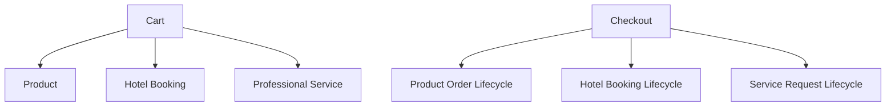

The checkout interface is unified while fulfilment lifecycles remain independent (ES-005 §30) — this IS implements one Checkout entry point that fans out into type-specific downstream workflows (§21–§24) rather than a single shared lifecycle.

---

## 7. Multi-Seller Cart

Per BP-006 §5 and ES-005 §29, and the special implementation requirement ("Checkout creates one consumer transaction but automatically splits into individual Seller Orders after confirmation"):

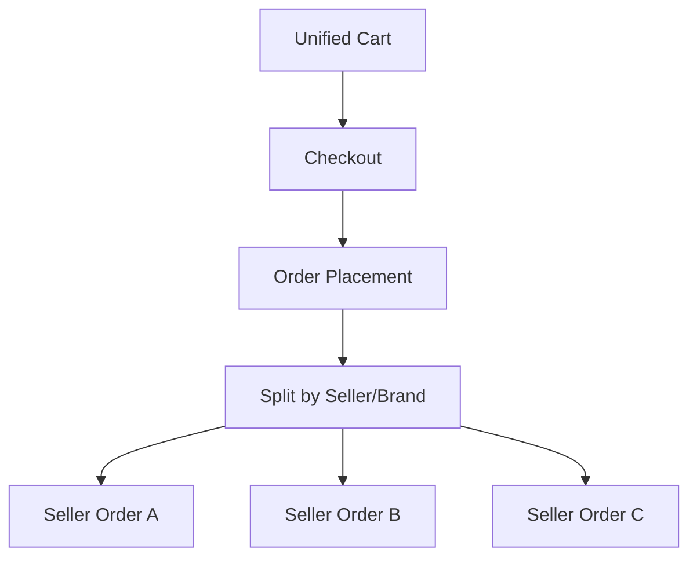

Each resulting Seller Order receives its own Order ID, Seller relationship, Fulfilment lifecycle, Conversation, Payment allocation, Settlement record, and Return/refund lifecycle (ES-005 §29). The Consumer continues viewing all of them through a unified order experience (§18).

---

## 8. Checkout Architecture

Checkout is a single Consumer-facing transaction (one payment authorization, one confirmation step) that internally triggers the Split Order Engine (§9). Per BP-006 §6–§7, checkout branches by item type: Product Checkout supports Online Payment/COD/Partial Advance/Delivery Charge Collection/Coupons/Gift Cards; Service Checkout begins as a Booking Request (§12).

---

## 9. Split Order Engine

Per BR-6.1 ("One checkout may generate multiple Seller Orders") and BR-6.2 ("Each Seller only accesses their own Orders") — directly matching the special requirement ("Every Seller receives only their own Order"):

The Split Order Engine is the component responsible for taking one confirmed checkout and creating N independent Seller Orders (one per distinct Brand represented in the Cart), each with independently scoped ownership (`Order.brand_id`/`Order.seller_id`, ES-003 §10), so that no Seller's API/UI queries can ever return another Seller's Order rows.

---

## 10. Order Number Strategy

Per ES-001 §13 (Order Number UNIQUE constraint): every split Seller Order receives its own unique Order Number, distinct from the Cart/Checkout transaction identifier that groups them for the Consumer's unified view (§18). The Checkout transaction ID and the individual Order Numbers are both persisted so either can be used to reconstruct the full multi-seller purchase.

---

## 11. Product Checkout

Per BP-006 §6: Product checkout supports Online Payment, Cash on Delivery, Partial Advance Payment, Delivery Charge Collection, Coupons, and Gift Cards, with Sellers configuring payment behaviour according to category and platform policy — directly matching the special requirement ("Products support Full Payment, COD and Partial Payment according to Seller payment policies configured from platform rules," ES-005 §35: "Seller cannot invent payment rules outside permitted platform configurations").

---

## 12. Service Checkout

Per BP-006 §7 and the special implementation requirement ("Services always begin as Booking Requests. Sellers may Accept, Modify or Reject service requests. Modified requests become Counter Offers"):

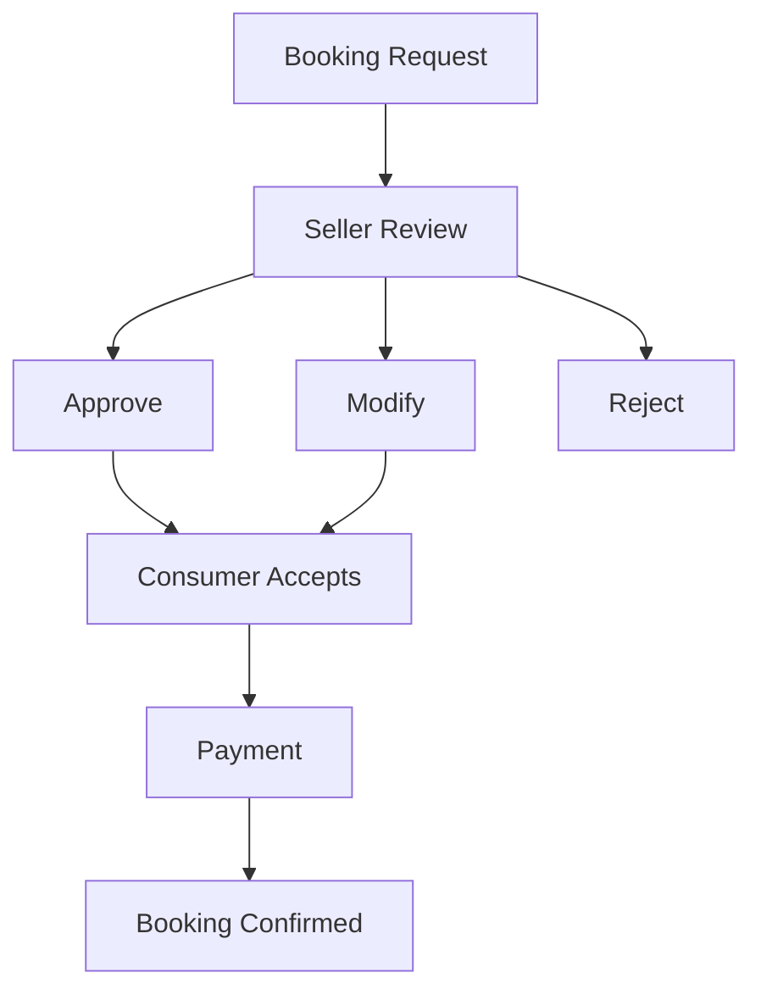

Modify produces a Counter Offer (§46); Counter Offers remain optional (BP-006 §7, BR-6.5).

---

## 13. Hotel Booking Checkout

Per BP-006 §15/ES-005 §25:


---

## 14. Tour Booking Checkout

Per BP-006 §16/ES-005 §26:


---

## 15. Manual Orders

Per BP-007 §11 and ES-005 §31, and the special implementation requirement ("Manual Orders created from WhatsApp, Messenger or Instagram conversations become normal Choosify Orders after the Consumer authenticates"):

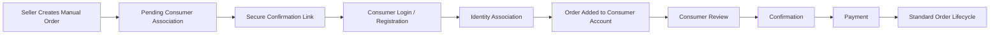

Manual Orders must transition into the standard Order system after confirmation and must not remain a parallel commerce system (ES-005 §31) — this IS implements Manual Orders as a distinct *creation path* into the exact same `orders` table and lifecycle used by standard checkout, never a separate order type at the data layer.

---

## 16. External Social Commerce Orders

Per BP-007 §13 (Social Inbox: Facebook Messenger, Instagram Direct, WhatsApp Business) and ES-005 §32:

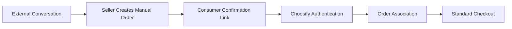

This is the specific instantiation of §15 where the originating conversation is an external Social Inbox channel rather than an in-platform inquiry; the resulting Order follows the identical Manual Order → Standard Order transition.

---

## 17. Order Association After Login

Per the special implementation requirement ("A Manual Order confirmation link automatically associates the Order with the Consumer account after login"): the secure confirmation link (§15 step C) carries a token that, once the Consumer authenticates (login or registration), performs Identity Association (§15 step E) — binding the pending Manual Order to the now-authenticated Consumer's account automatically, without requiring the Consumer to manually search for or re-enter the order.

---

## 18. Unified Consumer Order History

Per BP-006 §5 ("Consumers continue managing all orders from a unified Order History") and the special implementation requirement ("Unified consumer order history displays all split Orders as one purchase while preserving independent Seller fulfilment"): the Consumer-facing Order History groups Seller Orders originating from the same Checkout transaction (§10) into a single purchase view, while each grouped Order retains its own independent status, timeline, and Conversation (§9, §45) — grouping is presentational, not a merge of the underlying independently-owned Order records.

---

## 19. Seller Order Dashboard

Per BR-6.2 ("Each Seller only accesses their own Orders") and BP-004 §21 (Orders in Workspace Navigation, scoped to Active Brand): the Seller Order Dashboard queries are always scoped by `brand_id`/`seller_id` ownership (§9), consistent with IS-002 §9 Active Brand context — a Seller with multiple Brands sees Orders scoped to whichever Brand is currently active.

---

## 20. Multi-Brand Order Handling

Per BP-004 §5 (each Brand's Products/Services/Inventory are independent) and §9 (Split Order Engine): where a single Seller Account's multiple Brands both appear in one Consumer's Cart, the Split Order Engine (§9) treats each Brand as an independent split target — Orders split by Brand, not merely by Seller Account, since Brand is the operational ownership unit for Orders (consistent with IS-002 §5 Multi-Brand Ownership).

---

## 21. Order Lifecycle

Per BP-006 §13/ES-005 §27 (Standard Product Order):

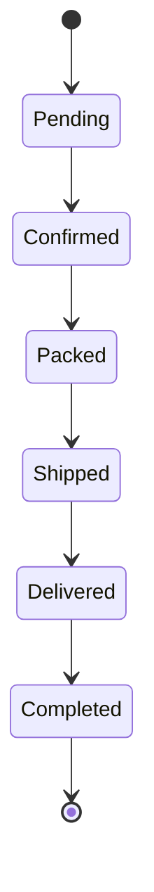

Cancellation may branch from eligible states per §33 (Product Cancellation Rules, ES-005 §33): Consumer may cancel until Seller confirmation; Seller may cancel until dispatch; Administrator may intervene per policy.

---

## 22. Service Lifecycle

Per BP-006 §14:

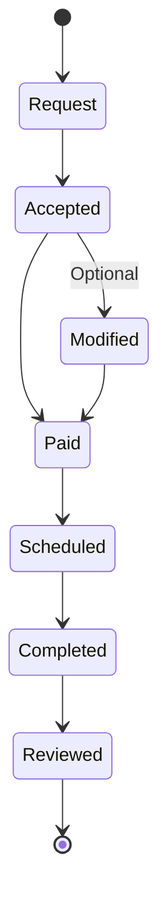

---

## 23. Hotel Booking Lifecycle

Per BP-006 §15:

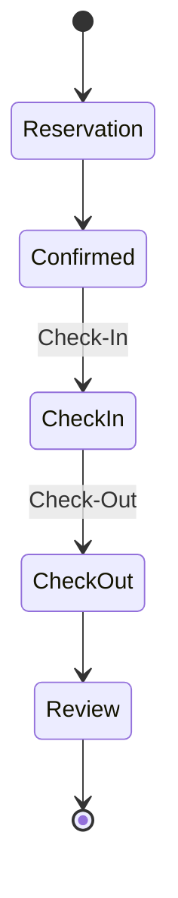

---

## 24. Tour Booking Lifecycle

Per BP-006 §16:

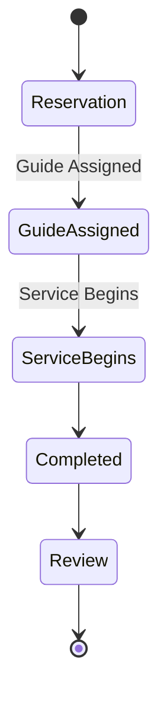

---

## 25. Order Status Management

Every status transition in §21–§24 emits the corresponding event (§52), is fully auditable (§65), and is validated against the ES-005 §70-equivalent rule "Invalid state transitions return a domain error" — e.g. `Delivered → Packed` must fail, never silently repair. Frontend requests a transition; backend is the sole authority on whether it is valid (BP-003 §14 principle applied to Commerce).

---

## 26. Shipment Management

Per BP-006 §18: shipping supports Platform Couriers, Seller Couriers, Self Delivery, Pickup, and Delivery Tracking, with shipping costs calculated independently per Seller (consistent with §9's independent Seller Orders). Shipment status (`Packed → Courier Assigned → Picked Up → In Transit → Out for Delivery → Delivered`, per ES-005 §39) drives the `Packed`/`Shipped`/`Delivered` transitions in §21.

---

## 27. Courier Integration (Future-Ready)

Per BP-006 §18 (Platform Couriers vs Seller Couriers as distinct options) and the general Future-Extension pattern in ES-009 §27 (Future Infrastructure: Partner APIs): this IS implements Shipment Management (§26) against a courier-provider-agnostic interface, so a specific courier integration (rate lookup, label generation, tracking webhook) can be added later without altering the Shipment/Order state machine. No specific courier vendor integration is implemented in this phase.

---

## 28. Partial Payment Engine

Per BP-006 §11 and ES-005 §36:

| Category | Consumer Pays Now | Remaining Balance |
|----------|---------------------|---------------------|
| Physical Products | Delivery Charge | Cash on Delivery |
| Hotels | Booking Deposit | Check-in |
| Tours | Advance Deposit | Service Date |

Partial payment rules are centrally configured by Administration and enabled by Sellers (BP-006 §11) — Sellers select from platform-defined policies, they do not define arbitrary split rules (ES-005 §35).

---

## 29. COD Workflow

Per ES-005 §36 example:

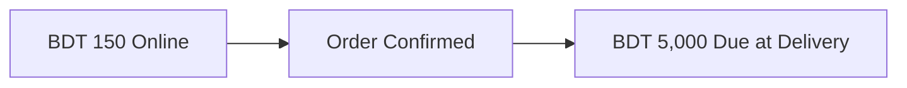

COD is a Product-checkout payment option (§11); the "Due at Delivery" balance is collected outside the platform payment gateway and reconciled against the Order at delivery confirmation.

---

## 30. Deposit Payment Workflow

Per ES-005 §36 example (Services):

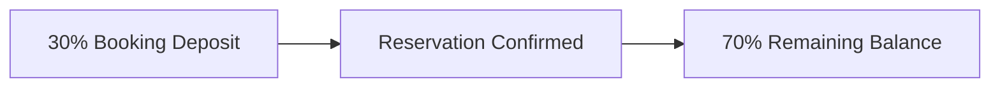

Percentages and amounts remain configurable (ES-005 §36), consistent with §28's platform-policy-driven configuration.

---

## 31. Full Payment Workflow

Per BP-006 §10/§35: Full Online Payment is one of the platform-defined payment options; on capture, the full Order total enters Escrow (§34) immediately rather than being split into deposit/balance.

---

## 32. Installment Support

Per BP-006 §10 ("Installments") and ES-005 §35 ("Installment where supported"): Installments are one of the supported payment methods, available where Seller/category configuration enables it — same governance model as §28 (Administration-defined policy, Seller-enabled), not a Seller-invented schedule.

---

## 33. Wallet Support

Per BP-006 §10 and §22 (Refunds may issue as Wallet Credit): Wallet is both a payment method and a refund destination. This IS treats Wallet balance as a Finance-domain-owned ledger (BP-009 scope) that Commerce debits/credits through Finance's interface, not a balance this subsystem stores independently.

---

## 34. Escrow Engine

Per BP-006 §12 and ES-005 §37, and the special implementation requirement ("Escrow holds all prepaid funds until fulfilment conditions are met"):

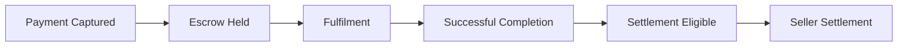

Escrow protects Consumers, Sellers, and the Platform (BP-006 §12); funds release only after Delivery, Service Completion, Booking Completion, or Refund Resolution (BP-006 §12, BR-6.4). Escrow itself is owned by the Finance domain (BP-009 §5–§6); this IS is responsible for triggering Escrow creation on payment capture and signaling fulfilment-condition-met events (§54) that Finance consumes to release funds.

---

## 35. Escrow Release Rules

Per ES-005 §38 and the special implementation requirement ("Refunds and Returns integrate directly with Escrow"):

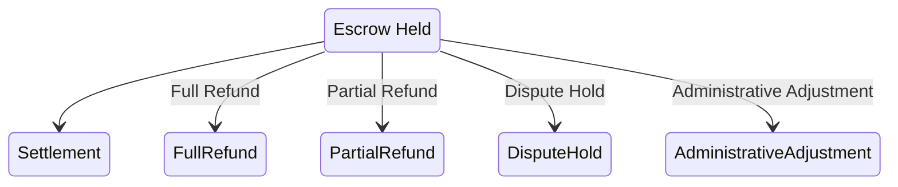

Every transition creates financial ledger entries (ES-005 §38) — owned by Finance, triggered by Commerce events from Refund (§36), Return (§37), and Dispute (§38) outcomes.

---

## 36. Refund Engine

Per BP-006 §22 and ES-005 §44:

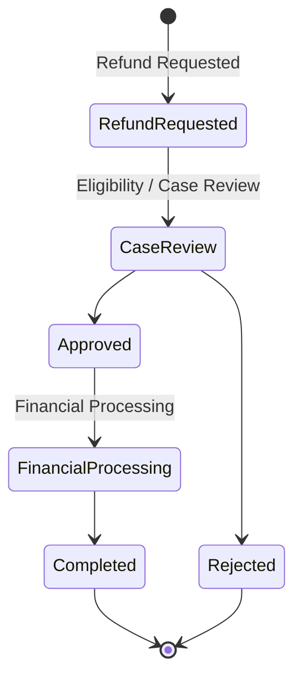

Refunds support Full Refund, Partial Refund, Escrow Release, and Wallet Credit / Original Payment Method (BP-006 §22), and may be Automatic, Administrative, or Dispute Resolution in origin.

---

## 37. Return Engine

Per BP-006 §21 and ES-005 §40–§41:

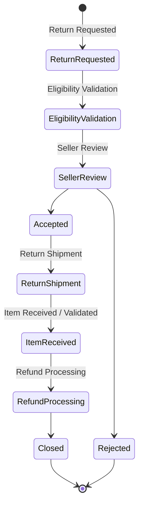

A rejected Return may escalate to a Dispute (§38). Return shipping responsibility is determined by reason (ES-005 §41: Seller responsibility for incorrect/defective/misrepresented/damaged; Consumer responsibility for eligible change-of-mind) and must be recorded.

---

## 38. Dispute Integration

Per BP-006 §21 (Dispute — Optional, after Seller rejection) and ES-005 §42–§43:

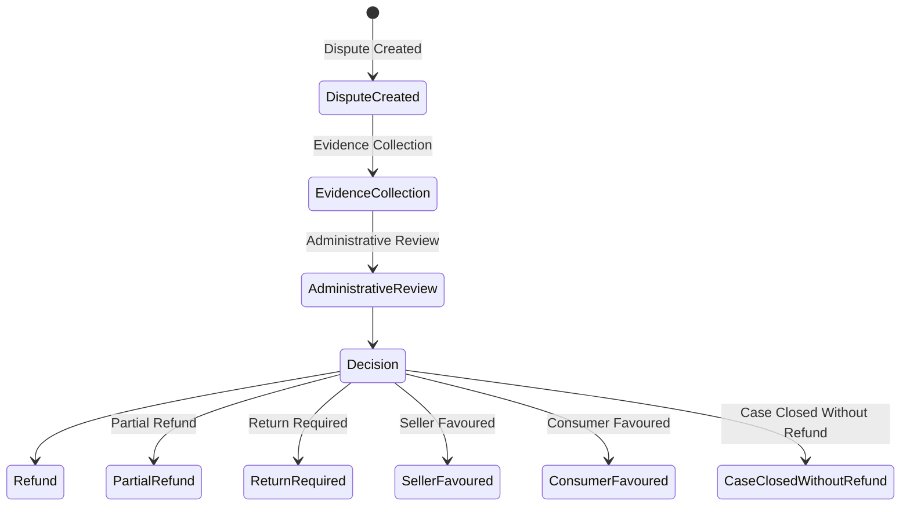

Dispute adjudication itself belongs to BP-011 Administration (out of scope, §2); this IS's responsibility is raising the Dispute against the correct Order/Escrow record and reacting to its resolution (Refund/Return/Trust events, §52–§54). Merely participating in a dispute does not itself reduce Trust — only governed outcomes may (ES-005 §43); Trust computation itself remains BP-008 scope.

---

## 39. Invoice Generation

Per BP-006 §28: Invoices include Invoice Number, QR Code, VAT, Tax, Item Breakdown, Seller Details, Consumer Details, Payment History, and a Downloadable PDF. Invoices are immutable after completion (BR-6.8) — generated once an Order reaches a completion/payment-capture milestone and never rewritten, only superseded by credit notes/adjustments if a refund occurs (consistent with ES-001 §11: financial records are Never Delete).

---

## 40. PDF Invoice

Per BP-006 §28 ("Downloadable PDF"): PDF rendering is a derived artifact generated from the immutable Invoice record (§39), not a second source of truth — regenerable at any time from the underlying data.

---

## 41. QR Code Support

Per BP-006 §28: every Invoice includes a QR Code, generated from the Invoice Number/verification reference, enabling quick lookup/verification of the invoice's authenticity.

---

## 42. VAT & Tax Integration

Per BP-006 §28 (VAT, Tax fields on Invoice) and BP-009 §17 (Taxes & VAT: configurable, future regional tax rules may be added): tax calculation is applied at Checkout/Order-total computation time and persisted on both the Order and its Invoice, using centrally configured tax rules (Finance domain, BP-009 §17) rather than Seller-defined rates.

---

## 43. Digital Signature Support (Future)

Per BP-006 §28 ("Future versions may include digital signatures"): explicitly out of scope for this implementation phase. The Invoice data model should not preclude attaching a signature artifact later.

---

## 44. Order Messaging Integration

Per BP-006 §19: every Order automatically generates an Order Conversation that becomes the official communication channel for Questions, Updates, Documents, Status Changes, and Attachments, permanently linked to the Order (BR-6.3). Order Messaging mechanics themselves are owned by BP-007 (Communication Engine); this IS is responsible for triggering Conversation creation at the correct point in Order creation (§45).

---

## 45. Conversation Auto-Creation

Per ES-005 §28 and the special implementation requirement ("Every split Order automatically creates its own Conversation"):

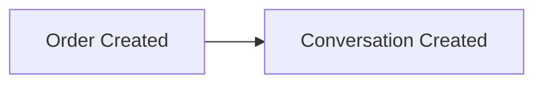

This applies even if the Consumer never messaged the Seller before checkout (ES-005 §28), and applies independently to *each* split Seller Order (§9) — not one Conversation shared across a multi-seller Checkout.

---

## 46. Counter Offer Integration

Per BP-006 §20 and ES-005 §22–§23, and the special implementation requirement ("Modified requests become Counter Offers. Counter Offers expire after the configured validity period — currently 8 hours"):

```mermaid
graph LR
    A["Request"] --> B["Seller Modification"] --> C["Counter Offer"] --> D["Consumer Review"]
    D --> E["Accept"]
    D --> F["Reject"]
    D --> G["Expire"]
    E --> H["Payment"] --> I["Confirmed"]
```

Service providers may modify Price, Schedule, Duration, Availability, and Included Services (BP-006 §20); Consumers may Accept, Reject, or let it Expire. The 8-hour validity window is the current default and must remain configurable, not hard-coded (ES-005 §23), matching the special requirement's phrasing exactly ("currently 8 hours").

---

## 47. Coupon Integration

Per BP-006 §24 and BR-6.7 ("Coupons never duplicate product pricing"): Coupons may be issued by Platform, Sellers, or Creators (within approved limits), with types Percentage/Fixed Amount/Shipping/Brand/Category/Campaign. Coupon validation and application occur at Checkout (§8), referencing existing pricing rather than storing a duplicated discounted price.

---

## 48. Gift Card Integration

Per BP-006 §25: Gift Cards support Fixed Value, Custom Value, Expiry, and Redemption Tracking, consumable as a Product Checkout payment method (§11) alongside or instead of other payment methods.

---

## 49. Wishlist Integration

Per BP-006 §26: Wishlists are private, and Consumers may create multiple collections. Wishlist items reference existing Products/Services (consistent with BP-001 Article 7) and are a Consumer-side read/save feature that feeds into Cart addition, not a Commerce transaction itself.

---

## 50. Save For Later Integration

Not separately named in BP-006, but consistent with §5 (Saved Cart) and §26 (Wishlist): "Save For Later" is implemented as a Cart-item-state transition (active cart item → saved, out of the active checkout total) distinct from Wishlist (a separate, named collection). This IS treats it as a Cart-domain feature, not a new commerce entity.

---

## 51. Reorder Workflow

Per BP-006 §27:

```mermaid
graph LR
    A["Reorder"] --> B["Add Items Back To Cart"] --> C["Standard Checkout"]
```

Inventory and pricing are recalculated during checkout (BP-006 §27) — Reorder never reuses the original Order's price/stock snapshot, it re-enters the standard Cart/Checkout flow (§5, §8).

---

## 52. Order Events

Per ES-004 §9 (Commerce Events):

- `CartCreated` / `CartUpdated`
- `CheckoutStarted` / `CheckoutCompleted`
- `OrderCreated` — per split Seller Order (§9)
- `OrderConfirmed`
- `OrderCancelled`
- `OrderPacked` / `OrderShipped` / `OrderDelivered`
- `OrderCompleted`

---

## 53. Payment Events

Per ES-004 §10:

- `PaymentInitiated` / `PaymentAuthorized` / `PaymentCaptured` / `PaymentFailed`
- `PaymentRefunded`
- `WithdrawalRequested` / `WithdrawalApproved` / `WithdrawalRejected` (Finance-domain-consumed, relevant where Seller settlement is triggered by Order completion)

---

## 54. Escrow Events

Per ES-004 §10:

- `EscrowCreated` — on payment capture entering Escrow (§34)
- `EscrowReleased` — on fulfilment-condition-met settlement (§35)
- `EscrowCancelled` — on refund/dispute-driven Escrow reversal (§35–§36)

---

## 55. Notification Requirements

Per ES-006 §13 (Commerce Notifications), §14 (Service Notifications), §15 (Payment Notifications):

| Trigger | Notification |
|---------|---------------|
| Order created | Order Created |
| Order confirmed | Order Confirmed |
| Order packed/shipped/out for delivery/delivered | Order Packed / Order Shipped / Out For Delivery / Delivered |
| Order completed | Completed |
| Order cancelled | Cancelled |
| Multi-seller checkout split into Orders | Order Split, Multi-Seller Checkout Completed |
| Service booking request created | Booking Request |
| Counter Offer issued / nearing expiry | Counter Offer, Counter Offer Expiring |
| Booking confirmed/scheduled | Booking Confirmed, Booking Scheduled |
| Check-in / Tour / Appointment approaching | Check-in Reminder, Tour Reminder, Appointment Reminder |
| Service completed | Service Completed |
| Payment succeeds/fails | Payment Successful, Payment Failed |
| Refund processed/approved/rejected | Refund Processed, Refund Approved, Refund Rejected |
| Escrow created/released | Escrow Created, Escrow Released |
| Withdrawal requested/approved/rejected | Withdrawal Requested, Withdrawal Approved, Withdrawal Rejected |
| Invoice generated | Invoice Generated |

Per ES-006 §13: "Every affected Seller receives only their own Order notifications. Consumers receive unified order notifications" — matching §9/§18's split-but-unified model exactly. Notifications are triggered exclusively via the events in §52–§54 (ES-006 §2); this subsystem never calls the Notification Engine directly.

---

## 56. Event Bus Integration

Every event in §52–§54 carries standard ES-004 §18 metadata (Event ID, Name, Timestamp, Producer, Domain: Commerce, Aggregate ID, Actor, Correlation ID, Payload, Version). Per ES-004 §2, this domain never calls Finance, Trust, Messaging, or Notification services directly — those domains subscribe independently. Event ordering within a single Order's aggregate is chronological (ES-004 §19: e.g. `OrderCreated → PaymentCaptured → OrderConfirmed → OrderPacked → OrderShipped → OrderDelivered → OrderCompleted`).

---

## 57. RBAC Requirements

Per ES-003 §11 (Consumer Permissions: Purchase, Track Orders, Disputes) and §12 (Seller Permissions: Manage Orders) and §10 (Ownership Rules: `Order → Consumer`, `Conversation → Order`):

Every Order-scoped endpoint validates the full ES-003 §16 pipeline. Consumers may access only Orders they placed; Sellers may access only Orders belonging to a Brand they own or are delegated to (matching BR-6.2 exactly); Administrators may access Orders for dispute/support purposes per BP-011 (out of scope here, referenced). Refund/Return approval permissions (`order.refund`, per ES-003 §7 example) are distinguished from Consumer-initiated Return *requests* — the request is a Consumer action, the approval is a Seller/Administrator permission.

---

## 58. Database Dependencies

Per ES-001 §9 (Commerce and Finance modules):

| Table | Owns | Key Fields |
|-------|------|------------|
| `cart` | Active shopping cart state (§5–§7) | `consumer_id`, items (Product/Service references) |
| `orders` | Split Seller Orders (§9) | `id`, `order_number` (UNIQUE, ES-001 §13), `consumer_id`, `brand_id`, `checkout_id` (groups split Orders, §10), `status` |
| `order_items` | Line items per Order | `order_id`, listing reference, quantity, price snapshot |
| `payments` | Payment attempts/captures (§34) | `order_id`, `status`, `payment_method` |
| `escrow` | Escrow holding records (§34–§35) | `order_id`, `status`, amount |
| `coupons` | Coupon definitions (§47) | `code` (UNIQUE, ES-001 §13), scope |
| `gift_cards` | Gift Card records (§48) | `code`, balance, expiry |
| `invoices` | Immutable invoice records (§39, Finance domain per ES-001 §9) | `invoice_number` (UNIQUE), `order_id`, VAT/Tax fields |
| `transactions` | Finance ledger entries (Finance domain) | Escrow/refund/settlement entries per §35 |

All tables follow ES-001 conventions: UUID primary keys, `created_at`/`updated_at`/`deleted_at`, `snake_case` naming, indexing on primary key/foreign keys/`created_at`/`status`. Per ES-001 §11: Orders are Never Delete; financial records (`payments`, `escrow`, `invoices`, `transactions`) are Never Delete. Schema migration itself is out of scope for this document.

---

## 59. API Endpoints

All endpoints follow ES-002 conventions.

| Method | Endpoint | Purpose | Auth |
|--------|----------|---------|------|
| GET | `/api/v1/cart` | Read current Cart | Yes |
| POST | `/api/v1/cart/items` | Add Product/Service to Cart (§5–§6) | Yes |
| PATCH | `/api/v1/cart/items/{id}` | Update quantity / save-for-later (§50) | Yes |
| DELETE | `/api/v1/cart/items/{id}` | Remove Cart item | Yes |
| POST | `/api/v1/checkout` | Initiate Checkout (§8), triggers Split Order Engine (§9) | Yes |
| GET | `/api/v1/orders` | Unified Consumer Order History (§18) | Yes |
| GET | `/api/v1/orders/{id}` | Retrieve one split Order | Yes (ownership) |
| POST | `/api/v1/orders/{id}/cancel` | Cancel Order per §33 rules | Yes (ownership) |
| GET | `/api/v1/seller/orders` | Seller Order Dashboard, Active-Brand-scoped (§19) | Yes (ownership) |
| PATCH | `/api/v1/seller/orders/{id}/status` | Advance Order status (§25) | Yes (ownership) |
| POST | `/api/v1/services/booking-requests` | Create Booking Request (§12; also defined in IS-003 §54, shared surface) | Yes |
| POST | `/api/v1/services/booking-requests/{id}/counter-offer` | Issue Counter Offer (§46) | Yes (ownership) |
| POST | `/api/v1/services/booking-requests/{id}/respond` | Accept/Reject Counter Offer | Yes (consumer) |
| POST | `/api/v1/orders/manual` | Seller-initiated Manual Order (§15–§16) | Yes (ownership) |
| POST | `/api/v1/orders/manual/{token}/associate` | Associate Manual Order after Consumer login (§17) | Yes |
| POST | `/api/v1/orders/{id}/returns` | Initiate Return (§37) | Yes (ownership) |
| PATCH | `/api/v1/orders/{id}/returns/{returnId}` | Seller Approve/Reject Return | Yes (ownership) |
| POST | `/api/v1/orders/{id}/disputes` | Escalate to Dispute (§38) | Yes |
| POST | `/api/v1/orders/{id}/refunds` | Initiate Refund (§36) | Yes (permission) |
| GET | `/api/v1/orders/{id}/invoice` | Retrieve Invoice / PDF (§39–§41) | Yes (ownership) |
| POST | `/api/v1/orders/{id}/reorder` | Reorder (§51) | Yes (ownership) |
| POST | `/api/v1/coupons/validate` | Validate a Coupon at Checkout (§47) | Yes |
| POST | `/api/v1/gift-cards/redeem` | Redeem Gift Card at Checkout (§48) | Yes |

Payment capture/webhook endpoints, Escrow release, and Withdrawal endpoints belong to the Finance domain's API surface (BP-009, future IS) and are intentionally not fully enumerated here — this subsystem calls into that surface rather than owning it.

---

## 60. Backend Services

Implementation order, gated per ES-010 §13 Quality Gates:

1. **Cart service** — mixed, multi-seller cart state (§5–§7), extending the pattern already partially present via `src/contexts/OrdersContext.tsx` and `src/lib/platformOrderAdapter.ts` in the admin repo.
2. **Checkout / Split Order service** — the core Split Order Engine (§9), producing one Order per Brand represented in the Cart, each independently owned (§20).
3. **Order lifecycle service** — implements §21 (Product), §22 (Service), §23 (Hotel), §24 (Tour) state machines, extending existing `server/booking/bookingService.ts` and `server/booking/bookingStore.ts` for Service/booking-type Orders, and existing Order-related surfaces (`src/pages/admin/Orders.tsx`, `src/pages/admin/PlatformOrders.tsx`) for Product-type Orders.
4. **Payment service** — Payment Lifecycle (Initiated → Pending → Authorized → Captured/Failed/Cancelled), extending existing `server/payments/paymentService.ts`, `server/payments/paymentsRouter.ts`, `server/payments/sslcommerzProvider.ts` already present in the repo.
5. **Escrow service** (Finance-domain-facing) — creation on capture, release on fulfilment (§34–§35); this IS calls into it, does not re-implement it.
6. **Manual Order service** — §15–§17 workflow, including the confirmation-link/association mechanism.
7. **Counter Offer service** — §46, including the configurable expiry job (ES-009 §11 Background Jobs).
8. **Return/Refund/Dispute service** — §36–§38 state machines, integrating with Escrow (§35).
9. **Invoice service** — §39–§42, immutable record generation plus PDF/QR rendering as derived artifacts.
10. **RBAC wiring** — every endpoint in §59 passes through `server/middleware/authorization.ts` / `server/permissions/authorization.ts` (existing).
11. **Event emission** — wire each service action to §52–§54.
12. **Audit logging** — wire each state-changing action to §65.

---

## 61. Frontend Components

- **Unified Cart UI** — supports mixed Product/Service items and multiple Sellers in one view (§5–§7).
- **Checkout flow** — single flow, branching per item type at confirmation (§8, §11–§14).
- **Booking Request / Counter Offer response UI** (Consumer-facing) — Accept/Reject/Expire handling (§46).
- **Unified Order History** — grouped-by-checkout, independently-tracked-per-Order view (§18).
- **Invoice/PDF download UI** (§40).
- **Reorder button/flow** on completed Orders (§51).

---

## 62. Admin Components

- **Dispute case surface** — read/administer Disputes raised against Orders (§38); adjudication workflow itself is BP-011 scope, this IS exposes the data.
- **Manual Order / Social Commerce audit view** — visibility into Manual Orders and their association status (§15–§17), for support/compliance purposes.

---

## 63. Seller Components

- **Seller Order Dashboard** (§19), Active-Brand-scoped, extending existing `src/components/brand/BrandOrdersTab.tsx`.
- **Order status update UI** (§25–§26), including Shipment/Courier assignment (§26–§27).
- **Booking Request review UI** — Approve/Modify(Counter Offer)/Reject (§12, §46).
- **Return review UI** — Approve/Reject incoming Return requests (§37).
- **Manual Order creation UI** — including generating the secure confirmation link (§15–§16).

---

## 64. Consumer Components

- **Cart and Checkout** (§61, Consumer-facing subset).
- **Order tracking / status timeline** per split Order (§21–§24).
- **Return/Refund request UI** (§36–§37).
- **Order Conversation entry point** (§44–§45), deep-linking into the auto-created Conversation for each Order.

---

## 65. Audit Logging

Per BR-6.10 ("Commerce events remain permanently auditable") and ES-008 §20: every state-changing action records Actor, Timestamp, Action, Entity, Old Value, New Value, IP Address, Device, Correlation ID, and produces an immutable audit record.

Minimum audited actions: Cart checkout initiation, Order creation (per split Order), every Order/Service/Hotel/Tour lifecycle transition, every Payment Lifecycle transition, Escrow creation/release/cancellation, Return/Refund/Dispute submissions and decisions, Manual Order creation and association, Counter Offer issuance/response/expiry, Coupon/Gift Card redemption.

---

## 66. Performance Considerations

Per ES-009:

- Checkout is a "Heavy" API per ES-009 §13 target band (<1000ms) given it spans Cart validation, Split Order creation, and Payment initiation across potentially multiple Brands; §9's split logic must not perform this work serially per Seller Order where it can be batched.
- Order History and Seller Order Dashboard queries are indexed on `consumer_id`/`brand_id` + `status` + `created_at` per ES-001 §12/ES-009 §6.
- Counter Offer expiry (§46) and the 90-day-adjacent archive-style jobs run as scheduled background jobs (ES-009 §11), never as synchronous request-path work.
- Invoice PDF/QR generation (§40–§41) is a derived, cacheable artifact — generated once and served from storage/CDN thereafter (ES-009 §8), not re-rendered on every download request.

---

## 67. Security Considerations

Per ES-008:

- Payment and Escrow operations require idempotency (ES-002 §20, BR-2.8) — repeated identical Checkout/Payment-capture/Refund/Escrow-release requests must not duplicate side effects (ES-005 §67-equivalent).
- Concurrent conflicting transitions (e.g. Consumer cancels while Seller confirms) require transactional/optimistic-concurrency protection (ES-005 §66-equivalent).
- Choosify never stores raw payment credentials (ES-008 §19); only references and transaction metadata are stored, consistent with the existing `server/payments/` provider abstraction.
- Manual Order confirmation links (§15, §17) are single-use, expiring tokens, not guessable or reusable after association.
- Every endpoint in §59 enforces ownership (§57) before execution.

---

## 68. Testing Checklist

- [ ] A Cart containing items from 3 different Sellers, after Checkout, produces exactly 3 independent Orders, each visible only to its owning Seller (§7, §9, BR-6.1/BR-6.2)
- [ ] A mixed Cart (Product + Hotel Booking + Service) produces the correct independent downstream lifecycle for each item type (§6)
- [ ] Every created Order automatically creates its own Conversation, even without a prior inquiry (§45, BR-6.3)
- [ ] Product Checkout supports Full Payment, COD, and Partial Payment exactly per Seller-enabled platform policy, with no Seller-invented payment rule accepted (§11, §28, ES-005 §35)
- [ ] Service Checkout always begins as a Booking Request; Seller Accept/Modify/Reject all produce the correct downstream state (§12)
- [ ] A Modified Service Request becomes a Counter Offer and expires automatically at the configured window (default 8 hours, configurable) (§46)
- [ ] A Manual Order created from a WhatsApp/Messenger/Instagram conversation becomes a standard Order after Consumer authentication, with no parallel order system (§15–§16)
- [ ] The Manual Order confirmation link automatically associates the Order to the Consumer's account immediately after login (§17)
- [ ] Escrow holds captured funds and releases only on the correct fulfilment condition (§34–§35, BR-6.4)
- [ ] Refunds and Returns correctly trigger Escrow exception paths (Full/Partial Refund, Dispute Hold, Administrative Adjustment) (§35–§37)
- [ ] Marketplace suspension on a Brand does not cancel, hide, or otherwise interrupt that Brand's active Orders (BR-6.6, directly testing the named special requirement)
- [ ] Unified Consumer Order History groups split Orders from one Checkout as one purchase while each retains independent status (§18)
- [ ] Every Order/Payment/Escrow event in §52–§54 is emitted with correct ES-004 §18 metadata
- [ ] Every notification in §55 is triggered via events only
- [ ] Invoices are immutable once generated (§39, BR-6.8)
- [ ] Every state-changing action produces an immutable audit record (§65)
- [ ] Repeated identical Payment/Refund/Escrow-release requests do not duplicate side effects (§67)

---

## 69. Acceptance Criteria

This IS is considered complete when:

- Cart, Checkout, and the Split Order Engine match BP-006 §4–§5 and ES-005 §29–§30 exactly, including the special requirement that every Seller receives only their own Order
- Product, Service, Hotel, and Tour checkout/lifecycle flows match BP-006 §6–§8, §13–§16 exactly
- Manual Orders and External Social Commerce Orders match BP-007 §11/§13 and ES-005 §31–§32 exactly, including automatic post-login association
- Escrow, Refund, Return, and Dispute integration match BP-006 §12/§21–§22 and ES-005 §37–§44 exactly
- Marketplace suspension never interrupts active Orders (BR-6.6)
- Unified Consumer Order History and independent Seller fulfilment coexist correctly (§18)
- Invoice generation (including PDF, QR, VAT/Tax) matches BP-006 §28 exactly, with immutability enforced (BR-6.8)
- All endpoints in §59 pass the ES-003 §16 RBAC pipeline including ownership validation
- All events in §52–§54 are emitted with correct ES-004 §18 metadata
- All notifications in §55 are triggered via events only
- All actions in §65 produce immutable audit records
- The testing checklist in §68 passes in full
- No BP or ES document required modification to complete this implementation

---

## 70. Rollback Strategy

- Each backend service in §60 is deployed independently behind standard release gates (ES-010 §11), allowing rollback to the prior deployed version without data loss.
- Database changes follow the ES-001 §15 migration workflow; every migration is paired with a tested down-migration before Production deployment.
- Payment and Escrow logic changes are feature-flagged (ES-010 §15) so a defective release can be disabled instantly without a code rollback, given the financial sensitivity of this domain.
- Because Orders, Payments, and Escrow are Never Delete (ES-001 §11), rollback of this subsystem never removes financial history — a rollback reverts *code behaviour*, not existing data.
- Since Order data is consumed by Messaging (Conversations), Trust, Finance, and Notifications (§3), rollback must be validated against those domains' Order-dependent flows before execution in Production.
- Audit logs and emitted events are never rolled back or deleted (ES-008 BR-8.6).

---

## 71. Future Extensions

Explicitly deferred, per the source documents:

- Specific courier-provider integrations beyond the provider-agnostic interface (§27)
- Digital signatures on Invoices (§43, BP-006 §28 explicitly Future)
- Corporate Gift Card programmes (BP-006 §25, marked Future)
- Collaborative Wishlist collections (BP-006 §26, marked Future)
- Future Payment Gateways beyond the initial supported set (BP-006 §10)

---

## 72. Implementation Order

**Phase 1 — Database**
Identity/Marketplace/Catalog dependencies already established (IS-001–IS-003); implement Commerce and Finance-facing tables per §58 (`cart`, `orders`, `order_items`, `payments`, `escrow`, `coupons`, `gift_cards`, `invoices`, `transactions`) following the ES-001 §15 migration workflow.

**Phase 2 — Backend Services**
Implement the services in §60 in the stated order: Cart → Checkout/Split Order Engine → Order lifecycle → Payment → Escrow integration → Manual Order → Counter Offer → Return/Refund/Dispute → Invoice.

**Phase 3 — REST APIs**
Implement and RBAC-wire the endpoints in §59, gated behind the ES-002 standard envelope and the ES-003 §16 authorization pipeline.

**Phase 4 — Admin Dashboard**
Implement §62 (Dispute case surface, Manual Order/Social Commerce audit view).

**Phase 5 — Seller Dashboard**
Implement §63 (Seller Order Dashboard, status/shipment updates, Booking Request review, Return review, Manual Order creation).

**Phase 6 — Consumer Storefront**
Implement §64 (Cart/Checkout, Order tracking, Return/Refund requests, Order Conversation entry point) and §61 shared components.

**Phase 7 — Notifications**
Wire the Notification Engine consumption of §52–§54 events per the §55 matrix; verify Seller/Consumer notification scoping matches ES-006 §13 exactly.

**Phase 8 — Testing**
Execute the full checklist in §68, including multi-seller split verification, Manual Order association, Escrow exception paths, and Marketplace-suspension-does-not-interrupt-Orders verification.

**Phase 9 — Documentation Update**
Update `docs/README.md` Implementation Specifications table to mark this IS as implemented; record any clarifying ADRs in `docs/engineering/Decision-Records/` if implementation surfaced ambiguity requiring a decision record (not a BP/ES change).

**Phase 10 — Deployment Checklist**
Apply the ES-010 §26 Production Readiness Checklist (Documentation Complete, Database Reviewed, Security Reviewed, API Reviewed, Testing Passed, Monitoring Ready, Rollback Ready, Feature Flags Configured, Release Approved) before enabling this subsystem in Production, with Payment/Escrow feature flags (§70) verified operative.

---

## Revision History

| Version | Date | Description |
|----------|------|-------------|
| 1.0.0 | August 2026 | Initial Commerce, Checkout & Order Management Implementation Specification |
