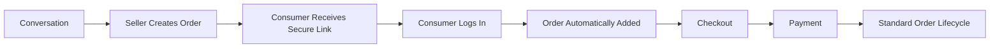
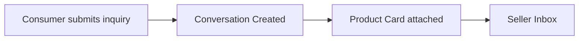

# Choosify Implementation Specification

**Document ID:** IS-005
**Title:** Messaging, Communication & Social Commerce Implementation
**Version:** 1.0.0
**Status:** Draft
**Priority:** Critical

**Derived From:**

- BP-001 Vision & Constitution
- BP-004 Seller Workspace & Brand Architecture
- BP-005 Product & Service Engine
- BP-006 Commerce Engine (Orders, Checkout & Payments)
- BP-007 Communication, Messaging & Customer Engagement Engine
- BP-008 Trust, Reputation, Moderation & Governance Engine
- BP-011 Administration, CMS & Platform Operations Engine
- ES-001 Database Architecture
- ES-002 API Architecture
- ES-003 RBAC & Permission Matrix
- ES-004 Event Bus
- ES-005 Workflow State Machines
- ES-006 Notification Matrix
- ES-008 Security Architecture

This is a documentation-only Implementation Specification. It does not redesign the platform, invent new business rules, simplify architecture, or replace any BP/ES decision. No production code or database migration is contained in this document.

---

## Table of Contents

1. [Purpose](#1-purpose)
2. [Scope](#2-scope)
3. [Dependencies](#3-dependencies)
4. [Messaging Architecture](#4-messaging-architecture)
5. [Conversation Architecture](#5-conversation-architecture)
6. [Order Conversations](#6-order-conversations)
7. [Service Conversations](#7-service-conversations)
8. [Booking Conversations](#8-booking-conversations)
9. [Manual Order Conversations](#9-manual-order-conversations)
10. [External Social Commerce Conversations](#10-external-social-commerce-conversations)
11. [Meta Business Inbox Integration](#11-meta-business-inbox-integration)
12. [Facebook Messenger Integration](#12-facebook-messenger-integration)
13. [Instagram DM Integration](#13-instagram-dm-integration)
14. [WhatsApp Business Integration](#14-whatsapp-business-integration)
15. [Unified Inbox Architecture](#15-unified-inbox-architecture)
16. [Conversation Ownership](#16-conversation-ownership)
17. [Conversation Permissions](#17-conversation-permissions)
18. [Conversation Lifecycle](#18-conversation-lifecycle)
19. [Conversation Expiration Rules](#19-conversation-expiration-rules)
20. [Read-only Conversation Rules](#20-read-only-conversation-rules)
21. [Automatic Conversation Creation](#21-automatic-conversation-creation)
22. [Manual Conversation Creation](#22-manual-conversation-creation)
23. [Product Inquiry Messages](#23-product-inquiry-messages)
24. [Service Request Messages](#24-service-request-messages)
25. [Booking Request Messages](#25-booking-request-messages)
26. [Counter Offer Messages](#26-counter-offer-messages)
27. [Offer Acceptance Workflow](#27-offer-acceptance-workflow)
28. [Offer Rejection Workflow](#28-offer-rejection-workflow)
29. [Offer Expiration Workflow](#29-offer-expiration-workflow)
30. [Offer Version History](#30-offer-version-history)
31. [Order Card Messages](#31-order-card-messages)
32. [Product Card Messages](#32-product-card-messages)
33. [Service Card Messages](#33-service-card-messages)
34. [Booking Cards](#34-booking-cards)
35. [Message Attachments](#35-message-attachments)
36. [File Sharing](#36-file-sharing)
37. [Voice Messages (Future)](#37-voice-messages-future)
38. [Video Messages (Future)](#38-video-messages-future)
39. [Emoji Support](#39-emoji-support)
40. [Typing Indicators](#40-typing-indicators)
41. [Read Receipts](#41-read-receipts)
42. [Delivery Status](#42-delivery-status)
43. [Internal Notes](#43-internal-notes)
44. [Seller Staff Messaging](#44-seller-staff-messaging)
45. [Admin Messaging](#45-admin-messaging)
46. [Support Ticket Conversations](#46-support-ticket-conversations)
47. [Platform Broadcast Messages](#47-platform-broadcast-messages)
48. [AI Assistant Integration (Future)](#48-ai-assistant-integration-future)
49. [Translation Support (Future)](#49-translation-support-future)
50. [Search Within Conversations](#50-search-within-conversations)
51. [Conversation Events](#51-conversation-events)
52. [Notification Integration](#52-notification-integration)
53. [Event Bus Integration](#53-event-bus-integration)
54. [RBAC Requirements](#54-rbac-requirements)
55. [Database Dependencies](#55-database-dependencies)
56. [API Endpoints](#56-api-endpoints)
57. [Backend Services](#57-backend-services)
58. [Frontend Components](#58-frontend-components)
59. [Admin Components](#59-admin-components)
60. [Seller Components](#60-seller-components)
61. [Consumer Components](#61-consumer-components)
62. [Audit Logging](#62-audit-logging)
63. [Security Considerations](#63-security-considerations)
64. [Privacy Considerations](#64-privacy-considerations)
65. [Performance Considerations](#65-performance-considerations)
66. [Testing Checklist](#66-testing-checklist)
67. [Acceptance Criteria](#67-acceptance-criteria)
68. [Rollback Strategy](#68-rollback-strategy)
69. [Future Extensions](#69-future-extensions)
70. [Implementation Order](#70-implementation-order)
71. [Revision History](#revision-history)

---

## 1. Purpose

This document defines the implementation plan for the Messaging, Communication & Social Commerce Engine of the Choosify Commerce Operating System, as governed by BP-007.

Every conversation inside Choosify must belong to a business context; messaging is never intended to function as an unrestricted social network (BP-007 §3). This IS translates that constraint — plus the Order Conversation triggers from BP-006, the Social Inbox integration from BP-007 §13, and the technical conventions of ES-001 through ES-006 and ES-008 — into a concrete, sequenced implementation plan.

---

## 2. Scope

In scope:

- Conversation architecture and the business contexts a conversation may belong to (BP-007 §3, §5)
- Automatic Conversation creation from Product Orders, Service Requests, Hotel Bookings, and Tour Bookings, including per-split-Order independence (BP-006 §19, BP-007 §9, §12, ES-005 §28)
- Manual Order and External Social Commerce Conversations (BP-007 §11, §13)
- Meta Business Inbox integration (Facebook Messenger, Instagram Direct, WhatsApp Business) and the Unified Inbox (BP-007 §13–§14)
- Conversation ownership, permissions, lifecycle, and read-only/expiration rules (BP-007 §10, §20, ES-005 §56–§57)
- Product/Service/Booking/Order card messages and structured inquiry forms (BP-007 §6–§7)
- Counter Offer messaging integration (BP-007 §8, ES-005 §22–§23)
- Attachments, and the explicitly Future capabilities (Voice/Video Messages, AI Assistant, Translation)
- Support Ticket conversations as an independent track from commercial messaging (BP-007 §18)
- Admin messaging and moderation entry points (BP-007 §21)
- Event Bus, RBAC, notification, and audit wiring for this domain

Out of scope (governed elsewhere, referenced not duplicated):

- Order/Payment/Escrow mechanics themselves — already specified in IS-004
- Product/Service listing mechanics — already specified in IS-003
- Trust Score computation from moderation signals — BP-008, future IS
- Live Commerce session mechanics and Brand Stories content management — BP-004 §18–§19/BP-010, future IS
- AI Moderation decisioning and the Moderation Centre UI — BP-008 §17/§19, BP-011, future IS
- Support Ticket assignment/resolution workflow internals beyond the conversation boundary — BP-011, future IS

---

## 3. Dependencies

| Document | Relevance |
|----------|-----------|
| BP-001 | Article 7 (Single Source of Truth: conversations reference Orders/Products, never duplicate their data) |
| BP-004 | Seller Workspace navigation includes Messaging (§21); Marketplace suspension does not remove access to Messaging (§11) |
| BP-005 | Product Inquiry references existing listings (§8) |
| BP-006 | Every Order automatically generates an Order Conversation (§19, BR-6.3); Order Conversation is permanently linked to the Order |
| BP-007 | Authoritative source for this IS |
| BP-008 | Communication is monitored for Spam/Fraud/Abuse/Harassment/Scam/Copyright (§21, BP-008 §17); moderation decisioning is out of scope here, this IS exposes the data |
| BP-011 | Support Ticket workflow assignment/resolution is Administration scope; Admin messaging entry point is in scope here |
| ES-001 | `conversations`, `messages`, `attachments`, `social_inbox` tables in the Messaging Domain (§9); Ownership Convention `Conversation.order_id` (§7) |
| ES-002 | `/api/v1/` conventions, file upload conventions (§18) |
| ES-003 | Ownership Rule `Conversation → Order` (§10); Consumer/Seller messaging permissions (§11–§12) |
| ES-004 | Messaging Events (§11): `ConversationCreated`, `MessageSent`, `MessageEdited`, `AttachmentUploaded`, `ConversationClosed`, `CounterOfferCreated`, `CounterOfferAccepted`, `CounterOfferExpired` |
| ES-005 | Conversation Lifecycle (§56), Service Conversation Expiration (§57), Service Request/Counter Offer Lifecycles (§20–§23, shared with IS-004) |
| ES-006 | Messaging Notifications (§16) |
| ES-008 | File security for attachments (§16), input validation (§12), audit logging (§20) |

---

## 4. Messaging Architecture

Per BP-007 §1/§3: the Communication Engine enables secure, contextual, commerce-driven conversations between Consumers, Sellers, Creators, and Administrators. Every conversation must belong to a business context (Product Inquiry, Service Booking, Order, Support Ticket, Verification, Dispute, Return, Live Commerce, Brand Story) — free-form social messaging is not supported (BR-7.1), matching the special requirement ("Choosify never becomes a general social messenger... Conversations are always contextual").

Supported participant pairs (BP-007 §4): Consumer↔Seller, Seller↔Administrator, Administrator↔Everyone, Consumer↔Platform Support, Seller Staff↔Consumer. Not supported: Consumer↔Consumer, Creator↔Consumer direct messaging, Creator↔Brand direct messaging, Seller↔Seller marketplace messaging.

---

## 5. Conversation Architecture

Per BP-007 §5: every conversation belongs to exactly one context — Product Inquiry, Service Booking, Order Conversation, Return Request, Refund Discussion, Dispute, Platform Support, Verification, Live Commerce, Manual Order, or General Business Inquiry. This IS implements `context_type` as a required, immutable field on every conversation record (§55) — a conversation never changes context after creation.

---

## 6. Order Conversations

Per BP-006 §19 and BR-6.3, and the special implementation requirement ("Every Product Order automatically creates a Conversation"): every successful Order automatically generates an Order Conversation, permanently linked to that Order, including Order Timeline, Status Updates, Attachments, Tracking, Seller Messages, and Consumer Messages (BP-007 §9). Consumers never need to manually create a conversation after purchasing.

---

## 7. Service Conversations

Per the special implementation requirement ("Every Service Request automatically creates a Conversation") and BP-007 §7: the Service Inquiry workflow itself creates the Conversation at submission time (before any Order exists), and that same Conversation carries through Booking Request review, Counter Offers (§26), acceptance, and eventual Order.

---

## 8. Booking Conversations

Per the special implementation requirements ("Every Hotel Booking automatically creates a Conversation" / "Every Tour Booking automatically creates a Conversation"): Hotel and Tour bookings follow the same Service Conversation pattern (§7) — the Booking Request that initiates a Hotel/Tour reservation (per IS-004 §13–§14) creates its Conversation at the same point a generic Service Request would (§25).

---

## 9. Manual Order Conversations

Per BP-007 §11 and the special implementation requirement ("Manual Orders created from Messenger, Instagram or WhatsApp must automatically create a Choosify Conversation"):

The Manual Order becomes indistinguishable from platform-created orders (BP-007 §11). Note that for Manual Orders the Conversation may already exist (originating from a Social Inbox conversation, §10) *before* the Order is created — this is the one case where Conversation creation precedes rather than follows Order creation, and this IS must handle both orderings without treating either as an error state.

---

## 10. External Social Commerce Conversations

Per BP-007 §13 (Social Inbox) and the special implementation requirement ("After the Consumer authenticates through the secure confirmation link, the Manual Order and Conversation become permanently associated with the Consumer account"): a conversation originating on Facebook Messenger, Instagram Direct, or WhatsApp Business is synchronized into the platform (§11–§14) and, once a Manual Order is created from it and the Consumer authenticates via the secure confirmation link (IS-004 §17), both the Order *and* its originating Conversation are permanently bound to the Consumer's account — not just the Order alone.

---

## 11. Meta Business Inbox Integration

Per the special implementation requirement ("Sellers connect Facebook Pages, Instagram Business, WhatsApp Business through their Seller Dashboard. Meta conversations synchronize into one Unified Inbox"): this IS implements Meta integration as a Seller-initiated connection (OAuth/token-based, configured per Brand) feeding into the Unified Inbox (§15). The admin repo already contains a channel-adapter abstraction (`server/messaging/adapters/channelAdapter.ts`, `normalizeWebhook.ts`, `webhookVerify.ts`, `webhookJobs.ts`) that this IS extends rather than replaces, consistent with ES-010 §8 ("no duplicated logic").

---

## 12. Facebook Messenger Integration

Per BP-007 §13: Facebook Messenger is one of the three supported Social Inbox integrations. Inbound Messenger messages are normalized into the standard Message/Conversation model (§5, §55) via the existing webhook-normalization pipeline, tagged with their source channel so conversation source remains clearly identified (BP-007 §14, BR-7.7).

---

## 13. Instagram DM Integration

Mirrors §12 for Instagram Direct (BP-007 §13).

---

## 14. WhatsApp Business Integration

Mirrors §12 for WhatsApp Business (BP-007 §13). WhatsApp is also a supported platform notification channel in its own right (ES-006 §4), distinct from its role here as a Social Inbox message source — this IS treats inbound WhatsApp Business messages (Social Inbox) and outbound WhatsApp notifications (ES-006) as related but separate integration points sharing the same underlying provider credential.

---

## 15. Unified Inbox Architecture

Per BP-007 §14 and the special requirement ("Meta conversations synchronize into one Unified Inbox"): the Seller Inbox combines Platform Messages, Order Conversations, Service Requests, Facebook Messages, Instagram Messages, WhatsApp Messages, and Support — with conversation source remaining clearly identified at all times (BR-7.7). This IS implements the Unified Inbox as a single query surface over the `conversations` table (§55), filterable/labelled by `source_channel`, rather than separate inboxes the Seller must switch between.

---

## 16. Conversation Ownership

Per ES-001 §7 (Ownership Convention: `Conversation.order_id`) and ES-003 §10 (`Conversation → Order`): every commerce-context conversation (Order, Service, Booking, Manual Order) is owned via its `order_id` (or, for pre-Order Service/Manual-Order conversations, a nullable reference later populated once the Order exists, per §9). Support Ticket and Verification conversations (§46) are owned independently, not via an Order reference, consistent with BR-7.10 (Platform Support operates independently from commercial messaging).

---

## 17. Conversation Permissions

Per BP-007 §20 and the special implementation requirement stated as a two-branch rule ("Sellers may only message Consumers when: the Consumer initiated the conversation, OR an active Order or Booking exists. Consumers may always reply while the conversation remains active"):

- **Consumers** may only contact Sellers they interact with, via Existing Orders or Existing Services (BP-007 §20) — never an arbitrary Seller.
- **Sellers** may only contact Consumers with Orders or existing Conversations (BP-007 §20) — a Seller may never initiate contact with a Consumer who has neither.
- **Administrators** may contact every participant (BP-007 §20), and per the special requirement, "Admins may enter any conversation when authorized for moderation or support" (§45, §59).

This is the authoritative enforcement point for BR-7.3 ("Consumers cannot directly message unrelated Sellers without initiating a commercial interaction").

---

## 18. Conversation Lifecycle

Per BP-007 §10:

**Product Orders**

**Services**

Once completed, conversations remain accessible but become read-only (BP-007 §10, BR-7.4).

---

## 19. Conversation Expiration Rules

Per the special implementation requirements defining exactly when each conversation type remains active:

**Product conversations remain active until:** Delivered, Cancelled, Refunded, or Closed.

**Service conversations remain active until:** Service completed, Booking cancelled, Counter offer expired, or Conversation closed.

These are the authoritative transition triggers into the Read-Only state (§20) for this IS — they are a direct, literal restatement of the special requirements and must be implemented exactly as listed, matching the Order/Service/Hotel/Tour lifecycle terminal-adjacent states already defined in IS-004 §21–§24.

---

## 20. Read-only Conversation Rules

Per BR-7.4 and the special requirement ("Every conversation maintains complete history. History is never deleted because an Order is completed... Read-Only conversations remain searchable"): reaching Read-Only never deletes or archives-out-of-reach the conversation — it only disables new message composition. Full history remains intact and searchable (§50) indefinitely, consistent with ES-001 §11 (conversations/messages are business records, not subject to hard deletion on completion).

---

## 21. Automatic Conversation Creation

Consolidates §6–§9: Conversations are created automatically (not by explicit user action) at Order creation (Product/Hotel/Tour), at Service Request submission, and at Manual Order creation from a Social Inbox conversation. Per the special requirement ("Every split Seller Order creates an independent Conversation"), this triggers once per split Order (IS-004 §9, §45) — a multi-seller Checkout producing 3 Orders produces 3 independent Conversations, never one shared thread.

---

## 22. Manual Conversation Creation

The one explicit, user-initiated Conversation creation path is the Product Inquiry / "Message Seller" flow (§23) and the Service Inquiry / "Book / Request" flow (§24) — both Consumer-initiated actions that create a Conversation *before* any Order exists, in contrast to §21's automatic, Order-triggered creation.

---

## 23. Product Inquiry Messages

Per BP-007 §6 and the special implementation requirement ("Product inquiries begin from the storefront 'Message Seller' flow using the predefined requirement form"):

The structured inquiry form captures Quantity, Colour, Size, Budget, and Notes (BP-007 §6) — this is a fixed, predefined form, not free-text-only messaging, consistent with §4's context-only-messaging constraint.

---

## 24. Service Request Messages

Per BP-007 §7 and the special implementation requirement ("Service inquiries include: requested dates, duration, quantity, pricing, special requirements"):

The Service Request Form captures Date, Duration, Guests, and Special Requests (BP-007 §7) — the special requirement's "quantity" and "pricing" fields map to the same structured-form pattern (guests/capacity and the Service's pricing model per IS-003 §30).

---

## 25. Booking Request Messages

Per the special implementation requirement ("Sellers may modify service requests before acceptance") and BP-007 §8: a Booking Request message carries the structured Booking Card (§34) into the Seller's Inbox; the Seller's response options are Approve, Modify (→ Counter Offer, §26), or Reject, mirroring IS-004 §12/§35's Booking Request state machine exactly — this IS is the messaging-surface representation of that same underlying state machine, not a separate one.

---

## 26. Counter Offer Messages

Per BP-007 §8 and ES-004 §11 (`CounterOfferCreated`), and the special implementation requirement ("Counter Offers remain valid for the configured period — currently 8 hours"):

A Counter Offer message is a special message type carrying a structured proposal (changed Date/Price/Duration/Services, per IS-004 §46) rather than plain text — consistent with the special requirement that "Seller replies support... counter offers" as a first-class message content type (§35).

---

## 27. Offer Acceptance Workflow

Per ES-004 §11 (`CounterOfferAccepted`): Consumer acceptance of a Counter Offer message transitions the underlying Booking Request to Accepted (IS-004 §46) and typically proceeds to Payment — the message-level "Accept" action and the commerce-level state transition are the same event, this domain emits the message-level notification/event, IS-004 owns the commerce state.

---

## 28. Offer Rejection Workflow

Per BP-007 §8 (Consumer may Reject) and ES-005 §22: a rejected Counter Offer message marks the conversation's associated Booking Request as Rejected; per §19 ("Counter offer expired" is a Service-conversation-active trigger only for expiration, not rejection) rejection is an immediate, consumer-initiated terminal action distinct from the time-based expiration in §29 — this IS represents both as distinct message/event outcomes even though their downstream effect (request does not proceed) is similar.

---

## 29. Offer Expiration Workflow

Per the special implementation requirement, stated as an explicit multi-step consequence ("Expired Counter Offers automatically: cancel the pending request, close the transaction, convert the conversation to Read-Only"):

This is the single most explicit chained business consequence stated in the special requirements and this IS implements it as one atomic background-job-triggered transition (ES-009 §11 Background Jobs) firing `CounterOfferExpired` (ES-004 §11) which in turn triggers the Read-Only transition defined in §19–§20 — not three independently-timed effects that could desynchronize.

---

## 30. Offer Version History

Per IS-004 §30 (any Seller modification affecting price generates a new offer version, ES-005 §24): every Counter Offer message is stored as an immutable version in the Conversation's message history (§20), never overwritten — a Seller issuing a second Counter Offer creates a new message/version, preserving the full negotiation history for audit (§62) and dispute purposes (IS-004 §38).

---

## 31. Order Card Messages

Per BP-007 §9 (Order Conversation includes Order Timeline, Status Updates, Tracking) and the special implementation requirement ("Consumers receive structured Product/Service cards rather than plain messages"): the Order Conversation's system-generated messages render as a structured Order Card (status, tracking, timeline) rather than free text — consistent with the Order Card being a read-only, system-authored message type distinct from Seller/Consumer authored messages.

---

## 32. Product Card Messages

Per BP-007 §6 ("Product Card attached") and the special requirement above: every Product Inquiry conversation attaches a structured Product Card (referencing the Product by ID per BP-001 Article 7, never duplicating its data) rather than requiring the Consumer to describe the product in free text.

---

## 33. Service Card Messages

Mirrors §32 for Services — attached at Service Inquiry submission (§24), referencing the Service listing by ID.

---

## 34. Booking Cards

Per BP-007 §7 ("Booking Card Attached"): the structured card attached to Service/Hotel/Tour Booking Requests, carrying the requested dates/duration/guests/special-requirements (§24–§25) in a structured, Seller-reviewable format.

---

## 35. Message Attachments

Per BP-007 §19 and the special implementation requirement ("Seller replies support: text, images, files, invoices, quotations, counter offers"): supported attachment types are Images, PDFs, Documents, Invoices, and Booking Confirmations (BP-007 §19), with Voice Messages and Video Clips explicitly Future (§37–§38). All uploads remain subject to moderation (BP-007 §19, BP-008 §17). "Quotations" are implemented as a structured document attachment (PDF/Document type), not a new attachment category beyond what BP-007 §19 already enumerates.

---

## 36. File Sharing

Per ES-002 §18 (File Uploads: media references returned, binary data never stored in relational tables) and ES-008 §16 (files scanned before availability, executables prohibited): attachment files are uploaded via the existing media pipeline and referenced by ID from the message record, consistent with the pattern already established for Product media in IS-003 §42.

---

## 37. Voice Messages (Future)

Per BP-007 §19: Voice Messages are explicitly listed under "Future" attachment types. Not implemented in this phase; the attachment data model should not preclude adding an audio attachment type later.

---

## 38. Video Messages (Future)

Per BP-007 §19: Video Clips are explicitly listed under "Future" attachment types. Not implemented in this phase.

---

## 39. Emoji Support

Not separately named in BP-007. Consistent with §35 (text messages) and general UI text-rendering standards (ES-007), emoji are treated as standard Unicode text content within a message body — no separate emoji subsystem is required or introduced by this IS.

---

## 40. Typing Indicators

Not separately named in BP-007. This is a real-time UX affordance layered onto the existing message transport (§57); it carries no business-context implications and does not persist as message history — implemented as ephemeral presence signaling, not a database-backed feature.

---

## 41. Read Receipts

Per BP-007 §9 (Order Conversation includes Status Updates) as the closest analogue, and consistent with general messaging conventions: each message records whether it has been read by the other participant. This is presentational/status metadata on the `messages` table (§55), not a new conversation type.

---

## 42. Delivery Status

Mirrors §41 — message-level delivery status (sent/delivered/failed), distinct from Order/Shipment delivery status (IS-004 §26), which is a different domain concept sharing similar terminology. This IS is careful to disambiguate "message delivery status" from "Order delivery status" in its data model to avoid confusion between the two.

---

## 43. Internal Notes

Not separately named in BP-007's Consumer/Seller conversation model. Internal Notes are Seller-Staff-only annotations attached to a Conversation, never visible to the Consumer — implemented as a separate note type scoped by the same Conversation ownership (§16) but excluded from Consumer-facing message queries, supporting Seller Staff collaboration (§44) without violating the Consumer-facing conversation's contents.

---

## 44. Seller Staff Messaging

Per BP-007 §4 ("Seller Staff ↔ Consumer" is a supported participant pair): Staff members with delegated Messaging permission (IS-002 §10, ES-003 §18) may reply within Conversations belonging to their Brand — Staff never own the Conversation, only operate within it, consistent with BR-4.7 (Staff never own Brands) extended to Conversation-level operational access.

---

## 45. Admin Messaging

Per BP-007 §4 ("Administrator ↔ Everyone") and the special implementation requirement ("Admins may enter any conversation when authorized for moderation or support"): Administrators may contact every participant (BP-007 §20) and may enter any Conversation for moderation/support purposes — this is a permission-gated override (ES-003 §14 Administrator Permissions: Moderate Reviews/Listings, extended here to Conversations), fully audited (§62), never a silent/undetectable entry.

---

## 46. Support Ticket Conversations

Per BP-007 §18 and BR-7.10 ("Platform Support operates independently from commercial messaging"):

Support conversations never merge with commercial (Order/Service) conversations (BP-007 §18) — implemented as a distinct `context_type` (§5) with its own ownership model (§16), not linked via `order_id`.

---

## 47. Platform Broadcast Messages

Per BP-007 §14 (Broadcast Inbox listed among Unified Inbox sources) and ES-006 §20 (Broadcast Notifications, Administrator-issued, targetable by audience): Platform Broadcasts are a distinct, one-to-many notification mechanism, not a Conversation — they appear in the Unified Inbox (§15) as a labelled source but are not bidirectional message threads. This IS treats Broadcast as a Notification-domain feature (ES-006) surfaced in the Inbox, not a new Messaging entity.

---

## 48. AI Assistant Integration (Future)

Per BP-006 §3 (referencing "AI receives new context" downstream of commerce events) and BP-012 §15 (AI Integration: assistant only, never system of record) — AI Assistant participation in Conversations (e.g. auto-suggested replies, summarization) is explicitly Future scope. Not implemented in this phase; message data (§55) is structured such that a future AI consumer can read Conversation history via the Event Bus without requiring a schema change.

---

## 49. Translation Support (Future)

Not named in BP-007. Given Choosify's Bangladesh market focus (BP-000 §2) and no explicit BP/ES translation requirement, this IS marks translation as Future/unscoped rather than inventing a requirement — consistent with the instruction not to introduce new business rules.

---

## 50. Search Within Conversations

Per the special implementation requirement ("Read-Only conversations remain searchable"): Conversation and message history (§20) must be full-text searchable by the owning Consumer/Seller/Administrator, regardless of Active or Read-Only status. This is a read query capability over the same `messages` table (§55), not a separate search index requirement beyond what ES-009 §12 already establishes platform-wide.

---

## 51. Conversation Events

Per ES-004 §11 (Messaging Events):

- `ConversationCreated` — on any automatic (§21) or manual (§22) creation
- `MessageSent` — on every new message
- `MessageEdited` — on message edits (where permitted)
- `AttachmentUploaded` — on attachment upload (§35–§36)
- `ConversationClosed` — on manual close or Read-Only transition (§19–§20)
- `CounterOfferCreated` / `CounterOfferAccepted` / `CounterOfferExpired` — per §26–§29

---

## 52. Notification Integration

Per ES-006 §16 (Messaging Notifications):

| Trigger | Notification |
|---------|---------------|
| New message received | New Message |
| Attachment uploaded | Attachment Received |
| Conversation created | Conversation Started |
| Conversation closed / Read-Only | Conversation Closed |
| Counter Offer issued | Counter Offer Received |
| Order Conversation auto-created | Order Conversation Created |

Message delivery respects active conversation rules (ES-006 §16) — i.e. a notification is never generated for a message that violates the §17 Conversation Permissions rule. Per ES-006 §2, this domain emits the events in §51; the Notification Engine resolves recipients and delivers — this domain never calls the Notification Engine directly.

---

## 53. Event Bus Integration

Every event in §51 carries standard ES-004 §18 metadata (Event ID, Name, Timestamp, Producer, Domain: Messaging, Aggregate ID, Actor, Correlation ID, Payload, Version). Per ES-004 §2, this domain never calls Trust, Notification, or Analytics services directly — those domains subscribe independently.

---

## 54. RBAC Requirements

Per ES-003 §10 (Ownership Rule: `Conversation → Order`) and the permission rules in §17: every Conversation-scoped endpoint validates the full ES-003 §16 pipeline. Consumer access is scoped to Conversations they are a participant in; Seller/Staff access is scoped to Conversations belonging to a Brand they own or are delegated to (with Messaging-specific delegated permission per §44); Administrator access is permission-gated but unrestricted in scope (§45), fully audited.

---

## 55. Database Dependencies

Per ES-001 §9 (Messaging module) and §7 (Ownership Convention: `Conversation.order_id`):

| Table | Owns | Key Fields |
|-------|------|------------|
| `conversations` | Conversation records (§5) | `id`, `context_type`, `order_id` (nullable for pre-Order conversations, §9), `brand_id`, `consumer_id`, `status` (Active/Read-Only/Closed), `source_channel` (§15) |
| `messages` | Individual messages (§35, §51) | `conversation_id`, `sender_id`, `sender_type`, `body`, `message_type` (text/card/counter-offer/system, §26/§31–§34), read/delivery status (§41–§42) |
| `attachments` | Attachment references (§35–§36) | `message_id`, media reference |
| `social_inbox` | Meta channel connection + sync state (§11–§14) | `brand_id`, `channel`, credentials reference, sync cursor |

All tables follow ES-001 conventions: UUID primary keys, `created_at`/`updated_at`/`deleted_at`, `snake_case` naming, indexes on primary key/foreign keys/`created_at`/`status`/search columns (relevant to §50). Conversations and messages are never hard-deleted on completion (§20) — soft-delete semantics apply only for moderation removal (BP-008 §14), not for normal lifecycle completion. Schema migration itself is out of scope for this document.

---

## 56. API Endpoints

All endpoints follow ES-002 conventions.

| Method | Endpoint | Purpose | Auth |
|--------|----------|---------|------|
| GET | `/api/v1/conversations` | Unified Inbox listing, filterable by source/context (§15) | Yes (ownership-scoped) |
| GET | `/api/v1/conversations/{id}` | Retrieve one Conversation with full history (§20, §50) | Yes (ownership) |
| POST | `/api/v1/conversations/{id}/messages` | Send a message (text/attachment) | Yes (§17 permission check) |
| GET | `/api/v1/conversations/{id}/messages` | Read message history | Yes (ownership) |
| POST | `/api/v1/products/{id}/inquiries` | Product Inquiry — creates Conversation + Product Card (§23) | Yes (consumer) |
| POST | `/api/v1/services/{id}/inquiries` | Service Inquiry — creates Conversation + Booking Card (§24) | Yes (consumer) |
| POST | `/api/v1/conversations/{id}/counter-offers` | Seller issues Counter Offer (§26) | Yes (ownership) |
| POST | `/api/v1/conversations/{id}/counter-offers/{offerId}/respond` | Consumer Accept/Reject (§27–§28) | Yes (consumer) |
| GET | `/api/v1/conversations/search` | Search within Conversations (§50) | Yes (ownership-scoped) |
| POST | `/api/v1/seller/social-inbox/connect` | Connect Facebook/Instagram/WhatsApp (§11) | Yes (owner permission) |
| GET | `/api/v1/seller/social-inbox/status` | Read connection status per channel | Yes (ownership) |
| DELETE | `/api/v1/seller/social-inbox/{channel}` | Disconnect a channel | Yes (owner permission) |
| POST | `/api/v1/support/tickets` | Create Support Ticket conversation (§46) | Yes |
| POST | `/api/v1/admin/conversations/{id}/enter` | Admin moderation/support entry into any Conversation (§45) | Yes (admin permission) |

Meta webhook receiver endpoints (`/api/v1/webhooks/meta/*`) are infrastructure-level, already partially present in the repo (§57), and are not enumerated as consumer-facing REST API here.

---

## 57. Backend Services

Implementation order, gated per ES-010 §13 Quality Gates:

1. **Conversation service** — creation (automatic §21 and manual §22), context assignment (§5), extending existing `server/communication/communicationService.ts` / `communicationStore.ts` / `communicationTypes.ts`.
2. **Message service** — send/read, attachment handling (§35–§36), read receipts/delivery status (§41–§42).
3. **Permission enforcement service** — implements §17's two-branch Seller-messaging rule and the Consumer-always-may-reply-while-active rule, as the single authoritative gate in front of the message-send endpoint.
4. **Lifecycle/expiration service** — implements §18–§20 transitions and the exact trigger lists in §19, plus the chained Counter-Offer-expiration consequence in §29, as scheduled background jobs (ES-009 §11) where time-based, and as event-driven transitions where triggered by Order/Booking state changes (consuming IS-004 events).
5. **Social Inbox integration service** — extends existing `server/messaging/adapters/channelAdapter.ts`, `normalizeWebhook.ts`, `webhookVerify.ts`, `webhookJobs.ts`, and `omniStore.ts` for Facebook/Instagram/WhatsApp (§11–§14), rather than introducing a parallel integration layer (ES-010 §8).
6. **Manual Order Conversation binding service** — implements §9–§10's dual Order+Conversation association after Consumer authentication.
7. **Support Ticket service** — independent conversation track (§46), extending existing `server/communication/` infrastructure without merging into commercial conversation logic (BR-7.10).
8. **Admin entry service** — permission-gated Conversation access for moderation/support (§45), fully audited (§62).
9. **RBAC wiring** — every endpoint in §56 passes through `server/middleware/authorization.ts` / `server/permissions/authorization.ts` (existing).
10. **Event emission** — wire each service action to §51.
11. **Audit logging** — wire each state-changing action to §62.

---

## 58. Frontend Components

- **Unified Inbox** — single view combining Platform Messages, Order Conversations, Service Requests, and each connected Social channel, with clear source labeling (§15).
- **Conversation thread view** — renders text messages, Product/Service/Order/Booking Cards (§31–§34), Counter Offer proposals (§26), and attachments (§35) in a single scrollable thread.
- **Message composer** — text, attachment upload, and (Seller-side) Counter Offer/quotation composition (§35).
- **Read-Only banner/state** — clearly indicates when a Conversation can no longer accept new messages but remains fully viewable and searchable (§20).
- **Search bar within Conversation/Inbox** — implements §50.

---

## 59. Admin Components

- **Conversation entry/oversight tool** — implements the "Admins may enter any conversation when authorized" requirement (§45), fully permission-gated and audited, distinct from normal participant access.
- **Moderation flag surface** — read-only exposure of flagged messages/attachments (BP-008 §17) for the Moderation Centre (BP-011, out of scope beyond this data surface).

---

## 60. Seller Components

- **Unified Inbox** (Brand-scoped, per IS-002 §9 Active Brand context), extending existing `src/pages/admin/Messages.tsx` and `src/pages/admin/LeadsInbox.tsx`.
- **Social Inbox connection UI** — Facebook Page / Instagram Business / WhatsApp Business connection flow from the Seller Dashboard (§11), matching the special requirement's exact phrasing.
- **Booking/Counter Offer response UI** — Approve/Modify/Reject (§25–§26), shared surface with IS-004 §63.
- **Internal Notes UI** (§43), visible only to Seller/Staff.
- **Staff messaging permission management**, extending IS-002 §10 staff delegation to include a Messaging permission scope (§44).

---

## 61. Consumer Components

- **"Message Seller" entry point** on Product pages — launches the structured Product Inquiry form (§23).
- **"Book / Request" entry point** on Service pages — launches the structured Service Inquiry form (§24).
- **Consumer Inbox** — Order Conversations, Service/Booking Conversations, and Support Tickets in one unified, read-only-aware view (§18, §20).
- **Counter Offer response UI** — Accept/Reject (§27–§28).
- **Manual Order confirmation-link landing page** — authenticates the Consumer and triggers the Order+Conversation association (§9–§10, shared with IS-004 §17).

---

## 62. Audit Logging

Per ES-008 §20: every state-changing action records Actor, Timestamp, Action, Entity, Old Value, New Value, IP Address, Device, Correlation ID, and produces an immutable audit record.

Minimum audited actions: Conversation creation (automatic and manual), Counter Offer issuance/acceptance/rejection/expiration, Conversation lifecycle transitions (Active → Read-Only → Closed), Social Inbox channel connect/disconnect, Manual Order/Conversation association after login, and every Admin entry into a Conversation (§45) — Admin entries are audited with particular care given their moderation/support-override nature.

---

## 63. Security Considerations

Per ES-008:

- Every message-send request passes through the §17 permission gate before persistence — there is no code path that allows message creation without that check.
- Meta channel credentials (Facebook/Instagram/WhatsApp tokens) are managed as Secrets per ES-008 §15, never committed to source control, and scoped per Brand connection (§11).
- Webhook receivers (§56 note) verify signatures before processing, consistent with the existing `server/messaging/webhookVerify.ts`.
- Attachments are scanned before becoming available; executable uploads are prohibited (ES-008 §16).
- Admin entry into a Conversation (§45, §59) requires an explicit permission check and is never silently available to all Administrator roles by default — it is a specific, auditable capability (ES-003 §9 Permission Levels).

---

## 64. Privacy Considerations

Per ES-008 §21 (Privacy: Data Minimization, Purpose Limitation, User Transparency): Conversation content is visible only to its participants and permission-gated Administrators (§17, §45) — never to unrelated Sellers or Consumers (§4). Internal Notes (§43) are explicitly excluded from Consumer-facing queries. Conversation history retention (§20) follows the same retention principles as other business records (ES-008 §22) — it is preserved, not because privacy is disregarded, but because it constitutes commerce/dispute-relevant business record, consistent with BP-001 Article 8 (Auditability).

---

## 65. Performance Considerations

Per ES-009:

- Unified Inbox listing (§15, §56) is a "Standard" API per ES-009 §13 (<500ms), requiring indexing on `brand_id`/`consumer_id` + `status` + `updated_at` (ES-009 §6).
- Social Inbox synchronization (§11–§14) is processed via background jobs/queues (ES-009 §10 Queue Architecture), never synchronously within a webhook request-response cycle.
- Search Within Conversations (§50) leverages the platform Search infrastructure (ES-009 §12) rather than a bespoke per-message full-scan.
- Counter Offer expiration (§29) runs as a scheduled background job (ES-009 §11), not a polling loop inside the request path.

---

## 66. Testing Checklist

- [ ] Every Product Order, Service Request, Hotel Booking, and Tour Booking automatically creates a Conversation, and every split Seller Order creates an *independent* Conversation (§6–§9, §21)
- [ ] A Seller cannot message a Consumer unless the Consumer initiated the conversation or an active Order/Booking exists (§17)
- [ ] A Consumer can always reply while a conversation remains Active, regardless of who initiated it (§17)
- [ ] Product conversations transition to Read-Only only on Delivered, Cancelled, Refunded, or Closed — no other trigger (§19)
- [ ] Service conversations transition to Read-Only only on Service completed, Booking cancelled, Counter offer expired, or Conversation closed — no other trigger (§19)
- [ ] A Counter Offer expires automatically at the configured window (default 8 hours) and this single event cancels the pending request, closes the transaction, and converts the conversation to Read-Only, in that logical order (§29)
- [ ] Read-Only conversations remain fully viewable, and full history is retained and searchable indefinitely — nothing is deleted on Order completion (§20, §50)
- [ ] A Manual Order created from a Messenger/Instagram/WhatsApp conversation automatically creates (or reuses the originating) Choosify Conversation (§9–§10)
- [ ] After the Consumer authenticates via the secure confirmation link, both the Manual Order and its Conversation become permanently associated with the Consumer account (§10)
- [ ] Sellers can connect Facebook Pages, Instagram Business, and WhatsApp Business from the Seller Dashboard, and connected conversations appear in the Unified Inbox correctly source-labelled (§11–§15)
- [ ] Seller replies correctly support text, images, files, invoices, quotations, and Counter Offers as distinct message content types (§35)
- [ ] Consumers see structured Product/Service/Booking Cards rather than plain text for system-generated content (§31–§34)
- [ ] Product inquiries use the predefined requirement form (Quantity/Colour/Size/Budget/Notes); Service inquiries capture dates/duration/quantity/pricing/special requirements (§23–§24)
- [ ] No Consumer↔Consumer, Creator↔Consumer, Creator↔Brand, or Seller↔Seller conversation can be created (§4)
- [ ] An authorized Administrator can enter any conversation for moderation/support, and this action is fully audited (§45, §62)
- [ ] Support Ticket conversations never merge with or appear inside commercial conversation threads (§46, BR-7.10)
- [ ] Every event in §51 is emitted with correct ES-004 §18 metadata, and every notification in §52 is triggered via events only

---

## 67. Acceptance Criteria

This IS is considered complete when:

- Automatic Conversation creation for Product Orders, Service Requests, Hotel Bookings, Tour Bookings, and each split Seller Order matches the special requirements and BP-006 §19/BP-007 §9/§12 exactly
- Conversation Permissions match BP-007 §20 and the special two-branch Seller-messaging rule exactly (BR-7.3)
- Conversation Expiration and Read-Only rules match the special requirements' exact trigger lists for Product and Service conversations (§19–§20)
- Counter Offer expiration produces its full chained consequence (cancel request, close transaction, Read-Only conversation) as one coherent transition (§29)
- Manual Order and External Social Commerce Conversations match BP-007 §11/§13 and the special post-login association requirement exactly (§9–§10)
- Meta Business Inbox integration (Facebook/Instagram/WhatsApp) synchronizes into one correctly-labelled Unified Inbox (§11–§15)
- Complete conversation history is preserved indefinitely and remains searchable in Read-Only state (§20, §50)
- No unsupported conversation pairing (Consumer↔Consumer, etc.) can be created (§4)
- All endpoints in §56 pass the ES-003 §16 RBAC pipeline, with Admin entry explicitly permission-gated and audited (§45)
- All events in §51 are emitted with correct ES-004 §18 metadata; all notifications in §52 are triggered via events only
- All actions in §62 produce immutable audit records
- The testing checklist in §66 passes in full
- No BP or ES document required modification to complete this implementation

---

## 68. Rollback Strategy

- Each backend service in §57 is deployed independently behind standard release gates (ES-010 §11), allowing rollback to the prior deployed version without data loss.
- Database changes follow the ES-001 §15 migration workflow; every migration is paired with a tested down-migration before Production deployment.
- Social Inbox integrations (§11–§14) are feature-flagged per channel (ES-010 §15), so a defective Meta integration can be disabled per-channel without affecting Order/Service Conversations or requiring a full rollback.
- Conversation and message history is never deleted (§20), so rollback of this subsystem never causes data loss to existing conversation records — a rollback reverts *code behaviour*, not the retained history.
- Because Conversations are consumed by Commerce (Order linkage), Trust (moderation signals), and Notifications (§3), rollback must be validated against those domains' Conversation-dependent flows before execution in Production.
- Audit logs and emitted events are never rolled back or deleted (ES-008 BR-8.6).

---

## 69. Future Extensions

Explicitly deferred, per the source documents:

- Voice Messages and Video Clips as attachment types (§37–§38, BP-007 §19 explicitly Future)
- Telegram and Email as additional Social Inbox integrations (BP-007 §13, marked Future)
- AI Assistant participation in Conversations (§48, BP-012 §15)
- Translation Support (§49) — not currently scoped by any BP/ES document
- Native Choosify Live streaming, superseding the current Facebook/YouTube/Instagram-only Live Commerce integrations (BP-004 §19, marked Future)

---

## 70. Implementation Order

**Phase 1 — Database**
Implement Messaging Domain tables per §55 (`conversations`, `messages`, `attachments`, `social_inbox`), following the ES-001 §15 migration workflow, building on the Commerce (IS-004) and Catalog (IS-003) tables this domain references.

**Phase 2 — Messaging Backend**
Implement the Conversation and Message services (§57 steps 1–3): creation, sending, permission enforcement.

**Phase 3 — Conversation Engine**
Implement the lifecycle/expiration engine (§57 step 4), including the exact §19 trigger lists and the §29 chained Counter Offer expiration consequence.

**Phase 4 — REST APIs**
Implement and RBAC-wire the endpoints in §56, gated behind the ES-002 standard envelope and the ES-003 §16 authorization pipeline, including the Admin entry endpoint's stricter permission gate (§45).

**Phase 5 — Meta Integrations**
Implement/extend the Social Inbox integration service (§57 step 5) for Facebook Messenger, Instagram Direct, and WhatsApp Business, building on the existing `server/messaging/adapters/` infrastructure.

**Phase 6 — Seller Dashboard**
Implement §60 (Unified Inbox, Social Inbox connection UI, Booking/Counter Offer response UI, Internal Notes, Staff messaging permissions).

**Phase 7 — Consumer Storefront**
Implement §61 (Message Seller / Book-Request entry points, Consumer Inbox, Counter Offer response UI, Manual Order confirmation-link landing page).

**Phase 8 — Notifications**
Wire the Notification Engine consumption of §51 events per the §52 matrix; verify message-delivery respects the §17 active-conversation rules exactly.

**Phase 9 — Testing**
Execute the full checklist in §66, with particular attention to the Conversation Permission gate (§17), the exact Expiration trigger lists (§19), and the Manual Order/Conversation post-login association (§9–§10).

**Phase 10 — Deployment Checklist**
Apply the ES-010 §26 Production Readiness Checklist before enabling this subsystem in Production, with per-channel Social Inbox feature flags (§68) verified operative and webhook signature verification (§63) confirmed active for all three Meta channels.

---

## Revision History

| Version | Date | Description |
|----------|------|-------------|
| 1.0.0 | August 2026 | Initial Messaging, Communication & Social Commerce Implementation Specification |
