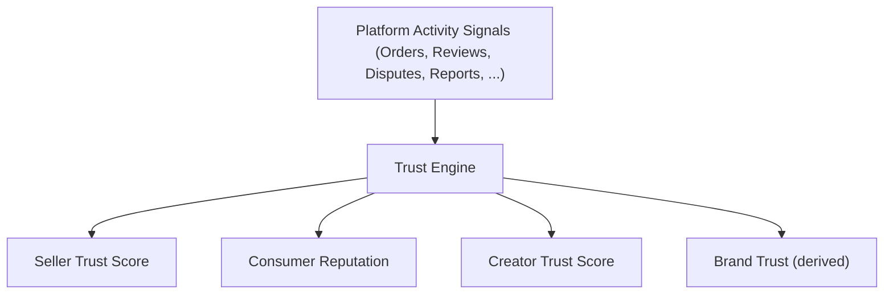
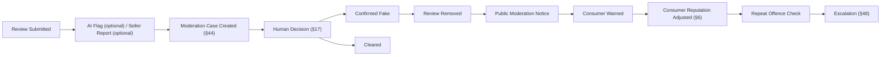
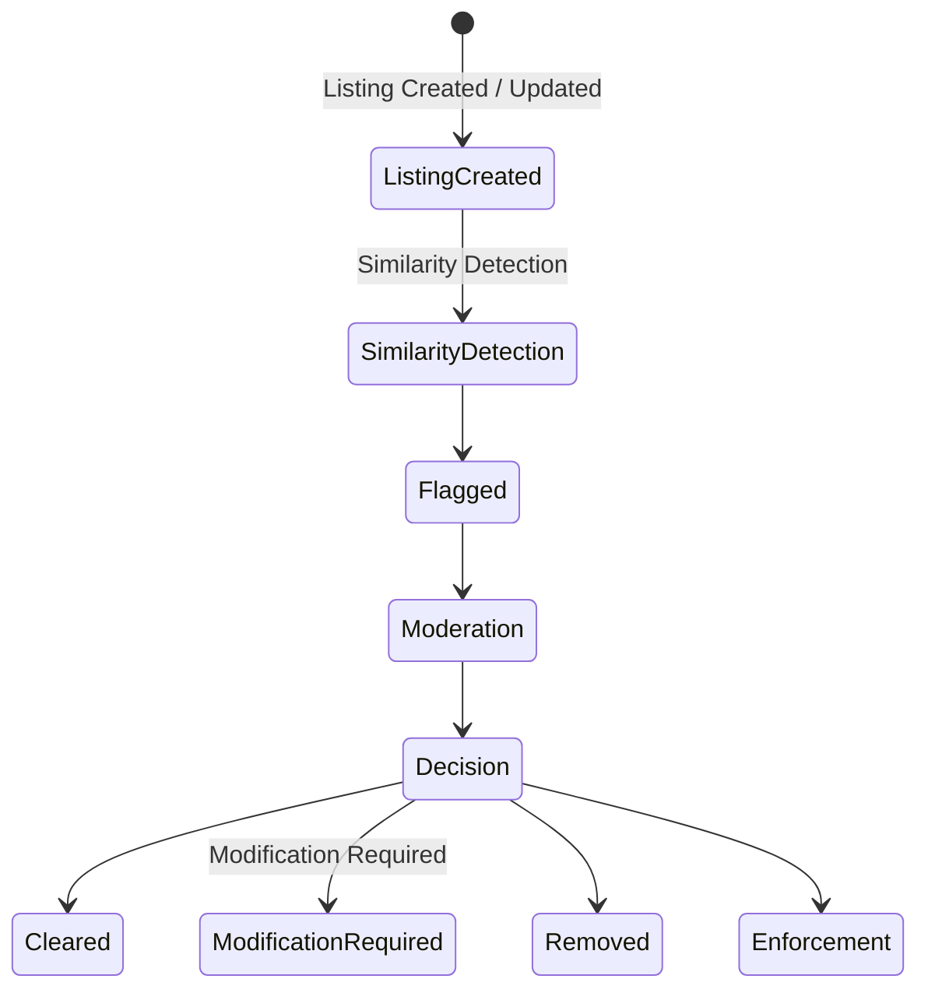
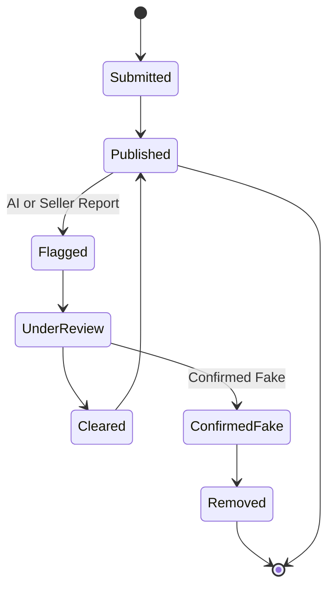
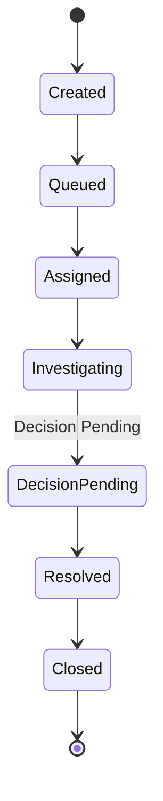
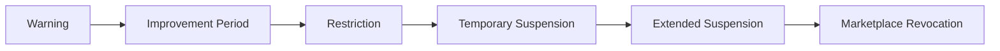

# Choosify Implementation Specification

**Document ID:** IS-006
**Title:** Trust, Reputation, Reviews & Moderation Implementation
**Version:** 1.0.0
**Status:** Draft
**Priority:** Critical

**Derived From:**

- BP-001 Vision & Constitution
- BP-002 User Ecosystem & Identity Model
- BP-004 Seller Workspace & Brand Architecture
- BP-005 Product & Service Engine
- BP-006 Commerce Engine (Orders, Checkout & Payments)
- BP-008 Trust, Reputation, Moderation & Governance Engine
- BP-010 Content, Discovery & Engagement Engine
- BP-011 Administration, CMS & Platform Operations Engine
- ES-001 Database Architecture
- ES-002 API Architecture
- ES-003 RBAC & Permission Matrix
- ES-004 Event Bus
- ES-005 Workflow State Machines
- ES-006 Notification Matrix
- ES-008 Security Architecture

This is a documentation-only Implementation Specification. It does not redesign the platform, invent new business rules, simplify architecture, or replace any BP/ES decision. No production code or database migration is contained in this document.

---

## Table of Contents

1. [Purpose](#1-purpose)
2. [Scope](#2-scope)
3. [Dependencies](#3-dependencies)
4. [Trust Engine Architecture](#4-trust-engine-architecture)
5. [Seller Trust Score Engine](#5-seller-trust-score-engine)
6. [Consumer Reputation Engine](#6-consumer-reputation-engine)
7. [Creator Trust Engine](#7-creator-trust-engine)
8. [Brand Reputation](#8-brand-reputation)
9. [Marketplace Reputation](#9-marketplace-reputation)
10. [Review System](#10-review-system)
11. [Verified Purchase Reviews](#11-verified-purchase-reviews)
12. [Verified Booking Reviews](#12-verified-booking-reviews)
13. [Seller Reply System](#13-seller-reply-system)
14. [Consumer Review Permissions](#14-consumer-review-permissions)
15. [Review Moderation](#15-review-moderation)
16. [AI Review Detection](#16-ai-review-detection)
17. [Human Moderation](#17-human-moderation)
18. [Fraud Detection](#18-fraud-detection)
19. [Spam Detection](#19-spam-detection)
20. [Copyright Detection](#20-copyright-detection)
21. [Fake Listing Detection](#21-fake-listing-detection)
22. [Duplicate Listing Detection](#22-duplicate-listing-detection)
23. [Fake Seller Detection](#23-fake-seller-detection)
24. [Fake Consumer Detection](#24-fake-consumer-detection)
25. [Fake Creator Detection](#25-fake-creator-detection)
26. [Review Lifecycle](#26-review-lifecycle)
27. [Trust Score Calculation](#27-trust-score-calculation)
28. [Reputation Events](#28-reputation-events)
29. [Featured Brand Logic](#29-featured-brand-logic)
30. [Promoted Brand Logic](#30-promoted-brand-logic)
31. [Search Ranking Integration](#31-search-ranking-integration)
32. [Recommendation Engine Integration](#32-recommendation-engine-integration)
33. [Marketplace Visibility Impact](#33-marketplace-visibility-impact)
34. [Trust Badges](#34-trust-badges)
35. [Verification Badges](#35-verification-badges)
36. [Featured Badges](#36-featured-badges)
37. [Promoted Labels](#37-promoted-labels)
38. [Seller Performance Dashboard](#38-seller-performance-dashboard)
39. [Consumer Reputation Dashboard](#39-consumer-reputation-dashboard)
40. [Creator Reputation Dashboard](#40-creator-reputation-dashboard)
41. [Trust History](#41-trust-history)
42. [Reputation History](#42-reputation-history)
43. [Moderation Queue](#43-moderation-queue)
44. [Moderation Cases](#44-moderation-cases)
45. [Manual Review Workflow](#45-manual-review-workflow)
46. [Automatic Flagging](#46-automatic-flagging)
47. [Appeal Workflow](#47-appeal-workflow)
48. [Suspension Workflow](#48-suspension-workflow)
49. [Marketplace Restriction Workflow](#49-marketplace-restriction-workflow)
50. [Marketplace Restoration Workflow](#50-marketplace-restoration-workflow)
51. [Event Bus Integration](#51-event-bus-integration)
52. [Notification Integration](#52-notification-integration)
53. [RBAC Requirements](#53-rbac-requirements)
54. [Database Dependencies](#54-database-dependencies)
55. [API Endpoints](#55-api-endpoints)
56. [Backend Services](#56-backend-services)
57. [Frontend Components](#57-frontend-components)
58. [Admin Components](#58-admin-components)
59. [Seller Components](#59-seller-components)
60. [Consumer Components](#60-consumer-components)
61. [Creator Components](#61-creator-components)
62. [Audit Logging](#62-audit-logging)
63. [Security Considerations](#63-security-considerations)
64. [Privacy Considerations](#64-privacy-considerations)
65. [Performance Considerations](#65-performance-considerations)
66. [Testing Checklist](#66-testing-checklist)
67. [Acceptance Criteria](#67-acceptance-criteria)
68. [Rollback Strategy](#68-rollback-strategy)
69. [Future Extensions](#69-future-extensions)
70. [Implementation Order](#70-implementation-order)
71. [Revision History](#revision-history)

---

## 1. Purpose

This document defines the implementation plan for the Trust, Reputation, Reviews & Moderation Engine of the Choosify Commerce Operating System, as governed by BP-008.

Trust is earned, cannot be purchased, and is continuously measured through real platform behaviour (BP-008 §3) — marketplace participation is built on maintaining trust, not merely completing verification. This IS translates that philosophy — plus the Review/Reply model, AI-assisted Moderation Centre, and progressive Marketplace Enforcement — into a concrete, sequenced implementation plan.

---

## 2. Scope

In scope:

- Trust Score computation for Sellers, Consumers, Creators, and Brands (BP-008 §4–§9)
- Review system: submission, Seller Reply, moderation, and fake-review handling (BP-008 §12–§15)
- AI-assisted and human Moderation, Reports, and the Moderation Centre (BP-008 §16–§19)
- Duplicate Listing and Fake Account (Seller/Consumer/Creator) detection (BP-008 §18, §23–§25 of this IS)
- Featured vs Promoted visibility distinction and its integration with Search/Discovery (BP-008 §10–§11)
- Progressive Marketplace Enforcement (Warning → Education → Restriction → Suspension → Removal) and Marketplace Suspension behaviour (BP-008 §20–§21)
- Trust/Reputation Dashboards and history views for Sellers, Consumers, and Creators
- Event Bus, RBAC, notification, and audit wiring for this domain

Out of scope (governed elsewhere, referenced not duplicated):

- Order/Payment/Escrow mechanics that generate the raw signals Trust consumes — already specified in IS-004
- Product/Service listing mechanics — already specified in IS-003
- Conversation/Messaging mechanics that generate Report/Moderation-relevant content — already specified in IS-005
- Search ranking algorithm internals and Recommendation Engine internals — BP-010, future IS (this IS defines the Trust *signals* they consume, not their ranking/recommendation logic)
- Dispute adjudication workflow itself — IS-004 §38 (this IS consumes Dispute *outcomes* as a Trust signal only)
- CMS/Website Manager mechanics for displaying Featured/Promoted placements on the storefront — BP-011, future IS

---

## 3. Dependencies

| Document | Relevance |
|----------|-----------|
| BP-001 | Article 1 (Trust First — never purchased), Article 4 (Transparency Over Manipulation — sponsored content always labelled) |
| BP-002 | Trust participants map to the User Ecosystem roles (Consumer, Seller, Creator) plus Brand |
| BP-004 | Brand Trust visible on Brand Profile (§17); Marketplace Suspension does not remove Orders/Messaging/Finance/Brand Studio/Inventory access (§11) — same constraint restated in BP-008 §21 |
| BP-005 | Reviews belong to completed transactions; Sellers may submit one official reply (§27) — same rule restated in BP-008 §13 |
| BP-006 | Every commercial transaction contributes to Trust (§29); Dispute outcomes may affect Trust, participation alone does not (IS-004 §43) |
| BP-008 | Authoritative source for this IS |
| BP-010 | Featured/Promoted content distinction (§14–§15); Search ranking combines Trust with other signals (BP-008 §11) |
| BP-011 | Moderation Centre and administrative case management are Administration-domain-adjacent; this IS defines the Trust/Moderation data surface Administration operates on |
| ES-001 | `reviews`, `review_replies`, `reports`, `trust_scores`, `moderation_cases` tables in the Trust Domain (§9) |
| ES-002 | `/api/v1/` conventions, standard envelope |
| ES-003 | Consumer Permissions include Review (§11); Seller Permissions include Reply Reviews (§12); Administrator Permissions include Moderate Reviews/Listings (§14) |
| ES-004 | Review Events (§12): `ReviewSubmitted`, `ReviewUpdated`, `ReviewRemoved`, `ReviewReported`, `SellerReplyAdded`, `ConsumerRated`, `TrustUpdated`. Moderation Events (§13): `ListingFlagged`, `ReviewFlagged`, `FraudDetected`, `SpamDetected`, `CopyrightViolation`, `CaseCreated`, `CaseResolved`, `MarketplaceWarningIssued` |
| ES-005 | Moderation Case Lifecycle (§51), Duplicate Listing Moderation (§52) |
| ES-006 | Review Notifications (§17), Moderation Notifications (§18) |
| ES-008 | Fraud Detection examples (§24), audit logging (§20) |

---

## 4. Trust Engine Architecture

Per BP-008 §3–§4: every participant (Consumer, Seller, Brand, Creator) maintains an independent Trust Profile; Trust never transfers between entities. Trust is continuously measured through real platform behaviour, not a one-time verification checkpoint (BP-008 §3).

The Trust Engine is a *consumer* of events from other domains (Commerce, Messaging, Catalog, Trust's own Reviews/Reports) — it never queries other domains' tables directly, per ES-001 §8 (cross-domain writes prohibited) and ES-004 §2 (decoupled event consumers).

---

## 5. Seller Trust Score Engine

Per BP-008 §5–§6 and the special implementation requirement ("Every approved Seller begins with a Trust Score of 100%. Trust Score changes over time based on platform activity"):

Seller Trust factors, per the special requirement and BP-008 §6 (both lists are consistent, this IS treats them as one unified factor set): Customer Reviews (Review Rating), Response Time, Order Completion Rate, Cancellation Ratio (Cancellation Rate), Return Ratio (Return Rate), Dispute Outcomes, Policy Violations, Spam, Fraud, Fake Products, Customer Support Performance (Customer Support Quality), plus Marketplace Compliance and Copyright Violations from BP-008 §6.

Trust is not designed to exceed the initial 100% baseline through artificial inflation (BP-008 §5) — exceptional performance is recognized through badges/Featured status (§29, §36), never a Trust Score above the baseline.

---

## 6. Consumer Reputation Engine

Per BP-008 §7 and the special implementation requirement ("Every Consumer begins with 100%. Negative behaviour includes: Fake Orders, Fake Reviews, Spam, Harassment, Refusing Delivery, Abusive Messaging, Policy Violations"):

This exactly matches BP-008 §7's signal list (Fake Orders, Refused Deliveries, Payment Reliability, Fake Reviews, Spam Behaviour, Harassment, Dispute Abuse, Communication Conduct, Cancellation Abuse) — "Refusing Delivery" = "Refused Deliveries," "Abusive Messaging" = "Communication Conduct"/Harassment. Consumers begin with full trust and lose trust only through repeated misconduct (BP-008 §7) — a single minor incident does not necessarily trigger a Trust reduction; this IS implements Consumer Reputation as cumulative, not single-event-triggered by default.

---

## 7. Creator Trust Engine

Per BP-008 §8 and the special implementation requirement ("Creators may recommend only products and services they have genuinely tested or verified according to platform policy. Fake recommendations are prohibited"):

Creator Trust factors: Content Authenticity, Disclosure Compliance, Community Reports, Platform Violations, Educational Quality, Recommendation Accuracy (BP-008 §8). A Creator recommendation not backed by genuine evaluation or transparent sponsorship disclosure is a Recommendation Accuracy / Disclosure Compliance violation, feeding directly into Creator Trust reduction.

---

## 8. Brand Reputation

Per BP-008 §9: Brand Trust reflects commercial reputation and considers Seller Trust, Product Reviews, Service Reviews, Returns, Complaints, Marketplace Compliance, and Customer Satisfaction. Brand Trust is a *derived* score — computed from the underlying Seller Trust Score (§5) plus Brand-specific review/return signals — not an independently tracked participant Trust Profile in the same sense as §5–§7 (BP-008 §4 lists Brand as a Trust Participant, but §9 describes it as considering Seller Trust as an input, confirming the derived relationship). Brand Trust contributes to storefront visibility (BP-008 §9, §33).

---

## 9. Marketplace Reputation

Marketplace-wide reputation is the aggregate effect of individual Seller/Brand/Consumer/Creator Trust Profiles on platform-wide discovery quality (BP-008 §1: "Trust... influences visibility, discovery, verification, moderation, and platform reputation"). This IS does not compute a separate "Marketplace Trust Score" — Marketplace Reputation is an emergent property surfaced through aggregated Analytics (BP-011 §15), not a new individually-tracked entity beyond §4's four Trust Participants.

---

## 10. Review System

Per BP-008 §12: Reviews are available for Products, Services, Brands, and Creators, originating only from verified transactions where applicable (BR-8.6).

---

## 11. Verified Purchase Reviews

Per BP-005 §27 and BP-008 §12/BR-8.6, and the special implementation requirement ("Verified transactions only"): a Product review may only be submitted against a completed Order the reviewing Consumer actually placed (IS-004 §21 Order Lifecycle, `Completed` state) — the review submission endpoint validates Order ownership and completion status before accepting the review.

---

## 12. Verified Booking Reviews

Mirrors §11 for Service/Hotel/Tour bookings: a review may only be submitted against a Booking that reached its "Review Eligible" state (IS-004 §22–§24) — Service/Hotel/Tour Lifecycle completion, not merely a Booking Request having been made.

---

## 13. Seller Reply System

Per BP-008 §13 and BR-8.7, and the special implementation requirement ("Sellers may publish one official reply"): Sellers may publish exactly one official reply per review, permanently associated with that review; additional replies require administrative intervention (BP-008 §13) — this is an application-enforced one-reply-per-review constraint, not merely a UI suggestion.

---

## 14. Consumer Review Permissions

Per the special implementation requirements ("Consumers may review once. Consumers cannot edit reviews after submission"):

- One review per Consumer per verified transaction (§11–§12) — not one review per Consumer per Product/Service lifetime, since a Consumer could legitimately purchase the same item again.
- Reviews are immutable after submission by the Consumer — no Consumer-facing edit endpoint exists; only Admin edit/removal (§17, per the special requirement "Admins may edit or remove reviews") and the fake-review removal path (§26) can alter or remove a published review.

---

## 15. Review Moderation

Per BP-008 §14 and the special implementation requirement's full workflow ("AI may flag suspicious reviews. Sellers may report fake reviews. If a review is confirmed fake: Review removed, Public moderation notice displayed, Consumer warned, Consumer Reputation adjusted. Repeat offences trigger escalation"):

This matches BP-008 §14/BR-8.8 exactly (Review Removed, Public Moderation Notice Displayed, Consumer Warned, Trust Score Reduced, Escalation Recorded) — the special requirement's "Consumer Reputation adjusted" is the same signal as BP-008 §14's "Trust Score Reduced" applied to the Consumer Reputation Engine (§6).

---

## 16. AI Review Detection

Per BP-008 §17 (AI Moderation: "Detect Suspicious Reviews") and BR-8.10 ("AI assists moderation but never replaces administrative authority"): AI produces a flag/recommendation on a review (feeding §15's workflow); it never autonomously removes a review or reduces Trust — every AI flag routes to Human Moderation (§17) for a final administrative decision.

---

## 17. Human Moderation

Per BP-008 §17 and BR-8.10: Administrators approve final decisions on every AI-recommended action. This IS implements Human Moderation as the mandatory terminal decision point for every Moderation Case (§44) — no case auto-resolves purely from an AI signal, consistent with the special principle "No trust manipulation" (§below, principles list) applied to the moderation process itself (AI cannot be gamed into an automatic removal without human sign-off).

---

## 18. Fraud Detection

Per BP-008 §17 (AI may "Detect Fraud Patterns") and §6/§7 (Fraud is a Seller/Consumer Trust factor): Fraud Detection is one of the AI Moderation capabilities (§16), producing `FraudDetected` events (§28, ES-004 §13) that feed both Moderation Cases (§44) and the relevant participant's Trust Score (§5–§6).

---

## 19. Spam Detection

Mirrors §18 for Spam — AI may "Detect Spam" (BP-008 §17), producing `SpamDetected` events (ES-004 §13), relevant to both Seller Trust (§5, "Spam") and Consumer Reputation (§6, "Spam").

---

## 20. Copyright Detection

Mirrors §18 for Copyright — AI may "Detect Copyright Violations" (BP-008 §17), producing `CopyrightViolation` events (ES-004 §13), relevant to Seller Trust (§5, "Copyright Violations").

---

## 21. Fake Listing Detection

Per BP-008 §17 (AI may "Detect Fake Listings"): a Fake Listing flag (`ListingFlagged`, ES-004 §13) routes a Product/Service (IS-003 scope) into the Moderation Queue (§43) for Human Moderation (§17) — this IS is responsible for the flagging/case-creation integration point, not the Product/Service data itself (owned by IS-003).

---

## 22. Duplicate Listing Detection

Per BP-008 §18 and BR-8.9 ("Duplicate listings are prohibited") and ES-005 §52, matching the special implementation requirement exactly ("Duplicate listings: Automatically flagged. Queued for moderation"):

Detection methods: Text Similarity, Image Matching, Metadata Analysis, Manual Reports (BP-008 §18) — copying another Seller's listing is prohibited; this is a Catalog-domain-adjacent detection consumed by this Trust/Moderation subsystem, not a rewrite of IS-003's listing ownership model.

---

## 23. Fake Seller Detection

Per BP-008 §17 (AI Moderation applies platform-wide to accounts as well as content, consistent with §19 Moderation Centre managing "Fake Accounts"): Fake Seller Detection routes through the same AI-assist → Moderation Case → Human Decision pipeline as §15/§21, scoped to Seller/Brand identity signals (verification document anomalies, behavioral patterns) rather than listing content.

---

## 24. Fake Consumer Detection

Mirrors §23 for Consumer accounts — feeding directly into Consumer Reputation (§6) "Fake Orders" and "Payment Reliability" signals.

---

## 25. Fake Creator Detection

Mirrors §23 for Creator accounts — feeding into Creator Trust (§7) "Content Authenticity" and "Platform Violations" signals.

---

## 26. Review Lifecycle

Per BP-008 §14/BR-8.8, consolidating §11–§15/§26 into one lifecycle:

Removal always carries a Public Moderation Notice (§15) rather than silently disappearing — the platform record indicates removal for policy violation without retaining the prohibited content (BP-008 §14 wording).

---

## 27. Trust Score Calculation

Per BP-008 §5 (100% baseline, never exceeded) and §6–§8 (factor lists per participant type): this IS implements Trust Score as a continuously-recalculated value, event-driven (recalculated on relevant signal events, §28, §51) rather than only on a fixed schedule — though a periodic reconciliation job (ES-009 §11 Background Jobs) is also appropriate to catch any missed/delayed signals. The specific weighting formula per factor is intentionally not specified by BP-008/ES-005/ES-006 and is therefore *not* invented by this IS (per the "do not introduce new business rules" instruction) — this IS defines the factor inputs (§5–§7) and the computation trigger points (§28), and the exact weighting algorithm is an implementation detail to be defined by Administration configuration (consistent with BP-011 §19 System Configuration), not hard-coded business logic.

---

## 28. Reputation Events

Consolidates the Trust-relevant events from ES-004 §12–§13 that recompute a participant's Trust Score: `ReviewSubmitted`, `ReviewRemoved`, `SellerReplyAdded`, `ConsumerRated`, `TrustUpdated`, `FraudDetected`, `SpamDetected`, `CopyrightViolation`, `CaseResolved`. Every one of these events, when consumed by the Trust Engine (§4), may trigger a Trust Score recalculation and emits `TrustUpdated` in turn (§51).

---

## 29. Featured Brand Logic

Per BP-008 §10 and BR-8.4 ("Featured placement is earned"), matching the special implementation requirement ("Trusted Brands: Display 'Featured.' Featured status is earned"):

Featured eligibility criteria: High Trust, Excellent Reviews, Strong Service, Platform Performance (BP-008 §10). Displayed as `⭐ Featured`. This is computed from the Brand Trust score (§8) and related signals — never purchasable, distinct from §30.

---

## 30. Promoted Brand Logic

Per BP-008 §10 and BR-8.5 ("Promoted placement is paid and must always be labelled"), matching the special requirement ("Sponsored Brands: Always display 'Promoted.' Promoted status is purchased"):

Promoted placement is paid advertising, displayed as `💎 Promoted`, and never hides its commercial nature (BP-008 §10) — this IS's responsibility is ensuring the label is always rendered whenever Promoted placement is active; the advertising/billing mechanism itself is Finance/Administration scope (BP-009 §9 Platform Revenue: Sponsored Listings), referenced not owned here.

---

## 31. Search Ranking Integration

Per BP-008 §11 and BR-8.12 ("Trust directly influences platform discovery and reputation but never overrides clearly identified sponsored placement"), matching the special requirement ("Trust Scores influence marketplace ranking. Higher Trust Scores improve organic visibility. Trust Scores never override Sponsored placements"):

Search ranking combines Relevance, Availability, Brand Trust, Consumer Behaviour, Sponsored Placement, Featured Status, Product Quality, and Delivery Performance (BP-008 §11) as independent signals — Trust influences organic ranking; Sponsored placement influences advertising position; these remain independent systems (BP-008 §11). This IS's responsibility is exposing the Trust Score as a ranking-input signal via the Event Bus/read API; the ranking algorithm itself belongs to BP-010/Discovery.

---

## 32. Recommendation Engine Integration

Per BP-008 §1 (Trust influences "discovery") and BP-010 §16 (Recommendation Engine signals include Trust and Quality): mirrors §31 — this IS exposes Trust Score as one input signal to Recommendations; the recommendation algorithm itself is BP-010/Discovery scope.

---

## 33. Marketplace Visibility Impact

Per BP-008 §21 and the "When both apply" special requirement ("Sponsored placement appears first. Featured status remains visible beside the Brand"):

Marketplace Suspension (BP-004 §11/BP-008 §21) affects Search, Brand Visibility, Product Visibility, Deals, and Recommendations but does not remove Orders, Messaging, Finance, Brand Studio, or Inventory access (BP-008 §21, matching IS-004 §19's marketplace-suspension-never-interrupts-Orders rule exactly). Where a Brand is both Sponsored and Featured simultaneously, Sponsored placement appears first in ordering, with the Featured badge (§36) still rendered beside the Brand — the two are independent, co-displayable signals (§31), never mutually exclusive.

---

## 34. Trust Badges

General badge surface for a participant's current Trust standing (e.g. "High Trust Seller"), derived from the Trust Score (§27) — a presentational layer over the underlying score, not a separately stored value distinct from the score itself.

---

## 35. Verification Badges

Per BP-004 §17 (Brand Profile includes "Verification Badge") and BP-003 §10 (Identity Verification): reflects the outcome of Identity/Brand Verification (IS-001, IS-002) — a binary verified/not-verified indicator, distinct from the continuous Trust Score (§27); a Brand can be Verified without being Featured, and vice versa is not possible (Featured requires High Trust which implies a verified, approved participant per BP-008 §5).

---

## 36. Featured Badges

The rendered `⭐ Featured` label (§29, BP-008 §10) — presentational implementation of Featured Brand Logic.

---

## 37. Promoted Labels

The rendered `💎 Promoted` label (§30, BP-008 §10) — presentational implementation of Promoted Brand Logic, always visible per BR-8.5, never suppressible by the Seller purchasing the placement.

---

## 38. Seller Performance Dashboard

Aggregated view of a Seller's Trust Score (§5), its contributing factors, and recent Trust-affecting events (§28) — consistent with BP-004 §21 (Analytics in Workspace Navigation) and BP-011 §5 (Dashboard widgets include "Pending Verifications," "Fraud Alerts" at the platform level; this is the Seller-scoped equivalent).

---

## 39. Consumer Reputation Dashboard

Mirrors §38 for Consumer Reputation (§6) — a Consumer-facing view of their own reputation standing and any warnings/adjustments (§15), supporting transparency (BP-001 Article 4).

---

## 40. Creator Reputation Dashboard

Mirrors §38 for Creator Trust (§7).

---

## 41. Trust History

Per BP-001 Article 8 (Auditability): a chronological view of every Trust Score-affecting event (§28) for a given participant, sourced from the audit trail (§62) — supports both the participant's own dashboard (§38–§40) and Administrative review (§58).

---

## 42. Reputation History

Synonymous with §41 for Consumer/Creator Reputation specifically — this IS treats "Trust History" and "Reputation History" as the same underlying event-log mechanism applied to different participant types, not two separate systems.

---

## 43. Moderation Queue

Per BP-008 §19 (Moderation Centre manages User Reports, Fraud, Copyright, Fake Accounts, Spam, AI Alerts, Manual Investigations): the Moderation Queue is the intake surface listing all open Moderation Cases (§44) awaiting Human Moderation (§17) decision, filterable by source (AI flag, Seller/Consumer report, manual investigation).

---

## 44. Moderation Cases

Per BP-008 §19 and ES-005 §51:

Every case receives a Case ID, Assigned Moderator, Timeline, Decision, and Audit History (BP-008 §19) — cases may be reopened only through authorized administrative procedures (ES-005 §51).

---

## 45. Manual Review Workflow

Per BP-008 §16 (Reports generate moderation cases): a platform participant's Report (Fake Products, Fake Reviews, Spam, Copyright, Harassment, Abuse, Counterfeit Goods, Identity Fraud, per BP-008 §16) manually creates a Moderation Case (§44), entering the same queue (§43) and Human Moderation pipeline (§17) as AI-flagged cases.

---

## 46. Automatic Flagging

Per BP-008 §17 (AI Moderation capabilities) consolidating §16, §18–§25: any AI detection (Spam, Fake Listing, Duplicate Listing, Suspicious Review, Copyright Violation, Fraud Pattern, Offensive Content, per BP-008 §17) automatically creates a Moderation Case (§44) with `source = AI` — AI never resolves the case itself (§16–§17), it only ever creates or contributes evidence to one.

---

## 47. Appeal Workflow

Not separately named in BP-008. Given no explicit BP/ES appeal-process specification, this IS does not invent a formal appeal state machine; it notes that Administrative case-reopening ("cases may be reopened only through authorized administrative procedures," ES-005 §51) is the closest existing mechanism, and treats a fuller Appeal Workflow as unscoped/Future (§69) rather than fabricating new business rules.

---

## 48. Suspension Workflow

Per BP-008 §20/BR-8.11 and the special implementation requirement's exact progression ("Warning → Improvement Period → Restriction → Temporary Suspension → Extended Suspension → Marketplace Revocation. Severe fraud may bypass warning stages"):

This is a more granular restatement of BP-008 §20's progression (Warning → Education → Temporary Restriction → Marketplace Suspension → Permanent Removal) — this IS implements the special requirement's six-stage version as the authoritative sequence, since it is the more specific of the two consistent descriptions, and both source Marketplace Enforcement is fundamentally the same progressive-discipline mechanism (BR-8.11). Severe fraud may bypass warning stages entirely (BP-008 §20, special requirement).

---

## 49. Marketplace Restriction Workflow

The "Restriction" stage of §48 — a partial capability reduction short of full suspension (e.g. reduced search visibility, capped listing count), applied per Administrative decision from a Moderation Case (§44) outcome.

---

## 50. Marketplace Restoration Workflow

Per BP-004 §7/ES-005 §8 (Marketplace Access: Suspended → Restored → Granted): restoration reverses a Suspension/Restriction stage in §48–§49 back toward full Marketplace Access, following the same Marketplace Access state machine already defined in IS-002 §7 — this IS does not introduce a second, parallel restoration mechanism; enforcement actions here operate on the same Marketplace Access entity IS-002 owns.

---

## 51. Event Bus Integration

Per ES-004 §12–§13, this domain emits:

**Review Events:** `ReviewSubmitted`, `ReviewUpdated`, `ReviewRemoved`, `ReviewReported`, `SellerReplyAdded`, `ConsumerRated`, `TrustUpdated`

**Moderation Events:** `ListingFlagged`, `ReviewFlagged`, `FraudDetected`, `SpamDetected`, `CopyrightViolation`, `CaseCreated`, `CaseResolved`, `MarketplaceWarningIssued`

Every event carries standard ES-004 §18 metadata (Event ID, Name, Timestamp, Producer, Domain: Trust, Aggregate ID, Actor, Correlation ID, Payload, Version). Per ES-004 §2, this domain never calls Search, Discovery, Finance, or Notification services directly — those domains subscribe independently (relevant to §31–§32).

---

## 52. Notification Integration

Per ES-006 §17 (Review Notifications) and §18 (Moderation Notifications):

| Trigger | Notification |
|---------|---------------|
| Review received | Review Received |
| Seller reply posted | Seller Reply |
| Review flagged | Review Flagged |
| Review removed (confirmed fake) | Review Removed |
| Review cleared/approved | Review Approved |
| Trust Score recalculated | Trust Score Updated |
| Listing flagged | Listing Flagged |
| Moderation Case opened | Case Opened |
| Additional info requested | Additional Information Required |
| Warning issued | Policy Warning |
| Restriction applied | Marketplace Restriction |
| Suspension applied | Suspension Notice |
| Marketplace Revocation applied | Ban Notice |

Per ES-006 §2, this domain emits the events in §51; the Notification Engine resolves recipients and delivers — this domain never calls the Notification Engine directly.

---

## 53. RBAC Requirements

Per ES-003 §11 (Consumer: Review), §12 (Seller: Reply Reviews — "Cannot: Moderate Platform Reviews"), §14 (Administrator: Moderate Reviews, Moderate Listings, Verify Brands): every Trust/Moderation-scoped endpoint validates the full ES-003 §16 pipeline. Consumers may submit/view their own reviews only; Sellers may reply to reviews on their own Brand's listings only and may report reviews, but cannot moderate (remove/edit) any review — that authority belongs exclusively to Administrators (ES-003 §12 explicit "Cannot" list, matching the special requirement "Admins may edit or remove reviews").

---

## 54. Database Dependencies

Per ES-001 §9 (Trust module):

| Table | Owns | Key Fields |
|-------|------|------------|
| `reviews` | Review records (§10–§12, §26) | `id`, `order_id` (ownership, ES-001 §7), `reviewer_id`, `subject_type`/`subject_id` (Product/Service/Brand/Creator), `status` |
| `review_replies` | Seller Reply records (§13) | `review_id`, `brand_id`, one-per-review constraint |
| `trust_scores` | Current Trust Score per participant (§5–§8) | `entity_type`, `entity_id`, `score`, `updated_at` |
| `moderation_cases` | Moderation Cases (§44) | `id`, `case_type`, `source` (AI/Report/Manual), `subject_type`/`subject_id`, `status`, `assigned_moderator_id` |
| `reports` | Platform participant reports (§45, BP-008 §16) | `reporter_id`, `subject_type`/`subject_id`, `reason` |

All tables follow ES-001 conventions: UUID primary keys, `created_at`/`updated_at`/`deleted_at`, `snake_case` naming, indexes on primary key/foreign keys/`created_at`/`status`. Reviews removed for fraud (§15, §26) are soft-deleted with the removal reason retained (ES-001 §11 Business entities → Soft Delete) — never hard-deleted, so the Public Moderation Notice can reference the removal event. Schema migration itself is out of scope for this document.

---

## 55. API Endpoints

All endpoints follow ES-002 conventions.

| Method | Endpoint | Purpose | Auth |
|--------|----------|---------|------|
| POST | `/api/v1/orders/{id}/review` | Submit a Verified Purchase/Booking Review (§11–§12) | Yes (ownership) |
| GET | `/api/v1/products/{id}/reviews` | List published reviews for a listing | No |
| POST | `/api/v1/reviews/{id}/reply` | Seller posts official reply (§13) | Yes (ownership, one-reply constraint) |
| POST | `/api/v1/reviews/{id}/report` | Report a suspected fake review (§15, §45) | Yes |
| GET | `/api/v1/trust/{entityType}/{entityId}` | Read current Trust Score / badges (§27, §34–§37) | No (public where applicable) |
| GET | `/api/v1/trust/{entityType}/{entityId}/history` | Trust/Reputation History (§41–§42) | Yes (self or admin) |
| GET | `/api/v1/seller/performance` | Seller Performance Dashboard (§38) | Yes (ownership) |
| GET | `/api/v1/consumer/reputation` | Consumer Reputation Dashboard (§39) | Yes (self) |
| GET | `/api/v1/creator/reputation` | Creator Reputation Dashboard (§40) | Yes (self) |
| GET | `/api/v1/admin/moderation/queue` | Moderation Queue (§43) | Yes (admin permission) |
| GET | `/api/v1/admin/moderation/cases/{id}` | Moderation Case detail (§44) | Yes (admin permission) |
| PATCH | `/api/v1/admin/moderation/cases/{id}` | Human Moderation decision (§17, §26) | Yes (admin permission) |
| PATCH | `/api/v1/admin/reviews/{id}` | Admin edit/remove a review (§14, §26) | Yes (admin permission) |
| POST | `/api/v1/admin/sellers/{id}/enforcement` | Apply Warning/Restriction/Suspension/Revocation (§48–§49) | Yes (admin permission) |
| POST | `/api/v1/admin/sellers/{id}/restore` | Restore Marketplace Access (§50) | Yes (admin permission) |

Featured/Promoted flag-setting endpoints live within the Brand/Marketplace surface (IS-002) and Finance/Advertising surface (BP-009) respectively — this IS's responsibility is computing/reading the underlying Trust signal (§29) and rendering the label (§36–§37), not the commercial mechanics of purchasing Promoted placement.

---

## 56. Backend Services

Implementation order, gated per ES-010 §13 Quality Gates:

1. **Trust computation service** — event-driven Trust Score recalculation (§27–§28) for Seller/Consumer/Creator, with Brand Trust derived from Seller Trust (§8). Extends existing `server/moderation/reputationEngine.ts` already present in the admin repo, rather than introducing a parallel scoring module (ES-010 §8).
2. **Review service** — submission with verified-transaction validation (§11–§12), one-review-per-transaction and immutability enforcement (§14), Seller Reply (§13, one-reply constraint).
3. **Moderation service** — Case creation (manual §45 and automatic §46), Queue (§43), Human Moderation decisioning (§17), extending existing `server/moderation/moderationService.ts`, `moderationQueue.ts`, `moderationStore.ts`, `moderationRouter.ts`, and `bulkModeration.ts`.
4. **AI detection integration** — wiring AI-produced flags (§16, §18–§25) into Moderation Case creation (§46); the AI models/detection logic themselves are outside this IS's documentation-only scope (BP-008 §17 treats AI as an assisting capability, not a component this IS specifies internals for).
5. **Enforcement service** — implements the Suspension Workflow progression (§48–§50), operating on the same Marketplace Access entity as IS-002.
6. **Featured/Promoted computation service** — reads Trust Score (§5, §8) plus Finance's Sponsored-placement flag to determine display eligibility and ordering (§29–§30, §33).
7. **RBAC wiring** — every endpoint in §55 passes through `server/middleware/authorization.ts` / `server/permissions/authorization.ts` (existing).
8. **Event emission** — wire each service action to §51.
9. **Audit logging** — wire each state-changing action to §62.

---

## 57. Frontend Components

- **Review submission form** — gated to verified/eligible transactions only (§11–§12), with a clear one-time, non-editable submission notice matching §14.
- **Review display with Seller Reply** — renders the single official reply where present (§13).
- **Trust/Verification/Featured/Promoted badges** — shared presentational components consumed across Brand Profile, Search results, and Product/Service listing cards (§34–§37).
- **Report review / Report listing** entry points (§15, §45).

---

## 58. Admin Components

- **Moderation Centre** — Queue (§43) and Case detail/decision UI (§44, §17), extending existing `src/pages/admin/Moderation.tsx` and `src/pages/admin/ModerationV2.tsx`.
- **Review management** — edit/remove reviews (§14), extending existing `src/pages/admin/Reviews.tsx`.
- **Trust Center** — platform-wide Trust oversight, extending existing `src/pages/admin/TrustCenter.tsx`.
- **Seller enforcement UI** — apply/restore Marketplace enforcement stages (§48–§50), extending existing `src/pages/admin/SellerReview.tsx`.

---

## 59. Seller Components

- **Seller Performance Dashboard** (§38), extending existing `src/contexts/TrustContext.tsx`.
- **Review Reply UI** (§13), respecting the one-reply constraint.
- **Report fake review** entry point (§15).

---

## 60. Consumer Components

- **Consumer Reputation Dashboard** (§39) — transparency into their own standing (BP-001 Article 4).
- **Review submission UI** — post-purchase/post-booking prompt, gated by eligibility (§11–§12).

---

## 61. Creator Components

- **Creator Reputation Dashboard** (§40).
- **Recommendation disclosure UI** — supports Creator Trust Engine's Disclosure Compliance factor (§7) by making sponsorship/genuine-evaluation status an explicit, structured field on Creator content rather than free text.

---

## 62. Audit Logging

Per ES-008 §20: every state-changing action records Actor, Timestamp, Action, Entity, Old Value, New Value, IP Address, Device, Correlation ID, and produces an immutable audit record.

Minimum audited actions: Review submission/removal/admin-edit, Seller Reply posting, every Trust Score recalculation with contributing factor breakdown, every Moderation Case creation/assignment/decision, every Suspension Workflow stage transition (§48–§50), Report submission.

---

## 63. Security Considerations

Per ES-008:

- Review submission validates ownership of a completed, verified transaction (§11–§12) before accepting the write — this is the primary anti-fraud gate for the review system.
- AI-produced flags never directly mutate Trust Score or remove content without passing through the Human Moderation decision point (§16–§17, BR-8.10) — this is a hard architectural constraint, not merely a policy recommendation.
- Enforcement actions (§48–§50) are restricted to Administrator permissions only (§53); no Seller-facing or Consumer-facing endpoint can trigger a Suspension or Revocation.
- Consistent with the platform principles listed in the special requirements ("No fake reviews. No manipulated rankings. No trust manipulation"), this IS ensures Trust Score is never directly writable via any API — it is always derived from the event-driven computation in §27–§28, never a raw settable field.

---

## 64. Privacy Considerations

Per ES-008 §21 (Privacy: Data Minimization, Purpose Limitation): Consumer Reputation details (§39) are visible to the Consumer themselves and to Administrators, not to Sellers directly beyond the aggregate signal already surfaced via Seller-facing Consumer evaluation (BP-008 §15). Moderation Case internals (evidence, moderator identity) are Admin-only (§58) and never exposed to the reported/reporting party beyond the final outcome notification (§52).

---

## 65. Performance Considerations

Per ES-009: Trust Score reads (§55 `GET /trust/{entityType}/{entityId}`) are high-frequency (consumed by Search/Discovery ranking, §31–§32) and should be served from a cached current-value read (ES-009 §7 Application Cache), invalidated on `TrustUpdated` events (§28, §51) — never recomputed synchronously on every read. Moderation Queue listing is indexed on `status` + `created_at` (ES-001 §12).

---

## 66. Testing Checklist

- [ ] Every newly approved Seller, Consumer, and Creator begins with exactly a 100% Trust Score/Reputation (§5–§7, BR-8.2)
- [ ] Trust Score never exceeds the 100% baseline regardless of positive activity (§5, §27)
- [ ] A review can only be submitted against a verified, completed transaction the reviewer actually owns, and only once per transaction (§11–§12, §14)
- [ ] A submitted review cannot be edited by the Consumer; only Admin edit/removal is possible (§14)
- [ ] A Seller can post exactly one official reply per review; a second reply attempt is rejected without administrative intervention (§13)
- [ ] AI can flag a review/listing/account but cannot itself remove content or change Trust Score — every action requires a Human Moderation decision (§16–§17)
- [ ] A confirmed-fake review triggers the full chain: removal, public moderation notice, consumer warning, Consumer Reputation adjustment, and repeat-offence escalation tracking (§15, §26)
- [ ] Duplicate listings are automatically flagged and queued for moderation, never auto-removed without review (§22)
- [ ] Featured status is never purchasable and Promoted status is never earned — the two remain fully independent and both correctly labelled when simultaneously active, with Sponsored ordering first and Featured badge still visible (§29–§30, §33)
- [ ] Trust Score influences organic ranking but never overrides or hides Sponsored placement labelling (§31, BR-8.12)
- [ ] Marketplace Suspension/Restriction hides Search/Brand/Product visibility and Deals/Recommendations but never removes Orders, Messaging, Finance, Brand Studio, or Inventory access (§33, matching BP-008 §21 exactly)
- [ ] The Suspension Workflow progresses Warning → Improvement Period → Restriction → Temporary Suspension → Extended Suspension → Marketplace Revocation, with severe fraud able to bypass warning stages (§48)
- [ ] Every event in §51 is emitted with correct ES-004 §18 metadata; every notification in §52 is triggered via events only
- [ ] Every state-changing action produces an immutable audit record (§62)

---

## 67. Acceptance Criteria

This IS is considered complete when:

- Seller, Consumer, and Creator Trust/Reputation Engines match BP-008 §5–§8 and the special requirements' exact factor lists
- Brand Reputation is correctly derived from Seller Trust and Brand-specific signals (§8–§9)
- Review System, Verified Purchase/Booking Reviews, Seller Reply, and Consumer Review Permissions match BP-008 §12–§15 and the special one-review/no-edit/one-reply rules exactly
- AI Review/Fraud/Spam/Copyright/Fake-Listing/Duplicate-Listing/Fake-Account Detection all route through Human Moderation before any content or Trust-affecting action is finalized (§16–§25, BR-8.10)
- Featured vs Promoted logic matches BP-008 §10 exactly, including correct co-display ordering when both apply (§29–§30, §33)
- Marketplace Enforcement follows the exact progressive stages in §48, with severe-fraud bypass supported
- Marketplace Suspension never interrupts Orders/Messaging/Finance/Brand Studio/Inventory access (§33)
- All endpoints in §55 pass the ES-003 §16 RBAC pipeline, with enforcement actions restricted to Administrators only
- All events in §51 are emitted with correct ES-004 §18 metadata; all notifications in §52 are triggered via events only
- All actions in §62 produce immutable audit records
- The testing checklist in §66 passes in full
- No BP or ES document required modification to complete this implementation

---

## 68. Rollback Strategy

- Each backend service in §56 is deployed independently behind standard release gates (ES-010 §11), allowing rollback to the prior deployed version without data loss.
- Database changes follow the ES-001 §15 migration workflow; every migration is paired with a tested down-migration before Production deployment.
- Trust Score computation changes are feature-flagged (ES-010 §15) so a defective scoring change can be disabled instantly, falling back to the last-known-good computed score, without a full code rollback.
- Enforcement actions (§48–§50) are never automatically reversed by a rollback — reverting code does not un-suspend a Seller; any correction requires an explicit Administrative restoration action (§50), keeping enforcement history intact and auditable.
- Reviews and Moderation Cases are never hard-deleted (§54), so rollback of this subsystem never causes loss of review/moderation history.
- Because Trust signals are consumed by Search, Discovery, Analytics, and Administration (§3), rollback must be validated against those domains' Trust-dependent flows before execution in Production.
- Audit logs and emitted events are never rolled back or deleted (ES-008 BR-8.6).

---

## 69. Future Extensions

Explicitly deferred, per the source documents and the absence of a specified requirement:

- A formal Appeal Workflow beyond administrative case-reopening (§47) — not specified by BP-008/ES-005, intentionally not invented here
- AI Discovery Assistant (Emi AI) consuming Trust signals for buying advice (BP-010 §20, marked Future)
- Corporate/advanced Sponsored placement programmes beyond the current Promoted model (BP-009 §9)
- The specific Trust Score weighting algorithm (§27) — left as Administration-configurable per BP-011 §19, not hard-coded in this phase

---

## 70. Implementation Order

**Phase 1 — Database**
Implement Trust Domain tables per §54 (`reviews`, `review_replies`, `trust_scores`, `moderation_cases`, `reports`), following the ES-001 §15 migration workflow, building on the Commerce (IS-004), Catalog (IS-003), and Identity (IS-001) tables this domain references.

**Phase 2 — Trust Engine**
Implement the Trust computation service (§56 step 1): Seller/Consumer/Creator Trust Score calculation and Brand Trust derivation, extending existing `server/moderation/reputationEngine.ts`.

**Phase 3 — Review Engine**
Implement the Review service (§56 step 2): verified-transaction-gated submission, immutability, Seller Reply constraint.

**Phase 4 — Moderation Engine**
Implement the Moderation service and AI-detection integration (§56 steps 3–4): Queue, Case lifecycle, Human Moderation decisioning, extending existing `server/moderation/` infrastructure.

**Phase 5 — REST APIs**
Implement and RBAC-wire the endpoints in §55, gated behind the ES-002 standard envelope and the ES-003 §16 authorization pipeline, with enforcement endpoints restricted to Administrator permissions.

**Phase 6 — Admin Dashboard**
Implement §58 (Moderation Centre, Review management, Trust Center, Seller enforcement UI), extending existing `src/pages/admin/Moderation.tsx`, `ModerationV2.tsx`, `Reviews.tsx`, `TrustCenter.tsx`, `SellerReview.tsx`.

**Phase 7 — Seller Dashboard**
Implement §59 (Seller Performance Dashboard, Review Reply UI, Report entry point).

**Phase 8 — Consumer Storefront**
Implement §57/§60/§61 (Review submission, Trust/Featured/Promoted badges, Consumer Reputation Dashboard, Creator Reputation Dashboard).

**Phase 9 — Testing**
Execute the full checklist in §66, with particular attention to the AI-never-auto-resolves constraint (§16–§17), the exact Suspension Workflow progression (§48), and the Featured/Promoted co-display rule (§33).

**Phase 10 — Deployment Checklist**
Apply the ES-010 §26 Production Readiness Checklist before enabling this subsystem in Production, with the Trust Score computation feature flag (§68) verified operative and Moderation Queue monitoring/alerting confirmed active.

---

## Revision History

| Version | Date | Description |
|----------|------|-------------|
| 1.0.0 | August 2026 | Initial Trust, Reputation, Reviews & Moderation Implementation Specification |
