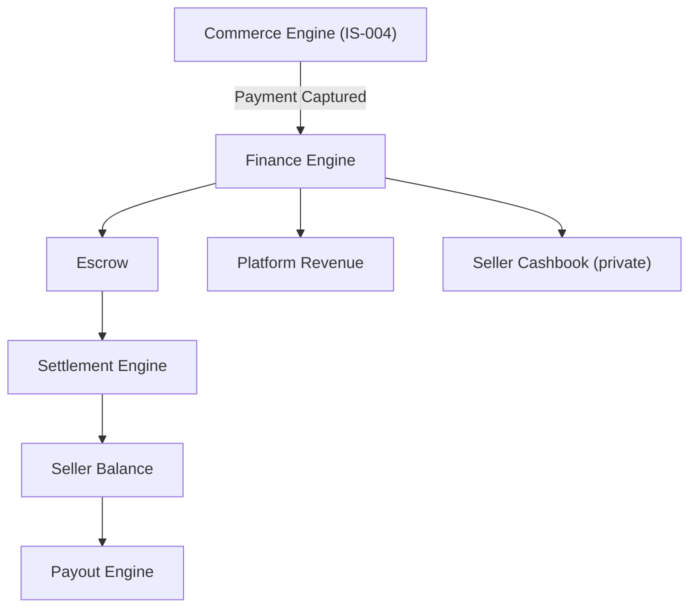
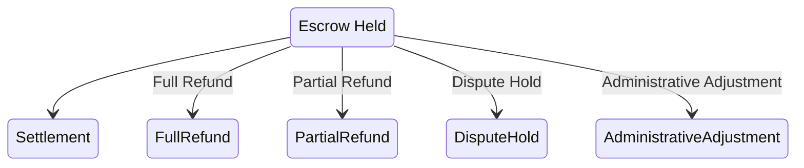
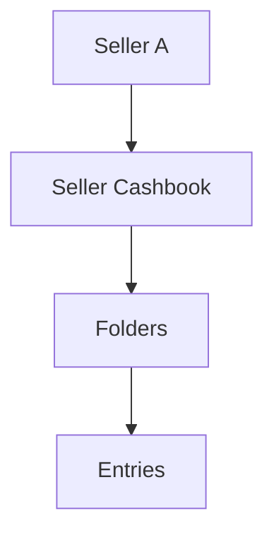

# Choosify Implementation Specification

**Document ID:** IS-007
**Title:** Finance, Escrow & Business Operations Implementation
**Version:** 1.0.0
**Status:** Draft
**Priority:** Critical

**Derived From:**

- BP-001 Vision & Constitution
- BP-004 Seller Workspace & Brand Architecture
- BP-006 Commerce Engine (Orders, Checkout & Payments)
- BP-008 Trust, Reputation, Moderation & Governance Engine
- BP-009 Finance, Escrow & Accounting Engine
- BP-011 Administration, CMS & Platform Operations Engine
- ES-001 Database Architecture
- ES-002 API Architecture
- ES-003 RBAC & Permission Matrix
- ES-004 Event Bus
- ES-005 Workflow State Machines
- ES-006 Notification Matrix
- ES-008 Security Architecture

This is a documentation-only Implementation Specification. It does not redesign the platform, invent new business rules, simplify architecture, or replace any BP/ES decision. No production code or database migration is contained in this document.

---

## Table of Contents

1. [Purpose](#1-purpose)
2. [Scope](#2-scope)
3. [Dependencies](#3-dependencies)
4. [Finance Architecture](#4-finance-architecture)
5. [Financial Ledger](#5-financial-ledger)
6. [Double Entry Accounting Strategy](#6-double-entry-accounting-strategy)
7. [Escrow Architecture](#7-escrow-architecture)
8. [Escrow Lifecycle](#8-escrow-lifecycle)
9. [Payment Ledger](#9-payment-ledger)
10. [Refund Ledger](#10-refund-ledger)
11. [Return Ledger](#11-return-ledger)
12. [Settlement Engine](#12-settlement-engine)
13. [Seller Earnings](#13-seller-earnings)
14. [Creator Earnings (Future Ready)](#14-creator-earnings-future-ready)
15. [Platform Revenue](#15-platform-revenue)
16. [Commission Engine](#16-commission-engine)
17. [Category Based Commission](#17-category-based-commission)
18. [Subscription Based Commission](#18-subscription-based-commission)
19. [Campaign Commission](#19-campaign-commission)
20. [VAT Engine](#20-vat-engine)
21. [Tax Engine](#21-tax-engine)
22. [Invoice Engine](#22-invoice-engine)
23. [PDF Invoice Generation](#23-pdf-invoice-generation)
24. [QR Verification](#24-qr-verification)
25. [Digital Signature Support (Future)](#25-digital-signature-support-future)
26. [Wallet Architecture (Future Ready)](#26-wallet-architecture-future-ready)
27. [Withdrawal Engine](#27-withdrawal-engine)
28. [Payout Engine](#28-payout-engine)
29. [Bank Account Management](#29-bank-account-management)
30. [Payment Gateway Integration](#30-payment-gateway-integration)
31. [Financial Reports](#31-financial-reports)
32. [Financial Analytics](#32-financial-analytics)
33. [Subscription Plans](#33-subscription-plans)
34. [Monthly Billing](#34-monthly-billing)
35. [Annual Billing](#35-annual-billing)
36. [Feature Limits](#36-feature-limits)
37. [Storage Limits](#37-storage-limits)
38. [Marketplace Access & Subscription](#38-marketplace-access--subscription)
39. [Cashbook Architecture](#39-cashbook-architecture)
40. [Seller Cashbook](#40-seller-cashbook)
41. [Private Seller Cashbook](#41-private-seller-cashbook)
42. [Folder Management](#42-folder-management)
43. [Transactions](#43-transactions)
44. [Income Entries](#44-income-entries)
45. [Expense Entries](#45-expense-entries)
46. [Attachments](#46-attachments)
47. [Cashbook Reports](#47-cashbook-reports)
48. [Admin Cashbook Monitoring](#48-admin-cashbook-monitoring)
49. [Seller-wise Cashbook Explorer](#49-seller-wise-cashbook-explorer)
50. [Financial Audit Trail](#50-financial-audit-trail)
51. [Fraud Detection](#51-fraud-detection)
52. [Refund Approval Workflow](#52-refund-approval-workflow)
53. [Dispute Financial Workflow](#53-dispute-financial-workflow)
54. [Event Bus Integration](#54-event-bus-integration)
55. [Notification Integration](#55-notification-integration)
56. [RBAC Requirements](#56-rbac-requirements)
57. [Database Dependencies](#57-database-dependencies)
58. [API Endpoints](#58-api-endpoints)
59. [Backend Services](#59-backend-services)
60. [Frontend Components](#60-frontend-components)
61. [Admin Components](#61-admin-components)
62. [Seller Components](#62-seller-components)
63. [Consumer Components](#63-consumer-components)
64. [Audit Logging](#64-audit-logging)
65. [Security Considerations](#65-security-considerations)
66. [Compliance Considerations](#66-compliance-considerations)
67. [Performance Considerations](#67-performance-considerations)
68. [Testing Checklist](#68-testing-checklist)
69. [Acceptance Criteria](#69-acceptance-criteria)
70. [Rollback Strategy](#70-rollback-strategy)
71. [Future Extensions](#71-future-extensions)
72. [Implementation Order](#72-implementation-order)
73. [Revision History](#revision-history)

---

## 1. Purpose

This document defines the implementation plan for the Finance, Escrow & Business Operations Engine of the Choosify Commerce Operating System, as governed by BP-009.

Finance must always be Transparent, Traceable, Secure, Auditable, and Automated where appropriate — money should never move without generating a permanent financial record, and every financial event must be explainable (BP-009 §3). This IS translates that philosophy — plus the Escrow, Commission, Subscription, and Cashbook models — into a concrete, sequenced implementation plan.

---

## 2. Scope

In scope:

- Escrow architecture and lifecycle (BP-009 §5–§6)
- Seller Balance, Earnings, and Platform Revenue (BP-009 §7–§9)
- Commission Engine including Flat/Percentage/Category/Subscription/Campaign models (BP-009 §10)
- Subscription Plans and Marketplace Billing (BP-009 §11–§12)
- Payout Engine (BP-009 §13)
- My Cashbook and Administrative Cashbook View (BP-009 §14–§15)
- Refund Accounting (BP-009 §16)
- Taxes & VAT (BP-009 §17)
- Financial Reports (BP-009 §18)
- Administrative Finance oversight (BP-009 §19)
- Financial Audit Trail and Financial Security (BP-009 §20–§21)
- Event Bus, RBAC, notification, and audit wiring for this domain

Out of scope (governed elsewhere, referenced not duplicated):

- Order/Payment capture and checkout mechanics themselves — already specified in IS-004 (this IS owns what happens to captured funds, not the capture flow)
- Invoice content/business rules beyond finance ledger integration — already specified in IS-004 §39–§43 (this IS is responsible for the ledger entries an invoice reflects, not the invoice document generation flow itself, though §22–§24 restate the finance-relevant parts for completeness)
- Trust Score computation from financial signals (e.g. Fraud) — already specified in IS-006
- Payment gateway provider-specific integration internals — BP-009 references Payment Gateways generically; provider specifics (SSLCommerz, etc.) already exist in the repo and are extended, not redesigned, here
- Digital signatures on invoices — explicitly Future (BP-006 §28, restated here at §25)

---

## 3. Dependencies

| Document | Relevance |
|----------|-----------|
| BP-001 | Article 8 (Auditability — every action attributable and auditable); Article 12 (Financial Principles: Transparency, Traceability, Security, Accountability) |
| BP-004 | Marketplace suspension does not remove Finance/Cashbook access (§11) |
| BP-006 | Escrow (§12), Partial Payments (§11), Refunds (§22), Invoice Engine (§28) — Commerce triggers Finance, Finance owns the ledger |
| BP-008 | Fraud/Dispute outcomes are Trust signals (§6) consumed here for §51/§53; Trust Score itself is not computed by this IS |
| BP-009 | Authoritative source for this IS |
| BP-011 | Administrative Finance is isolated from Seller accounting (§19); Subscription Administration (§18) sets Plans this IS enforces |
| ES-001 | `transactions`, `invoices`, `payouts`, `subscriptions`, `cashbooks` tables in the Finance Domain (§9); Soft Delete policy: Financial records, Escrow, Audit Logs are Never Delete (§11) |
| ES-002 | Idempotency requirement for financial operations (§20, BR-2.8) |
| ES-003 | Seller Permissions include Manage Finance, Manage Cashbook (§12); Administrator Permissions do not include unrestricted Seller-finance access (§14) |
| ES-004 | Payment Events (§10): `PaymentInitiated`, `PaymentAuthorized`, `PaymentCaptured`, `PaymentFailed`, `PaymentRefunded`, `EscrowCreated`, `EscrowReleased`, `EscrowCancelled`, `WithdrawalRequested`, `WithdrawalApproved`, `WithdrawalRejected` |
| ES-005 | Escrow Lifecycle (§37), Escrow Exception Paths (§38), Payout Lifecycle (§53), Subscription Lifecycle (§54), Cashbook Lifecycle (§55) |
| ES-006 | Payment Notifications (§15) |
| ES-008 | Payment Security (§19: raw payment credentials never stored), Financial Security requirements (BP-009 §21) |

---

## 4. Finance Architecture

Per BP-009 §4: the Finance Engine manages money belonging to Consumer, Seller, Brand, Platform, Courier (Future), and Creator (Future), each maintaining independent financial records.

Every financial event originates from this engine (BP-009 §1) — Commerce/Order events trigger it, but the ledger itself, Escrow, Commission, Payout, and Cashbook are owned exclusively here.

---

## 5. Financial Ledger

Per BP-009 §3 and BR-9.8 ("Financial records are immutable. Corrections are recorded as adjustments rather than overwriting historical transactions"), matching the special implementation requirement ("Every financial transaction creates immutable ledger records. Financial records are never physically deleted"):

The Financial Ledger is the single append-only record of every money movement in the platform (`transactions` table, §57). No ledger entry is ever updated or deleted after creation — a correction is a new, offsetting entry referencing the original, never an in-place edit.

---

## 6. Double Entry Accounting Strategy

Not explicitly named in BP-009, but directly implied by §5's append-only, immutable-with-adjustments model and by BP-009 §20 (Audit Trail requires Source and Destination on every action): this IS implements the ledger using double-entry semantics (every transaction records both a Source and a Destination, per BP-009 §20's exact field list) so that the ledger is self-balancing and auditable by construction — this is the accounting *technique* used to satisfy BP-009's stated Transparency/Traceability requirements (§3), not a new business rule.

---

## 7. Escrow Architecture

Per BP-009 §5 and the special implementation requirement ("Choosify acts as the escrow holder for all prepaid transactions"): funds collected from Consumers remain under platform protection until transaction obligations are fulfilled. Escrow protects Consumer, Seller, and Platform (BP-009 §5) — matching BR-9.1 ("All consumer payments enter escrow before settlement").

---

## 8. Escrow Lifecycle

Per BP-009 §6 and ES-005 §37–§38, matching the special requirement ("Seller funds are released only after successful fulfilment according to platform policy. Refunds are processed from escrow when applicable"):

Refunds interrupt the normal settlement flow (BP-009 §6); money must not be released simply because payment was received (ES-005 §37) — release requires the fulfilment condition to be met (BR-9.2).

---

## 9. Payment Ledger

The subset of the Financial Ledger (§5) tracking `PaymentInitiated → PaymentAuthorized → PaymentCaptured/PaymentFailed` events (ES-004 §10, IS-004 §34 Payment Lifecycle) — every payment attempt, successful or not, creates an immutable ledger entry, not only successful captures.

---

## 10. Refund Ledger

Per BP-009 §16 ("Refunds automatically generate financial adjustments... Full Refund, Partial Refund, Escrow Release, Platform Adjustment. Financial history remains immutable"): every Refund produces an adjustment entry referencing the original Payment Ledger entry (§9), never an edit to it — consistent with §5/§6's append-only model.

---

## 11. Return Ledger

Mirrors §10: a Return (IS-004 §37) that results in a Refund produces the same adjustment-entry pattern; a Return that does not result in a Refund (e.g. exchange, per platform policy) does not itself require a ledger entry beyond what the Order/Inventory domains already record — this IS's Return Ledger scope is specifically the financial-adjustment side of Returns.

---

## 12. Settlement Engine

Per BP-009 §6 (Escrow Lifecycle's final "Seller Settlement" step) and §7 (Seller Balance categories: Available Funds, Pending Settlement, Escrow Balance, Refund Reserve, Withdrawable Balance): the Settlement Engine moves funds from "Escrow Held" to a Seller's "Pending Settlement" then "Available/Withdrawable Balance" once the Commission Engine (§16) has calculated and deducted the platform's commission — settlement and commission calculation are coupled: commission is calculated automatically *during* settlement (BP-009 §10).

---

## 13. Seller Earnings

Per BP-009 §8: Seller earnings originate from Product Sales, Service Sales, Booking Revenue, and Digital Products, with Live Commerce, Brand Collaborations, and Affiliate Sales marked Future. Earnings become part of Seller Balance (§7) upon Settlement (§12).

---

## 14. Creator Earnings (Future Ready)

Per BP-009 §4 (Creator listed as a Financial Participant, marked Future) and BP-004 §4/BP-002 (Creator identity type): Creator monetization is not yet an active revenue path (BP-005 §8 lists no current Creator earnings source), but per the "future-ready" instruction, the Financial Participant model (§4) already includes Creator as a distinct entity type — this IS ensures the ledger/balance schema (§57) accommodates a Creator-type participant without requiring redesign when Creator monetization is activated. No Creator earnings logic is implemented in this phase.

---

## 15. Platform Revenue

Per BP-009 §9: Platform revenue originates from Marketplace Commission, Subscription Plans, Sponsored Listings, Advertising, Featured Placement, Promotional Campaigns, and Financial Services (Future) — each remaining independently reportable (§31–§32), not commingled into one opaque revenue figure.

---

## 16. Commission Engine

Per BP-009 §10 and BR-9.4 ("Platform commission is calculated automatically according to configured rules"), matching the special implementation requirement ("Commission supports: Flat Amount, Percentage, Category Based, Subscription Based, Campaign Based"):

Commission is calculated automatically during settlement (§12); historical commission calculations remain immutable (BP-009 §10) — a later change to commission configuration never retroactively alters a already-settled transaction's commission record, only future ones.

---

## 17. Category Based Commission

Per BP-009 §10: commission rate may vary by the Product/Service's Category (IS-003 §6–§9) — the Commission Engine reads the listing's category at settlement time to select the applicable rate, without duplicating category data into the finance domain (BP-001 Article 7).

---

## 18. Subscription Based Commission

Per BP-009 §10 and §11 (Subscription Plans apply to Seller Accounts): commission rate may vary based on the Seller's active Subscription Plan (§33) — e.g. a premium plan may carry a lower commission rate, configured as part of the Plan definition, not hard-coded per Seller.

---

## 19. Campaign Commission

Per BP-009 §10: commission rate may vary for listings participating in a specific promotional Campaign (BP-004 §20 Deals & Promotions, referenced not owned here) — Campaign-based commission is a time-boxed override of the otherwise-applicable Category/Subscription-based rate.

---

## 20. VAT Engine

Per BP-009 §17 and the special implementation requirement ("VAT and Tax calculations must remain configurable"): Invoices support VAT as a distinct line item (BP-006 §28); VAT calculation rules are centrally configured (Administration, BP-011 §19), never Seller-defined, consistent with IS-004 §42.

---

## 21. Tax Engine

Mirrors §20 for general Tax (BP-009 §17: "Tax calculations remain configurable. Future regional tax rules may be added") — this IS implements Tax/VAT as pluggable, region-configurable rule sets rather than a single hard-coded formula, so future regional rules (explicitly anticipated by BP-009 §17) can be added without schema redesign.

---

## 22. Invoice Engine

Per BP-006 §28 (restated here for the finance-ledger connection) and BP-009 §17: every Invoice reflects VAT, Tax, Platform Fees, Discounts, and Shipping Charges (BP-009 §17) sourced directly from the underlying ledger entries (§5, §9) it documents — the Invoice is a formatted view of ledger data, never an independently-entered second source of truth (BP-001 Article 7).

---

## 23. PDF Invoice Generation

Per BP-006 §28/§40 (restated): the downloadable PDF is a derived, regenerable artifact from the immutable Invoice record — not implemented differently here than already specified in IS-004 §40; this IS's concern is only that the PDF content matches the finance ledger exactly.

---

## 24. QR Verification

Per BP-006 §28/§41 (restated): every Invoice's QR Code encodes a verification reference resolvable back to the immutable ledger record (§5) — supporting authenticity verification without exposing sensitive financial detail in the QR payload itself (§65).

---

## 25. Digital Signature Support (Future)

Per BP-006 §28 ("Future versions may include digital signatures"): explicitly out of scope for this implementation phase, consistent with IS-004 §43.

---

## 26. Wallet Architecture (Future Ready)

Per BP-009 §2 (Wallet listed in scope) and BP-006 §10/§33 (Wallet as a payment method and refund destination, marked available/Future depending on context) and BP-009 §13 ("Wallet (Future)" for payouts): this IS treats Wallet as a Future-Ready balance type within the Seller Balance model (§7) and Financial Participant ledger (§4) — the schema (§57) accommodates a Wallet balance/transaction type without requiring redesign, but Wallet is not activated as a live payout/payment method in this phase, consistent with BP-009 §13 marking it explicitly Future.

---

## 27. Withdrawal Engine

Per ES-004 §10 (`WithdrawalRequested`/`WithdrawalApproved`/`WithdrawalRejected`) and the special implementation requirement's exact six-step chain ("Every payout requires: Identity Verification → Available Balance Validation → Escrow Validation → Approval Workflow → Transfer → Completion"):

This is the authoritative payout pre-condition chain for this IS — every withdrawal request must pass all six gates in order; failing any gate halts the request rather than proceeding with a partial validation. "Identity Verification" reuses IS-001's identity verification state (not re-verified from scratch each withdrawal, but confirmed still valid); "Escrow Validation" confirms the funds requested are not still encumbered by an open Escrow Exception Path (§8).

---

## 28. Payout Engine

Per BP-009 §13:

Seller payouts support Bank Transfer and Mobile Financial Services, with Wallet marked Future (§26). Rejected payouts remain fully logged (BP-009 §13) — never silently discarded. This is the same underlying workflow as §27, described at the Seller-facing level; §27 is the detailed six-gate validation chain executed within "Finance Review."

---

## 29. Bank Account Management

Per BP-009 §13 (Bank Transfer as a supported payout method): Sellers register and manage the bank account(s)/Mobile Financial Services destination(s) their payouts are sent to — this is payout-destination configuration data, distinct from the payout transaction itself (§27–§28), and subject to the same Identity Verification gate before being usable as a withdrawal destination.

---

## 30. Payment Gateway Integration

Per BP-006 §10 ("Future Payment Gateways") and the existing repo infrastructure: Payment Gateway integration (capture-side) is IS-004 scope; this IS's Payment Gateway-adjacent responsibility is limited to the settlement/payout side — ensuring captured funds correctly enter Escrow (§7–§8) regardless of which gateway captured them, and that payout transfers can route through Bank Transfer/MFS providers. No specific new gateway integration is introduced by this IS; existing `server/payments/paymentService.ts`, `sslcommerzProvider.ts`, and `mockProvider.ts` remain the capture-side integration this domain consumes events from.

---

## 31. Financial Reports

Per BP-009 §18 and the special implementation requirement ("Financial reports support: Daily, Weekly, Monthly, Quarterly, Annual, Custom Range"):

Seller reports include Revenue, Orders, Refunds, Taxes, Commissions, Net Profit, Best Products, Best Services, and Settlement History (BP-009 §18), filterable by Brand, Date, Category, and Payment Method (BP-009 §18) — this IS implements the six report time-windows (Daily/Weekly/Monthly/Quarterly/Annual/Custom Range) as a shared date-range parameter across every report type, not six separately-coded report variants.

---

## 32. Financial Analytics

Per BP-009 §18/§32 (Financial Reports as the base) and BP-011 §15 (Platform Analytics includes Finance): Financial Analytics is the aggregated/trend view built atop the same Financial Reports data (§31) — e.g. revenue trend over time, commission trend — rather than a separately-sourced dataset. This IS treats Analytics as a read/visualization layer over §31's report data.

---

## 33. Subscription Plans

Per BP-009 §11 and BR-9.5 ("Subscription Plans belong to Seller Accounts, not individual Brands"), matching the special implementation requirement ("Subscription plans may control: Marketplace Access, Products, Storage, Analytics, Advertising, Feature Availability"):

Subscriptions determine Product Limits, Storage, Analytics, Advertisement Allowances, Team Members, Premium Features, and API Access (Future) (BP-009 §11) — matching the special requirement's list closely ("Products" = Product Limits, "Advertising" = Advertisement Allowances, "Feature Availability" = Premium Features). Subscription applies at the Seller Account level (one Plan governs all of a Seller's Brands, per BR-9.5), not per-Brand.

---

## 34. Monthly Billing

Per BP-009 §11 ("Supported billing cycles: Monthly"): one of the two supported billing cycles, processed on a recurring monthly schedule per ES-005 §54 (Subscription Lifecycle: Active → Renewal Due → Renewed, or → Payment Failed → Grace Period → Expired).

---

## 35. Annual Billing

Per BP-009 §11 ("Yearly"): mirrors §34 with a yearly recurrence, following the identical Subscription Lifecycle state machine — billing cycle is a configuration parameter of the same lifecycle, not a separate lifecycle.

---

## 36. Feature Limits

Per BP-009 §11 (Premium Features, Team Members) and the special requirement ("Feature Availability"): Subscription Plans gate specific platform capabilities (e.g. advanced Analytics views, bulk operations) — enforced at the point of use by checking the Seller's active Plan, not duplicated into every consuming domain's own logic.

---

## 37. Storage Limits

Per BP-009 §11 ("Storage"): Subscription Plans cap media/attachment storage (Product media per IS-003 §42–§43, Cashbook attachments per §46) — enforced at upload time by checking cumulative usage against the active Plan's limit.

---

## 38. Marketplace Access & Subscription

Per BP-009 §12 and the special requirement ("Marketplace Access" listed among what Subscription Plans control): Marketplace participation may require a Subscription, Transaction Fees, or Optional Services (BP-009 §12). Marketplace suspension due to subscription expiry follows configurable platform policy (BP-009 §12) — this is a *policy-configurable* linkage, not an automatic hard rule; this IS implements the linkage as a configuration toggle Administration controls (BP-011 §19), not a hard-coded "expired subscription always suspends marketplace" behavior, since BP-009 itself says the policy is configurable. Subscription expiry never deletes Seller data (BP-009 §11) regardless of this policy setting.

---

## 39. Cashbook Architecture

Per BP-009 §14 and the special implementation requirement ("Seller Cashbook is a private accounting workspace. Every Seller owns an independent Cashbook. Cashbook data never mixes with official marketplace accounting"):

Cashbook functions entirely independently from the Financial Ledger/Escrow/Commission machinery in §5–§28 — it is Seller-owned private accounting data (BR-9.6), not a view onto or a source for official marketplace financial records. This is an architectural separation this IS must enforce at the data-model level (§57), not merely a UI convention.

---

## 40. Seller Cashbook

Per BP-009 §14: every Seller receives one private Cashbook supporting Multiple Folders, Income Records, Expense Records, Notes, Attachments, Manual Entries, and Financial Categories.

---

## 41. Private Seller Cashbook

Restates §39–§40's privacy guarantee explicitly: Cashbook belongs entirely to the Seller (BP-009 §14) — no other Seller, Consumer, Creator, or unauthorized Administrator role can read or write it (§56, §61).

---

## 42. Folder Management

Per BP-009 §14 ("Multiple Folders") and the special implementation requirement ("Sellers may create unlimited folders"): Cashbook Folders are a Seller-defined, unlimited-count organizational structure — no architectural cap on folder count is imposed.

---

## 43. Transactions

The Cashbook's own entry-level record (distinct from the platform Financial Ledger's `transactions`, §5/§57 — this IS disambiguates the two by keeping them in entirely separate tables per §39's architectural-separation requirement) — every Cashbook entry (Income or Expense, §44–§45) is a "transaction" within that Cashbook/Folder.

---

## 44. Income Entries

Per BP-009 §14 ("Income Records") and the special implementation requirement ("Sellers may create unlimited income... entries"): manually entered Income records within a Folder, uncapped in count.

---

## 45. Expense Entries

Mirrors §44 for Expense Records ("Sellers may create unlimited... expense entries").

---

## 46. Attachments

Per BP-009 §14 ("Attachments") and the special implementation requirement ("Sellers may upload attachments to Cashbook entries"): Cashbook entries support file attachments (receipts, invoices, notes) via the same media pipeline used elsewhere (IS-003 §42, ES-002 §18) — subject to the Storage Limits in §37.

---

## 47. Cashbook Reports

Per BP-009 §14 (Financial Categories imply reportability) and by analogy to §31: Sellers may generate summary reports (by Folder, by Category, by date range) over their own Cashbook data — entirely separate from the official Financial Reports in §31, consistent with §39's data-never-mixes constraint.

---

## 48. Admin Cashbook Monitoring

Per BP-009 §15 and the special implementation requirement's exact hierarchy diagram ("Admins have a dedicated Cashbook section. Admin Cashbook displays: Seller A ↓ Seller Cashbook ↓ Folders ↓ Entries"):

This matches BP-009 §15's hierarchy (`Seller → Cashbooks → Folders → Transactions`) exactly, with the special requirement's wording ("Entries") used consistently by this IS in place of BP-009's "Transactions" to avoid the §43 naming collision with the platform Financial Ledger.

---

## 49. Seller-wise Cashbook Explorer

Per BP-009 §15 and the special implementation requirement ("Admins may inspect but never alter Seller accounting records unless platform policy explicitly permits administrative intervention"): the Admin Cashbook Monitoring surface (§48) is a per-Seller drill-down explorer — Administrative access remains read-only unless policy requires intervention (BP-009 §15, BR-9.7: "Administrators may access Seller financial records only through authorized governance workflows"). Any exception (administrative correction) must itself be an explicit, permissioned, audited action (§56, §64) — never an ordinary edit capability available by default.

---

## 50. Financial Audit Trail

Per BP-009 §20 and BR-9.10 ("Every financial event generates a permanent audit record"): every financial action generates a Transaction ID, Timestamp, Actor, Amount, Currency, Source, Destination, Related Entity, and Audit Record (BP-009 §20) — this is the same field set underlying the Double Entry Accounting Strategy (§6). Financial history is immutable (BP-009 §20).

---

## 51. Fraud Detection

Per BP-009 §21 (Financial Security includes Fraud Detection) and BP-008 §6/§17 (Fraud as a Seller Trust factor, AI may Detect Fraud Patterns): Fraud Detection signals relevant to Finance (e.g. unusual payout patterns, mismatched Escrow amounts) are surfaced to the Trust domain (IS-006 §18) as `FraudDetected` events (ES-004 §13) — Fraud *detection logic* is IS-006/Trust scope; this IS's responsibility is exposing the financial anomaly signal, not computing Trust consequences from it.

---

## 52. Refund Approval Workflow

Per BP-006 §22/IS-004 §36 (Refund Engine) and BP-009 §16 (Refund Accounting): mirrors IS-004 §36's Refund Lifecycle exactly (`RefundRequested → Case Review → Approved/Rejected → Financial Processing → Completed`) — this IS's specific responsibility within that shared lifecycle is the "Financial Processing" step: generating the correct Refund Ledger adjustment entry (§10) and releasing/reversing the corresponding Escrow hold (§8) once approval is granted.

---

## 53. Dispute Financial Workflow

Per BP-006 §21/§38 (IS-004 §38 Dispute Integration) and ES-005 §38 Escrow Exception Paths ("Dispute Hold," "Administrative Adjustment"): while Dispute adjudication itself is out of scope here (IS-004 §38, BP-011), the *financial* consequence of a Dispute resolution (Refund, Partial Refund, Administrative Adjustment) is this domain's responsibility to execute correctly against the ledger (§5) and Escrow (§8), exactly mirroring §52's pattern.

---

## 54. Event Bus Integration

Per ES-004 §10 (Payment Events), this domain emits: `PaymentInitiated`, `PaymentAuthorized`, `PaymentCaptured`, `PaymentFailed`, `PaymentRefunded`, `EscrowCreated`, `EscrowReleased`, `EscrowCancelled`, `WithdrawalRequested`, `WithdrawalApproved`, `WithdrawalRejected`.

Every event carries standard ES-004 §18 metadata (Event ID, Name, Timestamp, Producer, Domain: Finance, Aggregate ID, Actor, Correlation ID, Payload, Version). Per ES-004 §2, this domain never calls Trust, Notification, or Administration services directly — those domains subscribe independently. Financial event processing is idempotent (ES-002 §20, BR-2.8) — repeated identical Payment/Escrow/Withdrawal events must never duplicate ledger entries.

---

## 55. Notification Integration

Per ES-006 §15 (Payment Notifications):

| Trigger | Notification |
|---------|---------------|
| Payment succeeds/fails | Payment Successful, Payment Failed |
| Refund processed/approved/rejected | Refund Processed, Refund Approved, Refund Rejected |
| Escrow created/released | Escrow Created, Escrow Released |
| Withdrawal requested/approved/rejected | Withdrawal Requested, Withdrawal Approved, Withdrawal Rejected |
| Invoice generated | Invoice Generated |

Per ES-006 §2, this domain emits the events in §54; the Notification Engine resolves recipients and delivers — this domain never calls the Notification Engine directly.

---

## 56. RBAC Requirements

Per ES-003 §12 (Seller Permissions: Manage Finance, Manage Cashbook) and §14 (Administrator Permissions do not list unrestricted Seller-finance write access), matching BR-9.6/BR-9.7 exactly: every Finance/Cashbook-scoped endpoint validates the full ES-003 §16 pipeline. Sellers may access only their own Balance/Cashbook/Reports; Administrators have read access to Cashbooks by default (§48–§49) and require an additional, explicitly-permissioned action (`finance.cashbook.intervene` or equivalent, ES-003 §7 naming convention) to write to a Seller's Cashbook — never a default capability.

---

## 57. Database Dependencies

Per ES-001 §9 (Finance module) and §11 (Soft Delete Policy: Financial records, Escrow, Orders → Never Delete):

| Table | Owns | Key Fields |
|-------|------|------------|
| `transactions` | Immutable Financial Ledger (§5–§6, §9–§11) | `id`, `type` (payment/refund/settlement/commission/payout), `source`, `destination`, `amount`, `currency`, `related_entity_id` |
| `escrow` | Escrow holding records (§7–§8) | `order_id`, `status`, amount, hold reason |
| `invoices` | Immutable invoice records (§22) | `invoice_number` (UNIQUE), `order_id`, VAT/Tax breakdown |
| `payouts` | Payout requests and their state (§27–§28) | `seller_id`, `status`, amount, destination bank account reference |
| `subscriptions` | Seller Subscription Plan state (§33–§38) | `seller_id` (not `brand_id`, per BR-9.5), `plan_id`, `billing_cycle`, `status` |
| `cashbooks` | One Cashbook per Seller (§39–§41) | `seller_id` (UNIQUE per Seller) |
| `cashbook_folders` | Unlimited Folders per Cashbook (§42) | `cashbook_id` |
| `cashbook_entries` | Unlimited Income/Expense entries (§43–§45) | `folder_id`, `entry_type` (income/expense), amount, notes |
| `cashbook_attachments` | Entry attachments (§46) | `entry_id`, media reference |

All tables follow ES-001 conventions: UUID primary keys, `created_at`/`updated_at`/`deleted_at`, `snake_case` naming, indexes on primary key/foreign keys/`created_at`/`status`. `transactions`, `escrow`, and `invoices` are Never Delete (ES-001 §11) — corrections are new adjustment rows, never edits (§5). `cashbooks`/`cashbook_folders`/`cashbook_entries` are architecturally isolated from `transactions` (§39) — no foreign key relationship exists between the two, by design. Schema migration itself is out of scope for this document.

---

## 58. API Endpoints

All endpoints follow ES-002 conventions.

| Method | Endpoint | Purpose | Auth |
|--------|----------|---------|------|
| GET | `/api/v1/seller/balance` | Read Seller Balance breakdown (§7) | Yes (ownership) |
| GET | `/api/v1/seller/earnings` | Seller Earnings summary (§13) | Yes (ownership) |
| GET | `/api/v1/seller/reports/financial` | Financial Reports with date-range filter (§31) | Yes (ownership) |
| POST | `/api/v1/seller/payouts` | Request a Withdrawal (§27–§28) | Yes (ownership) |
| GET | `/api/v1/seller/payouts` | List payout history including rejected (§28) | Yes (ownership) |
| POST | `/api/v1/seller/bank-accounts` | Register a payout destination (§29) | Yes (ownership) |
| GET | `/api/v1/seller/subscription` | Read current Subscription Plan and usage against limits (§33–§37) | Yes (ownership) |
| POST | `/api/v1/seller/subscription/change` | Change Subscription Plan | Yes (ownership) |
| GET | `/api/v1/seller/cashbook/folders` | List Cashbook Folders (§42) | Yes (ownership) |
| POST | `/api/v1/seller/cashbook/folders` | Create a Folder | Yes (ownership) |
| POST | `/api/v1/seller/cashbook/entries` | Create Income/Expense entry (§44–§45) | Yes (ownership) |
| POST | `/api/v1/seller/cashbook/entries/{id}/attachments` | Upload an attachment (§46) | Yes (ownership) |
| GET | `/api/v1/seller/cashbook/reports` | Cashbook Reports (§47) | Yes (ownership) |
| GET | `/api/v1/admin/finance/platform-revenue` | Platform Revenue reporting (§15, §19) | Yes (admin permission) |
| GET | `/api/v1/admin/finance/escrow` | Escrow oversight (§19) | Yes (admin permission) |
| POST | `/api/v1/admin/finance/payouts/{id}/review` | Finance Review step of Payout Engine (§28) | Yes (admin permission) |
| GET | `/api/v1/admin/cashbooks/{sellerId}` | Admin Cashbook Explorer, read-only by default (§48–§49) | Yes (admin permission) |
| POST | `/api/v1/admin/cashbooks/{sellerId}/intervene` | Explicit, policy-gated administrative Cashbook correction (§49) | Yes (elevated admin permission) |
| GET | `/api/v1/admin/finance/commission-config` | Read/manage Commission configuration (§16–§19) | Yes (admin permission) |
| GET | `/api/v1/admin/finance/tax-config` | Read/manage VAT/Tax configuration (§20–§21) | Yes (admin permission) |

---

## 59. Backend Services

Implementation order, gated per ES-010 §13 Quality Gates:

1. **Ledger service** — the core immutable Financial Ledger (§5–§6), the foundation every other Finance service writes through.
2. **Escrow service** — holding, release, and exception-path handling (§7–§8), consuming `PaymentCaptured` events from IS-004 and Order/Booking-completion events for release triggers.
3. **Commission service** — Flat/Percentage/Category/Subscription/Campaign calculation (§16–§19), invoked during Settlement (§12).
4. **Settlement service** — moves funds from Escrow to Seller Balance via Commission calculation (§12–§13).
5. **Payout/Withdrawal service** — implements the exact six-gate chain in §27 and the workflow in §28, including Bank Account management (§29).
6. **Subscription service** — Plan enforcement, billing cycles (§33–§38), consuming/emitting the ES-005 §54 Subscription Lifecycle.
7. **VAT/Tax service** — configurable calculation rules (§20–§21), consumed by Invoice generation.
8. **Invoice service** — ledger-sourced Invoice generation, PDF/QR derivation (§22–§24), shared surface with IS-004 §39–§43.
9. **Cashbook service** — entirely separate module implementing §39–§47 (Folders, Entries, Attachments, Reports), architecturally isolated from the Ledger service (step 1) per §39. The admin repo currently has only frontend Cashbook scaffolding (`src/contexts/CashBookContext.tsx`, `src/pages/admin/CashBookHub.tsx`) — this IS's backend Cashbook service is new, not an extension of an existing server-side module, and should be structured to preserve that architectural separation from day one.
10. **Financial Reports/Analytics service** — read-side aggregation over the Ledger (§31–§32), never a write path.
11. **RBAC wiring** — every endpoint in §58 passes through `server/middleware/authorization.ts` / `server/permissions/authorization.ts` (existing), extended with the elevated Cashbook-intervention permission (§49, §56).
12. **Event emission** — wire each service action to §54.
13. **Audit logging** — wire each state-changing action to §64.

---

## 60. Frontend Components

- **Seller Balance/Earnings summary widgets**, consumed by the Seller Dashboard (IS-002 §11).
- **Financial Reports UI** with the six time-window options (Daily/Weekly/Monthly/Quarterly/Annual/Custom Range, §31).
- **Payout request flow** — Bank Account selection, balance confirmation, request submission (§27–§29).
- **Subscription Plan comparison/selection UI** (§33–§38).
- **Cashbook UI** — Folder tree, Entry list/create forms (Income/Expense), attachment upload, Cashbook Reports (§39–§47), extending existing `src/contexts/CashBookContext.tsx` and `src/pages/admin/CashBookHub.tsx`.
- **Invoice download/QR display** (§22–§24), shared surface with IS-004 §61.

---

## 61. Admin Components

- **Platform Revenue dashboard** (§15, §31–§32).
- **Escrow oversight tool** (§8, §19).
- **Payout Finance Review queue** (§28), the Administrative half of the Payout Engine.
- **Commission/VAT/Tax configuration UI** (§16–§21), Administrator-only per §56.
- **Admin Cashbook Explorer** — implements the exact §48 hierarchy (Seller → Seller Cashbook → Folders → Entries) as a read-only drill-down, with the elevated intervention action (§49) clearly separated and requiring explicit confirmation.
- **Subscription Plan management** (§33, BP-011 §18 Subscription Administration).

---

## 62. Seller Components

- **Seller Balance and Payout Dashboard** (§7, §27–§29), extending existing `src/contexts/CashBookContext.tsx` adjacent Finance context.
- **Private Cashbook workspace** (§39–§47), extending existing `src/pages/admin/CashBookHub.tsx`.
- **Financial Reports view** (§31), Brand/Date/Category/Payment-Method filterable.
- **Subscription management** (§33–§38).

---

## 63. Consumer Components

- **Invoice download** (§22–§24), consistent with IS-004 §64 Consumer Components — this domain supplies the underlying, ledger-sourced Invoice data, the Consumer-facing UI itself lives in IS-004's checkout/order-history surfaces.
- **Refund status visibility** — Consumer-facing view into where their Refund stands within §52's workflow, read-only.

---

## 64. Audit Logging

Per BP-009 §20/BR-9.10 and ES-008 §20: every financial action records Actor, Timestamp, Action, Entity, Old Value, New Value, IP Address, Device, Correlation ID, and produces an immutable audit record — matching BP-009 §20's exact field list (Transaction ID, Timestamp, Actor, Amount, Currency, Source, Destination, Related Entity, Audit Record) applied on top of the standard ES-008 §20 fields.

Minimum audited actions: every Payment/Escrow/Refund/Settlement/Commission calculation, every Payout request/review/approval/rejection/transfer, every Subscription change, every Cashbook Folder/Entry/Attachment creation, and — with particular emphasis given BR-9.7 — every Administrative Cashbook read access and any intervention action (§49).

---

## 65. Security Considerations

Per ES-008 and BP-009 §21:

- Financial operations require Authentication, Authorization, Audit Logging, Fraud Detection, Secure Settlement, and Encryption (BP-009 §21); Multi-Signature Approval, Risk Scoring, and AML Integrations are explicitly Future.
- Choosify never stores raw payment credentials (ES-008 §19) — this domain only ever handles references and transaction metadata, consistent with IS-004 §67.
- Every financial write operation is idempotent (§54, ES-002 §20) to prevent duplicate ledger entries from retried requests.
- The Withdrawal Engine's six-gate chain (§27) is the primary anti-fraud control for payouts — no code path may skip a gate, including administrative override paths, which must instead use the explicit, separately-audited intervention mechanism (§49).
- Cashbook data is architecturally isolated from the official Ledger (§39, §57) specifically so that a Cashbook-scoped defect or breach cannot corrupt official marketplace accounting.

---

## 66. Compliance Considerations

Per BP-009 §17 (configurable Tax/VAT, future regional rules) and ES-008 §31 (Compliance: GDPR/CCPA/PCI-related/local Bangladesh regulations): the VAT/Tax Engine (§20–§21) is deliberately implemented as configurable rule sets rather than hard-coded rates, anticipating regional expansion (BP-012 §18) without requiring architectural change. Payment credential handling (§65) supports PCI-related integration requirements by design (never storing raw card data). Financial record retention (§5, ES-001 §11 Never Delete) supports audit/regulatory retention obligations referenced in ES-008 §22.

---

## 67. Performance Considerations

Per ES-009: Ledger writes (§5) are append-only and should be optimized for write-throughput with indexing on `related_entity_id`/`type`/`created_at` (ES-001 §12). Financial Reports (§31) with wide date ranges (Annual, Custom Range) are "Heavy" API calls per ES-009 §13 and should leverage pre-aggregated rollups (background jobs, ES-009 §11: "Nightly Reports," "Analytics Aggregation") rather than scanning the full ledger on every request. Cashbook queries are scoped and indexed per-Seller (`cashbook_id`), keeping them cheap regardless of platform-wide Cashbook volume, consistent with §39's isolation.

---

## 68. Testing Checklist

- [ ] Every financial transaction (Payment, Refund, Settlement, Commission, Payout) creates an immutable ledger record; no code path updates or deletes an existing ledger row (§5–§6, matching the special requirement exactly)
- [ ] Escrow holds captured funds and releases only per the exact conditions in §8 (Delivery/Service Completion/Booking Completion/Refund Resolution), never on payment receipt alone
- [ ] A Refund correctly generates a Refund Ledger adjustment and correctly interacts with the associated Escrow hold (§10, §52)
- [ ] Commission correctly applies Flat, Percentage, Category-based, Subscription-based, and Campaign-based rules, and historical commission calculations remain unchanged after a later configuration change (§16–§19, BP-009 §10)
- [ ] VAT and Tax calculations are read from central configuration, never hard-coded or Seller-definable (§20–§21)
- [ ] Every payout request passes through all six gates in order (Identity Verification → Available Balance Validation → Escrow Validation → Approval Workflow → Transfer → Completion), and a failure at any gate halts the request (§27)
- [ ] Rejected payouts remain fully logged, never silently discarded (§28)
- [ ] Subscription Plans apply at the Seller Account level, not per-Brand, and correctly gate Marketplace Access/Products/Storage/Analytics/Advertising/Feature Availability per the active Plan (§33–§38, BR-9.5)
- [ ] Subscription expiry never deletes Seller data, regardless of Marketplace Access policy outcome (§38)
- [ ] Every Seller has exactly one private Cashbook, supports unlimited Folders and unlimited Income/Expense entries, and Cashbook data never appears in or influences official Financial Reports/Ledger queries (§39–§47, matching the special requirement exactly)
- [ ] The Admin Cashbook view displays the exact Seller → Seller Cashbook → Folders → Entries hierarchy and defaults to read-only (§48–§49)
- [ ] An administrative Cashbook intervention is only possible through the explicit, separately-permissioned action, never the default read path (§49, BR-9.7)
- [ ] Every event in §54 is emitted with correct ES-004 §18 metadata; every notification in §55 is triggered via events only
- [ ] Every financial action produces an immutable audit record matching BP-009 §20's exact field list (§64)
- [ ] Repeated identical financial event processing does not duplicate ledger entries (§54, idempotency)

---

## 69. Acceptance Criteria

This IS is considered complete when:

- The Financial Ledger, Escrow Architecture/Lifecycle, and Settlement Engine match BP-009 §5–§7/§12 exactly, with immutability enforced at the data-model level
- Commission Engine supports all five models (Flat, Percentage, Category, Subscription, Campaign) exactly per BP-009 §10
- VAT/Tax remain centrally configurable, not hard-coded (§20–§21)
- The Withdrawal/Payout Engine implements the exact six-gate chain and the standard workflow, with rejected payouts fully logged (§27–§29)
- Subscription Plans apply at the Seller Account level and correctly gate the six named capability areas (§33–§38)
- Cashbook Architecture is fully isolated from official marketplace accounting, supports unlimited Folders/Entries/Attachments, and Admin access is read-only by default with intervention explicitly permissioned (§39–§49, BR-9.6/BR-9.7)
- Financial Reports support all six time-window options (§31)
- All endpoints in §58 pass the ES-003 §16 RBAC pipeline
- All events in §54 are emitted with correct ES-004 §18 metadata; all notifications in §55 are triggered via events only
- All actions in §64 produce immutable audit records matching BP-009 §20's field list
- The testing checklist in §68 passes in full
- No BP or ES document required modification to complete this implementation

---

## 70. Rollback Strategy

- Each backend service in §59 is deployed independently behind standard release gates (ES-010 §11), allowing rollback to the prior deployed version without data loss.
- Database changes follow the ES-001 §15 migration workflow; every migration is paired with a tested down-migration before Production deployment.
- Given this domain's financial sensitivity, every service in §59 is feature-flagged (ES-010 §15), allowing instant disablement of a defective Commission/Escrow/Payout change without a full rollback.
- Because the Financial Ledger, Escrow, and Cashbook records are Never Delete (§57, ES-001 §11), rollback of this subsystem never causes loss of financial history — a rollback reverts *code behaviour*, not existing ledger data.
- Because Finance is consumed by Commerce (Escrow/Refund triggers), Trust (Fraud signals), and Administration (§3), rollback must be validated against those domains' Finance-dependent flows before execution in Production.
- Audit logs and emitted events are never rolled back or deleted (ES-008 BR-8.6).

---

## 71. Future Extensions

Explicitly deferred, per the source documents:

- Creator Earnings activation (§14, BP-009 §4/§8 marked Future)
- Live Commerce, Brand Collaboration, and Affiliate Sales as Seller earnings sources (BP-009 §8, marked Future)
- Wallet as an active payment/payout method (§26, BP-009 §13 marked Future)
- Digital Signature Support on Invoices (§25, BP-006 §28 marked Future)
- API Access as a Subscription feature (BP-009 §11, marked Future)
- Multi-Signature Approval, Risk Scoring, and AML Integrations for Financial Security (BP-009 §21, marked Future)
- Financial Services as a Platform Revenue source (BP-009 §9, marked Future)

---

## 72. Implementation Order

**Phase 1 — Database**
Implement Finance Domain tables per §57 (`transactions`, `escrow`, `invoices`, `payouts`, `subscriptions`, `cashbooks`, `cashbook_folders`, `cashbook_entries`, `cashbook_attachments`), following the ES-001 §15 migration workflow, with `cashbooks`/`cashbook_folders`/`cashbook_entries` structurally isolated from `transactions` from the outset.

**Phase 2 — Financial Ledger**
Implement the core Ledger service (§59 step 1) — the immutable, append-only foundation every other Finance service depends on.

**Phase 3 — Escrow Engine**
Implement the Escrow service (§59 step 2), including the Escrow Exception Paths (§8).

**Phase 4 — Commission Engine**
Implement the Commission and Settlement services (§59 steps 3–4), covering all five commission models.

**Phase 5 — Cashbook Engine**
Implement the Cashbook service (§59 step 9) as an architecturally separate module, given the admin repo currently only has frontend Cashbook scaffolding — this is new backend construction, not an extension.

**Phase 6 — REST APIs**
Implement and RBAC-wire the endpoints in §58, gated behind the ES-002 standard envelope and the ES-003 §16 authorization pipeline, with the elevated Cashbook-intervention endpoint separately permissioned.

**Phase 7 — Admin Dashboard**
Implement §61 (Platform Revenue, Escrow oversight, Payout Review queue, Commission/VAT/Tax configuration, Admin Cashbook Explorer, Subscription management).

**Phase 8 — Seller Dashboard**
Implement §62 (Balance/Payout Dashboard, private Cashbook workspace, Financial Reports, Subscription management), extending existing `CashBookContext.tsx` and `CashBookHub.tsx`.

**Phase 9 — Testing**
Execute the full checklist in §68, with particular attention to ledger immutability, the six-gate Payout chain, and the Cashbook/official-accounting isolation boundary.

**Phase 10 — Deployment Checklist**
Apply the ES-010 §26 Production Readiness Checklist before enabling this subsystem in Production, with per-service financial feature flags (§70) verified operative and Escrow/Payout monitoring and alerting confirmed active.

---

## Revision History

| Version | Date | Description |
|----------|------|-------------|
| 1.0.0 | August 2026 | Initial Finance, Escrow & Business Operations Implementation Specification |
