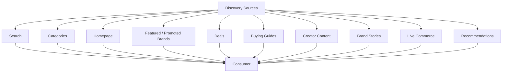

# Choosify Implementation Specification

**Document ID:** IS-008
**Title:** Discovery, Search, Recommendation & Content Implementation
**Version:** 1.0.0
**Status:** Draft
**Priority:** Critical

**Derived From:**

- BP-001 Vision & Constitution
- BP-004 Seller Workspace & Brand Architecture
- BP-005 Product & Service Engine
- BP-006 Commerce Engine (Orders, Checkout & Payments)
- BP-007 Communication, Messaging & Customer Engagement Engine
- BP-008 Trust, Reputation, Moderation & Governance Engine
- BP-010 Content, Discovery & Engagement Engine
- ES-001 Database Architecture
- ES-002 API Architecture
- ES-003 RBAC & Permission Matrix
- ES-004 Event Bus
- ES-006 Notification Matrix
- ES-007 UI Architecture, Design System & UX Specifications
- ES-008 Security Architecture
- ES-009 Performance, Scalability & Infrastructure Engineering

This is a documentation-only Implementation Specification. It does not redesign the platform, invent new business rules, simplify architecture, or replace any BP/ES decision. No production code or database migration is contained in this document.

---

## Table of Contents

1. [Purpose](#1-purpose)
2. [Scope](#2-scope)
3. [Dependencies](#3-dependencies)
4. [Discovery Architecture](#4-discovery-architecture)
5. [Homepage Discovery](#5-homepage-discovery)
6. [Category Discovery](#6-category-discovery)
7. [Search Architecture](#7-search-architecture)
8. [Search Ranking Engine](#8-search-ranking-engine)
9. [Search Suggestions](#9-search-suggestions)
10. [Search Auto Complete](#10-search-auto-complete)
11. [Fuzzy Search](#11-fuzzy-search)
12. [Typo Correction](#12-typo-correction)
13. [Synonym Search](#13-synonym-search)
14. [AI Ready Search (Future)](#14-ai-ready-search-future)
15. [Product Discovery](#15-product-discovery)
16. [Service Discovery](#16-service-discovery)
17. [Brand Discovery](#17-brand-discovery)
18. [Creator Discovery](#18-creator-discovery)
19. [Guide Discovery](#19-guide-discovery)
20. [Story Discovery](#20-story-discovery)
21. [Live Commerce Discovery](#21-live-commerce-discovery)
22. [Deals Discovery](#22-deals-discovery)
23. [Advertisement Discovery](#23-advertisement-discovery)
24. [Recommendation Engine](#24-recommendation-engine)
25. [Personalized Recommendations](#25-personalized-recommendations)
26. [Trending Engine](#26-trending-engine)
27. [Featured Engine](#27-featured-engine)
28. [Promoted Engine](#28-promoted-engine)
29. [Trust Score Ranking](#29-trust-score-ranking)
30. [Sponsored Ranking](#30-sponsored-ranking)
31. [Organic Ranking](#31-organic-ranking)
32. [Search Filters](#32-search-filters)
33. [Comparison Discovery](#33-comparison-discovery)
34. [Seller Comparison Discovery](#34-seller-comparison-discovery)
35. [Category Comparison Rules](#35-category-comparison-rules)
36. [Search Analytics](#36-search-analytics)
37. [Search Logging](#37-search-logging)
38. [SEO Architecture](#38-seo-architecture)
39. [Structured Data](#39-structured-data)
40. [Sitemap Strategy](#40-sitemap-strategy)
41. [Robots Strategy](#41-robots-strategy)
42. [Meta Tags](#42-meta-tags)
43. [Open Graph](#43-open-graph)
44. [Canonical URLs](#44-canonical-urls)
45. [Landing Pages](#45-landing-pages)
46. [Brand Pages](#46-brand-pages)
47. [Product Pages](#47-product-pages)
48. [Service Pages](#48-service-pages)
49. [Guide Pages](#49-guide-pages)
50. [Story Pages](#50-story-pages)
51. [Live Commerce Pages](#51-live-commerce-pages)
52. [Deals Pages](#52-deals-pages)
53. [Promotional Sections](#53-promotional-sections)
54. [Homepage Sections](#54-homepage-sections)
55. [Product Badges](#55-product-badges)
56. [Featured Badges](#56-featured-badges)
57. [Promoted Labels](#57-promoted-labels)
58. [Recommendation Events](#58-recommendation-events)
59. [Search Events](#59-search-events)
60. [Event Bus Integration](#60-event-bus-integration)
61. [Notification Integration](#61-notification-integration)
62. [RBAC Requirements](#62-rbac-requirements)
63. [Database Dependencies](#63-database-dependencies)
64. [API Endpoints](#64-api-endpoints)
65. [Backend Services](#65-backend-services)
66. [Frontend Components](#66-frontend-components)
67. [Admin Components](#67-admin-components)
68. [Seller Components](#68-seller-components)
69. [Creator Components](#69-creator-components)
70. [Consumer Components](#70-consumer-components)
71. [Audit Logging](#71-audit-logging)
72. [Performance Considerations](#72-performance-considerations)
73. [SEO Considerations](#73-seo-considerations)
74. [Security Considerations](#74-security-considerations)
75. [Testing Checklist](#75-testing-checklist)
76. [Acceptance Criteria](#76-acceptance-criteria)
77. [Rollback Strategy](#77-rollback-strategy)
78. [Future Extensions](#78-future-extensions)
79. [Implementation Order](#79-implementation-order)
80. [Revision History](#revision-history)

---

## 1. Purpose

This document defines the implementation plan for the Discovery, Search, Recommendation & Content Ecosystem of the Choosify Commerce Operating System, as governed by BP-010.

Discovery is not limited to search — consumers should discover products through content, trust, education, recommendations, and community engagement (BP-010 §1). Discovery should answer one question: "Help me find the right product or service," guiding consumers using Trust, Education, Relevance, Personalization, and Transparency rather than overwhelming them with random listings (BP-010 §3). This IS translates that philosophy — plus the Trust-driven ranking model from BP-008, the SEO conventions of ES-007, and the search-performance targets of ES-009 — into a concrete, sequenced implementation plan.

---

## 2. Scope

In scope:

- Discovery Sources, Homepage, and Discovery Feed architecture (BP-010 §4–§6)
- Search Engine including ranking, suggestions, autocomplete, fuzzy/typo/synonym handling (BP-010 §7)
- Discovery of every resource type: Products, Services, Brands, Creators, Guides, Stories, Live Commerce, Deals, Advertisements
- Recommendation Engine, Trending Engine, and Personalization (BP-010 §16–§18)
- Featured vs Promoted content and their integration into ranking (BP-010 §14–§15, BP-008 §10)
- Organic vs Sponsored ranking and Trust Score's role in each (BP-008 §11, BP-010 §22)
- Category-restricted Comparison Discovery (BP-005 §12, BR-5.4)
- SEO Architecture: structured data, sitemaps, robots, meta tags, Open Graph, canonical URLs (BP-010 §19, ES-007-adjacent)
- Per-resource-type public pages (Brand, Product, Service, Guide, Story, Live Commerce, Deals, Landing Pages)
- Event Bus, RBAC, notification, and audit wiring for this domain

Out of scope (governed elsewhere, referenced not duplicated):

- Product/Service/Brand/Deal data ownership and lifecycle — already specified in IS-002/IS-003
- Trust Score computation itself — already specified in IS-006 (this IS consumes the score as a ranking signal)
- Sponsored/Promoted placement purchasing and billing — BP-009, IS-007 (this IS renders the label and applies ranking position, not the commercial transaction)
- Live Commerce session infrastructure (streaming mechanics) — BP-004 §19/BP-010 §11, future IS (this IS covers discovery/tagging of Live sessions, not the streaming pipeline)
- AI Discovery Assistant (Emi AI) — explicitly Future (BP-010 §20)
- Content Moderation decisioning — IS-006 (this IS exposes content for moderation, doesn't decide outcomes)

---

## 3. Dependencies

| Document | Relevance |
|----------|-----------|
| BP-001 | Article 4 (Transparency Over Manipulation — sponsored content always labelled, consumers understand why content appears) |
| BP-004 | Brand Stories (§18) and Live Commerce (§19) belong to the Brand; Deals reference existing Products (§20) |
| BP-005 | Product Comparison Engine is category-aware (§12, BR-5.4) — directly underlies §33–§35 |
| BP-006 | Every commercial transaction feeds Trust (§29), which this domain consumes for ranking |
| BP-007 | Brand Stories labelled `Brand Content` (BR-7.8); Product/Service Cards attached to inquiries (§6–§7) — consistent labeling conventions this domain also applies in Discovery Feed |
| BP-008 | Featured vs Promoted (§10), Search Ranking signals (§11), Trust Score as a ranking input — authoritative for §27–§31 |
| BP-010 | Authoritative source for this IS |
| ES-001 | `search_index`, `recommendations`, `trending` tables in the Search/Analytics Domain (§9); search index is derived data, database remains source of truth (ES-009 §22) |
| ES-002 | `/api/v1/` conventions, filtering/sorting/pagination (§13–§15) |
| ES-003 | Public read endpoints require no authentication where content is public; Administrator permissions include Manage Analytics, Manage CMS (§14) |
| ES-004 | Content Events (§14): `GuidePublished`, `StoryPublished`, `LiveStarted`, `LiveEnded`, `RecommendationPublished`, `DealPublished`, `DealExpired`, `CouponActivated`. Analytics Events (§16): `AnalyticsRecorded`, `MetricUpdated`, `SearchIndexed`, `RecommendationUpdated`, `TrendingCalculated`, `DashboardUpdated` |
| ES-006 | Product Notifications (§12, "Deal Approved," "Deal Expired," "Listing Flagged" relevant here) |
| ES-007 | SEO fields already noted at §19 in the UI spec; general UI standards for Search/Filter/Card components (§16–§17) |
| ES-008 | Input validation for search queries (§12); output security (no internal IDs exposed, §13) |
| ES-009 | Search Performance (§12), Search Index Lifecycle (§22): Create → Update → Reindex → Archive → Delete, derived data |

---

## 4. Discovery Architecture

Per BP-010 §4:

Every discovery source follows the same Trust principles (BP-010 §4) — no source bypasses the Trust/Featured/Promoted rules defined in §27–§31.

---

## 5. Homepage Discovery

Per BP-010 §5: the homepage is dynamic, with modules including Hero Banner, Featured Brands, Promoted Brands, Trending Products, Trending Services, Flash Deals, Buying Guides, Brand Stories, Live Commerce, Creator Recommendations, Recently Added, Categories, and Seasonal Campaigns — each section independently configurable by Administrators (BP-011 §11 Website Manager, referenced not owned here).

---

## 6. Category Discovery

Category-scoped listing pages, consuming the Category Hierarchy already defined in IS-003 §6–§8 — this IS is responsible for the discovery/browse experience over that hierarchy (filtering, sorting, SEO per-category page, §32/§46), not the hierarchy's data ownership.

---

## 7. Search Architecture

Per BP-010 §7/BR-10.8 ("Search indexes all public commerce content"): Search operates across the entire platform, indexing Products, Services, Brands, Categories, Creators, Guides, Stories, Deals, and Live Sessions, supporting Typo Correction, Synonyms, AI Suggestions, Natural Language, and Voice Search (Future).

Matching the special implementation requirement ("Search behaves similarly to modern search engines"), examples given (Samsung S25, Galaxy Phone, Phone under 50,000 BDT, Hotel near Cox's Bazar, Tour Saint Martin, Doctor in Dhaka, Lawyer in Chattogram) directly correspond to BP-005 §13's own search examples (Samsung Phone, Phone under 50,000, Gaming Laptop, Hotel in Cox's Bazar, Saint Martin Tour, Lawyer in Dhaka) — this IS treats natural-language, price-qualified, and location-qualified queries as first-class query shapes the Search Architecture must parse, not edge cases.

Per ES-009 §22 (Search Index Lifecycle: Create → Update → Reindex → Archive → Delete): the search index is derived data; the database (owned by IS-003/IS-002/etc.) remains the source of truth. Search indexing occurs asynchronously through the Event Bus (special requirement, matching ES-009 §12/§22 exactly) — this domain never indexes synchronously within another domain's write request.

---

## 8. Search Ranking Engine

Per BP-008 §11 (Search Ranking combines Relevance, Availability, Brand Trust, Consumer Behaviour, Sponsored Placement, Featured Status, Product Quality, Delivery Performance) and the special implementation requirement's explicit factor list ("Organic Ranking factors include: Trust Score, Relevance, Availability, Popularity, Quality, Freshness, Verified Status, Featured Status"):

The special requirement's list is a more granular restatement of BP-008 §11's — this IS treats both as describing the same Organic Ranking Engine (§31), with "Popularity" and "Freshness" as additional named factors this IS must implement alongside BP-008 §11's set, and "Verified Status" mapping to the Verification Badge already defined in IS-006 §35.

---

## 9. Search Suggestions

Per BP-010 §7 ("AI Suggestions") and BP-005 §13: as the Consumer types, the Search Engine surfaces suggested completions/related queries — an assistive layer over the core Search Architecture (§7), not a separate index.

---

## 10. Search Auto Complete

Per the special implementation requirement ("Autocomplete must be supported"): real-time, as-you-type suggestions drawn from indexed content (§7) and popular/trending queries (§26) — implemented as a low-latency, cached-read path distinct from full search execution, per ES-009 §12/§13 performance targets.

---

## 11. Fuzzy Search

Per BP-005 §13 (implicit in "Typo Correction") and the special requirement ("Search must understand category context" is adjacent): Fuzzy Search is the underlying matching technique that makes Typo Correction (§12) and Synonym Search (§13) possible — approximate string matching rather than exact-match-only queries.

---

## 12. Typo Correction

Per BP-010 §7 and the special implementation requirement ("Typos must return intelligent suggestions"): a misspelled query (e.g. "Samsng") still returns relevant results or a "Did you mean" suggestion, using the Fuzzy Search capability in §11.

---

## 13. Synonym Search

Per BP-010 §7 ("Synonyms"): configured synonym mappings (e.g. "Mobile" ↔ "Phone," "Doctor" ↔ "Physician") expand query matching without requiring the Consumer to know the platform's exact category/attribute vocabulary — synonym sets are Administrator-configured data (consistent with IS-003 §9's category-attribute configuration pattern), not hard-coded.

---

## 14. AI Ready Search (Future)

Per BP-010 §7 ("Natural Language," "Voice Search (Future)") and BP-010 §20 (Emi AI, explicitly Future) and BP-012 §15 (AI Integration — assistant only): this IS ensures Search query logs (§37) and the index structure (§7) are AI-consumable (structured, labelled) without requiring redesign when Natural Language/Voice/Emi AI capabilities are activated. No AI functionality is implemented in this phase, consistent with IS-003 §41's identical AI-Readiness pattern.

---

## 15. Product Discovery

Per BP-010 §4/§7 and BR-10.8: Products are indexed and surfaced through Search, Category browse, Homepage modules, Recommendations, and Comparison (§33) — this IS is responsible for the discovery/ranking surface over Product data owned by IS-003.

---

## 16. Service Discovery

Mirrors §15 for Services.

---

## 17. Brand Discovery

Per BP-010 §4 (Featured/Promoted Brands as a Discovery Source): Brand discovery surfaces the Brand Profile (IS-002 §12) through Search, Homepage, and Featured/Promoted placement (§27–§28).

---

## 18. Creator Discovery

Per BP-010 §9 (Creator Content appears in Discovery Feed, Search, Creator Profiles, Product Pages, Category Pages): Creator profiles and their published content are discoverable through the same Search/Feed mechanisms as commercial listings, with mandatory creator attribution (BR-10.3).

---

## 19. Guide Discovery

Per BP-010 §10 (Buying Guides): Guides may originate from Brands, Creators, or Administrators, with source attribution always visible — Guide discovery surfaces this attribution consistently regardless of origin.

---

## 20. Story Discovery

Per BP-010 §8 and BR-10.2/BR-7.8 ("Brand Stories always belong to their originating Brand," labelled `Brand Content`): this IS renders the `Brand Content` label consistently wherever Brand Story content surfaces in Discovery (Feed, Brand Profile, Search). BP-004 §18, BP-007 §16, and BP-010 §8 are unanimous on this exact label text, so it takes precedence over the differently-worded label mentioned in this document's originating request; correcting the label here to `Brand Content` is a documentation-consistency fix, not a business-rule change — see `docs/project/PROJECT-MASTER-INDEX.md` §1 for why BP wording governs.

---

## 21. Live Commerce Discovery

Per BP-010 §11 and the special implementation requirement ("Live Commerce supports: Facebook Live, YouTube Live, Future Platforms. Sellers may tag: Products, Services, Deals, Bundles, During Live sessions"):

Supported integrations: Facebook Live, YouTube Live, Instagram Live (BP-010 §11), with Native Choosify Live marked Future. The special requirement's "Future Platforms" phrasing matches BP-010 §11's "Future: Native Choosify Live" exactly. Tagging: BP-010 §12 (Product Tagging) lists Products/Services/Brands as taggable; the special requirement additionally lists Deals and Bundles — this IS extends the taggable-entity set to include Deals (BP-004 §20/IS-003 §46) and Bundles (IS-003 §27), consistent with BP-010 §12's "Tags create relationships rather than duplicate information" principle applied to those additional entity types.

---

## 22. Deals Discovery

Per BP-010 §13 and BR-10.6 ("Deals always reference existing Products or Services"): Deals (Flash Sale, Daily Deal, Weekend Deal, Bundle Offer, Limited Quantity, Festival Campaign) are surfaced through Homepage (§5), Discovery Feed (§6), and Search, and automatically expire according to schedule — expired Deals are removed from active discovery surfaces without deleting the underlying Product/Service.

---

## 23. Advertisement Discovery

Per the special implementation requirement (Advertisements listed among Search Results content types) and BP-009 §9 (Advertising as a Platform Revenue source): Advertisement placements are surfaced alongside organic/Sponsored results, always labelled consistently with the Promoted convention (§28, §57) — this IS's responsibility is discovery placement and labelling, not the ad-serving/bidding mechanism itself (BP-009/Finance scope).

---

## 24. Recommendation Engine

Per BP-010 §16 and BR-10.7 ("Recommendations never duplicate listing information"): Recommendations combine Related Products, Similar Services, Previously Viewed, Brand Affinity, Purchase History, Category Interest, Trust, Quality, and Availability. Recommendation algorithms remain transparent and auditable (BP-010 §16) — every recommendation references the underlying listing by ID, never a duplicated copy of its data (BP-001 Article 7).

---

## 25. Personalized Recommendations

Per BP-010 §18: Personalization may use Purchase History, Wishlist, Browsing History, Location, Category Interests, and Favourite Brands, with Consumers retaining control over personalization preferences — this is the personalized subset of §24's general Recommendation Engine, opt-out-capable per Consumer preference (consistent with ES-006 §8 User Preferences pattern).

---

## 26. Trending Engine

Per BP-010 §17: Trending considers Views, Orders, Engagement, Saves, Shares, Reviews, and Growth Velocity, remaining time-sensitive — old popularity alone should not dominate discovery. This IS implements Trending as a decaying/windowed calculation (favoring recent activity), not a cumulative all-time counter.

---

## 27. Featured Engine

Per BP-008 §10/BR-8.4 and BP-010 §14/BR-10.4 ("Featured placement is earned"): Featured eligibility considers Trust Score, Consumer Satisfaction, Platform Quality, and Operational Excellence (BP-010 §14), displayed as `⭐ Featured`. This IS reads the Featured determination computed by IS-006 §29 — it does not recompute Trust Score itself, only applies the resulting Featured flag to ranking/display.

---

## 28. Promoted Engine

Per BP-008 §10/BR-8.5 and BP-010 §15/BR-10.5 ("Promoted placement is paid and always labelled"): Promoted placement covers Brands, Products, Services, Guides, and Campaigns (BP-010 §15), displayed as `💎 Promoted`, and never disguises itself as earned recommendation. This IS reads the Promoted/Sponsored flag set by the Finance/Advertising mechanism (IS-007, out of scope here) and applies it to ranking/display — matching the special requirement ("Sponsored Brands: Always display 'Promoted'") exactly.

---

## 29. Trust Score Ranking

Per BP-008 §11 and the special implementation requirement's factor list (§8): Trust Score is one of several Organic Ranking inputs (§31) — this IS consumes the current Trust Score (IS-006 §5/§8/§27) as a read-only ranking signal via the Event Bus (`TrustUpdated`, §60), never computing or mutating it itself.

---

## 30. Sponsored Ranking

Per BP-008 §11 ("Sponsored placement influences advertising positions... These remain independent systems") and the special implementation requirement ("Trust Scores never override Sponsored placements"):

Sponsored/Promoted results occupy a designated position (e.g. top-of-results, dedicated slot) determined by the Advertising mechanism (§28, IS-007), entirely independent of the Organic Ranking calculation in §31 — a low-Trust Sponsored listing is never pushed below a high-Trust organic listing by the ranking algorithm, because the two are separate slots/systems, not one merged ranked list where Trust could "override" Sponsored position.

---

## 31. Organic Ranking

Per BP-008 §11 and the special implementation requirement's exact factor list ("Organic Ranking factors include: Trust Score, Relevance, Availability, Popularity, Quality, Freshness, Verified Status, Featured Status"):

This is the authoritative Organic Ranking factor list for this IS, superseding/elaborating BP-008 §11's shorter list (both are consistent — Popularity ≈ Consumer Behaviour, Freshness is new but not contradictory, Quality ≈ Product Quality, Availability and Featured Status appear in both). The specific weighting formula is intentionally not specified by any BP/ES document (same honest-scoping approach as IS-006 §27's Trust Score weighting) — this IS defines the factor inputs, the exact formula is Administration-configurable (BP-011 §19), not hard-coded here.

---

## 32. Search Filters

Per BP-005 §13 (Category/Brand/Seller/Price/Location Filters) and ES-002 §13 (Filtering conventions): every collection/search endpoint supports the standard filter set already established platform-wide, applied consistently to Product/Service/Brand/Guide/Story search results.

---

## 33. Comparison Discovery

Per BP-005 §12/BR-5.4 and the special implementation requirement's exact examples ("Phone comparison → Only phones appear. Hotel comparison → Only hotels appear. Perfume comparison → Only perfume brands appear. Cross-category comparison is prohibited"):

This is a direct, literal restatement of BP-005 §12 ("Comparison is category-aware... ✔ Phone ↔ Phone... ✘ Phone ↔ Hotel") — this IS's Comparison Discovery surface enforces the category-restriction rule already defined in IS-003 §37 at the *discovery/presentation* layer: a comparison view request outside the requested item's category returns no cross-category results, ever.

---

## 34. Seller Comparison Discovery

Per BP-005 §11/§38 (IS-003 §38 Seller Comparison Integration): mirrors §33 for comparing Sellers/Brands offering the same Product/Service — restricted to sellers of the same category/commercial-product grouping, matching the special requirement's "Perfume comparison → Only perfume brands appear" example exactly (Brand-level comparison within one category).

---

## 35. Category Comparison Rules

Consolidates §33–§34: Comparison Rules are defined per category (BP-005 §12) — this IS's responsibility is enforcing that rule at the API/discovery layer (§64), reading the category-compatibility configuration IS-003 §9 already establishes, never inventing a separate compatibility rule set.

---

## 36. Search Analytics

Per ES-004 §16 (`SearchIndexed`, `RecommendationUpdated`, `TrendingCalculated`) and BP-011 §15 (Platform Analytics): aggregated metrics over search behavior (query volume, zero-result queries, click-through) feeding the Analytics domain (out of scope beyond this data-generation responsibility) — this IS emits the raw signal events, Analytics computes trends/dashboards.

---

## 37. Search Logging

Per ES-008 §20 (Audit Logging) applied to search queries: every search query is logged (query text, filters applied, result count, timestamp, anonymized/pseudonymized user reference per §74 Privacy) — feeding both §36 Analytics and §12/§13's Typo Correction/Synonym improvement loop.

---

## 38. SEO Architecture

Per BP-010 §19 and the special implementation requirement's full list ("SEO supports: Canonical URLs, Rich Snippets, Schema.org, Open Graph, Twitter Cards, Dynamic Metadata, XML Sitemap, Structured Data. Every discoverable resource receives its own SEO-friendly URL"):

BP-010 §19 lists Structured Data, Canonical URLs, Meta Tags, Open Graph, Sitemap, Schema Markup — the special requirement adds Rich Snippets and Twitter Cards as explicit sub-requirements. This IS treats every public page type (§46–§52) as requiring the full SEO field set, and every discoverable resource (Product, Service, Brand, Guide, Story, Live Session, Deal, Category, Creator Profile) as requiring its own dedicated, SEO-friendly URL (special requirement, matching BP-010 §19's page-type list).

---

## 39. Structured Data

Per BP-010 §19 ("Schema Markup") and the special requirement ("Schema.org"): each page type emits the appropriate Schema.org structured data type (Product, LocalBusiness/Brand, Review, Event for Live Commerce, Article for Guides/Stories) so search engines can render Rich Snippets.

---

## 40. Sitemap Strategy

Per BP-010 §19 ("Sitemap") and the special requirement ("XML Sitemap"): an XML Sitemap enumerating every public, discoverable resource URL (§44), regenerated as content is published/archived — consistent with the async, event-driven indexing model in §7.

---

## 41. Robots Strategy

Not separately named in BP-010, but a standard companion to Sitemap Strategy (§40) and necessary to ensure only intentionally-public resources are indexed. This IS implements `robots.txt`/per-page `noindex` directives consistent with Marketplace Visibility rules — a suspended Brand's pages must not remain indexable (§74, "Marketplace suspension immediately removes affected content from public discovery").

---

## 42. Meta Tags

Per BP-010 §19 ("Meta Tags") and the special requirement ("Dynamic Metadata"): every public page generates dynamic title/description meta tags sourced from the underlying resource's data (Product name/description, Brand name, etc.) — never static/generic tags across pages.

---

## 43. Open Graph

Per BP-010 §19 and the special requirement (also naming "Twitter Cards" as a sibling social-preview standard): Open Graph tags (and Twitter Card tags) enable rich link previews when a Product/Brand/Guide/Story/Deal page is shared on social platforms — sourced from the same page data as §42.

---

## 44. Canonical URLs

Per BP-010 §19 and the special requirement: every discoverable resource has one canonical, SEO-friendly URL (special requirement's explicit wording), preventing duplicate-content SEO penalties from multiple URL variants pointing to the same resource.

---

## 45. Landing Pages

Administrator-configured promotional/campaign pages (BP-011 §11 Website Manager: "Landing Pages"), composed from existing discoverable resources (Products, Deals, Brands) rather than duplicating their data — consistent with BP-001 Article 7.

---

## 46. Brand Pages

Per BP-004 §17 (Brand Profile content) and BP-010 §19 ("Brand Pages" in SEO scope): the public Brand Profile page, carrying full SEO treatment (§38–§44) and displaying Featured/Promoted/Trust badges (§55–§57) where applicable.

---

## 47. Product Pages

Mirrors §46 for individual Product listings (IS-003 scope for the underlying data; this IS owns the discovery/SEO page wrapper).

---

## 48. Service Pages

Mirrors §47 for Service listings.

---

## 49. Guide Pages

Mirrors §46 for Buying Guides (§19), with source attribution (Brand/Creator/Administrator) always visible per BP-010 §10.

---

## 50. Story Pages

Mirrors §46 for Brand Stories (§20), labelled `Brand Content`.

---

## 51. Live Commerce Pages

Mirrors §46 for Live Commerce sessions (§21), including Event-type structured data (§39) reflecting session timing.

---

## 52. Deals Pages

Mirrors §46 for Deals (§22), with clear expiry/countdown treatment consistent with BP-010 §13.

---

## 53. Promotional Sections

Configurable Homepage/Feed modules dedicated to time-boxed promotions (Seasonal Campaigns, Flash Deals — BP-010 §5) — an Administrator-managed subset of Homepage Sections (§54), not a separate architecture.

---

## 54. Homepage Sections

Per BP-010 §5 and BP-011 §11 (Website Manager controls Homepage, Hero Sections): each Homepage module (§5's twelve examples) is independently configurable/orderable by Administrators — this IS defines the module *content sourcing* (pulling Featured Brands, Trending Products, etc. from their respective engines), while Website Manager (BP-011, referenced) owns the layout/ordering configuration UI.

---

## 55. Product Badges

Per BP-004 §17/BP-008 §10 (badges on Brand Profile, extended here to Product-level display): Trust/Verification/Featured/Promoted badges (mirroring IS-006 §34–§37) rendered on Product cards throughout Discovery surfaces — this IS reuses IS-006's badge computation, applying it in the Discovery/Search UI context.

---

## 56. Featured Badges

The rendered `⭐ Featured` label wherever Featured content (§27) appears in Discovery — shared component with IS-006 §36.

---

## 57. Promoted Labels

The rendered `💎 Promoted` label wherever Promoted/Sponsored content (§28, §30) appears in Discovery — shared component with IS-006 §37, always visible, never suppressible (BR-8.5/BR-10.5).

---

## 58. Recommendation Events

Per ES-004 §14 (`RecommendationPublished`) and §16 (`RecommendationUpdated`): emitted when a Recommendation set is computed/refreshed for a context (Product page's "related products," Consumer's personalized feed) — consumed by frontend surfaces to refresh displayed recommendations without a full page reload.

---

## 59. Search Events

Per ES-004 §16 (`SearchIndexed`, `TrendingCalculated`): `SearchIndexed` fires when a resource's search-index entry is created/updated (async, per §7); `TrendingCalculated` fires when the Trending Engine (§26) recomputes its windowed rankings.

---

## 60. Event Bus Integration

Per ES-004 §14 (Content Events: `GuidePublished`, `StoryPublished`, `LiveStarted`, `LiveEnded`, `RecommendationPublished`, `DealPublished`, `DealExpired`, `CouponActivated`) and §16 (Analytics Events: `AnalyticsRecorded`, `MetricUpdated`, `SearchIndexed`, `RecommendationUpdated`, `TrendingCalculated`, `DashboardUpdated`):

This domain both emits these events and *consumes* events from Catalog (IS-003: `ProductCreated`/`ProductPublished`/`InventoryOutOfStock`), Marketplace (IS-002: `MarketplaceSuspended`/`MarketplaceEnabled`), Trust (IS-006: `TrustUpdated`), and Commerce (IS-004: `OrderCompleted` for Trending/Recommendation signals) — matching the special implementation requirement ("Search integrates directly with: Trust Engine, Recommendation Engine, Advertisement Engine, Marketplace Visibility, Moderation Engine") and ("Search indexing occurs asynchronously through the Event Bus"). Every event carries standard ES-004 §18 metadata. Per ES-004 §2, this domain never queries other domains' tables directly — it is a pure event consumer/producer.

---

## 61. Notification Integration

Per ES-006 §12 (Product Notifications: "Deal Approved," "Deal Expired," "Listing Flagged" — all Discovery-adjacent): this domain emits the events in §60 that trigger these notifications; it never calls the Notification Engine directly (ES-006 §2). Search/Discovery itself generates few direct Consumer notifications — most Discovery-relevant notifications (Deal Expired, Listing Flagged) originate from the Catalog/Trust domains this IS consumes events from, not from Discovery itself.

---

## 62. RBAC Requirements

Per ES-003: public discovery endpoints (Search, Category browse, Product/Brand/Guide pages) require no authentication — they are public by design (BP-010's entire premise is Consumer-facing discovery). Administrator-only endpoints (Homepage module configuration, SEO/Sitemap management, Search synonym/ranking-weight configuration) require Administrator permissions (`analytics.manage`, `cms.manage`, per ES-003 §7 naming convention). Per the special implementation requirement ("Marketplace suspension immediately removes affected content from public discovery"), every public read endpoint validates Marketplace Visibility status (IS-002 §7) before returning a result — this is a mandatory filter, not an optional one, on every Discovery query.

---

## 63. Database Dependencies

Per ES-001 §9 (Search/Analytics module):

| Table | Owns | Key Fields |
|-------|------|------------|
| `search_index` | Derived, asynchronously-updated search index (§7, ES-009 §22) | `entity_type`, `entity_id`, indexed text/attributes, `updated_at` |
| `recommendations` | Computed recommendation sets (§24–§25) | `context_type`, `subject_id`, ranked entity list |
| `trending` | Windowed Trending calculations (§26) | `entity_type`, `entity_id`, score, `window_start`/`window_end` |
| `search_logs` | Query logs (§37) | `query_text`, filters, `result_count`, `created_at` |

All tables follow ES-001 conventions: UUID primary keys, `created_at`/`updated_at`/`deleted_at`, `snake_case` naming, indexed on primary key/foreign keys/`created_at`/search columns (§12). Per ES-009 §22, `search_index`/`recommendations`/`trending` are all derived data — they may be fully rebuilt from source-of-truth domain tables (IS-002/003/004/006) at any time without data loss, and this IS's schema must never become an authoritative source any other domain depends on. Schema migration itself is out of scope for this document.

---

## 64. API Endpoints

All endpoints follow ES-002 conventions.

| Method | Endpoint | Purpose | Auth |
|--------|----------|---------|------|
| GET | `/api/v1/search` | Unified search across all indexed content (§7) | No |
| GET | `/api/v1/search/suggestions` | Autocomplete/suggestions (§9–§10) | No |
| GET | `/api/v1/categories/{id}/browse` | Category Discovery listing (§6) | No |
| GET | `/api/v1/homepage` | Homepage module composition (§5, §54) | No |
| GET | `/api/v1/discovery/feed` | Discovery Feed (§6, BP-010 §6) | Yes (personalization) / No (generic) |
| GET | `/api/v1/products/{id}/recommendations` | Related/similar recommendations (§24) | No |
| GET | `/api/v1/consumer/recommendations` | Personalized recommendations (§25) | Yes |
| GET | `/api/v1/trending` | Trending listings (§26) | No |
| GET | `/api/v1/compare` | Category-restricted Comparison Discovery (§33–§35) | No |
| GET | `/api/v1/sellers/compare` | Seller Comparison Discovery (§34) | No |
| GET | `/api/v1/sitemap.xml` | XML Sitemap (§40) | No |
| GET | `/api/v1/robots.txt` | Robots directives (§41) | No |
| POST | `/api/v1/admin/search/synonyms` | Manage Synonym configuration (§13) | Yes (admin permission) |
| POST | `/api/v1/admin/search/ranking-weights` | Manage Organic Ranking weight configuration (§31) | Yes (admin permission) |
| GET | `/api/v1/admin/homepage/config` | Homepage module configuration (§54) | Yes (admin permission) |

---

## 65. Backend Services

Implementation order, gated per ES-010 §13 Quality Gates:

1. **Search indexing service** — asynchronous, event-driven index maintenance (§7), extending the existing `server/search/searchEngine.ts`, `searchTypes.ts`, `searchValidation.ts` already present in the admin repo.
2. **Search query service** — Fuzzy/Typo/Synonym-aware query execution (§9–§13), extending existing `server/search/searchFilters.ts`.
3. **Ranking service** — Organic Ranking (§31), Sponsored slot placement (§30), extending existing `server/search/rankingEngine.ts` and `rankingWeights.ts`.
4. **Discovery composition service** — Homepage/Feed module aggregation (§5–§6, §54), extending existing `server/search/discoveryEngine.ts`.
5. **Recommendation service** — related/personalized recommendation computation (§24–§25).
6. **Trending service** — windowed Trending calculation (§26), as a scheduled background job (ES-009 §11).
7. **Comparison service** — category-restricted comparison enforcement (§33–§35), consuming IS-003's category-compatibility data.
8. **SEO service** — Sitemap/Robots generation (§40–§41), Structured Data/Meta/Open Graph rendering per page type (§39, §42–§44).
9. **Search Analytics service** — query logging and metrics (§36–§37), extending existing `server/search/searchAnalytics.ts`.
10. **Marketplace-visibility filter** — the mandatory pre-filter (§62) applied to every Discovery query, consuming `MarketplaceSuspended`/`MarketplaceEnabled` events from IS-002.
11. **RBAC wiring** — Admin-only endpoints in §64 pass through `server/middleware/authorization.ts` / `server/permissions/authorization.ts` (existing); public endpoints skip authentication but still apply the visibility filter (step 10).
12. **Event emission** — wire each service action to §58–§59.
13. **Audit logging** — wire each Admin-configuration action to §71.

---

## 66. Frontend Components

Note: the primary Consumer-facing storefront surface for these components is the separate storefront (Choosify-Web) repository, not this admin repository — this IS defines the requirements and API contract; the storefront implementation consumes this domain's `/api/v1/` surface (§64). Within the admin repository, this section covers shared/preview components only.

- **Search bar with autocomplete** (§9–§10), consuming `GET /api/v1/search/suggestions`.
- **Search results page** rendering Products/Services/Brands/Sellers/Creators/Guides/Stories/Deals/Live Commerce/Advertisements/Categories together, per the special requirement's exact content-type list — with Featured/Promoted badges (§56–§57) correctly co-displayed per §30.
- **Comparison view** enforcing category restriction (§33–§35) at the UI level as well as the API level (defense in depth).
- **Recommendation carousels/sections** (§24–§25) — shared component pattern across Product pages, Cart, and Homepage.

---

## 67. Admin Components

- **Homepage/Website Manager module configuration** (§54), extending BP-011 §11 Website Manager, out of full scope but referenced for the module-content-sourcing integration point.
- **Search configuration UI** — Synonym management (§13), Ranking weight configuration (§31), both explicitly Administration-owned per this IS's honest scoping of "formula is configurable, not hard-coded."
- **SEO management UI** — Sitemap status, per-resource meta-tag overrides (§38–§44).

---

## 68. Seller Components

- **Brand Story / Guide publishing** entry points that feed into Discovery (§19–§20), extending existing Brand Studio surfaces (IS-002 §12).
- **Live Commerce tagging UI** — tag Products/Services/Deals/Bundles during a session (§21), matching the special requirement's exact taggable-entity list.
- **Deal creation** feeding into Deals Discovery (§22), extending IS-003 §46.

---

## 69. Creator Components

- **Guide/Content publishing** with mandatory attribution display (BR-10.3) and sponsorship disclosure (BP-010 §9) — feeding into Guide Discovery (§19) and Creator Discovery (§18).
- **Product/Service/Brand tagging** within Guides (special requirement: "Guides may tag: Products, Services, Brands"), matching BP-010 §12 Product Tagging exactly.

---

## 70. Consumer Components

Primarily implemented in the storefront (Choosify-Web) repository, consuming this domain's API surface (§64):

- Search experience (§7–§14), Homepage (§5), Discovery Feed (§6), Category browse (§6), Recommendation surfaces (§24–§25), Comparison tool (§33–§35), personalization preference controls (§25).

---

## 71. Audit Logging

Per ES-008 §20: every Administrator-facing configuration change in this domain (Homepage module changes, Synonym/Ranking-weight updates, SEO overrides) records Actor, Timestamp, Action, Entity, Old Value, New Value, IP Address, Device, Correlation ID, and produces an immutable audit record. Search query logs (§37) are retained for Analytics/improvement purposes but are not "audit" records in the BP-001 Article 8 sense unless they represent a state-changing administrative action — this IS distinguishes operational query logging (§37, high-volume, may be pseudonymized per §74) from administrative audit logging (low-volume, always retains full actor identity).

---

## 72. Performance Considerations

Per ES-009 §12–§13: Search queries target the "Heavy" API band (<1000ms) per ES-009 §13, given full-text/fuzzy matching complexity; Autocomplete (§10) targets "Simple" (<200ms) since it serves cached/precomputed suggestions. Search indexing (§7) is fully asynchronous — a Product publish (IS-003) must never block on search-index completion. Trending (§26) and Recommendation (§24) computation run as scheduled/background jobs (ES-009 §11), not on-request. The Organic Ranking calculation (§31) should be pre-computed/cached per query-shape where feasible, invalidated by the relevant Event Bus signals (§60), rather than recomputed live for every request.

---

## 73. SEO Considerations

Per BP-010 §19 and the special implementation requirement's full list (§38): every public page must render server-side (or statically-generated) meta tags, structured data, and canonical URLs — client-side-only rendering of SEO-critical content is insufficient for search engine crawlability. Sitemap (§40) regeneration must reflect Marketplace Visibility changes promptly (a suspended Brand's Product pages must not remain in the active sitemap, per §41/§74) to avoid indexing content that returns errors or empty states to crawlers.

---

## 74. Security Considerations

Per ES-008 §12 (Input Validation) and the special implementation requirement ("Marketplace suspension immediately removes affected content from public discovery while preserving historical records internally"):

- Search query input is validated/sanitized before execution (§12, no raw query injection into the index backend).
- Every Discovery read enforces the Marketplace Visibility filter (§62) as a mandatory, non-bypassable step — a suspended Brand's Products/Services/Brand Profile must disappear from Search, Category browse, Homepage, Recommendations, and Sitemap immediately, while the underlying records remain fully intact internally (consistent with IS-002 §7/IS-003 §19's suspension-never-deletes principle) — this is the Discovery-domain-specific instance of that same platform-wide rule.
- Admin-only configuration endpoints (§64, §67) are permission-gated (§62); no Consumer-facing endpoint can alter ranking weights or synonym configuration.

---

## 75. Testing Checklist

- [ ] A search for "Samsng" (typo) returns Samsung-related results via Typo Correction (§12)
- [ ] Natural-language, price-qualified, and location-qualified queries ("Phone under 50,000 BDT," "Hotel near Cox's Bazar," "Lawyer in Chattogram") return relevant, correctly-filtered results (§7)
- [ ] Autocomplete returns suggestions within the target latency band as the Consumer types (§10, §72)
- [ ] Search results correctly include Products, Services, Brands, Sellers, Creators, Guides, Stories, Deals, Live Commerce, Advertisements, and relevant Categories in one unified result set (§7, matching the special requirement's exact content-type list)
- [ ] A Phone comparison request returns only phones; a Hotel comparison returns only hotels; a Perfume brand comparison returns only perfume brands; no cross-category comparison request ever returns mixed-category results (§33–§35, matching the special requirement's exact examples)
- [ ] Organic Ranking correctly incorporates Trust Score, Relevance, Availability, Popularity, Quality, Freshness, Verified Status, and Featured Status (§31)
- [ ] Sponsored/Promoted results are always labelled "Promoted" and Featured Brands are always labelled "Featured," with both labels correctly co-displayed when a Brand is simultaneously Featured and Sponsored (§27–§30, §57)
- [ ] Trust Score never suppresses or reorders a Sponsored placement's designated slot (§30)
- [ ] Seller-created Brand Stories display the "Brand Content" label (per BP-004 §18/BP-007 §16/BP-010 §8/BR-7.8) and Creator-created content displays the "Creator Guide" label, consistently across every surface they appear on (§20)
- [ ] Live Commerce sessions support Facebook Live and YouTube Live, and Sellers can tag Products, Services, Deals, and Bundles during a session (§21, matching the special requirement exactly)
- [ ] Guides can tag Products, Services, and Brands (§19, matching the special requirement exactly)
- [ ] Search indexing occurs asynchronously — a Product/Brand/Guide publish action returns immediately without waiting for index completion (§7, §65)
- [ ] Suspending a Brand's Marketplace Access immediately removes its content from Search, Category browse, Homepage, Recommendations, and the Sitemap, while the underlying data remains fully intact and internally queryable (§74, matching the special requirement exactly)
- [ ] Every public SEO-relevant page renders Canonical URL, Structured Data (Schema.org), Open Graph, Twitter Card, and dynamic Meta Tags correctly (§38–§44)
- [ ] Every discoverable resource type has its own dedicated, SEO-friendly URL (§44)
- [ ] Every event in §58–§60 is emitted with correct ES-004 §18 metadata

---

## 76. Acceptance Criteria

This IS is considered complete when:

- Discovery Architecture, Homepage, Category, and Feed discovery match BP-010 §4–§6 exactly
- Search Architecture supports Typo Correction, Autocomplete, Fuzzy/Synonym matching, and modern-search-engine-style natural-language/price/location queries per the special requirements
- Every named content type (Products, Services, Brands, Sellers, Creators, Guides, Stories, Deals, Live Commerce, Advertisements, Categories) appears correctly in unified Search results
- Comparison Discovery enforces category restriction with zero cross-category leakage, matching the special requirement's exact examples
- Organic Ranking implements the exact eight-factor list from the special requirements; Sponsored Ranking never has its designated slot overridden by Trust Score
- Featured and Promoted labelling matches BP-008 §10/BP-010 §14–§15 exactly, including correct co-display
- Brand Story content is labelled "Brand Content" per BP-004 §18/BP-007 §16/BP-010 §8/BR-7.8, and Creator-created content is labelled "Creator Guide," consistently across every surface
- Live Commerce and Guide tagging support the exact taggable-entity lists in the special requirements
- SEO Architecture implements the full field list (Canonical URLs, Rich Snippets, Schema.org, Open Graph, Twitter Cards, Dynamic Metadata, XML Sitemap, Structured Data) with a dedicated URL per discoverable resource
- Search indexing is fully asynchronous via the Event Bus
- Marketplace suspension immediately removes affected content from all public Discovery surfaces while preserving historical records internally
- All endpoints in §64 pass the ES-003 §16 RBAC pipeline where applicable, with Admin-only configuration correctly gated
- All events in §58–§60 are emitted with correct ES-004 §18 metadata; all notifications in §61 are triggered via events only
- All Administrator configuration actions in §71 produce immutable audit records
- The testing checklist in §75 passes in full
- No BP or ES document required modification to complete this implementation

---

## 77. Rollback Strategy

- Each backend service in §65 is deployed independently behind standard release gates (ES-010 §11), allowing rollback to the prior deployed version without data loss.
- Database changes follow the ES-001 §15 migration workflow; every migration is paired with a tested down-migration before Production deployment.
- Because `search_index`/`recommendations`/`trending` are derived data (§63, ES-009 §22), rollback of this subsystem can safely include a full index rebuild from source-of-truth domains without any data loss — this is a uniquely low-risk rollback domain compared to Commerce/Finance.
- Ranking-weight and synonym configuration changes are feature-flagged (ES-010 §15), allowing instant reversion to prior ranking behavior without a code rollback if a ranking regression is discovered.
- The Marketplace-visibility filter (§62, §74) is a hard, non-optional gate and is never itself subject to feature-flagged disablement — any rollback must preserve this filter's enforcement at all times.
- Audit logs and emitted events are never rolled back or deleted (ES-008 BR-8.6).

---

## 78. Future Extensions

Explicitly deferred, per the source documents:

- Voice Search (BP-010 §7, marked Future)
- Native Choosify Live, superseding the current Facebook/YouTube/Instagram-only Live Commerce integrations (BP-010 §11, marked Future)
- Emi AI / AI Discovery Assistant — Product Summaries, Comparison Summaries, Buying Advice, Search Assistance, Guide Recommendations, Seller Assistance (§14, BP-010 §20, explicitly Future)
- The specific Organic Ranking weighting algorithm (§31) — left Administration-configurable, not hard-coded in this phase

---

## 79. Implementation Order

**Phase 1 — Database**
Implement Search/Analytics Domain tables per §63 (`search_index`, `recommendations`, `trending`, `search_logs`), following the ES-001 §15 migration workflow, confirming they are correctly modeled as derived data with no other domain depending on them as source of truth.

**Phase 2 — Search Engine**
Implement Search indexing and query services (§65 steps 1–2), extending existing `server/search/searchEngine.ts`, `searchFilters.ts`, `searchTypes.ts`, `searchValidation.ts`.

**Phase 3 — Recommendation Engine**
Implement Ranking, Recommendation, and Trending services (§65 steps 3, 5–6), extending existing `server/search/rankingEngine.ts` and `rankingWeights.ts`.

**Phase 4 — SEO Engine**
Implement the SEO service (§65 step 8): Sitemap/Robots generation, Structured Data/Meta/Open Graph rendering per page type.

**Phase 5 — REST APIs**
Implement and wire the endpoints in §64, with public endpoints applying the mandatory Marketplace-visibility filter (§62, §65 step 10) and Admin-only endpoints RBAC-gated.

**Phase 6 — Admin Dashboard**
Implement §67 (Homepage/Website Manager configuration integration, Search/Ranking/Synonym configuration UI, SEO management UI).

**Phase 7 — Storefront**
Implement/coordinate with the storefront (Choosify-Web) repository for §66/§68–§70's Consumer-, Seller-, and Creator-facing discovery surfaces, consuming this domain's API contract (§64).

**Phase 8 — Analytics**
Implement Search Analytics/Logging (§65 step 9), extending existing `server/search/searchAnalytics.ts`, feeding the broader Platform Analytics domain (BP-011 §15).

**Phase 9 — Testing**
Execute the full checklist in §75, with particular attention to category-restricted comparison, the Marketplace-suspension-removes-content-immediately rule, and the exact Organic/Sponsored ranking independence requirement.

**Phase 10 — Deployment Checklist**
Apply the ES-010 §26 Production Readiness Checklist before enabling this subsystem in Production, with a verified full-index-rebuild runbook in place (§77) and Sitemap/Robots correctness confirmed for at least one suspended-Brand test case.

---

## Revision History

| Version | Date | Description |
|----------|------|-------------|
| 1.0.0 | August 2026 | Initial Discovery, Search, Recommendation & Content Implementation Specification |
