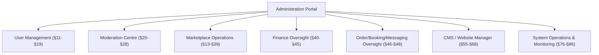
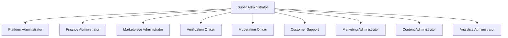
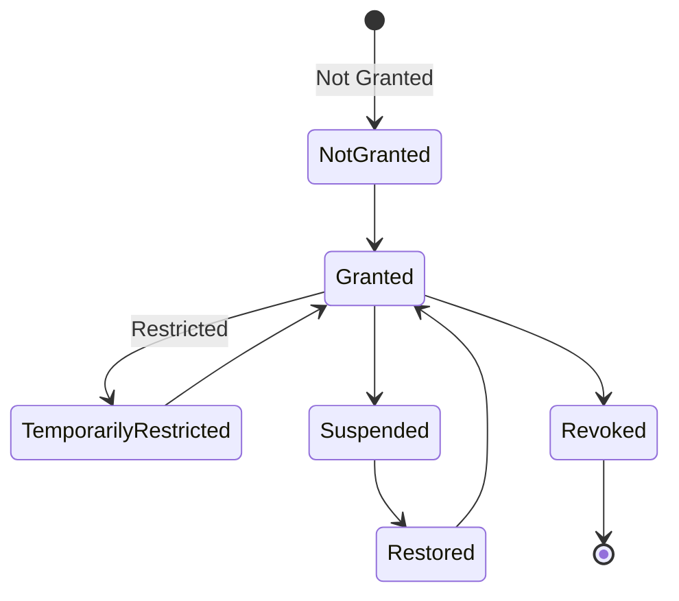
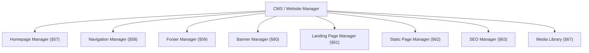

# Choosify Implementation Specification

**Document ID:** IS-009
**Title:** Administration Portal, CMS & Platform Operations Implementation
**Version:** 1.0.0
**Status:** Draft
**Priority:** Critical

**Derived From:**

- BP-001 Vision & Constitution
- BP-002 User Ecosystem & Identity Model
- BP-003 Identity, Authentication & Verification Engine
- BP-004 Seller Workspace & Brand Architecture
- BP-005 Product & Service Engine
- BP-008 Trust, Reputation, Moderation & Governance Engine
- BP-009 Finance, Escrow & Accounting Engine
- BP-010 Content, Discovery & Engagement Engine
- BP-011 Administration, CMS & Platform Operations Engine
- ES-001 through ES-010 (all Engineering Specifications)

This is a documentation-only Implementation Specification. It does not redesign the platform, invent new business rules, simplify architecture, or replace any BP/ES decision. No production code or database migration is contained in this document. This IS is the integration layer over IS-001 through IS-008 — wherever a capability is already fully specified there, this document references it rather than re-deriving it.

---

## Table of Contents

1. [Purpose](#1-purpose)
2. [Scope](#2-scope)
3. [Dependencies](#3-dependencies)
4. [Administration Architecture](#4-administration-architecture)
5. [Workspace Architecture](#5-workspace-architecture)
6. [Role Hierarchy](#6-role-hierarchy)
7. [RBAC Integration](#7-rbac-integration)
8. [Permission Matrix](#8-permission-matrix)
9. [Dashboard Architecture](#9-dashboard-architecture)
10. [Platform Analytics](#10-platform-analytics)
11. [Seller Management](#11-seller-management)
12. [Brand Management](#12-brand-management)
13. [Marketplace Access Management](#13-marketplace-access-management)
14. [Brand Verification](#14-brand-verification)
15. [Ownership Claims](#15-ownership-claims)
16. [Consumer Management](#16-consumer-management)
17. [Creator Management](#17-creator-management)
18. [Staff Management](#18-staff-management)
19. [Moderator Management](#19-moderator-management)
20. [Trust Management](#20-trust-management)
21. [Review Moderation](#21-review-moderation)
22. [Fraud Detection Dashboard](#22-fraud-detection-dashboard)
23. [Product Moderation](#23-product-moderation)
24. [Service Moderation](#24-service-moderation)
25. [Duplicate Listing Detection](#25-duplicate-listing-detection)
26. [Copyright Review](#26-copyright-review)
27. [Spam Detection](#27-spam-detection)
28. [AI Moderation Readiness](#28-ai-moderation-readiness)
29. [Category Management](#29-category-management)
30. [Category Attributes](#30-category-attributes)
31. [Dynamic Variant Templates](#31-dynamic-variant-templates)
32. [Search Management](#32-search-management)
33. [Recommendation Management](#33-recommendation-management)
34. [Featured Brand Management](#34-featured-brand-management)
35. [Sponsored Brand Management](#35-sponsored-brand-management)
36. [Advertisement Management](#36-advertisement-management)
37. [Deals Management](#37-deals-management)
38. [Coupon Management](#38-coupon-management)
39. [Subscription Management](#39-subscription-management)
40. [Finance Dashboard](#40-finance-dashboard)
41. [Escrow Dashboard](#41-escrow-dashboard)
42. [Payout Management](#42-payout-management)
43. [Commission Management](#43-commission-management)
44. [VAT & Tax Configuration](#44-vat--tax-configuration)
45. [Payment Policy Management](#45-payment-policy-management)
46. [Order Management](#46-order-management)
47. [Booking Management](#47-booking-management)
48. [Messaging Oversight](#48-messaging-oversight)
49. [Support Center](#49-support-center)
50. [Notification Center](#50-notification-center)
51. [Broadcast Notifications](#51-broadcast-notifications)
52. [Email Templates](#52-email-templates)
53. [SMS Templates](#53-sms-templates)
54. [WhatsApp Templates](#54-whatsapp-templates)
55. [CMS Architecture](#55-cms-architecture)
56. [Website Builder](#56-website-builder)
57. [Homepage Manager](#57-homepage-manager)
58. [Navigation Manager](#58-navigation-manager)
59. [Footer Manager](#59-footer-manager)
60. [Banner Manager](#60-banner-manager)
61. [Landing Page Manager](#61-landing-page-manager)
62. [Static Page Manager](#62-static-page-manager)
63. [SEO Manager](#63-seo-manager)
64. [Sitemap Manager](#64-sitemap-manager)
65. [Robots Manager](#65-robots-manager)
66. [Redirect Manager](#66-redirect-manager)
67. [Media Library](#67-media-library)
68. [File Manager](#68-file-manager)
69. [Audit Log Explorer](#69-audit-log-explorer)
70. [Activity Timeline](#70-activity-timeline)
71. [Platform Settings](#71-platform-settings)
72. [Localization](#72-localization)
73. [Language Management](#73-language-management)
74. [Currency Management](#74-currency-management)
75. [Regional Settings](#75-regional-settings)
76. [API Management](#76-api-management)
77. [Integration Management](#77-integration-management)
78. [Event Bus Monitoring](#78-event-bus-monitoring)
79. [Queue Monitoring](#79-queue-monitoring)
80. [Search Index Monitoring](#80-search-index-monitoring)
81. [System Health Dashboard](#81-system-health-dashboard)
82. [Error Monitoring](#82-error-monitoring)
83. [Deployment Information](#83-deployment-information)
84. [Backup Management](#84-backup-management)
85. [Security Dashboard](#85-security-dashboard)
86. [Incident Dashboard](#86-incident-dashboard)
87. [Event Bus Integration](#87-event-bus-integration)
88. [Notification Integration](#88-notification-integration)
89. [Database Dependencies](#89-database-dependencies)
90. [API Endpoints](#90-api-endpoints)
91. [Backend Services](#91-backend-services)
92. [Frontend Components](#92-frontend-components)
93. [Audit Logging](#93-audit-logging)
94. [Security Considerations](#94-security-considerations)
95. [Performance Considerations](#95-performance-considerations)
96. [Testing Checklist](#96-testing-checklist)
97. [Acceptance Criteria](#97-acceptance-criteria)
98. [Rollback Strategy](#98-rollback-strategy)
99. [Future Extensions](#99-future-extensions)
100. [Implementation Order](#100-implementation-order)
101. [Revision History](#revision-history)

---

## 1. Purpose

This document defines the implementation plan for the Administration Portal, CMS & Platform Operations of the Choosify Commerce Operating System, as governed by BP-011.

Unlike Seller and Creator Workspaces, the Administration Engine manages the entire ecosystem rather than individual businesses (BP-011 §1). Administrators exist to protect and operate the marketplace; administration is a governance function, and administrative privileges must never provide commercial advantages (BP-011 §3). This IS translates that philosophy — plus the RBAC roles from ES-003, the operational monitoring requirements of ES-009, and the governance boundaries already established across IS-001 through IS-008 — into a concrete, sequenced implementation plan for the single portal that operates and oversees them all.

---

## 2. Scope

In scope:

- Administration Architecture, Workspace Architecture, Role Hierarchy, and RBAC/Permission Matrix integration (BP-011 §3–§4, ES-003)
- Dashboard and Platform Analytics (BP-011 §5, §15)
- User Management surfaces for Sellers, Brands, Consumers, Creators, Staff, and Moderators (BP-011 §6–§7)
- Verification Management: Brand Verification, Ownership Claims (BP-011 §9)
- The complete Moderation Centre: Trust, Reviews, Fraud, Products, Services, Duplicate Listings, Copyright, Spam, AI-assist readiness (BP-011 §10, integrating IS-006)
- Category/Attribute/Variant template management (BP-011 §19 System Configuration, integrating IS-003)
- Search/Recommendation/Featured/Promoted/Advertisement/Deals/Coupon administrative surfaces (BP-011 §13–§14, integrating IS-008)
- Subscription Administration, Finance/Escrow/Payout/Commission/Tax dashboards (BP-011 §18–§19, integrating IS-007)
- Order/Booking Management and Messaging Oversight (integrating IS-004, IS-005)
- Notification Center, Broadcasts, and Templates (BP-011 §17)
- The complete CMS/Website Manager: Homepage, Navigation, Footer, Banners, Landing/Static Pages, SEO/Sitemap/Robots/Redirects, Media Library (BP-011 §11–§12)
- Audit Log Explorer and Activity Timeline (BP-011 §16)
- Platform Settings, Localization (Language/Currency/Regional)
- API/Integration Management, and full System Operations monitoring (Event Bus, Queues, Search Index, System Health, Errors, Deployment, Backups, Security, Incidents)

Out of scope (governed elsewhere, referenced not duplicated):

- The underlying business logic and data ownership of every domain this portal administers (Identity: IS-001, Seller/Brand: IS-002, Catalog: IS-003, Commerce: IS-004, Messaging: IS-005, Trust: IS-006, Finance: IS-007, Discovery: IS-008) — this IS is the administrative *surface* over those domains, not a re-specification of them
- AI Moderation model internals — BP-008 §17, this IS covers only the human-facing readiness/integration point (§28)
- Specific third-party integration credentials/connection flows beyond the Integration Management surface (§77)

---

## 3. Dependencies

| Document | Relevance |
|----------|-----------|
| BP-001 | Article 9 (Platform Neutrality: Administrators govern, never compete commercially) — the constitutional basis for the special requirement "Administrators never own Brands / sell Products / operate as Consumers" |
| BP-002 | Super Administrator role definition (§7), Workspace Separation (§12) |
| BP-003 | Administrator identity type; Marketplace Approval independence from registration |
| BP-004 | Marketplace Access states (Granted/Restricted/Suspended/Restored/Revoked) and suspension-preserves-ownership rules, already defined in IS-002 §7 |
| BP-005 | Category/Attribute/Variant ownership, already defined in IS-003 §9–§10 |
| BP-008 | Moderation Centre, Trust/Featured/Promoted distinction, already defined in IS-006 |
| BP-009 | Finance/Escrow/Cashbook oversight boundaries (Admin read-only by default), already defined in IS-007 §48–§49 |
| BP-010 | Website Manager, CMS, SEO scope, already defined in IS-008 |
| BP-011 | Authoritative source for this IS |
| ES-001 | Cross-domain data ownership rules this portal must respect when reading/writing across domains |
| ES-002 | `/api/v1/` conventions used by every endpoint in §90 |
| ES-003 | System Roles (§4), Administrative Roles, Super Administrator (§15), Permission Evaluation pipeline (§16) — authoritative for §6–§8 |
| ES-004 | Administration Events (§15): `AdminApprovedBrand`, `AdminSuspendedMarketplace`, `AdminChangedSettings`, `AdminPublishedBanner`, `AdminDeletedListing`, `AdminBroadcastSent` |
| ES-005 | Marketplace Access State Machine (§8), Active Order Suspension Guard (§11) — already implemented in IS-002, referenced here for the Administration-facing trigger |
| ES-006 | Broadcast Notifications (§20), Moderation Notifications (§18) |
| ES-008 | Zero Trust security model, Administrative Security (§25), Audit Logging (§20), Monitoring (§26), Incident Response (§27) |
| ES-009 | Logging (§15), Monitoring (§16), Observability (§17), Alerting (§18), Backup/Restore Strategy (§19–§20), Infrastructure Automation (§24) — authoritative for §78–§86 |
| ES-010 | Production Readiness Checklist (§26), Operational Runbooks (§20) |

---

## 4. Administration Architecture

Per BP-011 §1/§3:

The Administration Engine manages the entire ecosystem rather than individual businesses (BP-011 §1) — every branch above is a governance/oversight surface over a domain owned elsewhere (IS-001 through IS-008), never a duplicate data store for that domain's own records.

---

## 5. Workspace Architecture

Per the special implementation requirement ("Administration Portal is completely independent from Seller Workspace") and BP-002 §12 (Workspace Separation):

The Administration Portal is a distinct workspace from the Seller Workspace (IS-002), Creator Workspace, and Consumer Storefront — sharing the same underlying `/api/v1/` backend and Identity system (IS-001), but with a completely separate frontend application surface and navigation, consistent with ES-003 §5 ("Administrators access the Administration Portal," cross-workspace access prohibited unless explicitly authorized).

---

## 6. Role Hierarchy

Per BP-011 §4 and ES-003 §4 (System Roles):

Matching the special implementation requirement ("Super Admins possess unrestricted platform authority. Other administrative roles remain permission-driven through RBAC"): Super Administrator (ES-003 §15) possesses unrestricted authority (Platform Configuration, Security, Finance, System Settings, Feature Flags, Administrative Management, Infrastructure Integration, Audit Review); every other role listed in BP-011 §4 is scoped strictly by its assigned permission set (§7–§8), with no implicit elevation.

---

## 7. RBAC Integration

Per ES-003 §16 (Permission Evaluation pipeline): every Administration Portal action — without exception, including Super Administrator actions — passes through Authentication → Role → Permission → Ownership (where applicable, e.g. a specific Moderation Case assignment) → Business Rule → Execution → Audit. This IS does not introduce a bypass path for Administrators; Super Administrator's "unrestricted authority" (§6) means their permission set is maximal, not that they skip the pipeline.

---

## 8. Permission Matrix

Per BP-011 §4 and ES-003 §7–§9 (Permission Naming Convention `domain.action`, Permission Domains, Permission Levels): this IS assigns each Administrative Role (§6) a scoped permission set drawn from the domain.action catalog already established across IS-001 through IS-008 (e.g. `brand.verify`, `finance.escrow.view`, `cms.homepage.manage`, `moderation.case.assign`) — no new permission domains are invented here; this IS's contribution is the *role-to-permission-set mapping*, not new permission primitives.

---

## 9. Dashboard Architecture

Per BP-011 §5: the Administration Dashboard provides a real-time overview via configurable widgets — Marketplace Health, Active Orders, Revenue, Escrow Balance, Pending Verifications, Active Sellers, Active Consumers, Active Creators, Moderation Queue, Support Tickets, Fraud Alerts, and System Health. Each widget reads from its owning domain's IS (Orders/Escrow: IS-004/IS-007, Verifications: §14, Moderation Queue: IS-006 §43, System Health: §81) — the Dashboard is a composition layer, not a new data source.

---

## 10. Platform Analytics

Per BP-011 §15: Platform Analytics cover Marketplace, Consumers, Sellers, Brands, Products, Orders, Finance, Trust, Growth, Marketing, and Traffic, all filterable — extending existing `server/analytics/analyticsService.ts`, `analyticsRouter.ts`, `analyticsStorage.ts`, `analyticsTypes.ts`, `analyticsEvents.ts` already present in the admin repo, and `src/pages/admin/Analytics.tsx`. Each analytics category sources its raw data from its owning domain's events (IS-001 through IS-008's Event Bus emissions, §87) via the Analytics Domain (ES-001 §9), never by this portal querying other domains' tables directly.

---

## 11. Seller Management

Per BP-011 §6 (User Management: Sellers) matching the special requirement ("Administrators never own Brands. Administrators never sell Products"): capabilities are View, Search, Verify, Suspend, Restore, Merge (Future), Delete, Export — every action generates an audit record (§93). Administrative editing of a Seller record never grants the Administrator any operational/ownership capability over that Seller's Brands (BR-11.1/BR-11.2) — extending existing `src/pages/admin/Sellers.tsx`.

---

## 12. Brand Management

Per BP-011 §7 (Brand Portfolio Management): View All Brands, Marketplace Status, Verification, Ownership Claims, Marketplace Approval, Suspension, Featured Status, Trust Information, Reports, Analytics — administrative editing never replaces Seller ownership (BR-11.2). Extends existing `src/pages/admin/Brands.tsx`, `BrandDetails.tsx`, `BrandEditStudio.tsx`. This is the read/governance view over the Brand entity IS-002 owns — Administrators may change a Brand's Marketplace Status (§13) but never its content/ownership.

---

## 13. Marketplace Access Management

Per the special implementation requirement's exact state list ("Marketplace Access may be: Granted, Restricted, Suspended, Restored, Revoked, through Administration") and ES-005 §8 (Marketplace Access State Machine, already implemented in IS-002 §7):

This IS is the Administration-facing control surface over the exact state machine IS-002 §7 already owns — this document does not redefine the state machine, it specifies the administrative UI/API triggers for each transition.

---

## 14. Brand Verification

Per BP-011 §9 (Verification Management): Approve, Reject, Request Additional Documents, Suspend Review, Escalate — extending existing `src/pages/admin/BrandVerification.tsx`, operating on the verification workflow already defined in IS-002 §8. Verification decisions remain permanently traceable (BR-11.5, §93).

---

## 15. Ownership Claims

Per BP-011 §9 and ES-005 §12–§13 (Ownership Claim Lifecycle, Claim Rejection Rule, already implemented in IS-002 §8): the Administration surface for reviewing and deciding Brand Claim submissions — a rejected claim must never leave ownership assigned to the rejected claimant, matching IS-002's Claim Rejection Rule exactly.

---

## 16. Consumer Management

Per BP-011 §6: View, Search, Verify, Suspend, Restore, Delete, Export for Consumer accounts, matching the special requirement ("Administrators never operate as Consumers") — Administrative Consumer management is oversight only; no Administrator action can place an order or act as a Consumer using platform privileges (BP-011 §20, BR-11.8). Extends existing `src/pages/admin/Consumers.tsx`.

---

## 17. Creator Management

Mirrors §16 for Creator accounts, including Creator Verification (BP-011 §9), extending existing `src/pages/admin/CreatorsHub.tsx`, `CreatorsStudioList.tsx`, `CreatorEditStudio.tsx`, `CreatorEconomy.tsx`, `CreatorEarnings.tsx`.

---

## 18. Staff Management

Per BP-011 §4 (Administrative Roles are themselves a form of Staff) and ES-003 §6 (Staff Roles, IS-002 §10 Seller Staff): Administration oversight of platform-level Administrative Staff accounts (assigning Administrative Roles per §6) — distinct from Seller/Brand Staff (IS-002 §10), which Administrators view for governance purposes (§11) but do not directly manage day-to-day.

---

## 19. Moderator Management

Per BP-011 §4 ("Moderation Officer") and BP-011 §10 (Moderation Centre: "Assigned Moderator"): assignment and workload management of Moderation Officers across Moderation Cases (IS-006 §44) — a specific instance of Staff Management (§18) scoped to the Moderation role.

---

## 20. Trust Management

Per BP-011 §7 ("Trust Information") and IS-006 (Trust Score Engine, already fully specified): the Administration surface reads Trust Scores/History computed by IS-006 and, per BP-011 §20 ("Administrators may never Manipulate Trust Scores without recorded justification"), any administrative Trust adjustment must carry an explicit, audited justification (§93) — never a silent override. Extends existing `src/pages/admin/TrustCenter.tsx`.

---

## 21. Review Moderation

Per BP-011 §10 ("Fake Reviews") and IS-006 §15/§17 (Review Moderation, Human Moderation, already fully specified): extends existing `src/pages/admin/Reviews.tsx`. This IS does not re-specify the review moderation workflow — it is the same Moderation Queue/Case surface described in §43–§44 of IS-006, presented within this portal.

---

## 22. Fraud Detection Dashboard

Per BP-011 §5 ("Fraud Alerts") and IS-006 §18 (Fraud Detection, already specified): a dashboard aggregation of `FraudDetected` events (ES-004 §13) across Sellers, Consumers, and Finance (IS-007 §51) — this IS's Fraud Detection Dashboard is a read/visualization surface, not a new detection mechanism.

---

## 23. Product Moderation

Per BP-011 §8 (Product Portfolio: View All Products/Services, Search, Moderate, Archive, Remove, Restore, Flag, Investigate) — administrative product tools remain governance-focused (BP-011 §8), operating on Products owned by IS-003, never replacing Seller editing rights. Extends existing `src/pages/admin/Products.tsx`.

---

## 24. Service Moderation

Mirrors §23 for Services, per BP-011 §8's identical treatment of Products and Services.

---

## 25. Duplicate Listing Detection

Per BP-011 §10 ("Duplicate Listings") and IS-006 §22 (Duplicate Listing Detection, already fully specified via ES-005 §52's state machine): this IS's Duplicate Listing surface within the Administration Portal is the same Moderation Case flow already defined — no new detection logic here.

---

## 26. Copyright Review

Per BP-011 §10 ("Copyright") and IS-006 §20 (Copyright Detection, already specified): Administration surface for reviewing `CopyrightViolation`-flagged content (ES-004 §13) through the standard Moderation Case pipeline (IS-006 §44).

---

## 27. Spam Detection

Mirrors §25–§26 for Spam, per BP-011 §10 and IS-006 §19 (already specified).

---

## 28. AI Moderation Readiness

Per BP-011 §10 ("AI Flags") and IS-006 §16–§17 (AI Review Detection, Human Moderation — "AI recommends actions, Administrators approve final decisions," BR-8.10): this IS's Administration-side responsibility is presenting AI-flagged cases in the same Moderation Queue as human/report-originated cases (IS-006 §43, §46), with the source clearly labelled — AI never resolves a case without an Administrator's decision (matching IS-006's hard constraint exactly, restated here for the Administration UI).

---

## 29. Category Management

Per BP-011 §19 (System Configuration is where category/attribute ownership sits per BP-005 §21 "Administrators define category attributes") and IS-003 §9/§52 (Category & Attribute Manager, Administrator-only): extends existing `src/pages/admin/Categories.tsx`. This IS does not re-specify category hierarchy mechanics (IS-003 §6–§8 owns that) — it specifies the Administration UI for managing it.

---

## 30. Category Attributes

Per IS-003 §9/§57 (Dynamic Category Attributes, Administrator-only write access per IS-003 §52): the Administration UI for defining/editing the category-scoped attribute schema — this portal is the *only* place attribute schema can be written, since IS-003 §52 explicitly excludes Seller write access to it.

---

## 31. Dynamic Variant Templates

Mirrors §30 for Variant schemas, per IS-003 §10/§57 — Administrator-only, same UI surface as §30.

---

## 32. Search Management

Per IS-008 §67 (Admin Components: Synonym management, Ranking weight configuration, already fully specified): this IS's Search Management surface within the Administration Portal is the same configuration UI IS-008 already defines — Synonym sets (IS-008 §13) and Organic Ranking weights (IS-008 §31), both Administrator-configurable per IS-008's honest scoping (formula not hard-coded).

---

## 33. Recommendation Management

Per IS-008 §24/§67: Administration oversight of Recommendation Engine configuration (which signal categories are weighted) — a read/configure surface over the Recommendation Engine IS-008 owns, not a new recommendation algorithm.

---

## 34. Featured Brand Management

Per BP-008 §10/BR-8.4 and IS-006 §29/IS-008 §27 (Featured Engine, already fully specified) and the special implementation requirement ("Featured Brands are earned... Administration must clearly distinguish both" [Featured vs Promoted]): this IS's Administration surface displays the computed Featured eligibility (read-only, since Featured is earned via Trust Score, never administratively assigned) alongside the Promoted surface (§35), with the two visually and functionally distinguished throughout the portal, matching IS-006 §29–§30's "never purchasable / never earned" separation exactly.

---

## 35. Sponsored Brand Management

Per BP-008 §10/BR-8.5, IS-006 §30/IS-008 §28 (Promoted Engine) and IS-007 §30 (Advertising as Platform Revenue): this is the one place in the Featured/Promoted pair where Administration has *write* access — Promoted/Sponsored placement is a paid, Administrator/Finance-managed commercial arrangement (unlike Featured, which is a derived Trust output). Extends existing `src/pages/admin/AdsSponsors.tsx`, `SponsoredPromotions.tsx`.

---

## 36. Advertisement Management

Per the special implementation requirement's exact scope list ("Advertisement Manager controls: Homepage Ads, Category Ads, Search Ads, Product Ads, Service Ads, Guide Ads, Story Ads, Live Commerce Ads"):

This is a more granular breakdown of BP-010 §15's Promoted Content scope (Brands, Products, Services, Guides, Campaigns) — this IS extends that list to the eight placement surfaces named in the special requirement, each corresponding to a Discovery surface already defined in IS-008 (§54 Homepage Sections, §6 Category Discovery, §7 Search Architecture, §47 Product Pages, §48 Service Pages, §49 Guide Pages, §50 Story Pages, §51 Live Commerce Pages). Extends existing `src/pages/admin/AdsDealsStudio.tsx`.

---

## 37. Deals Management

Per BP-011 §14 ("Flash Deals, Seasonal Campaigns") and IS-003 §46/IS-008 §22 (Deals, already specified), with promotion scheduling supporting Start Date, End Date, Budget, and Priority (BP-011 §14). Extends existing `src/pages/admin/Deals.tsx`, `DealsBannersStudio.tsx`.

---

## 38. Coupon Management

Per BP-011 §14 ("Coupons, Gift Cards, Voucher Campaigns") and IS-004 §47 (Coupon Integration, already specified): Administration surface for Platform-issued Coupons (BP-006 §24 lists Platform as one of three coupon-issuing parties, alongside Sellers and Creators) — extends existing `src/pages/admin/Coupons.tsx`.

---

## 39. Subscription Management

Per BP-011 §18 (Subscription Administration: Plans, Pricing, Feature Limits, Product Limits, Storage, Analytics Access, API Limits [Future]) and IS-007 §33–§38 (Subscription Plans, already fully specified) — this is the Administrator-facing configuration surface over the Subscription model IS-007 owns; Subscriptions apply to Seller Accounts, not individual Brands (BR-9.5, restated).

---

## 40. Finance Dashboard

Per BP-011 §19 (Administrative Finance: Platform Revenue, Seller Settlements, Escrow, Refunds, Commissions, Subscription Billing, Financial Audits, Outstanding Balances) and IS-007 §61 (Admin Components, already fully specified) — administrative finance remains isolated from Seller accounting (BP-011 §19, BR-9.7). Extends existing `src/pages/admin/FeeChargesEngine.tsx`, `InvoiceView.tsx`.

---

## 41. Escrow Dashboard

Per IS-007 §8/§41/§61 (already fully specified): read/oversight surface over Escrow state, including exception paths (Full/Partial Refund, Dispute Hold, Administrative Adjustment) — this IS does not re-specify Escrow mechanics.

---

## 42. Payout Management

Per IS-007 §27–§28/§61 (Payout Engine's "Finance Review" step, already fully specified): this is where the Administration Portal executes the "Approval Workflow" gate of IS-007's six-gate Withdrawal chain. Extends existing `src/pages/admin/Payouts.tsx`.

---

## 43. Commission Management

Per IS-007 §16–§19/§61 (Commission Engine configuration, already fully specified): Administrator configuration of Flat/Percentage/Category/Subscription/Campaign commission rules.

---

## 44. VAT & Tax Configuration

Per BP-009 §17/IS-007 §20–§21 (VAT/Tax Engine, already fully specified): centrally-configured, region-extensible tax rule management — never Seller-definable, per IS-007's exact scoping.

---

## 45. Payment Policy Management

Per BP-006 §35/IS-004 §11/§28 ("Seller cannot invent payment rules outside permitted platform configurations") and IS-007 §28 (Payment Options are platform-defined, Seller-enabled): the Administration surface for defining which payment methods (Full/COD/Partial/Deposit/Installment/Wallet) are available for Sellers to enable, per category/platform policy — matching IS-004's exact governance model.

---

## 46. Order Management

Per BP-011 §5 ("Active Orders") and IS-004 §62 (Admin Components: Dispute case surface, already specified): Administration oversight of Orders across the platform for support/dispute/compliance purposes, extending existing `src/pages/admin/Orders.tsx`, `OrdersOverview.tsx`, `PlatformOrders.tsx`, `Returns.tsx`, `DisputeCenter.tsx` — this IS does not duplicate IS-004's Order lifecycle ownership, it is the oversight read/intervention surface.

---

## 47. Booking Management

Mirrors §46 for Service/Hotel/Tour Bookings, per IS-004's Booking lifecycles (already specified) — same oversight pattern.

---

## 48. Messaging Oversight

Per the special implementation requirement ("Admins may enter any conversation when authorized for moderation or support") and IS-005 §45/§59 (Admin Messaging, already fully specified): extends existing `src/pages/admin/Messages.tsx`, `LeadsInbox.tsx`. This IS reuses IS-005's exact permission-gated, fully-audited Admin entry mechanism — it is not re-specified differently here.

---

## 49. Support Center

Per BP-011 §2/BP-007 §18 (Support Tickets, independent from commercial messaging, BR-7.10, already specified in IS-005 §46): the Administration-facing queue/assignment/resolution UI over the Support Ticket lifecycle IS-005 owns.

---

## 50. Notification Center

Per BP-011 §17 and ES-006 (Notification Architecture, already fully specified): Administration oversight of the platform Notification Engine's delivery status/history — this IS does not re-specify notification delivery mechanics (ES-006 owns that), it is the Administrator's visibility/troubleshooting surface. Extends existing `src/pages/admin/Notifications.tsx`.

---

## 51. Broadcast Notifications

Per BP-011 §17 (Administrators may broadcast Platform Notifications, Email, SMS, Push, WhatsApp, In-App Broadcasts, targeting Everyone/Sellers/Consumers/Creators/Selected Brands) and ES-006 §20 (Broadcast Notifications, already specified) and ES-004 §15 (`AdminBroadcastSent`): the Administration UI for composing and targeting a Broadcast, triggering the mechanism ES-006 §20 already owns.

---

## 52. Email Templates

Per BP-011 §17/ES-006 §21 (Notification Templates, "Templates are managed centrally"): the Administration UI for managing the Email channel's template set — templates support variables (ES-006 §21) and are edited here, consumed by the Notification Engine at send time.

---

## 53. SMS Templates

Mirrors §52 for the SMS channel.

---

## 54. WhatsApp Templates

Mirrors §52 for the WhatsApp channel — noting WhatsApp serves both as a notification channel (ES-006 §4) and, separately, as a Social Inbox message source (IS-005 §14); this template management is specifically for the outbound notification use, not inbound Social Inbox conversation content.

---

## 55. CMS Architecture

Per BP-011 §11–§12 and the special implementation requirement's exact scope list ("CMS must manage: Homepage, Navigation, Footer, Hero Sections, Landing Pages, Categories, Menus, SEO, Media, Branding, Static Pages, Legal Pages, Announcements, Promotional Sections, without requiring code deployment"):

Website Manager controls all public platform content (BP-011 §11); CMS does not manage Seller-owned content (BP-011 §12, BR-11.6/BR-11.7) — every module above operates exclusively on platform-owned content (Homepage, Navigation, Footer, static/legal pages), never on Brand Profiles, Products, or Brand Stories, which remain Seller-owned per IS-002/IS-003. "Without requiring code deployment" (special requirement) means every CMS change is data-driven configuration consumed by the frontend at render time, never a code change.

---

## 56. Website Builder

Consolidates §57–§62: the umbrella term for the CMS modules that compose the public-facing website — this IS treats "Website Builder" as the collective UI/UX wrapping the individually-specified managers below, not a separately-architected system.

---

## 57. Homepage Manager

Per BP-011 §11 ("Homepage ordering remains fully configurable") and IS-008 §5/§54 (Homepage Discovery, Homepage Sections, already specified): the Administration UI for ordering/configuring the Homepage modules IS-008 §5 defines (Hero Banner, Featured Brands, Promoted Brands, Trending Products, etc.) — extends existing `src/pages/admin/WebsiteCMSStudio.tsx`, `LeftEditorPanel.tsx`, `RightPreviewPanel.tsx`.

---

## 58. Navigation Manager

Per BP-011 §11 ("Navigation") and the special requirement ("Menus"): primary navigation/menu structure configuration — data-driven, no code deployment required.

---

## 59. Footer Manager

Per BP-011 §11 ("Footer"): footer link/content configuration, same data-driven pattern as §58.

---

## 60. Banner Manager

Per BP-011 §11 ("Hero Sections") and BP-011 §12 ("Promotional Banners") and ES-004 §15 (`AdminPublishedBanner`): Hero Section and promotional banner content management, consistent with the Homepage Manager's module system (§57).

---

## 61. Landing Page Manager

Per BP-011 §11 ("Landing Pages") and IS-008 §45 (Landing Pages, already specified as composed from existing discoverable resources, never duplicating their data): the Administration authoring UI for these campaign/promotional pages.

---

## 62. Static Page Manager

Per BP-011 §12 ("Static Pages, Policies") and the special requirement ("Static Pages, Legal Pages"): CMS-authored pages (Terms, Privacy Policy, About, Help Articles per BP-011 §12) — platform-owned content, matching BR-11.6/BR-11.7 exactly.

---

## 63. SEO Manager

Per BP-011 §11 ("SEO") and IS-008 §38–§44/§67 (SEO Architecture and Admin Components, already fully specified): this IS's SEO Manager within the Administration Portal is the same configuration surface IS-008 already defines — this document does not re-specify SEO field mechanics.

---

## 64. Sitemap Manager

Per IS-008 §40/§65 (Sitemap Strategy, already specified): Administration visibility into Sitemap generation status/content — a monitoring surface over IS-008's automated Sitemap regeneration, not a manually-authored sitemap.

---

## 65. Robots Manager

Per IS-008 §41 (Robots Strategy, already specified): Administration configuration of `robots.txt`/`noindex` directives beyond the automatic Marketplace-Visibility-driven exclusions IS-008 already handles — e.g. temporarily excluding a Landing Page from indexing during a campaign draft period.

---

## 66. Redirect Manager

Not separately named in BP-011, but a standard companion to Canonical URLs (IS-008 §44) and Static Page Manager (§62): when a CMS-managed page's URL changes, the Administration Portal manages a redirect mapping (old URL → new URL) to preserve SEO value and avoid broken links — this IS treats Redirect Manager as part of the same URL-governance responsibility as §63–§65, not a separate architecture.

---

## 67. Media Library

Per BP-011 §11 ("Media" in the special requirement's CMS scope list) and ES-002 §18/ES-008 §16 (File Uploads, scanned before availability): the shared media asset repository consumed by Homepage/Banner/Landing/Static Page content — distinct from Product/Brand media (IS-003 §42, owned by Sellers) and Cashbook attachments (IS-007 §46, private) — this Media Library is specifically for platform-owned CMS assets.

---

## 68. File Manager

General-purpose file browsing/organization over the Media Library (§67) and any other platform-owned file assets (e.g. legal document templates) — an administrative UI layer over the same underlying media storage, not a separate storage system.

---

## 69. Audit Log Explorer

Per BP-011 §16 and BR-11.9 ("Audit history is immutable"): every administrative action generates User, Role, Timestamp, Module, Action, Previous Value, New Value, IP Address, and Device (BP-011 §16) — the Audit Log Explorer is the searchable/filterable read UI over this immutable record, sourced from the audit trail every IS in this series already writes to (§93).

---

## 70. Activity Timeline

Per BP-011 §16 (implicit chronological view) and BP-011 §7/§10 ("Timeline" fields on Brand reports and Moderation Cases): a chronological, entity-scoped view (e.g. "everything that happened to Brand X") composed from the Audit Log (§69) — a different UI presentation of the same underlying immutable data, not a separate log.

---

## 71. Platform Settings

Per BP-011 §19 (System Configuration: Platform Settings, Payment Gateways, Courier Providers, Tax Rules, VAT Rules, Marketplace Policies, Commission Rules, Notification Providers, Search Configuration, AI Configuration) — configuration changes require appropriate permissions (BP-011 §19, BR-11.10). Extends existing `src/pages/admin/Settings.tsx`. This is the umbrella settings surface; Payment Gateway/Tax/Commission/Search-specific configuration is separately detailed in §44–§45/§32 to avoid duplicating IS-007/IS-008's already-specified configuration surfaces.

---

## 72. Localization

Consolidates §73–§75: Language, Currency, and Regional Settings as the Localization sub-area of Platform Settings (§71) — not named as a distinct BP-011 section but implied by BP-012 §18 (Future Expansion: Multi-Currency, Multi-Language, International Expansion) and BP-009 §17 (Future regional tax rules). This IS treats the Localization configuration surface as forward-compatible scaffolding for that anticipated expansion, per the "future-ready" pattern already used in IS-003 §14 and IS-007 §14/§26.

---

## 73. Language Management

Per BP-012 §18 (Multi-Language, marked Future for full activation) — this IS ensures the Platform Settings data model (§71) includes a language-configuration slot from day one, without activating multi-language UI rendering in this phase.

---

## 74. Currency Management

Mirrors §73 for Multi-Currency (BP-012 §18, marked Future) — the platform currently operates in a single currency (BDT, per BP-005/BP-006/BP-009 examples throughout); this is schema/config readiness, not an active multi-currency feature.

---

## 75. Regional Settings

Mirrors §73–§74 for regional tax/compliance variation (BP-009 §17 "Future regional tax rules may be added") — consistent with IS-007 §21's Tax Engine already being implemented as pluggable/region-configurable.

---

## 76. API Management

Per BP-012 §18 (Enterprise APIs, marked Future) and ES-002 §26 (Future API Domains: Public API, Partner API, Webhook API): Administration visibility into API usage/rate-limit status (ES-002 §21) for the platform's own `/api/v1/` surface — full third-party API-key issuance/management is Future scope (§99), consistent with ES-002 §26 marking Public/Partner APIs as future domains.

---

## 77. Integration Management

Per BP-011 §19 (System Configuration includes Payment Gateways, Courier Providers, Notification Providers) and IS-005 §11 (Meta Business Inbox Integration, already specified as Seller-initiated): this IS's Integration Management surface is the Administrator-level configuration of *platform-wide* third-party providers (payment gateways, courier providers, notification providers, per BP-011 §19) — distinct from IS-005's Seller-initiated Social Inbox connections, which remain Seller-controlled per Brand.

---

## 78. Event Bus Monitoring

Per ES-009 §17 (Observability: Request ID, Correlation ID, Service Timeline) and ES-004 §21 (Event Consumers) and §22 (Retry Policy): Administration visibility into Event Bus health — event throughput, failed/retried events, Dead Letter Queue contents (ES-004 §22) — a monitoring surface over the Event Bus infrastructure every IS in this series emits to and consumes from (§87).

---

## 79. Queue Monitoring

Per ES-009 §10 (Queue Architecture: Email, SMS, WhatsApp, Push Notifications, Search Indexing, Image/Video Processing, Analytics, Reports, Escrow Processing) and §16 (Monitoring includes "Queue Length"): Administration visibility into queue depth/processing rate per queue type — surfaces backlogs (e.g. Search Reindexing falling behind) before they become user-visible problems.

---

## 80. Search Index Monitoring

Per IS-008 §7/§65 (Search indexing occurs asynchronously through the Event Bus, already specified) and ES-009 §22 (Search Index Lifecycle): Administration visibility into indexing lag, index freshness, and reindex-job status — this IS does not own the indexing mechanism (IS-008 does), only its Administration-facing health surface.

---

## 81. System Health Dashboard

Per the special implementation requirement's exact component list ("System Health Dashboard displays: API, Database, Queues, Search, Storage, Notifications, Payments, Background Jobs, Infrastructure") and ES-009 §16 (Monitoring: CPU, Memory, Disk, Database, API Latency, Queue Length, Search Health, Payment Health, Notification Health, Infrastructure Health):

This is a near-exact match to ES-009 §16's list — this IS implements the System Health Dashboard as the Administration-facing rendering of ES-009 §16's monitoring signals, extending the existing `server/routes/health.ts`, `server/routes/diagnostics.ts`, `server/lib/readiness.ts`, `server/lib/runtimeInfo.ts`, and `server/lib/startupDiagnostics.ts` already present in the admin repo, rather than building parallel health-check infrastructure.

---

## 82. Error Monitoring

Per ES-009 §15 (Logging: Errors) and ES-009 §18 (Alerting: API Failure, Database Failure, Payment Failure, Queue Failure, High Latency): Administration surface for centralized error visibility, extending existing `server/lib/logger.ts` and `server/lib/sanitizeLog.ts` (ensuring sensitive data is scrubbed from Admin-visible error logs, per ES-008 §13 Output Security).

---

## 83. Deployment Information

Per ES-010 §25/§26 (Release Strategy, Production Readiness Checklist): Administration read-only visibility into the currently-deployed version/build, extending existing `server/lib/runtimeInfo.ts` — informational only, this portal does not trigger deployments (ES-010 §11's CD pipeline remains the sole deployment mechanism, outside this IS's scope).

---

## 84. Backup Management

Per ES-009 §19–§20 (Backup Strategy, Restore Strategy) and BP-011 §19 (System Configuration, implicitly): Administration visibility into backup schedule/status/last-successful-backup — this IS's scope is visibility and triggering documented restore *runbooks* (ES-010 §20), not implementing the backup infrastructure itself (ES-009 §19 owns that).

---

## 85. Security Dashboard

Per ES-008 §26 (Monitoring: Authentication, Authorization, Payments, API Abuse, Rate Limits, Suspicious Activity, Alerts) and ES-008 §25 (Administrative Security: MFA, Strong Passwords, Audit Logging, Restricted Permissions, Session Monitoring): Administration visibility into security-relevant signals — failed login attempts, rate-limit triggers, suspicious activity flags — extending existing `server/lib/abuseProtection.ts` and `server/lib/helmetConfig.ts`.

---

## 86. Incident Dashboard

Per ES-008 §27 (Incident Response: Detection → Assessment → Containment → Investigation → Resolution → Recovery → Post-Incident Review, every incident receives an Incident ID): Administration surface for tracking active/historical Incidents through this exact lifecycle — a governance view over the Incident Response process ES-008 §27 defines, not a new incident-management system.

---

## 87. Event Bus Integration

Per ES-004 §15 (Administration Events): this domain emits `AdminApprovedBrand`, `AdminSuspendedMarketplace`, `AdminChangedSettings`, `AdminPublishedBanner`, `AdminDeletedListing`, `AdminBroadcastSent` — and, per §78, also *monitors* the Event Bus platform-wide (a unique dual role: producer of Administration Events, and observer of every other domain's event traffic for operational visibility). Every emitted event carries standard ES-004 §18 metadata. Per ES-004 §2, this domain's monitoring role (§78) is read-only observation, never an interception/mutation point in other domains' event flows.

---

## 88. Notification Integration

Per ES-006 §2: this domain's Broadcast mechanism (§51) is a direct, intentional exception to "business modules never deliver notifications directly" — Broadcast is itself an Administrator-initiated notification action by design (BP-011 §17), not an event-triggered one, consistent with ES-006 §20 describing Broadcast Notifications as Administrator-created rather than system-triggered. All *other* Administration-domain notifications (e.g. a Moderation decision notifying the affected Seller) are triggered via the events in §87, exactly like every other domain in this series.

---

## 89. Database Dependencies

Per ES-001 §9 (Administration module): `audit_logs`, `cms_pages`, `settings`, `feature_flags` (already listed in ES-001 §9's Administration module) plus this IS's additional surfaces:

| Table | Owns | Key Fields |
|-------|------|------------|
| `audit_logs` | Immutable audit trail (§69, ES-001 §9) | `actor_id`, `role`, `module`, `action`, `previous_value`, `new_value`, `ip_address`, `device`, `created_at` |
| `cms_pages` | Homepage/Navigation/Footer/Static/Landing Page content (§55–§62) | `page_type`, `slug`, content payload, `status` |
| `settings` | Platform Settings (§71–§75) | `key`, `value`, `category` |
| `feature_flags` | Feature Flag state (ES-001 §9) | `flag_key`, `enabled`, scope |
| `banners` | Hero/Promotional Banner content (§60) | `placement`, `content`, `schedule` |
| `templates` | Notification templates (§52–§54, ES-001 §9 Notifications module) | `channel`, `template_key`, `body` |
| `redirects` | URL redirect mappings (§66) | `from_path`, `to_path` |
| `media_library` | Platform-owned CMS media assets (§67) | media reference, `owner_type = platform` |

All tables follow ES-001 conventions: UUID primary keys, `created_at`/`updated_at`/`deleted_at`, `snake_case` naming. `audit_logs` is Never Delete (ES-001 §11, BR-11.9) — no code path in this IS may delete or edit an existing audit record. Schema migration itself is out of scope for this document.

---

## 90. API Endpoints

All endpoints follow ES-002 conventions and are Administrator-permission-gated per §7–§8 unless noted.

| Method | Endpoint | Purpose |
|--------|----------|---------|
| GET | `/api/v1/admin/dashboard` | Dashboard widget composition (§9) |
| GET | `/api/v1/admin/analytics` | Platform Analytics (§10) |
| GET/PATCH | `/api/v1/admin/sellers/{id}` | Seller Management (§11) |
| GET/PATCH | `/api/v1/admin/brands/{id}` | Brand Management, Marketplace Access transitions (§12–§13) |
| POST | `/api/v1/admin/brands/{id}/verification/decision` | Brand Verification decision (§14) |
| POST | `/api/v1/admin/brands/{id}/claims/{claimId}/decision` | Ownership Claim decision (§15) |
| GET/PATCH | `/api/v1/admin/consumers/{id}` | Consumer Management (§16) |
| GET/PATCH | `/api/v1/admin/creators/{id}` | Creator Management (§17) |
| GET | `/api/v1/admin/moderation/queue` | Unified Moderation Queue — Products/Services/Reviews/Consumers/Creators/Brands/Listings/Messages/Copyright/Fraud/Spam (§19–§28), shared surface with IS-006 §55 |
| GET/PATCH | `/api/v1/admin/categories` | Category/Attribute/Variant management (§29–§31) |
| GET/PATCH | `/api/v1/admin/search/config` | Search/Recommendation Management (§32–§33), shared surface with IS-008 §64 |
| GET/PATCH | `/api/v1/admin/promotions/sponsored` | Sponsored Brand / Advertisement Management (§35–§36) |
| GET/PATCH | `/api/v1/admin/deals`, `/api/v1/admin/coupons` | Deals/Coupon Management (§37–§38) |
| GET/PATCH | `/api/v1/admin/subscriptions/plans` | Subscription Management (§39), shared surface with IS-007 §58 |
| GET | `/api/v1/admin/finance/*` | Finance/Escrow/Payout/Commission/Tax dashboards (§40–§45), shared surface with IS-007 §58 |
| GET | `/api/v1/admin/orders`, `/api/v1/admin/bookings` | Order/Booking Management (§46–§47) |
| POST | `/api/v1/admin/conversations/{id}/enter` | Messaging Oversight (§48), shared surface with IS-005 §56 |
| GET/PATCH | `/api/v1/admin/support/tickets` | Support Center (§49) |
| POST | `/api/v1/admin/notifications/broadcast` | Broadcast Notifications (§51) |
| GET/PATCH | `/api/v1/admin/notifications/templates` | Email/SMS/WhatsApp Templates (§52–§54) |
| GET/PATCH | `/api/v1/admin/cms/pages` | Static/Landing Page Manager (§61–§62) |
| GET/PATCH | `/api/v1/admin/cms/homepage` | Homepage Manager (§57) |
| GET/PATCH | `/api/v1/admin/cms/navigation`, `/api/v1/admin/cms/footer` | Navigation/Footer Manager (§58–§59) |
| GET/PATCH | `/api/v1/admin/cms/banners` | Banner Manager (§60) |
| GET/PATCH | `/api/v1/admin/cms/seo`, `/api/v1/admin/cms/redirects` | SEO/Redirect Manager (§63, §66), shared surface with IS-008 §64 |
| GET | `/api/v1/admin/media` | Media Library (§67) |
| GET | `/api/v1/admin/audit-logs` | Audit Log Explorer (§69) |
| GET/PATCH | `/api/v1/admin/settings` | Platform Settings, Localization (§71–§75) |
| GET | `/api/v1/admin/system/health` | System Health Dashboard (§81) |
| GET | `/api/v1/admin/system/events`, `/api/v1/admin/system/queues` | Event Bus / Queue Monitoring (§78–§79) |
| GET | `/api/v1/admin/system/errors` | Error Monitoring (§82) |
| GET | `/api/v1/admin/system/security` | Security Dashboard (§85) |
| GET/POST | `/api/v1/admin/system/incidents` | Incident Dashboard (§86) |

Endpoints marked "shared surface" reuse the exact API already specified in the referenced IS document — this IS does not duplicate them under a different contract.

---

## 91. Backend Services

Implementation order, gated per ES-010 §13 Quality Gates:

1. **Administration RBAC/role-assignment service** — Role Hierarchy (§6) and Permission Matrix (§7–§8) enforcement, extending existing `server/middleware/requireAdmin.ts` and `server/middleware/requireSuperAdmin.ts`.
2. **Dashboard/Analytics composition service** — aggregates read-only data from IS-001 through IS-008's domains, extending existing `server/analytics/analyticsService.ts`, `analyticsStorage.ts`, `server/operations/analyticsService.ts`.
3. **CMS content service** — Homepage/Navigation/Footer/Banner/Landing/Static Page storage and retrieval (§55–§68), the one genuinely new backend surface this IS introduces (no existing `server/cms/` module was found in the repo; this extends the frontend-only `WebsiteCMSStudio.tsx`/`CMS.tsx`/`LeftEditorPanel.tsx`/`RightPreviewPanel.tsx` with a real backend).
4. **Moderation oversight service** — the Administration-side wrapper over IS-006's Moderation Queue/Case APIs, adding cross-domain aggregation (Products, Services, Reviews, Consumers, Creators, Brands, Listings, Messages, Copyright, Fraud, Spam all in one queue, matching the special requirement's exact list).
5. **Broadcast/Template service** — extending ES-006's Notification Engine with the Administrator-authored Broadcast/Template management surface (§51–§54).
6. **System monitoring service** — Event Bus/Queue/Search Index/System Health/Error/Security/Incident dashboards (§78–§86), extending existing `server/routes/health.ts`, `diagnostics.ts`, `server/lib/readiness.ts`, `runtimeInfo.ts`, `startupDiagnostics.ts`, `logger.ts`, `metrics.ts`, `abuseProtection.ts`.
7. **Audit Log service** — the write-side of every action in §11–§68, feeding the immutable `audit_logs` table (§89), plus the read/search Audit Log Explorer (§69).
8. **RBAC wiring** — every endpoint in §90 passes through the pipeline in §7.
9. **Event emission** — wire each service action to §87.
10. **Backup/restore runbook integration** — Administration visibility into ES-009 §19–§20's backup infrastructure (§84), read-only.

---

## 92. Frontend Components

The admin repository already contains an extensive Administration Portal frontend — this IS's frontend responsibility is largely *completing the backend* behind existing pages and adding the net-new CMS/System-Operations surfaces:

- **Existing pages this IS wires to real backend data**: `Dashboard.tsx`, `Analytics.tsx`, `Sellers.tsx`, `Brands.tsx`, `BrandDetails.tsx`, `BrandEditStudio.tsx`, `BrandVerification.tsx`, `Consumers.tsx`, `CreatorsHub.tsx`, `Moderation.tsx`/`ModerationV2.tsx`, `Reviews.tsx`, `TrustCenter.tsx`, `Categories.tsx`, `AdsDealsStudio.tsx`, `AdsSponsors.tsx`, `SponsoredPromotions.tsx`, `Deals.tsx`, `Coupons.tsx`, `FeeChargesEngine.tsx`, `InvoiceView.tsx`, `Payouts.tsx`, `Orders.tsx`, `OrdersOverview.tsx`, `PlatformOrders.tsx`, `Returns.tsx`, `DisputeCenter.tsx`, `Messages.tsx`, `LeadsInbox.tsx`, `Notifications.tsx`, `Settings.tsx`, `WebsiteCMSStudio.tsx`, `CMS.tsx`.
- **New System Operations surfaces**: Event Bus Monitor, Queue Monitor, Search Index Monitor, System Health Dashboard, Error Monitor, Security Dashboard, Incident Dashboard (§78–§86) — no existing frontend pages for these; this is genuinely new UI.
- **New CMS Manager surfaces**: Navigation Manager, Footer Manager, Banner Manager (dedicated), Redirect Manager, Media Library (§58–§60, §66–§67) — some overlap with `WebsiteCMSStudio.tsx`'s existing scope, extended per the special requirement's full CMS list.

---

## 93. Audit Logging

Per BP-011 §16/BR-11.4/BR-11.9 and the special implementation requirement ("Every administrative action generates immutable audit records. Sensitive administrative operations require confirmation and justification"): every action across §11–§68 records User, Role, Timestamp, Module, Action, Previous Value, New Value, IP Address, and Device (BP-011 §16 exact field list) and produces an immutable record (§89). Sensitive operations (Marketplace Suspension/Revocation, Trust Score manual adjustment, Cashbook intervention [IS-007 §49], Audit Log access itself for high-sensitivity records) require an explicit confirmation step and a recorded justification string — not merely a confirmation dialog, but a persisted "reason" field on the audit record.

---

## 94. Security Considerations

Per ES-008 §25 and BP-011 §20 and the special implementation requirement's constitutional statements ("Administrators never own Brands. Administrators never sell Products. Administrators never operate as Consumers"):

- These three constraints are enforced architecturally, not just by convention: the Administration Portal's data model has no code path that creates a Brand-ownership record, a Product-sale transaction, or a Consumer-order attributed to an Administrator identity. Administrative accounts are a fully distinct identity type (BP-002 §7) from Seller/Consumer accounts, and cross-workspace action is structurally prevented (§5), not merely permission-denied.
- Per BP-011 §20 ("Administrators may never... Manipulate Trust Scores without recorded justification, Hide promoted placements, Delete audit history, Modify completed financial history"): these four restrictions are implemented as hard denials in the RBAC/business-rule layer (§7), not soft warnings — there is no permission level that grants any of these four capabilities.
- Administrative accounts require MFA (ES-008 §25) — noting MFA itself is marked Future in ES-008 §4/§8 and IS-001 §26, so this requirement activates when MFA is implemented; until then, Administrative accounts receive the strongest available authentication controls (§85 Security Dashboard monitors this gap explicitly).

---

## 95. Performance Considerations

Per ES-009: the Dashboard (§9) and Analytics (§10) composition services aggregate across many domains and should be treated as "Heavy" APIs (ES-009 §13, <1000ms) with pre-aggregated/cached reads (ES-009 §7) rather than live cross-domain queries on every page load. System Health/Monitoring dashboards (§78–§86) poll at a bounded interval rather than real-time-streaming by default, to avoid the monitoring surface itself becoming a load source. CMS content (§55–§68) is served from cache/CDN on the public-facing side (ES-009 §7–§8), with Administration edits invalidating the relevant cache entries via the Event Bus (§87).

---

## 96. Testing Checklist

- [ ] The Administration Portal is a fully separate workspace from the Seller Workspace, with no shared navigation or cross-workspace data leakage (§5)
- [ ] No Administrator action can create Brand ownership, sell a Product, or place a Consumer order under the Administrator's own identity (§94, matching the special requirement exactly)
- [ ] Marketplace Access correctly transitions through Granted/Restricted/Suspended/Restored/Revoked via Administration, using the exact state machine already verified in IS-002 (§13)
- [ ] Marketplace suspension hides Brand/Products/Services/Deals/Advertisements/Search visibility while preserving Orders/Bookings/Messages/Finance/Inventory/Seller ownership, and generates an administrative warning first if active Orders exist (§13, matching the special requirement and IS-002/IS-004's Active Order Suspension Guard exactly)
- [ ] CMS content changes (Homepage, Navigation, Footer, Banners, Landing/Static Pages) take effect without any code deployment (§55–§62)
- [ ] The Advertisement Manager correctly controls all eight named placement surfaces (Homepage, Category, Search, Product, Service, Guide, Story, Live Commerce Ads) (§36)
- [ ] Featured and Promoted/Sponsored Brands are clearly, consistently distinguished throughout the Administration UI, with Featured shown as read-only/earned and Promoted as Administrator/Finance-configurable (§34–§35)
- [ ] The unified Moderation Queue correctly surfaces Products, Services, Reviews, Consumers, Creators, Brands, Listings, authorized Message cases, Copyright, Fraud, and Spam cases in one place (§19–§28, matching the special requirement's exact list)
- [ ] Every administrative action produces an immutable audit record with the exact BP-011 §16 field set (§93)
- [ ] Sensitive operations (Marketplace Revocation, Trust adjustment, Cashbook intervention) require explicit confirmation and a persisted justification, not merely a dialog (§93)
- [ ] Super Administrator has unrestricted access; every other role is correctly limited to its assigned permission set with no implicit elevation (§6–§8)
- [ ] The System Health Dashboard correctly displays API, Database, Queues, Search, Storage, Notifications, Payments, Background Jobs, and Infrastructure status (§81, matching the special requirement exactly)
- [ ] Administration Cashbook access remains read-only by default, exposing operational oversight without private Seller bookkeeping detail beyond authorized functions (§40, matching the special requirement and IS-007 §48–§49 exactly)
- [ ] Every event in §87 is emitted with correct ES-004 §18 metadata

---

## 97. Acceptance Criteria

This IS is considered complete when:

- Administration Architecture, Workspace Architecture, Role Hierarchy, and RBAC/Permission Matrix match BP-011 §3–§4 and ES-003 exactly, with the constitutional Administrator-never-participates-commercially constraint enforced architecturally
- Marketplace Access Management implements the exact five-state administrative control surface, correctly triggering the Active Order Suspension Guard warning
- The complete Moderation Centre unifies every named case type into one queue, with AI-flagged cases always requiring human decision
- CMS/Website Manager covers every module in the special requirement's exact list, entirely without code deployment, and never touches Seller-owned content (BR-11.6/BR-11.7)
- Featured vs Promoted/Sponsored distinction is clear and consistent throughout the Administration UI
- Finance/Escrow/Payout/Commission/Tax administrative surfaces correctly reuse IS-007's already-specified mechanisms without duplication or contradiction
- System Health Dashboard and the full System Operations monitoring suite (Event Bus, Queue, Search Index, Errors, Backup, Security, Incidents) are implemented per §78–§86
- Every administrative action, especially sensitive ones, produces an immutable, justified audit record
- All endpoints in §90 pass the RBAC pipeline in §7
- All events in §87 are emitted with correct ES-004 §18 metadata
- The testing checklist in §96 passes in full
- No BP or ES document required modification to complete this implementation

---

## 98. Rollback Strategy

- Each backend service in §91 is deployed independently behind standard release gates (ES-010 §11), allowing rollback to the prior deployed version without data loss.
- Database changes follow the ES-001 §15 migration workflow; every migration is paired with a tested down-migration before Production deployment.
- CMS content changes are versioned (a rollback of a Homepage/Static Page edit restores the prior published version, not a code rollback) — this is a content-rollback capability distinct from the deployment-rollback covered by ES-010.
- Because this Administration Portal is the control surface over every other domain (IS-001–IS-008), rollback of this subsystem's *code* never reverts the underlying domain data or state it manages — a rollback here means Administrators temporarily lose a UI/API capability, never that Marketplace Access, Moderation decisions, or Finance state silently revert.
- Audit logs and emitted events are never rolled back or deleted (ES-008 BR-8.6, BR-11.9).

---

## 99. Future Extensions

Explicitly deferred, per the source documents:

- Full Multi-Language and Multi-Currency activation (§72–§75, BP-012 §18 marked Future)
- Public/Partner/Webhook API issuance and management (§76, ES-002 §26 marked Future)
- Merge capability for User Management (BP-011 §6, explicitly marked Future)
- API Limits as a Subscription-controlled feature (BP-011 §18, marked Future)
- MFA-gated Administrative accounts (§94, dependent on IS-001 §26's Future MFA implementation)
- AI Configuration surfacing model-level tuning controls beyond the current AI-assist-flags-only integration (§28, BP-008 §17/BP-012 §15's assistant-only AI boundary)

---

## 100. Implementation Order

**Phase 1 — Database**
Implement Administration Domain tables per §89 (`audit_logs`, `cms_pages`, `settings`, `feature_flags`, `banners`, `templates`, `redirects`, `media_library`), following the ES-001 §15 migration workflow, building on the eight prior domains' tables this portal governs.

**Phase 2 — Administration Backend**
Implement the RBAC/role-assignment service and Dashboard/Analytics composition service (§91 steps 1–2).

**Phase 3 — CMS Engine**
Implement the CMS content service (§91 step 3) — the genuinely new backend module behind Homepage/Navigation/Footer/Banner/Landing/Static Page management, since the repo currently has only frontend CMS scaffolding.

**Phase 4 — Moderation Engine**
Implement the Moderation oversight service (§91 step 4), unifying IS-006's Moderation Queue across every named case type.

**Phase 5 — REST APIs**
Implement and RBAC-wire the endpoints in §90, correctly reusing shared surfaces from IS-005/IS-006/IS-007/IS-008 rather than duplicating their contracts.

**Phase 6 — Administration Dashboard**
Wire the extensive existing frontend (§92) to real backend data, and build the net-new CMS Manager and System Operations surfaces.

**Phase 7 — System Monitoring**
Implement the System monitoring service (§91 step 6): Event Bus/Queue/Search Index/System Health/Error/Security/Incident dashboards, extending existing `server/routes/health.ts`, `diagnostics.ts`, and `server/lib/` observability modules.

**Phase 8 — Testing**
Execute the full checklist in §96, with particular attention to the Administrator-never-participates-commercially architectural constraint, the Marketplace Access suspension-preserves-ownership behavior, and audit-record completeness for sensitive operations.

**Phase 9 — Documentation Update**
Update `docs/README.md`'s Implementation Specifications table to mark this IS as implemented; record any clarifying ADRs in `docs/engineering/Decision-Records/` if implementation surfaced ambiguity requiring a decision record.

**Phase 10 — Deployment Checklist**
Apply the ES-010 §26 Production Readiness Checklist before enabling this subsystem in Production, with Super Administrator provisioning verified secure, all sensitive-operation confirmation/justification flows tested, and the System Health Dashboard confirmed accurately reflecting real infrastructure state before go-live.

---

## Revision History

| Version | Date | Description |
|----------|------|-------------|
| 1.0.0 | August 2026 | Initial Administration Portal, CMS & Platform Operations Implementation Specification |
