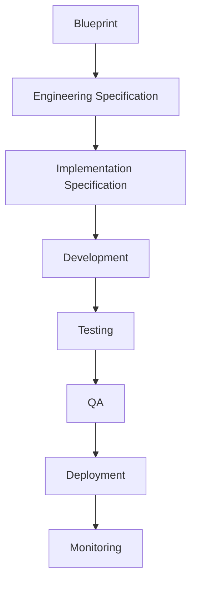

# Choosify Implementation Specification

**Document ID:** IS-010
**Title:** Production Readiness & Sprint Execution Roadmap
**Version:** 1.0.0
**Status:** Draft
**Priority:** Critical

**Derived From:**

- BP-000 through BP-012 (all Blueprints)
- ES-001 through ES-010 (all Engineering Specifications)
- IS-001 through IS-009 (all Implementation Specifications published to date)

This is a documentation-only Implementation Specification. It does not redesign the platform, invent new business rules, simplify architecture, or replace any BP/ES decision. No production code or database migration is contained in this document. This IS is the master execution roadmap sitting above IS-001 through IS-009 — it sequences and governs how they are built, it does not re-specify what they contain.

---

## Table of Contents

1. [Purpose](#1-purpose)
2. [Scope](#2-scope)
3. [Dependencies](#3-dependencies)
4. [Overall Platform Build Strategy](#4-overall-platform-build-strategy)
5. [Repository Strategy](#5-repository-strategy)
6. [Documentation Governance](#6-documentation-governance)
7. [Sprint Philosophy](#7-sprint-philosophy)
8. [Development Principles](#8-development-principles)
9. [Coding Standards](#9-coding-standards)
10. [Branch Strategy](#10-branch-strategy)
11. [Environment Strategy](#11-environment-strategy)
12. [Feature Flag Strategy](#12-feature-flag-strategy)
13. [Database Migration Strategy](#13-database-migration-strategy)
14. [API Versioning Strategy](#14-api-versioning-strategy)
15. [Testing Strategy](#15-testing-strategy)
16. [QA Strategy](#16-qa-strategy)
17. [Release Strategy](#17-release-strategy)
18. [Rollback Strategy](#18-rollback-strategy)
19. [Monitoring Strategy](#19-monitoring-strategy)
20. [Production Readiness Checklist](#20-production-readiness-checklist)
21. [Deployment Checklist](#21-deployment-checklist)
22. [Documentation Update Process](#22-documentation-update-process)
23. [ADR (Architecture Decision Record) Process](#23-adr-architecture-decision-record-process)
24. [Change Management](#24-change-management)
25. [Risk Management](#25-risk-management)
26. [Technical Debt Management](#26-technical-debt-management)
27. [Future Expansion Strategy](#27-future-expansion-strategy)
28. [Sprint 1 — Identity & Authentication](#28-sprint-1--identity--authentication)
29. [Sprint 2 — Seller Workspace](#29-sprint-2--seller-workspace)
30. [Sprint 3 — Brand Ownership](#30-sprint-3--brand-ownership)
31. [Sprint 4 — Products](#31-sprint-4--products)
32. [Sprint 5 — Services](#32-sprint-5--services)
33. [Sprint 6 — Inventory](#33-sprint-6--inventory)
34. [Sprint 7 — Categories](#34-sprint-7--categories)
35. [Sprint 8 — Commerce](#35-sprint-8--commerce)
36. [Sprint 9 — Orders](#36-sprint-9--orders)
37. [Sprint 10 — Payments](#37-sprint-10--payments)
38. [Sprint 11 — Escrow](#38-sprint-11--escrow)
39. [Sprint 12 — Messaging](#39-sprint-12--messaging)
40. [Sprint 13 — Notifications](#40-sprint-13--notifications)
41. [Sprint 14 — Trust Engine](#41-sprint-14--trust-engine)
42. [Sprint 15 — Reviews](#42-sprint-15--reviews)
43. [Sprint 16 — Moderation](#43-sprint-16--moderation)
44. [Sprint 17 — Finance](#44-sprint-17--finance)
45. [Sprint 18 — Cashbook](#45-sprint-18--cashbook)
46. [Sprint 19 — Discovery](#46-sprint-19--discovery)
47. [Sprint 20 — Search](#47-sprint-20--search)
48. [Sprint 21 — Recommendation Engine](#48-sprint-21--recommendation-engine)
49. [Sprint 22 — Live Commerce](#49-sprint-22--live-commerce)
50. [Sprint 23 — Deals](#50-sprint-23--deals)
51. [Sprint 24 — Guides](#51-sprint-24--guides)
52. [Sprint 25 — Creator Platform](#52-sprint-25--creator-platform)
53. [Sprint 26 — CMS](#53-sprint-26--cms)
54. [Sprint 27 — Administration](#54-sprint-27--administration)
55. [Sprint 28 — Analytics](#55-sprint-28--analytics)
56. [Sprint 29 — Performance Optimization](#56-sprint-29--performance-optimization)
57. [Sprint 30 — Production Hardening](#57-sprint-30--production-hardening)
58. [Module Dependency Matrix](#58-module-dependency-matrix)
59. [Critical Path Analysis](#59-critical-path-analysis)
60. [Parallel Development Opportunities](#60-parallel-development-opportunities)
61. [Infrastructure Readiness](#61-infrastructure-readiness)
62. [Database Readiness](#62-database-readiness)
63. [API Readiness](#63-api-readiness)
64. [Frontend Readiness](#64-frontend-readiness)
65. [Mobile Readiness (Future)](#65-mobile-readiness-future)
66. [AI Readiness (Future)](#66-ai-readiness-future)
67. [Third-party Integrations](#67-third-party-integrations)
68. [Payment Gateway Readiness](#68-payment-gateway-readiness)
69. [Meta Integration Readiness](#69-meta-integration-readiness)
70. [Google Integration Readiness](#70-google-integration-readiness)
71. [Courier Integration Readiness](#71-courier-integration-readiness)
72. [Search Infrastructure Readiness](#72-search-infrastructure-readiness)
73. [Monitoring Readiness](#73-monitoring-readiness)
74. [Security Readiness](#74-security-readiness)
75. [Compliance Readiness](#75-compliance-readiness)
76. [Disaster Recovery Readiness](#76-disaster-recovery-readiness)
77. [Backup Validation](#77-backup-validation)
78. [Go-Live Checklist](#78-go-live-checklist)
79. [Post-Launch Monitoring](#79-post-launch-monitoring)
80. [Production Stabilization](#80-production-stabilization)
81. [Continuous Improvement](#81-continuous-improvement)
82. [Event Bus Integration](#82-event-bus-integration)
83. [Notification Integration](#83-notification-integration)
84. [RBAC Validation](#84-rbac-validation)
85. [Audit Validation](#85-audit-validation)
86. [Testing Matrix](#86-testing-matrix)
87. [Acceptance Criteria](#87-acceptance-criteria)
88. [Future Expansion](#88-future-expansion)
89. [Implementation Order](#89-implementation-order)
90. [Revision History](#revision-history)

---

## 1. Purpose

This document is the master execution roadmap for building the Choosify Commerce Operating System. It translates the approved Blueprints (BP-000–BP-012), Engineering Specifications (ES-001–ES-010), and the domain Implementation Specifications (IS-001–IS-009) into a sequenced, sprint-by-sprint build plan governing every development sprint from first commit to Production go-live and beyond.

Per BP-012 §1: this document "serves as the master architectural contract for developers, architects, AI coding assistants, QA engineers, DevOps engineers and future contributors" applied specifically to *sequencing* — BP-012 defines what the architecture is; this IS defines the order in which it gets built.

---

## 2. Scope

In scope:

- The governance hierarchy (Blueprint → Engineering Specification → Implementation Specification → Development → Testing → QA → Deployment → Monitoring) and the strategies that support each stage (§4–§27)
- The complete 30-sprint execution sequence (§28–§57), mapping every sprint to the IS document(s) that govern it
- Module dependency analysis, critical path, and parallelization opportunities (§58–§60)
- Readiness verification across every platform dimension — infrastructure, database, API, frontend, third-party integrations, security, compliance, disaster recovery (§61–§77)
- Go-live, post-launch, and continuous-improvement processes (§78–§81)
- Cross-cutting validation requirements (Event Bus, Notifications, RBAC, Audit, Testing) that apply across all 30 sprints (§82–§86)

Out of scope:

- Re-specifying any domain's architecture, business rules, or technical design — that is IS-001 through IS-009's role, and this document defers to them entirely
- Sprint-level task breakdown (user stories, story points, ticket assignment) — this is a phase/sprint *sequencing* document, not a project-management artifact
- Any BP or ES content — this document only sequences and governs their execution

---

## 3. Dependencies

This document depends on and governs the execution of all prior documentation:

| Document Set | Role in This IS |
|---------------|------------------|
| BP-000–BP-012 | Business authority (special requirement) — every sprint's *why* traces here |
| ES-001–ES-010 | Technical authority (special requirement) — every sprint's *how* traces here, especially ES-010 (DevOps/CI/CD) which this document extends into a concrete sprint calendar |
| IS-001 Identity, Authentication & Session | Governs Sprint 1 (§28) |
| IS-002 Seller Workspace & Brand Ownership | Governs Sprints 2–3 (§29–§30) |
| IS-003 Product, Service & Inventory Engine | Governs Sprints 4–7, 23 (§31–§34, §50) |
| IS-004 Commerce, Checkout & Order Management | Governs Sprints 8–11 (§35–§38) |
| IS-005 Messaging, Communication & Social Commerce | Governs Sprint 12 (§39) |
| IS-006 Trust, Reputation, Reviews & Moderation | Governs Sprints 14–16 (§41–§43) |
| IS-007 Finance, Escrow & Business Operations | Governs Sprints 11, 17–18 (§38, §44–§45) |
| IS-008 Discovery, Search, Recommendation & Content | Governs Sprints 19–21, 24 (§46–§48, §51) |
| IS-009 Administration Portal, CMS & Platform Operations | Governs Sprints 26–28 (§53–§55) |

Sprint 13 (Notifications), 22 (Live Commerce), 25 (Creator Platform), 29 (Performance Optimization), and 30 (Production Hardening) are cross-cutting or not yet covered by a dedicated IS — each is addressed explicitly in its own section (§40, §49, §52, §56–§57) with an honest statement of what governs it.

---

## 4. Overall Platform Build Strategy

Per the special implementation requirement's exact governance chain:

Matching the special requirement exactly ("The Blueprints remain the business authority. Engineering Specifications remain the technical authority. Implementation Specifications become the execution authority"): no sprint begins development against a capability that lacks an approved BP → ES → IS chain. This document's 30-sprint sequence (§28–§57) is built exclusively from capabilities already covered by BP-000–012, ES-001–010, and IS-001–009 (or, where a dedicated IS does not yet exist, explicitly flagged as requiring one before that sprint's Development stage begins — never skipped silently).

The platform is built domain-by-domain, in dependency order (§58–§59), with each domain's sprint(s) producing working, independently testable software (special requirement) before the next domain's sprints begin — consistent with BP-012 §14 (Scalability is architected in from the start, not bolted on) and BP-012 §19 (Blueprint Dependency Map, which this roadmap's sprint order structurally mirrors).

---

## 5. Repository Strategy

Per ES-010 §4 (Source Control: Choosify Admin, Choosify Web, with Mobile/API/Infrastructure/Documentation/AI Services as future repositories): this roadmap targets the `choosify-admin-4.0` repository as the primary build target for backend services and the Administration Portal (consistent with every IS-001–009's Backend/Admin Components sections), with the `Choosify-Web` storefront repository consuming the same `/api/v1/` contract for Consumer-facing surfaces (explicitly noted in IS-008 §66/§70 for Discovery/Search). Documentation itself (`docs/blueprint/`, `docs/engineering/`, `docs/implementation/`) lives in the admin repository per the earlier decision recorded in this documentation effort, and is not duplicated into the storefront repository.

---

## 6. Documentation Governance

Per §4's chain and BP-011 §16/ES-001 §15: every sprint that changes behavior in a way that reveals an ambiguity, gap, or necessary clarification in an existing BP/ES/IS document does not silently patch that document mid-sprint. Clarifications are captured as ADRs (§23) referencing the specific document/section in question; the source documents (BP/ES) are amended only through the formal amendment process already defined in BP-001 §19 (Constitutional Amendments: reason, affected modules, implementation impact, migration considerations, version increment) — never through an undocumented sprint-time edit. IS documents (§22) may be revised more readily than BP/ES, since they are the execution authority translating already-fixed business/technical decisions, but revisions still follow the Revision History convention already established throughout this documentation set.

---

## 7. Sprint Philosophy

Matching the special implementation requirements exactly: every sprint must produce working software; every sprint must be independently testable; every sprint must update documentation where necessary; every sprint must include unit tests, API tests, and integration tests; every sprint must pass QA before the next sprint begins; the platform must remain deployable at every stage; no sprint should require rebuilding previous architecture.

This is the single most load-bearing section of this document — every sprint definition in §28–§57 is written to satisfy these seven constraints simultaneously, not sequentially deferred. A sprint that produces code but no tests, or tests but no working deployable increment, does not satisfy this philosophy regardless of how much work was completed.

---

## 8. Development Principles

Per BP-012 §16 (Platform Principles: API First, Modular, Event Driven, Secure by Default, Least Privilege, Single Source of Truth, Audit Everything, No Hidden Business Logic, Clear Ownership, Horizontal Scalability) and ES-010 §8 (Coding Standards: consistent naming, small functions, single responsibility, no duplicated logic): every sprint's Development stage (§4) adheres to these ten platform principles without exception — they are not negotiable per-sprint, since they are what makes the "no sprint should require rebuilding previous architecture" constraint (§7) achievable in practice.

---

## 9. Coding Standards

Per ES-010 §8: consistent naming, small functions, single responsibility, no duplicated logic, clear documentation, type safety, reusable components, readable architecture — business logic belongs in services. This roadmap does not restate ES-010 §8's standards; every sprint's Development stage is governed by them directly.

---

## 10. Branch Strategy

Per ES-010 §5: `main` (production-ready), `develop` (integration), `feature/*`, `bugfix/*`, `hotfix/*`, `release/*` — direct commits to `main` are prohibited. Each Sprint (§28–§57) is developed on `feature/*` branches scoped to that sprint's IS document, merged to `develop` after passing the sprint's QA gate (§7, §16), and promoted to `release/*` → `main` only at the Phase boundaries defined in §89's Implementation Order, not necessarily after every individual sprint (a Phase may batch several sprints' work into one release).

---

## 11. Environment Strategy

Per ES-010 §3: Local Development → Development → Testing → Staging → Production, each with isolated Database, Storage, Secrets, Configuration, Logging, and Monitoring. Every sprint's software (§7) is validated in Development and Testing environments before Staging promotion; Production deployment occurs only after Sprint 30 (special requirement, §57, §89 Phase 9) — no individual sprint's completion triggers a Production deployment on its own.

---

## 12. Feature Flag Strategy

Per ES-010 §15 (Feature Flags: Enabled/Disabled/Scheduled/Limited/Experimental, allowing gradual rollout without redeployment) and the Rollback Strategy sections already established in every IS-001–009 (each of which feature-flags its most sensitive services — Payment/Escrow in IS-004/IS-007, Trust Score computation in IS-006, Social Inbox channels in IS-005, Search ranking weights in IS-008): this roadmap requires every sprint touching a financially-sensitive, trust-sensitive, or externally-integrated capability to ship behind a feature flag, consistent with each IS document's own Rollback Strategy section — this is not a new requirement invented here, it aggregates what IS-001–009 already individually committed to.

---

## 13. Database Migration Strategy

Per ES-001 §15 (Schema Change → Migration → Review → Approval → Deployment, direct production schema edits prohibited): every sprint that introduces new tables (per its governing IS document's Database Dependencies section) follows this exact workflow. Database Migration Strategy at the roadmap level means sequencing — a sprint's migrations only ever depend on tables already migrated in an earlier sprint (§58 Module Dependency Matrix enforces this), never a forward reference to a not-yet-built table.

---

## 14. API Versioning Strategy

Per ES-002 §5: base URL `/api/v1/`, with `/api/v2/` reserved for future breaking changes, older versions supported per platform deprecation policy. Every sprint's endpoints (per its governing IS document's API Endpoints section) ship under `/api/v1/` — this roadmap does not introduce version fragmentation mid-build; a breaking change discovered during a later sprint is resolved via ADR (§23) and, if unavoidable, deferred to a `/api/v2/` scope explicitly outside this 30-sprint plan.

---

## 15. Testing Strategy

Per ES-010 §12 (Testing pyramid: Unit → Integration → API → UI → End-to-End → Manual Acceptance) and the special requirement's exact three-tier minimum (unit, API, integration tests every sprint): every sprint's Testing stage (§4) executes at minimum the unit/API/integration tiers before QA (§16); UI and End-to-End tests are added at the Phase boundaries (§89) once enough sprints have completed to exercise a full user journey (a single early sprint like Sprint 1 cannot end-to-end test a purchase flow that doesn't exist yet).

---

## 16. QA Strategy

Per ES-010 §13 (Quality Gates: Compilation, Linting, Unit Tests, Integration Tests, API Validation, Security Checks, Migration Validation, Performance Checks, Accessibility Checks, Documentation Review): every sprint must pass QA before the next sprint begins (special requirement) — this is a hard sequential gate, not a parallel/advisory check. QA validates the sprint's Testing-stage results (§15) against its governing IS document's own Testing Checklist and Acceptance Criteria sections (every IS-001–009 already has these) — QA is not inventing new criteria, it is verifying the criteria the domain IS already specified.

---

## 17. Release Strategy

Per ES-010 §16 (Major/Minor/Patch/Emergency Hotfix, Semantic Versioning where practical): this roadmap's 30 sprints are grouped into 10 Phases (§89), each Phase corresponding to a Minor release candidate; Production deployment (a Major release, "v1.0.0") occurs only after Phase 9 (§80/§89), matching the special requirement ("Production deployment occurs only after Sprint 30") exactly.

---

## 18. Rollback Strategy

Per ES-010 §17 and the Rollback Strategy section already present in every IS-001–009: this roadmap-level Rollback Strategy is the aggregation rule — because the platform must remain deployable at every stage (§7), rolling back any single sprint's release never requires rolling back an earlier sprint's already-Production-validated work, since §58's Module Dependency Matrix ensures later sprints only ever add to, never restructure, earlier sprints' foundations (matching "no sprint should require rebuilding previous architecture" exactly).

---

## 19. Monitoring Strategy

Per ES-010 §18 (Monitoring After Deployment: API Errors, Performance, Database, Queues, Payments, Authentication, Infrastructure, Business KPIs) and IS-009 §78–§86 (the complete System Operations monitoring suite, already specified): this roadmap requires every Phase boundary release (§17, §89) to pass through the monitoring validation IS-009 already defines before the next Phase's sprints begin development — monitoring is not deferred entirely to post-Sprint-30 (§79), it is continuously validated Phase by Phase.

---

## 20. Production Readiness Checklist

Per ES-010 §26 (Documentation Complete, Database Reviewed, Security Reviewed, API Reviewed, Testing Passed, Monitoring Ready, Rollback Ready, Feature Flags Configured, Release Approved): this exact nine-item checklist is the final gate before the Sprint 30 → Production transition (§57, §78, §89 Phase 9) — every IS-001–009's own Rollback/Testing/Acceptance sections feed into satisfying this checklist, it is not a separate, newly-invented set of criteria.

---

## 21. Deployment Checklist

Per ES-010 §11 (CD pipeline: Build → Package → Deploy to Testing → Automated Tests → Deploy to Staging → Acceptance Validation → Deploy to Production, Production deployment requires approval): every Phase-boundary release (§17) executes this pipeline; the final Production deployment (post-Sprint-30) additionally requires the full §20 checklist and explicit Release Approval per ES-010 §11.

---

## 22. Documentation Update Process

Per the special requirement ("Every sprint must update documentation where necessary") and BP-011 §16/ES-010 §9 (Documentation Requirements: Blueprints if business rules change, Engineering Specifications if architecture changes, API documentation, Database documentation, Decision Records): a sprint updates documentation in the following order of likelihood — API documentation (near-certain, every new endpoint), the governing IS document's own status/notes (if implementation surfaced a clarification), an ADR (§23, if a genuine architectural decision was made), and — only through the formal amendment process (§6) — a BP or ES document, which should be rare and deliberate, never routine.

---

## 23. ADR (Architecture Decision Record) Process

Per BP-011 §16 (Decision Records referenced) and ES-010 §29 (Architecture Governance: Engineering Review, Architecture Review, Documentation Update, ADR Creation, Approval — "Architecture evolves intentionally"): every sprint that makes a genuine architectural choice not already dictated by an existing BP/ES/IS document (e.g. a specific caching strategy, a specific library choice within an already-approved technology, per BP-012 §17 Technology Independence) records that choice as an ADR in `docs/engineering/Decision-Records/` (already scaffolded in this documentation set) — this is where implementation-level decisions live, distinct from the BP/ES/IS documents themselves, which remain the fixed source of truth this roadmap builds against.

---

## 24. Change Management

Per BP-001 §19 (Constitutional Amendments) and ES-010 §29: any change request that would require modifying an already-approved BP, ES, or IS document mid-build is routed through the formal amendment process, never implemented as an ad-hoc sprint deviation. This roadmap treats the 30-sprint sequence itself as subject to the same discipline — reordering sprints (§58–§60 permitting) is a roadmap-document change requiring the same rigor as any other IS revision, not an informal schedule shuffle.

---

## 25. Risk Management

Per ES-008 §27 (Incident Response) and ES-010 §19 (Incident Management): the primary technical risks this roadmap manages are (a) sequencing risk — building a sprint whose dependencies aren't actually ready (mitigated by §58–§59), (b) scope risk — a sprint's governing IS document proving incomplete during implementation (mitigated by §22–§23's ADR process), and (c) integration risk — cross-domain Event Bus/RBAC/Audit wiring breaking between sprints (mitigated by §82–§86's continuous cross-cutting validation, run every sprint, not only at Phase boundaries).

---

## 26. Technical Debt Management

Per ES-010 §28 (Technical Debt: Documented, Prioritized, Reviewed, Reduced incrementally — "Hidden technical debt is discouraged"): any shortcut taken during a sprint to meet its "must produce working software" obligation (§7) that deviates from its governing IS document's full specification is logged as technical debt against that IS document's Acceptance Criteria section, with a target sprint/Phase for remediation — never silently left unresolved or undocumented.

---

## 27. Future Expansion Strategy

Per BP-012 §18 (Future Expansion: Native Mobile Apps, AI Commerce, International Expansion, Multi-Currency, Multi-Language, Franchise Marketplace, Enterprise APIs, POS Integration, ERP Integration, Warehouse Management, Affiliate Network, White Label Commerce) and the special implementation requirement ("Future features (AI, Mobile, ERP, POS, Internationalization) must remain compatible with the core architecture"): every sprint in §28–§57 that touches a domain with a known future extension (e.g. IS-003 §14 Warehouse Support already schema-ready, IS-007 §14/§26 Creator Earnings/Wallet already Future-Ready, IS-009 §72–§75 Localization already scaffolded) must preserve that forward-compatibility — this roadmap does not permit a sprint to "simplify away" a Future-Ready accommodation an IS document already committed to, per BP-012 §18's closing statement: "Future features must comply with the constitutional principles defined in BP-001" and must not require fundamental redesign.

---

## 28. Sprint 1 — Identity & Authentication

**Governing IS:** IS-001 (Identity, Authentication & Session Implementation)

Delivers: registration (Consumer/Seller/Creator), login/logout, JWT + refresh token lifecycle, session management, password reset, email verification, role assignment, workspace routing, RBAC foundation (ES-003 baseline), staff invitation. This is the platform's foundational sprint — every subsequent sprint depends on it (§58).

**Working software:** a Consumer/Seller/Creator can register, verify, log in, and be routed to the correct workspace shell.

---

## 29. Sprint 2 — Seller Workspace

**Governing IS:** IS-002 §4–§11 (Seller Account Architecture through Seller Dashboard)

Delivers: Seller Account model, first-time Seller experience, Brand Creation Wizard, Marketplace Access state machine (grant/suspend/restore, read-side), Seller Dashboard shell.

**Working software:** an authenticated Seller can create a first Brand and see an empty, functioning Workspace shell.

---

## 30. Sprint 3 — Brand Ownership

**Governing IS:** IS-002 §5–§10, §12–§21 (Multi-Brand Ownership through Staff & Moderators)

Delivers: Multi-Brand ownership, Active Brand switching, Brand Studio, Brand Verification workflow, Brand Staff delegation.

**Working software:** a Seller can own and switch between multiple Brands, each independently editable and verifiable.

---

## 31. Sprint 4 — Products

**Governing IS:** IS-003 §4, §8–§9, §15, §20–§23, §25 (Product Architecture, Attribute Engine, Product Lifecycle, Publishing/Approval/Archive/Restore Workflows)

Delivers: Product CRUD, Product Lifecycle state machine, Marketplace-Access-gated publishing (no per-product admin approval, per IS-003 §20).

**Working software:** a Seller with Marketplace Access can create, publish, archive, and restore Products.

---

## 32. Sprint 5 — Services

**Governing IS:** IS-003 §5, §12, §16, §21, §30–§36 (Service Architecture, Service Attribute Engine, Lifecycle, Pricing Models, Availability, Booking Request, Counter Offer)

Delivers: Service CRUD, Service Lifecycle, Availability Calendar/Working Hours/Capacity, Booking Request state machine, Counter Offer expiration engine (8-hour default, configurable).

**Working software:** a Seller can list a bookable Service and receive/respond to Booking Requests with Counter Offers.

---

## 33. Sprint 6 — Inventory

**Governing IS:** IS-003 §13–§14, §17, §24 (Inventory Architecture, Warehouse Support, Out-of-Stock Behaviour)

Delivers: Inventory tracking (SKU/Barcode/Quantity), warehouse-ready schema (`warehouse_id`, not yet activated for multi-warehouse logic), Out-of-Stock lifecycle and Seller-facing Out-of-Stock tab.

**Working software:** Inventory changes correctly drive a Product's lifecycle state (Active ↔ Out of Stock).

---

## 34. Sprint 7 — Categories

**Governing IS:** IS-003 §6–§11 (Category Hierarchy, Branch/Subcategories, Dynamic Category Attributes, Dynamic Variant Engine)

Delivers: Category tree (self-referencing, arbitrary depth), Administrator-only category/attribute/variant schema management (extended into IS-009 §29–§31's Administration surface).

**Working software:** an Administrator can define a new category with its own attribute/variant schema, immediately usable by Sprint 4's Product creation flow without a code change.

---

## 35. Sprint 8 — Commerce

**Governing IS:** IS-004 §5–§14 (Shopping Cart Architecture through Manual/External Social Commerce Orders)

Delivers: unified mixed multi-seller Cart, Checkout, Split Order Engine (one Checkout → N independent Seller Orders), Product/Service/Hotel/Tour checkout flows, Manual Order creation and post-login association.

**Working software:** a Consumer can check out a Cart spanning multiple Sellers and multiple item types, producing correctly split, independently-owned Orders.

---

## 36. Sprint 9 — Orders

**Governing IS:** IS-004 §18–§27, §33 (Unified Consumer Order History through Order Status Management, Product Cancellation Rules)

Delivers: Order/Service/Hotel/Tour Lifecycle state machines, Order Status Management, Shipment Management (courier-agnostic interface), Seller Order Dashboard, Unified Consumer Order History.

**Working software:** an Order progresses through its full lifecycle (Pending → ... → Completed) with correct Seller-scoped and Consumer-unified visibility.

---

## 37. Sprint 10 — Payments

**Governing IS:** IS-004 §28–§33 (Partial Payment Engine through Wallet Support)

Delivers: Payment Lifecycle, COD/Deposit/Full/Installment workflows, platform-policy-driven Seller payment-method enablement (no Seller-invented payment rules).

**Working software:** a Checkout correctly applies the enabled payment method(s) for each Order and captures payment.

---

## 38. Sprint 11 — Escrow

**Governing IS:** IS-004 §34–§38 (Escrow Engine, Escrow Release Rules, Refund/Return Engine, Dispute Integration), IS-007 §7–§12 (Escrow Architecture through Settlement Engine)

Delivers: Escrow holding on payment capture, release only on fulfilment condition, Escrow Exception Paths (Refund/Dispute Hold/Administrative Adjustment), Settlement Engine feeding Seller Balance.

**Working software:** captured payment enters Escrow and releases correctly to Seller Balance only upon Order completion; a Refund correctly reverses the Escrow hold.

---

## 39. Sprint 12 — Messaging

**Governing IS:** IS-005 (Messaging, Communication & Social Commerce Implementation, in full)

Delivers: automatic Conversation creation per split Order/Service/Hotel/Tour Booking, Conversation Permissions (the two-branch Seller-messaging rule), Conversation Lifecycle/Read-Only rules, Counter Offer messaging, Meta Business Inbox integration (Facebook Messenger, Instagram, WhatsApp Business), Unified Inbox.

**Working software:** every Order/Booking produces its own Conversation; a Seller can connect a Facebook Page and see synchronized messages in one Unified Inbox alongside platform Conversations.

---

## 40. Sprint 13 — Notifications

**Governing document:** ES-006 (Notification Matrix & Multi-Channel Delivery Architecture) directly — this is the one sprint without a dedicated domain IS, since Notifications is a cross-cutting engineering concern (ES-006) consumed by every domain IS (each of IS-001–009 already specifies its own Notification Integration section referencing ES-006).

Delivers: the Notification Engine itself (Recipient Resolution, Preference Evaluation, Channel Selection, Delivery Queue, Delivery Provider, Status Tracking, Retry/Dead Letter Queue per ES-006 §2/§7/§23), consuming the events every prior sprint (1–12) has already been emitting.

**Working software:** every event emitted by Sprints 1–12 correctly produces a delivered notification through the appropriate channel, respecting user preferences.

---

## 41. Sprint 14 — Trust Engine

**Governing IS:** IS-006 §4–§9, §27–§28 (Trust Engine Architecture through Brand Reputation, Trust Score Calculation, Reputation Events)

Delivers: Seller/Consumer/Creator Trust Score computation (100% baseline, event-driven recalculation), Brand Trust derivation.

**Working software:** every newly approved participant begins at 100%, and Trust Score correctly responds to the commerce/review/dispute signals already flowing from Sprints 8–11.

---

## 42. Sprint 15 — Reviews

**Governing IS:** IS-006 §10–§15, §26 (Review System through Consumer Review Permissions, Review Lifecycle)

Delivers: verified-transaction-gated Review submission, one-review-per-transaction/no-edit enforcement, one Seller Reply per review.

**Working software:** a Consumer can submit exactly one review per completed Order, and the Seller can reply exactly once.

---

## 43. Sprint 16 — Moderation

**Governing IS:** IS-006 §16–§25, §43–§50 (AI Review Detection through Fake Creator Detection, Moderation Queue through Marketplace Restoration Workflow)

Delivers: Moderation Case lifecycle, AI-flag-then-Human-decide pipeline, Duplicate Listing Detection, the six-stage progressive Suspension Workflow.

**Working software:** a flagged review/listing correctly enters a Moderation Case, and a confirmed violation correctly triggers the progressive enforcement sequence.

---

## 44. Sprint 17 — Finance

**Governing IS:** IS-007 §5–§6, §13–§21, §27–§32 (Financial Ledger through Double Entry Accounting, Seller Earnings through VAT/Tax Engine, Withdrawal Engine through Financial Analytics)

Delivers: immutable append-only Financial Ledger, Commission Engine (all five models), VAT/Tax Engine, Payout Engine (six-gate Withdrawal chain), Financial Reports (six time-window options).

**Working software:** a Settlement correctly calculates commission, and a Seller can request and receive a Payout through the full gated workflow.

---

## 45. Sprint 18 — Cashbook

**Governing IS:** IS-007 §39–§49 (Cashbook Architecture through Seller-wise Cashbook Explorer)

Delivers: private, per-Seller Cashbook (unlimited Folders/Entries/Attachments), architecturally isolated from the official Ledger (Sprint 17), Admin Cashbook Explorer (read-only by default).

**Working software:** a Seller can maintain private accounting records entirely separate from the official marketplace Ledger, and an Administrator can view (but not by default alter) any Seller's Cashbook.

---

## 46. Sprint 19 — Discovery

**Governing IS:** IS-008 §4–§6, §15–§23 (Discovery Architecture through Advertisement Discovery)

Delivers: Homepage/Category/Feed discovery composition, per-resource-type discovery (Product/Service/Brand/Creator/Guide/Story/Live Commerce/Deals/Ads).

**Working software:** the Homepage correctly surfaces content from Sprints 3–18's domains (Brands, Products, Services, Deals).

---

## 47. Sprint 20 — Search

**Governing IS:** IS-008 §7–§14, §32–§37 (Search Architecture through AI Ready Search, Search Filters through Category Comparison Rules)

Delivers: full-text/fuzzy/typo/synonym Search, Autocomplete, category-restricted Comparison Discovery, async Event-Bus-driven indexing.

**Working software:** a Search query for "Samsng" returns Samsung results; a Phone comparison never returns a Hotel.

---

## 48. Sprint 21 — Recommendation Engine

**Governing IS:** IS-008 §24–§31 (Recommendation Engine through Organic Ranking)

Delivers: Recommendation Engine, Personalization, Trending Engine, Featured/Promoted Engines, Organic/Sponsored Ranking (with the hard Trust-never-overrides-Sponsored-slot rule).

**Working software:** a Product page correctly shows related-product recommendations; Search results correctly show independently-ranked Organic and Sponsored slots.

---

## 49. Sprint 22 — Live Commerce

**Governing documents:** BP-004 §19 and BP-010 §11 directly — **no dedicated IS document exists yet** for Live Commerce session/streaming mechanics as of IS-001–009. IS-008 §21/§45/§51 covers Live Commerce *discovery and tagging* (already specified), and IS-005 does not cover Live Commerce messaging. Per §4/§6 of this roadmap, Sprint 22's Development stage does not begin until a dedicated IS document (e.g. a future "IS-011 Live Commerce & Streaming Implementation") is authored covering the streaming integration (Facebook Live, YouTube Live, Instagram Live) and in-session purchase mechanics — this roadmap flags the gap explicitly rather than fabricating governance for it.

**Working software (once governed):** a Brand can start a Live Session on a supported platform, tag Products/Services/Deals/Bundles, and a Consumer can purchase from within the session.

---

## 50. Sprint 23 — Deals

**Governing IS:** IS-003 §46 (Deals Integration), IS-004 §47 (Coupon Integration, adjacent), IS-008 §22 (Deals Discovery), IS-009 §37 (Deals Management)

Delivers: Deal creation referencing existing Products/Services (never duplicating listing data), scheduled expiry, Admin Deals Management oversight.

**Working software:** a Seller can post an existing Product as a Flash/Daily/Weekend Deal, correctly discoverable and expiring on schedule.

---

## 51. Sprint 24 — Guides

**Governing IS:** IS-008 §19, §49 (Guide Discovery, Guide Pages)

Delivers: Buying Guide publishing (Brand/Creator/Administrator origin, source attribution always visible), Product/Service/Brand tagging within Guides.

**Working software:** a published Guide is discoverable through Search and correctly displays tagged Products purchasable directly from the Guide.

---

## 52. Sprint 25 — Creator Platform

**Governing documents:** BP-002 §6 (Creator identity), BP-008 §8 (Creator Trust, already specified in IS-006 §7), BP-010 §9 (Creator Content, already specified in IS-008 §18) — **no single dedicated IS document consolidates the full Creator Workspace** (analogous to how IS-002 consolidates the Seller Workspace) as of IS-001–009. This roadmap flags that a future "IS-012 Creator Workspace Implementation" would formally consolidate Creator registration (already in IS-001), Creator Trust (IS-006 §7), Creator Content/Discovery (IS-008 §18), and any Creator-specific workspace UI not yet specified — until that IS exists, Sprint 25 proceeds only against the Creator capabilities already governed piecemeal by IS-001/IS-006/IS-008.

**Working software (within existing governance):** a Creator can register, publish attributed Guide/Story content with sponsorship disclosure, and see their Creator Trust standing.

---

## 53. Sprint 26 — CMS

**Governing IS:** IS-009 §55–§68 (CMS Architecture through File Manager)

Delivers: Homepage/Navigation/Footer/Banner/Landing/Static Page Managers, SEO/Sitemap/Robots/Redirect Managers, Media Library — all data-driven, no-code-deployment content management.

**Working software:** an Administrator can change the Homepage layout and publish a new Static Page without a code deployment.

---

## 54. Sprint 27 — Administration

**Governing IS:** IS-009 §4–§28, §69–§88 (Administration Architecture through AI Moderation Readiness, Audit Log Explorer through Notification Integration)

Delivers: full Role Hierarchy/RBAC/Permission Matrix, Dashboard, User/Brand/Consumer/Creator Management, unified Moderation Queue, Marketplace Access Management (Grant/Restrict/Suspend/Restore/Revoke), Audit Log Explorer, Broadcast Notifications.

**Working software:** a Super Administrator can suspend a Brand's Marketplace Access (with the correct Active Order warning) and every other Administrative role operates strictly within its permission set.

---

## 55. Sprint 28 — Analytics

**Governing IS:** IS-009 §10 (Platform Analytics), BP-011 §15

Delivers: the eleven-category Platform Analytics surface (Marketplace, Consumers, Sellers, Brands, Products, Orders, Finance, Trust, Growth, Marketing, Traffic), filterable, sourced from Sprints 1–27's Event Bus emissions.

**Working software:** an Administrator can view filterable, accurate analytics across every domain built so far.

---

## 56. Sprint 29 — Performance Optimization

**Governing document:** ES-009 (Performance, Scalability & Infrastructure Engineering) directly, applied retroactively across every domain built in Sprints 1–28: caching (§7), CDN (§8), queue/background-job tuning (§10–§11), API performance targets (§13), search performance (§12) — this sprint has no new domain IS because its entire scope is "verify and tune Sprints 1–28 against ES-009's already-specified targets," not new functionality.

**Working software:** every API endpoint built in Sprints 1–28 meets its ES-009 §13 performance band (Simple/Standard/Heavy) under representative load.

---

## 57. Sprint 30 — Production Hardening

**Governing documents:** ES-008 (Security Architecture) and ES-010 §26 (Production Readiness Checklist) directly, applied across the full platform built in Sprints 1–29: Zero Trust verification, secrets rotation, penetration-testing-readiness, the full nine-item Production Readiness Checklist (§20). This is the final sprint before Production deployment (special requirement, §17, §89 Phase 9).

**Working software:** the complete platform passes the full Production Readiness Checklist (§20) and is deployable to Production.

---

## 58. Module Dependency Matrix

Per the sprint definitions above, dependencies flow strictly forward — no sprint depends on a later sprint's output:

| Sprint | Depends On |
|--------|------------|
| 1 Identity | — (foundation) |
| 2 Seller Workspace | 1 |
| 3 Brand Ownership | 1, 2 |
| 4 Products | 1, 2, 3 |
| 5 Services | 1, 2, 3 |
| 6 Inventory | 4 |
| 7 Categories | 4, 5 (retroactively informs their attribute schema) |
| 8 Commerce | 1, 3, 4, 5, 6 |
| 9 Orders | 8 |
| 10 Payments | 8, 9 |
| 11 Escrow | 9, 10 |
| 12 Messaging | 1, 3, 8, 9 |
| 13 Notifications | 1–12 (consumes events from all) |
| 14 Trust Engine | 1, 3, 9, 11 |
| 15 Reviews | 9, 14 |
| 16 Moderation | 4, 5, 14, 15 |
| 17 Finance | 9, 11 |
| 18 Cashbook | 2, 17 (isolated from 17's data, but Seller-scoped) |
| 19 Discovery | 3, 4, 5, 23 (partial), 26 (partial) |
| 20 Search | 4, 5, 7, 19 |
| 21 Recommendation Engine | 14, 19, 20 |
| 22 Live Commerce | 3, 4, 5 (blocked on future IS, §49) |
| 23 Deals | 4, 5 |
| 24 Guides | 4, 5, 3 (Brand), 25 (Creator, partial) |
| 25 Creator Platform | 1, 14, 24 (blocked on future IS, §52) |
| 26 CMS | 27 (Administration RBAC needed for CMS write access) — see note below |
| 27 Administration | 1 (RBAC foundation only needed early; full scope depends on 1–21) |
| 28 Analytics | 1–27 |
| 29 Performance Optimization | 1–28 |
| 30 Production Hardening | 1–29 |

Note on 26/27: Administration's RBAC foundation (IS-009 §6–§8) is needed from Sprint 1 onward (every domain's Admin-only endpoints depend on it), but Administration's *full* domain-management scope (§54) can only be completed once the domains it manages exist — this roadmap resolves the apparent circularity by building Administration's RBAC/Permission Matrix incrementally alongside Sprints 1–21 (not deferred to Sprint 27), with Sprint 27 completing the consolidated Administration Portal UI/oversight surfaces.

---

## 59. Critical Path Analysis

The longest dependency chain runs: **1 (Identity) → 3 (Brand Ownership) → 4/5 (Products/Services) → 8 (Commerce) → 9 (Orders) → 10 (Payments) → 11 (Escrow) → 17 (Finance) → 28 (Analytics) → 29 (Performance) → 30 (Production Hardening)** — eleven sprints deep. This is the Critical Path: any delay in this chain delays Production go-live directly. Sprints 2, 6, 7, 12–16, 18–27 have slack relative to this path (§60) and can absorb schedule variance without affecting the overall timeline, provided they complete before the Phase boundary (§89) that requires them.

---

## 60. Parallel Development Opportunities

Per §58's Matrix, the following sprint groups have no direct dependency on each other and may be developed in parallel by separate workstreams once their shared prerequisites are met:

- **Sprints 6 (Inventory) and 7 (Categories)** — both depend only on 4/5, not on each other
- **Sprints 12 (Messaging) and 14 (Trust Engine)** — both depend on 9, not on each other
- **Sprints 15 (Reviews) and 17 (Finance)** — both depend on 9/11, not on each other
- **Sprints 19 (Discovery), 23 (Deals), and 24 (Guides)** — share dependencies on 3/4/5 but not on each other
- **Sprints 20 (Search) and 21 (Recommendation Engine)** can overlap significantly once 19 is stable
- **Sprint 26 (CMS)** has no dependency on 14–25 and may begin as soon as Sprint 1's RBAC foundation exists, run fully in parallel with the entire Commerce/Trust/Discovery sequence
- **Sprint 13 (Notifications)** can begin its Notification Engine infrastructure (independent of specific event content) as early as Sprint 1, incrementally wiring new event types as each subsequent sprint introduces them, rather than waiting for all of Sprints 1–12 to complete first

This parallelization does not shorten the Critical Path (§59) but reduces overall calendar time by keeping non-critical-path teams continuously productive.

---

## 61. Infrastructure Readiness

Per ES-009 §2–§5 (Infrastructure Philosophy, High Availability, Scalability Strategy, Horizontal Scaling): before Sprint 1 begins, the baseline infrastructure (stateless application servers, load balancer, shared database/cache/storage) must already exist — this roadmap assumes ES-009's infrastructure principles are operative from day one, not retrofitted at Sprint 29.

---

## 62. Database Readiness

Per ES-001 §15 (Migration Rules) and §58's Matrix: each sprint's migrations are additive and sequenced per the Module Dependency Matrix — Database Readiness for a given sprint means every table its governing IS document's Database Dependencies section lists has been migrated, reviewed, and approved before that sprint's Development stage begins.

---

## 63. API Readiness

Per ES-002 (API Architecture, in full): every sprint's endpoints (per its governing IS document's API Endpoints section) are validated against the ES-002 standard envelope, HTTP status codes, and RBAC pipeline before that sprint's QA gate (§16) — API Readiness is a per-sprint, not a one-time, checkpoint.

---

## 64. Frontend Readiness

Per each IS-001–009's Frontend/Admin/Seller/Consumer/Creator Components sections: this roadmap notes (consistent with IS-008 §66/§70 and IS-004's Consumer Components) that the admin repository is Readiness-complete for Seller/Admin-facing UI by design, while Consumer/Creator-facing storefront UI depends on coordination with the separate Choosify-Web repository (§5) — Frontend Readiness for a Consumer-facing sprint (e.g. Sprint 8 Commerce, Sprint 19 Discovery) is only achieved once both repositories' relevant surfaces are complete, not the admin repository alone.

---

## 65. Mobile Readiness (Future)

Per BP-012 §18 (Native Mobile Applications, marked Future): no Mobile-specific sprint exists in the 30-sprint plan (§28–§57); this roadmap's Future Expansion Strategy (§27) requires that the `/api/v1/` contract built across Sprints 1–30 remains directly consumable by a future Mobile client without modification — Mobile Readiness at the end of this roadmap means "the API surface is mobile-consumable," not "a mobile app exists."

---

## 66. AI Readiness (Future)

Per BP-010 §20/BP-012 §15 (Emi AI, AI Integration — assistant only, never system of record) and the AI-Readiness sections already present in IS-003 §41 and IS-008 §14: no AI-specific sprint exists; this roadmap requires every sprint that touches Search, Recommendations, Product/Category data, or Moderation to preserve the structured, event-driven data model those IS documents already committed to for future AI consumption — matching the special requirement ("Future features (AI...) must remain compatible with the core architecture") exactly.

---

## 67. Third-party Integrations

Consolidates §68–§71: Payment Gateway, Meta, Google, and Courier integrations are the four named third-party integration surfaces across this documentation set — each addressed individually below, none introduced as a new requirement beyond what IS-004/IS-005/IS-007 already specify.

---

## 68. Payment Gateway Readiness

Per IS-004 §67/IS-007 §30 (Payment Gateway integration, existing `server/payments/paymentService.ts`, `sslcommerzProvider.ts`, `mockProvider.ts` already in the repo): Payment Gateway Readiness for Sprint 10 means the existing provider abstraction is validated end-to-end (capture, refund, webhook handling) before Sprint 11's Escrow logic depends on its output.

---

## 69. Meta Integration Readiness

Per IS-005 §11–§14 (Meta Business Inbox Integration, existing `server/messaging/adapters/`, `normalizeWebhook.ts`, `webhookVerify.ts` already in the repo): Meta Integration Readiness for Sprint 12 means Facebook Messenger, Instagram Direct, and WhatsApp Business webhook verification and normalization are validated against Meta's sandbox/test environment before Production go-live (§78).

---

## 70. Google Integration Readiness

Not explicitly named as a distinct integration surface in any BP/ES document reviewed for this roadmap beyond BP-009 §32 listing "Google" among third-party integrations generically (credentials, scopes, audit, monitoring, revocation, per ES-008 §32) — this roadmap does not invent a specific Google integration scope beyond that generic third-party-integration governance; if a specific Google capability (e.g. Google Login, Google Merchant Center) is required, it requires its own ADR/IS-document coverage before a sprint targets it, consistent with §4's "no development without an IS" rule.

---

## 71. Courier Integration Readiness

Per IS-004 §27 (Courier Integration, explicitly Future-Ready: provider-agnostic interface, no specific vendor integrated in this roadmap's 30 sprints) — Courier Integration Readiness at Production go-live means Sprint 9's Shipment Management operates correctly against the provider-agnostic interface with manual/Seller-self-delivery options fully functional; a specific courier API integration is Future Extension scope (§88), not required for this roadmap's Sprint 30 Production gate.

---

## 72. Search Infrastructure Readiness

Per IS-008 §65/ES-009 §12 (Search Performance): Search Infrastructure Readiness for Sprint 20 means the async, Event-Bus-driven indexing pipeline (extending existing `server/search/searchEngine.ts`) is validated for both correctness (search results match source data) and the ES-009 §13 performance targets before Sprint 21's Recommendation Engine depends on it.

---

## 73. Monitoring Readiness

Per IS-009 §78–§86/ES-009 §16–§18: Monitoring Readiness means the System Health Dashboard and its underlying signals (extending existing `server/routes/health.ts`, `diagnostics.ts`) are operative from early in the build (not deferred to Sprint 30) — per §19 of this document, Monitoring Strategy is validated at every Phase boundary, so Monitoring Readiness is a continuously-maintained state, not a single checkpoint.

---

## 74. Security Readiness

Per ES-008 (in full) and Sprint 30's Production Hardening (§57): Security Readiness is the cumulative result of every sprint's own Security Considerations section (present in every IS-001–009) being satisfied, verified comprehensively at Sprint 30 — not a security review deferred entirely to the end of the build.

---

## 75. Compliance Readiness

Per ES-008 §31 (Compliance: GDPR/CCPA Principles, PCI-related integration requirements, Local Bangladesh regulations) and IS-007 §66 (Compliance Considerations, already specified — configurable Tax/VAT, no raw payment credential storage): Compliance Readiness at Production go-live means Sprint 17's VAT/Tax Engine and Sprint 10's Payment handling satisfy these requirements, verified as part of Sprint 30.

---

## 76. Disaster Recovery Readiness

Per ES-009 §19–§20 (Backup Strategy, Restore Strategy) and ES-010 §20 (Operational Runbooks: Database Recovery, Payment Failure, Queue Failure, etc.): Disaster Recovery Readiness means the runbooks referenced throughout IS-001–009's Rollback Strategy sections are documented and at least tabletop-tested before Production go-live (§78) — this roadmap does not require a live disaster-recovery drill within the 30-sprint plan itself, but requires the runbooks to exist and be validated.

---

## 77. Backup Validation

Per ES-009 §19 ("Recovery procedures are tested periodically") and IS-009 §84 (Backup Management, already specified as visibility over ES-009's backup infrastructure): Backup Validation is a Sprint 30 / Go-Live Checklist (§78) item — confirming at least one successful backup-and-restore cycle has been executed against the Production-equivalent Staging environment before real Production data exists.

---

## 78. Go-Live Checklist

Consolidating §20–§21 and §61–§77 into the single gate between Sprint 30's completion and Production deployment:

- [ ] Production Readiness Checklist (§20) — all nine items satisfied
- [ ] Infrastructure, Database, API, and Frontend Readiness (§61–§64) confirmed across both repositories (admin + storefront)
- [ ] Payment Gateway, Meta, and Courier integrations validated end-to-end in Staging (§68–§71)
- [ ] Search Infrastructure and Monitoring confirmed operative (§72–§73)
- [ ] Security and Compliance Readiness confirmed (§74–§75)
- [ ] Disaster Recovery runbooks documented and Backup Validation completed (§76–§77)
- [ ] Testing Matrix (§86) fully green
- [ ] RBAC Validation and Audit Validation (§84–§85) confirmed across every domain
- [ ] Release Approved per ES-010 §11

---

## 79. Post-Launch Monitoring

Per ES-010 §18 (Monitoring After Deployment): immediately following Production deployment, the platform is observed against IS-009's System Health Dashboard (§81) and ES-009 §16's monitoring signals before this roadmap considers the deployment "closed" — matching ES-010 §18's principle that "Production health is observed before closing deployment."

---

## 80. Production Stabilization

A defined post-launch window (not itself one of the 30 sprints, but the first activity of Phase 9/§89) during which no new feature sprints begin — only defect remediation against Production-observed behavior, consistent with §26's Technical Debt Management (any stabilization-phase shortcut is logged, not silently accepted as the new baseline).

---

## 81. Continuous Improvement

Per ES-010 §27 (Maintenance: Dependency Updates, Database Optimization, Index Review, Security Review, Performance Review, Infrastructure Review, Backup Validation, Disaster Recovery Testing) and BP-000 §12 (Long-Term Vision): once Production Stabilization (§80) concludes, the platform enters ongoing maintenance and future-expansion development (§27, §88) — this roadmap's 30 sprints conclude the *initial build*, not the platform's development lifecycle.

---

## 82. Event Bus Integration

Cross-cutting validation requirement applying to every sprint (§7): each sprint's governing IS document's own Event Bus Integration section (present in every IS-001–009) must be verified — the correct events are emitted with correct ES-004 §18 metadata, and any events that sprint's domain *consumes* from earlier sprints are correctly subscribed to. This is validated at every sprint's QA gate (§16), not deferred to a later integration sprint.

---

## 83. Notification Integration

Cross-cutting validation requirement: each sprint's governing IS document's own Notification Integration section must be verified against Sprint 13's Notification Engine (§40) — for sprints before Sprint 13 completes, this means confirming the correct events are emitted (ready for Sprint 13 to consume), not that end-to-end notification delivery is already functional.

---

## 84. RBAC Validation

Cross-cutting validation requirement: each sprint's governing IS document's own RBAC Requirements section must be verified against the full ES-003 §16 pipeline (Authentication → Role → Permission → Ownership → Business Rule → Execution → Audit) for every endpoint that sprint introduces — no sprint ships an endpoint that skips this pipeline, regardless of how early in the roadmap it lands (Sprint 1's Identity work establishes the pipeline; every subsequent sprint uses it, never reimplements it).

---

## 85. Audit Validation

Cross-cutting validation requirement: each sprint's governing IS document's own Audit Logging section must be verified — every state-changing action introduced by that sprint produces an immutable audit record with the standard field set (Actor, Timestamp, Action, Entity, Old Value, New Value, IP Address, Device, Correlation ID, per ES-008 §20), consistent with BP-001 Article 8 across the entire platform.

---

## 86. Testing Matrix

Per §15 (Testing Strategy) and the special requirement (unit, API, integration tests every sprint):

| Sprint Range | Unit Tests | API Tests | Integration Tests | Cross-Domain Integration Tests |
|--------------|------------|-----------|---------------------|-----------------------------------|
| 1–7 (Foundation/Marketplace Core) | Required per sprint | Required per sprint | Required per sprint | Deferred until 8 (first cross-domain flow: Commerce) |
| 8–11 (Commerce/Finance) | Required per sprint | Required per sprint | Required per sprint | Required (Cart→Order→Payment→Escrow chain) |
| 12–18 (Messaging/Trust/Finance) | Required per sprint | Required per sprint | Required per sprint | Required (Order→Conversation, Order→Review→Trust, Order→Finance→Cashbook) |
| 19–25 (Discovery) | Required per sprint | Required per sprint | Required per sprint | Required (Catalog→Search→Discovery chain) |
| 26–28 (CMS/Administration/Analytics) | Required per sprint | Required per sprint | Required per sprint | Required (every domain→Administration oversight) |
| 29–30 (Optimization/Hardening) | Regression only | Performance/Security-focused | Full-platform regression | Full end-to-end user journeys (registration → purchase → review → payout) |

---

## 87. Acceptance Criteria

This IS is considered complete when:

- The governance chain (Blueprint → Engineering Specification → Implementation Specification → Development → Testing → QA → Deployment → Monitoring) is documented and demonstrably followed by every sprint definition in §28–§57
- All 30 sprints are mapped to their governing IS document(s), with honest gaps flagged (Sprint 22 Live Commerce, Sprint 25 Creator Platform) rather than fabricated
- Every sprint definition specifies working, independently testable software, consistent with §7's Sprint Philosophy
- Module Dependency Matrix, Critical Path, and Parallelization opportunities are correctly derived from the sprint definitions (§58–§60)
- Every readiness dimension (§61–§77) is addressed with a concrete definition of "ready," not a vague aspiration
- The Go-Live Checklist (§78) consolidates every prior readiness section into one actionable gate
- Cross-cutting validation requirements (Event Bus, Notifications, RBAC, Audit, Testing — §82–§86) apply uniformly across all 30 sprints, not selectively
- Production deployment is correctly gated to occur only after Sprint 30 (§17, §57, §89 Phase 9), matching the special requirement exactly
- No sprint requires rebuilding previously-completed architecture (§7, §18, §58)
- No BP or ES document required modification to complete this implementation

---

## 88. Future Expansion

Per BP-012 §18 and the special implementation requirement ("Future features (AI, Mobile, ERP, POS, Internationalization) must remain compatible with the core architecture"):

- **AI Commerce / Emi AI** (§66) — Search, Recommendation, and Moderation data models are already structured for this per IS-003 §41, IS-008 §14
- **Native Mobile Applications** (§65) — the `/api/v1/` contract built across Sprints 1–30 is directly mobile-consumable
- **Internationalization** (Multi-Language, Multi-Currency, Regional Settings) — already schema-scaffolded in IS-009 §72–§75
- **ERP/POS Integration** — BP-012 §18, not addressed by any sprint in this roadmap; requires its own future IS before a sprint targets it
- **Warehouse Management** — already schema-ready per IS-003 §14, full multi-warehouse workflow is Future Extension scope per IS-003 §66
- **Franchise Marketplace, Enterprise APIs, Affiliate Network, White Label Commerce** — all explicitly BP-012 §18 Future Expansion items, none scoped into this 30-sprint roadmap

Consistent with every prior IS document in this series, this roadmap does not invent premature implementations of these — it confirms the architecture built across Sprints 1–30 does not preclude them.

---

## 89. Implementation Order

**Phase 1 — Foundation**
Sprints 1–3 (Identity & Authentication, Seller Workspace, Brand Ownership). Establishes Identity, RBAC foundation, and the Seller/Brand ownership model every later Phase depends on.

**Phase 2 — Marketplace Core**
Sprints 4–7 (Products, Services, Inventory, Categories). Establishes the Catalog domain.

**Phase 3 — Commerce**
Sprints 8–13 (Commerce, Orders, Payments, Escrow, Messaging, Notifications). Establishes the full transactional core and its communication/notification layer.

**Phase 4 — Finance**
Sprints 17–18 (Finance, Cashbook), pulled forward from their numeric position because Escrow (Sprint 11, Phase 3) is a prerequisite but full Finance/Cashbook administration is a distinct Phase concern. *(Note: Sprint numbering follows the special requirement's exact list order; Phase grouping reflects logical build sequencing, which is why Finance/Cashbook's Phase placement follows Trust below rather than strictly by sprint number — see Module Dependency Matrix §58 for the authoritative dependency ordering.)*

**Phase 5 — Trust**
Sprints 14–16 (Trust Engine, Reviews, Moderation). Establishes reputation and governance over the Commerce/Finance activity from Phases 3–4.

**Phase 6 — Discovery**
Sprints 19–25 (Discovery, Search, Recommendation Engine, Live Commerce, Deals, Guides, Creator Platform). Establishes the consumer-facing discovery layer over everything built so far, with Sprints 22 and 25 gated on their future IS documents per §49/§52.

**Phase 7 — Administration**
Sprints 26–28 (CMS, Administration, Analytics). Establishes the complete operational control and content-management layer over the entire platform.

**Phase 8 — Optimization**
Sprint 29 (Performance Optimization). Tunes every domain built in Phases 1–7 against ES-009's targets.

**Phase 9 — Production**
Sprint 30 (Production Hardening), followed by the Go-Live Checklist (§78) and Production deployment — the only point in this roadmap where Production deployment occurs, matching the special requirement exactly.

**Phase 10 — Continuous Evolution**
Post-launch: Production Stabilization (§80), Post-Launch Monitoring (§79), Continuous Improvement (§81), and the governed pursuit of Future Expansion items (§88) as their own future BP/ES/IS-governed initiatives — this roadmap's 30 sprints conclude here, but the platform's development, per BP-000 §12's Long-Term Vision, does not.

---

## Revision History

| Version | Date | Description |
|----------|------|-------------|
| 1.0.0 | August 2026 | Initial Production Readiness & Sprint Execution Roadmap |
