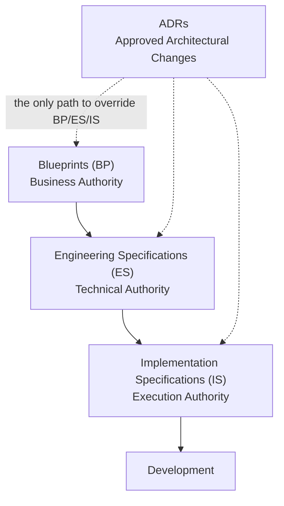
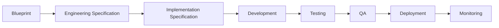
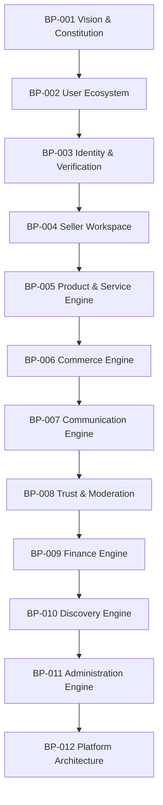
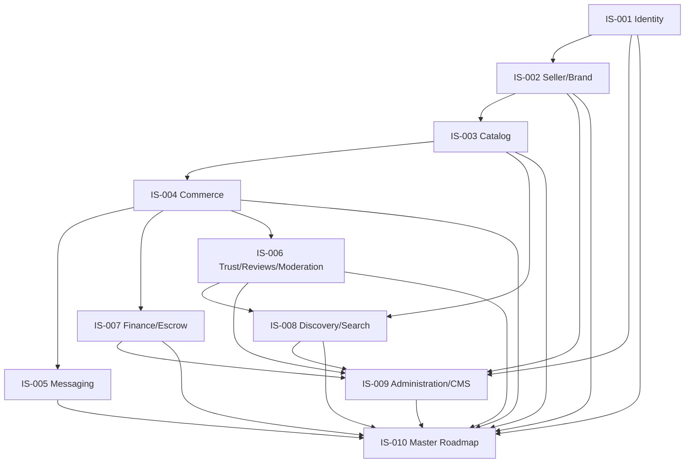

# Choosify — Project Master Index

**Document Type:** Governance / Constitution Index
**Version:** 1.0.0
**Status:** Authoritative
**Last Updated:** August 2026

---

## 0. What This Document Is

This is the single entry point into the Choosify Commerce Operating System documentation. It exists so that any future AI session, new developer, or reviewer can start here and understand — before touching any code — what the project is, how its documentation is organized, and which document governs which kind of decision.

Read this document first. Every other document in `docs/` is subordinate to the hierarchy defined here.

---

## 1. Document Hierarchy

Choosify's documentation is governed by a strict four-tier authority hierarchy. Each tier answers a different question, and no lower tier may override a higher one.

| Tier | Folder | Authority | Answers |
|------|--------|-----------|---------|
| **Blueprints (BP)** | `docs/blueprint/` | **Business authority** | *What* does Choosify do, and *why*? |
| **Engineering Specifications (ES)** | `docs/engineering/` | **Technical authority** | *How* is it built, technically? |
| **Implementation Specifications (IS)** | `docs/implementation/` | **Execution authority** | *In what order*, and by which concrete plan, does it get built? |
| **Architecture Decision Records (ADR)** | `docs/engineering/Decision-Records/` and `docs/adr/` | **Approved change authority** | What specific deviation or clarification was *deliberately* approved, and why? |

### 1.1 Blueprints (BP) — Business Authority

Blueprints define Choosify's vision, constitution, user ecosystem, and every business engine (identity, commerce, trust, finance, discovery, administration). They are written first and changed least often. A Blueprint statement is a business decision — it is never contradicted by a technical or implementation convenience.

### 1.2 Engineering Specifications (ES) — Technical Authority

Engineering Specifications translate the Blueprints into binding technical conventions: database architecture, API contracts, RBAC, the event bus, state machines, notifications, UI standards, security, performance, and DevOps. An ES document never invents new business rules — it only decides *how* an already-approved BP rule is technically realized.

### 1.3 Implementation Specifications (IS) — Execution Authority

Implementation Specifications translate the approved BP + ES documentation into concrete, sequenced, executable build plans — one per major platform domain, plus the master sprint roadmap (IS-010). An IS document is documentation only: no production code, no schema migrations, no redesign, no new business rules. It is the *plan*, not the *decision*.

### 1.4 Architecture Decision Records (ADR) — Approved Change Authority

ADRs are the **only** mechanism by which an implementation may deviate from, clarify, or extend what a BP, ES, or IS document states. An ADR records: the decision, the reason, the affected modules, the implementation impact, and — where it touches a Blueprint — follows the formal amendment process described in BP-001 §19 (Constitutional Amendments). No ADR may silently rewrite a BP/ES/IS document; it is a separate, dated, justified record that sits alongside them.

**Governing rule: no implementation may contradict a BP, ES, or IS document unless an ADR explicitly approves the change.** Absent an approved ADR, the BP/ES/IS documentation is binding as written.

---

## 2. Development Flow

Per IS-010 §4 (Overall Platform Build Strategy), every unit of work follows this exact chain — no step may be skipped:

If a proposed change has no corresponding BP/ES/IS coverage, the correct next step is to write or extend the appropriate document (or raise an ADR if it is a deliberate, scoped deviation) — not to implement first and document later.

---

## 3. Blueprints (BP) — Business Authority

Location: [`docs/blueprint/`](../blueprint/)

| ID | Document | Link |
|----|----------|------|
| BP-000 | Executive Summary | [00-Executive-Summary.md](../blueprint/00-Executive-Summary.md) |
| BP-001 | Vision & Constitution | [01-Vision-Constitution.md](../blueprint/01-Vision-Constitution.md) |
| BP-002 | User Ecosystem & Identity Model | [02-User-Ecosystem-Identity-Model.md](../blueprint/02-User-Ecosystem-Identity-Model.md) |
| BP-003 | Identity, Authentication & Verification Engine | [03-Identity-Authentication-Verification-Engine.md](../blueprint/03-Identity-Authentication-Verification-Engine.md) |
| BP-004 | Seller Workspace & Brand Architecture | [04-Seller-Workspace-Brand-Architecture.md](../blueprint/04-Seller-Workspace-Brand-Architecture.md) |
| BP-005 | Product & Service Engine | [05-Product-Service-Engine.md](../blueprint/05-Product-Service-Engine.md) |
| BP-006 | Commerce Engine (Orders, Checkout & Payments) | [06-Commerce-Engine.md](../blueprint/06-Commerce-Engine.md) |
| BP-007 | Communication, Messaging & Customer Engagement Engine | [07-Communication-Messaging-Customer-Engagement-Engine.md](../blueprint/07-Communication-Messaging-Customer-Engagement-Engine.md) |
| BP-008 | Trust, Reputation, Moderation & Governance Engine | [08-Trust-Reputation-Moderation-Governance-Engine.md](../blueprint/08-Trust-Reputation-Moderation-Governance-Engine.md) |
| BP-009 | Finance, Escrow & Accounting Engine | [09-Finance-Escrow-Accounting-Engine.md](../blueprint/09-Finance-Escrow-Accounting-Engine.md) |
| BP-010 | Content, Discovery & Engagement Engine | [10-Content-Discovery-Engagement-Engine.md](../blueprint/10-Content-Discovery-Engagement-Engine.md) |
| BP-011 | Administration, CMS & Platform Operations Engine | [11-Administration-CMS-Platform-Operations-Engine.md](../blueprint/11-Administration-CMS-Platform-Operations-Engine.md) |
| BP-012 | Platform Architecture, System Boundaries & Technical Constitution | [12-Platform-Architecture-System-Boundaries-Technical-Constitution.md](../blueprint/12-Platform-Architecture-System-Boundaries-Technical-Constitution.md) |

### BP Dependency Chain

Per BP-012 §19 (Blueprint Dependency Map), the Blueprints build on each other linearly:

BP-000 (Executive Summary) sits above this chain as the entry point every other Blueprint assumes as read.

---

## 4. Engineering Specifications (ES) — Technical Authority

Location: [`docs/engineering/`](../engineering/)

| ID | Document | Link | Primarily Derived From |
|----|----------|------|--------------------------|
| ES-001 | PostgreSQL Database Architecture & Entity Relationship Model | [ES-001-Database-Architecture.md](../engineering/ES-001-Database-Architecture.md) | BP-001 – BP-012 |
| ES-002 | API Architecture & Service Contracts | [ES-002-API-Architecture.md](../engineering/ES-002-API-Architecture.md) | BP-001 – BP-012, ES-001 |
| ES-003 | Role-Based Access Control (RBAC) & Permission Matrix | [ES-003-RBAC.md](../engineering/ES-003-RBAC.md) | BP-001 – BP-012, ES-001, ES-002 |
| ES-004 | Event Bus, Domain Events & System Messaging | [ES-004-Event-Bus.md](../engineering/ES-004-Event-Bus.md) | BP-001 – BP-012, ES-001 – ES-003 |
| ES-005 | Workflow State Machines & Business Lifecycles | [ES-005-State-Machines.md](../engineering/ES-005-State-Machines.md) | BP-001 – BP-012, ES-001 – ES-004 |
| ES-006 | Notification Matrix & Multi-Channel Delivery Architecture | [ES-006-Notification-Matrix.md](../engineering/ES-006-Notification-Matrix.md) | BP-001 – BP-012, ES-001 – ES-005 |
| ES-007 | User Interface Architecture, Design System & UX Specifications | [ES-007-UI-Specification.md](../engineering/ES-007-UI-Specification.md) | BP-001 – BP-012, ES-001 – ES-006 |
| ES-008 | Security Architecture, Privacy & Compliance Engineering | [ES-008-Security.md](../engineering/ES-008-Security.md) | BP-001 – BP-012, ES-001 – ES-007 |
| ES-009 | Performance, Scalability & Infrastructure Engineering | [ES-009-Performance.md](../engineering/ES-009-Performance.md) | BP-001 – BP-012, ES-001 – ES-008 |
| ES-010 | DevOps, Deployment, CI/CD & Operational Excellence | [ES-010-Deployment.md](../engineering/ES-010-Deployment.md) | BP-001 – BP-012, ES-001 – ES-009 |

### ES Dependency Chain

Each Engineering Specification depends cumulatively on all prior ones (ES-010 depends on ES-001 through ES-009, and so on):

```mermaid
graph LR
    ES001["ES-001 Database"] --> ES002["ES-002 API"] --> ES003["ES-003 RBAC"] --> ES004["ES-004 Event Bus"] --> ES005["ES-005 State Machines"] --> ES006["ES-006 Notifications"] --> ES007["ES-007 UI"] --> ES008["ES-008 Security"] --> ES009["ES-009 Performance"] --> ES010["ES-010 DevOps"]
```

Pre-existing, non-numbered engineering documents also live in `docs/engineering/` and remain in force alongside the ES series: [Engineering-Bible.md](../engineering/Engineering-Bible.md), [AI-Implementation-Protocol.md](../engineering/AI-Implementation-Protocol.md), [Coding-Standards.md](../engineering/Coding-Standards.md), [Architecture-Principles.md](../engineering/Architecture-Principles.md).

---

## 5. Implementation Specifications (IS) — Execution Authority

Location: [`docs/implementation/`](../implementation/)

| ID | Document | Link | Primarily Governs |
|----|----------|------|---------------------|
| IS-001 | Identity, Authentication & Session Implementation | [IS-001-Identity-Authentication-Implementation.md](../implementation/IS-001-Identity-Authentication-Implementation.md) | Sprint 1 |
| IS-002 | Seller Workspace & Brand Ownership Implementation | [IS-002-Seller-Workspace-Brand-Ownership.md](../implementation/IS-002-Seller-Workspace-Brand-Ownership.md) | Sprints 2–3 |
| IS-003 | Product, Service & Inventory Engine Implementation | [IS-003-Product-Service-Inventory-Engine.md](../implementation/IS-003-Product-Service-Inventory-Engine.md) | Sprints 4–7, 23 |
| IS-004 | Commerce, Checkout & Order Management Implementation | [IS-004-Commerce-Checkout-Order-Management.md](../implementation/IS-004-Commerce-Checkout-Order-Management.md) | Sprints 8–11 |
| IS-005 | Messaging, Communication & Social Commerce Implementation | [IS-005-Messaging-Communication-Social-Commerce.md](../implementation/IS-005-Messaging-Communication-Social-Commerce.md) | Sprint 12 |
| IS-006 | Trust, Reputation, Reviews & Moderation Implementation | [IS-006-Trust-Reputation-Reviews-Moderation.md](../implementation/IS-006-Trust-Reputation-Reviews-Moderation.md) | Sprints 14–16 |
| IS-007 | Finance, Escrow & Business Operations Implementation | [IS-007-Finance-Escrow-Business-Operations.md](../implementation/IS-007-Finance-Escrow-Business-Operations.md) | Sprints 11, 17–18 |
| IS-008 | Discovery, Search, Recommendation & Content Implementation | [IS-008-Discovery-Search-Recommendation-Content.md](../implementation/IS-008-Discovery-Search-Recommendation-Content.md) | Sprints 19–21, 24 |
| IS-009 | Administration Portal, CMS & Platform Operations Implementation | [IS-009-Administration-Portal-CMS-Platform-Operations.md](../implementation/IS-009-Administration-Portal-CMS-Platform-Operations.md) | Sprints 26–28 |
| IS-010 | Production Readiness & Sprint Execution Roadmap | [IS-010-Production-Readiness-Sprint-Execution-Roadmap.md](../implementation/IS-010-Production-Readiness-Sprint-Execution-Roadmap.md) | Master roadmap governing all 30 sprints |

### IS Dependency Chain

IS-010 is the master execution roadmap: it does not introduce new domain scope, it sequences IS-001 through IS-009 into the platform's 30-sprint build plan (see IS-010 §58, Module Dependency Matrix, for the authoritative per-sprint dependency graph).

**Known coverage gaps (intentional, not oversights):** IS-010 §49 (Sprint 22, Live Commerce) and §52 (Sprint 25, Creator Platform) each identify that no dedicated consolidating IS document exists yet for those domains as of this writing. Per the governing rule in §1 above, development on those specific domains should not proceed beyond what IS-005/IS-006/IS-008's partial coverage already permits until a future IS document (or an approving ADR) closes the gap.

---

## 6. Architecture Decision Records (ADR)

ADRs are the approved-change mechanism described in §1.4. Two ADR locations currently exist in this repository:

- [`docs/engineering/Decision-Records/`](../engineering/Decision-Records/) — the primary location for new ADRs going forward, scaffolded alongside the ES series.
- [`docs/adr/`](../adr/) — a pre-existing ADR location containing earlier decisions, including [ADR-015_DRY_Authentication.md](../adr/ADR-015_DRY_Authentication.md).

Both locations are authoritative; an ADR's validity does not depend on which of the two folders it lives in. New ADRs should be added to `docs/engineering/Decision-Records/` unless there is a specific reason to extend the pre-existing `docs/adr/` series.

**Rule:** if implementation work reveals that a BP, ES, or IS document is ambiguous, incomplete, or needs to be deviated from, the correct response is to write an ADR recording the decision — not to silently code around the documentation, and not to edit the BP/ES/IS document directly outside the formal amendment process (BP-001 §19 for Blueprints; ordinary revision with a Revision History entry for ES/IS documents).

---

## 7. How to Use This Index

- **Starting a new feature or fix:** identify which BP domain it belongs to, confirm the relevant ES conventions, find the governing IS document (§5 above), and check IS-010 for where it sits in the sprint sequence.
- **Something in the code seems to contradict the docs:** check `docs/adr/` and `docs/engineering/Decision-Records/` (§6) for an approving ADR first. If none exists, the documentation is authoritative and the code is the thing that needs to change (or an ADR needs to be written and approved).
- **The documentation seems to have a gap:** check §5's "Known coverage gaps" note before assuming none exists — some gaps are already identified and intentionally deferred.
- **Onboarding to this project for the first time:** read BP-000 and BP-001 first (business vision and constitution), then BP-012 (technical architecture overview), then this index's §1 and §2, then proceed into whichever domain you're working on.

---

## 8. Full Document Set at a Glance

| Tier | Count | Location |
|------|-------|----------|
| Blueprints (BP) | 13 (BP-000–BP-012) | `docs/blueprint/` |
| Engineering Specifications (ES) | 10 (ES-001–ES-010) | `docs/engineering/` |
| Implementation Specifications (IS) | 10 (IS-001–IS-010) | `docs/implementation/` |
| Architecture Decision Records (ADR) | Ongoing | `docs/engineering/Decision-Records/`, `docs/adr/` |

The full documentation index, including non-BP/ES/IS reference material (templates, sprints, product/design docs, and this project folder), remains browsable from [`docs/README.md`](../README.md).

---

## Revision History

| Version | Date | Description |
|----------|------|-------------|
| 1.0.0 | August 2026 | Initial Project Master Index |
